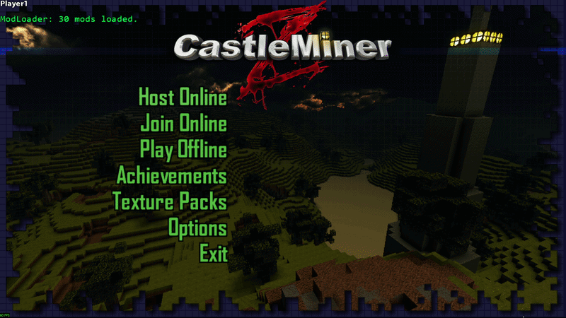
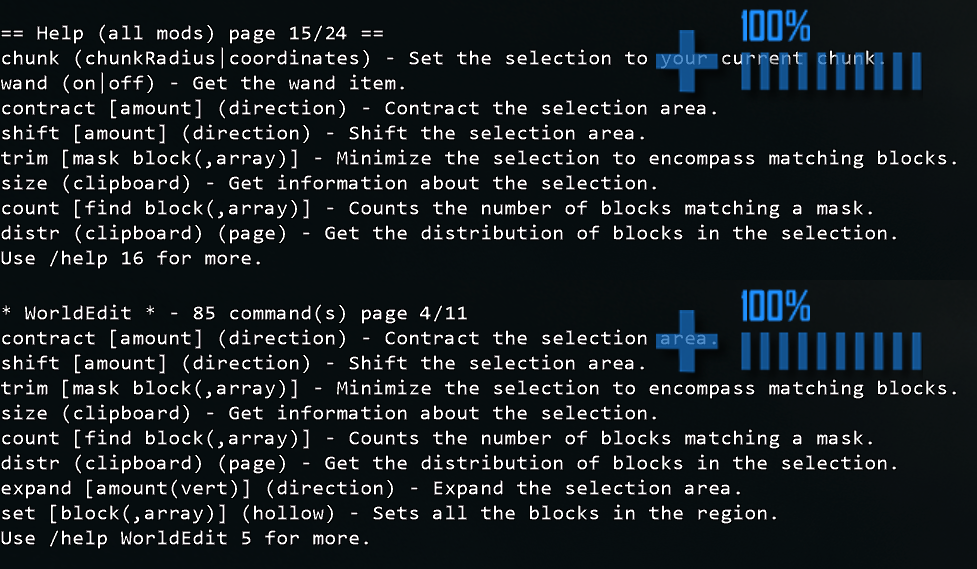
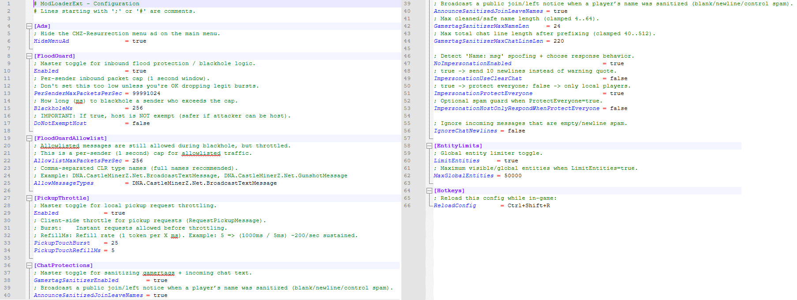

# ModLoaderExtensions


> The shared command and runtime extension layer for CastleForge.
>
> ModLoaderExtensions is the core dependency that enables `/ commands` and shared command handling across other CastleForge mods. It also adds a large set of stability fixes, chat protections, networking safeguards, fullscreen recovery improvements, and developer-facing helpers.

> [!IMPORTANT]
> **Mod dependency note:** ModLoaderExtensions is the shared command-extension layer used by other CastleForge mods.  
> If a mod relies on `/ commands`, shared help integration, or centralized command dispatch, this mod is typically required.

---

## Overview

ModLoaderExtensions is the shared command and extension framework for the CastleForge mod ecosystem.

Its primary role is to provide the common slash-command layer that other mods build on. If a CastleForge mod adds `/commands`, this is the mod that makes that command infrastructure work.

On top of that, ModLoaderExtensions also improves the game’s foundation with:

- shared slash-command interception and dispatch
- a central help/command registry for mods
- hot-reloadable runtime configuration
- safer networking behavior
- stronger chat and gamertag protections
- fullscreen recovery improvements
- cleaner in-game text input behavior
- developer helpers for embedded dependencies and resource extraction
- defensive crash resistance around fragile vanilla code paths

In other words, this mod is first and foremost the **command extension layer** for CastleForge, with a broad set of additional fixes and quality-of-life improvements built around it.

## Full patch inventory

For readers who want the exact patch-level breakdown, here is a full organized inventory of the tweaks, fixes, and improvements implemented in `GamePatches.cs`.

<details>
<summary><strong>Runtime, config, and crash diagnostics</strong></summary>

| Area | Patch / system | Type | What it changes |
|---|---|---|---|
| Runtime / Config | Hot-reload config hotkey | Improvement | Adds a configurable in-game reload hotkey so ModLoaderExt settings can be reapplied without restarting the game. |
| Crash diagnostics | Backtrace crash-report tap | Improvement | Hooks the game’s crash-report/backtrace path so exceptions can be captured locally and upstream crash upload behavior can be controlled. |
| Crash safety | `Program.Main(...)` guard | Fix | Adds a guarded crash path around the game entry point to reduce hard-crash behavior during startup or fatal exception flow. |

</details>

<details>
<summary><strong>Network stability and packet hardening</strong></summary>

| Area | Patch / system | Type | What it changes |
|---|---|---|---|
| Network stability | Safe TX send (`LocalNetworkGamer.SendData`) | Fix | Logs and swallows known non-fatal lifecycle send errors instead of letting teardown or bad state crash the session. |
| Network stability | Safe RX receive (`LocalNetworkGamer.ReceiveData`) | Fix | Handles malformed receive cases, drops bad queued packets, and prevents bad inbound data from repeatedly crashing the game loop. |
| Network stability | Safe RX decode (`ReceiveData/RecieveData(BinaryReader)`) | Fix | Wraps message decode methods so malformed payloads are abandoned safely instead of breaking the full receive pipeline. |
| Network stability | Safe message dispatch (`EnemyManager.HandleMessage`) | Fix | Prevents downstream message-handler exceptions from tearing down the game when enemy/network message routing hits bad state. |
| Anti-spam / networking | FloodGuard packet gate + queued-packet purge | Improvement / Fix | Adds per-sender rate limits, timed blackhole logic, allowlist handling, and precise pending-data purge behavior for abusive or malformed traffic. |
| Anti-spam / networking | Pickup request throttle | Improvement | Uses a config-backed token-bucket throttle for local pickup requests to reduce pickup spam abuse and accidental flooding. |
| Network validation | Remote transform sanity checks (`PlayerUpdateMessage.Apply`) | Fix | Rejects NaN, Infinity, and absurd transform data from remote players before it can destabilize simulation or rendering. |
| Net message hardening | `ShotgunShotMessage` validation | Fix | Validates shotgun payload/item data before it is trusted, reducing malformed message crashes or bad-state behavior. |
| Net message hardening | Safe inventory-store handling on host | Fix | Guards the host-side inventory store path when sender state is invalid or unstable. |

</details>

<details>
<summary><strong>Frame-loop, fullscreen, and rendering recovery</strong></summary>

| Area | Patch / system | Type | What it changes |
|----------------------|--------------------------------------------------------------|-----|----------------------------------------------------------------------------------------------------------------------------------------------------------|
| Frame-loop stability | Update / HUD draw / terrain draw finalizers                  | Fix | Adds non-fatal guards around `CastleMinerZGame.Update`, `InGameHUD.OnDraw`, and `BlockTerrain.Draw` so unexpected exceptions do not kill the frame loop. |
| Fullscreen recovery  | Defer terrain vertex-buffer builds while inactive fullscreen | Fix | Prevents fragile terrain buffer rebuilds from firing while the game is inactive in exclusive fullscreen.                                                 |
| Fullscreen recovery  | Focus-regain terrain rebuild pass                            | Fix | Performs a visible-ring terrain recovery pass when focus returns so alt-tabbed fullscreen sessions do not come back with invisible or stale chunks.      |
| Fullscreen recovery  | Defer kick teardown while inactive fullscreen                | Fix | Holds kick-message teardown until focus is restored so hidden fullscreen transitions are less brittle.                                                   |
| Fullscreen recovery  | Defer / finalize session-ended teardown on focus regain      | Fix | Delays session-end teardown while inactive fullscreen, then safely completes it after the game regains focus.                                            |
| Defensive hardening  | Safe player profile callback                                 | Fix | Guards fragile profile callback logic so callback-side nulls or edge-case failures do not cascade into bigger crashes.                                   |
| Defensive hardening  | Safe particle draw                                           | Fix | Swallows known non-fatal particle draw null-reference failures instead of letting them kill rendering.                                                   |
| Rendering stability  | Safe inventory icon atlas recovery                           | Fix | Rebuilds disposed/stale `RenderTarget2D` item atlases during `InventoryItem.FinishInitialization` instead of reusing broken render targets.              |

</details>

<details>
<summary><strong>Steam host compatibility and migration guardrails</strong></summary>

| Area | Patch / system | Type | What it changes |
|---------------------|---------------------------------------------------|-------------------|---------------------------------------------------------------------------------------------------------------------------------------------|
| Host migration      | Dragon migration hardening — outgoing handoff     | Fix               | Replaces unsafe dragon handoff logic with validated migration send behavior so null/stale state cannot crash or corrupt ownership transfer. |
| Host migration      | Dragon migration hardening — incoming accept path | Fix               | Validates dragon migration payloads before accepting them locally, reducing crashes and invalid dragon ownership states.                    |
| Steam compatibility | Remember expected host during client join         | Compatibility fix | Tracks the expected host identity during join bootstrap so malformed host mapping can be repaired later.                                    |
| Steam compatibility | Repair broken Steam host mapping                  | Compatibility fix | Fixes host mappings when the host arrives with a bad/non-standard visible gamer ID layout.                                                  |
| Steam compatibility | Broadcast safety nets                             | Compatibility fix | Drops unsafe client broadcast attempts when host mapping is invalid instead of allowing exception spam or endless join-loop behavior.       |
| Steam compatibility | Direct-send wire recipient ID `0` rewrite         | Compatibility fix | Rewrites direct sends to broken hosts that still expect wire recipient ID `0` even when the visible host object uses another ID.            |
| Steam compatibility | Legacy host ID `0` alias                          | Compatibility fix | Aliases legacy host ID `0` back to the repaired host object so inbound host packets are not lost after host-mapping repair.                 |
| Gameplay fallback   | Host fallback for stale terrain/server IDs        | Compatibility fix | Falls back to `CurrentNetworkSession.Host` when server/terrain IDs are stale so startup and terrain traffic still resolve correctly.        |

</details>

<details>
<summary><strong>Chat integrity, gamertag protection, and session hygiene</strong></summary>

| Area | Patch / system | Type | What it changes |
|-----------------|-------------------------------------------------------------------|-------------------|-------------------------------------------------------------------------------------------------------------------------------------------------------------------|
| Chat integrity  | Incoming chat sanitization + alias rewrite + impersonation guard  | Improvement / Fix | Sanitizes chat payloads, blocks control/newline abuse, rewrites fake `Name: msg` aliases, and protects against simple impersonation attempts.                     |
| Chat integrity  | Blank/newline chat drop addon                                     | Improvement       | Optionally drops empty or newline-only broadcast chat so obvious spam never reaches the visible chat feed.                                                        |
| Session hygiene | Reset chat/gamertag session caches on join / leave / invited join | Fix               | Clears session-scoped sanitizer and impersonation caches so stale state from older sessions does not leak into new ones.                                          |
| Session hygiene | Apply gamertag sanitization at safe lifecycle points              | Fix               | Forces sanitization/rescan during `JoinCallback`, `StartGame`, `OnGamerJoined`, and `OnGamerLeft` so visible names stay corrected throughout session transitions. |
| Log cleanliness | Sanitize only the `OnGamerJoined` log/output path                 | Fix               | Cleans the specific join-log output path so blank-name and newline-spam gamertags do not pollute console/log text.                                                |

</details>

<details>
<summary><strong>Main menu, chat history, and text-input polish</strong></summary>

| Area | Patch / system | Type | What it changes |
|------------|-------------------------------------------|-------------|-------------------------------------------------------------------------------------------------------------|
| Main menu  | Hide CMZ-Resurrection ad                  | Tweak       | Hides the main-menu ad visually when enabled.                                                               |
| Main menu  | Block hidden ad interaction               | Tweak       | Prevents the hidden main-menu ad area from still receiving input/click behavior.                            |
| Main menu  | Mods-loaded banner                        | Improvement | Draws a main-menu banner that shows how many mods are currently loaded.                                     |
| Main menu  | Discord + Support menu buttons            | Improvement | Adds embedded bottom-left main-menu buttons for joining the CastleForge Discord and supporting CastleForge. |
| Chat input | Capture sent chat into history            | Improvement | Saves submitted chat/command lines into a reusable in-game history buffer.                                  |
| Chat input | Up / Down history browsing                | Improvement | Adds command/chat history recall inside `PlainChatInputScreen` using the arrow keys.                        |
| Chat input | Trim non-command history between sessions | Improvement | Preserves useful command history while trimming ordinary chat lines when leaving a game session.            |
| Text input | Centered caret rendering                  | Tweak       | Repositions the text caret so chat entry looks visually cleaner and more centered.                          |
| Text input | Single-step Left / Right caret movement   | Improvement | Makes cursor movement through text input feel cleaner and more predictable.                                 |
| Text input | Preserve caret position while typing      | Fix         | Stops the caret from snapping to the end while typing and keeps editing behavior stable.                    |

</details>

---

## Visual highlights

| Preview | What it demonstrates |
|-----------------------------------------------|----------------------------------------------------------------------------------------------------------------------------------------|
|             | **Main menu polish** — Shows the hidden ad behavior, mods-loaded banner, and bottom-left Discord / Support buttons on the main menu.   |
|  | **Chat and input improvements** — Shows chat history recall, command recall, and smoother text-entry behavior.                         |
|          | **Shared command system** — Highlights `/help`, command paging, and the shared slash-command framework used by other CastleForge mods. |
|         | **Runtime configuration** — Shows the generated config and the main sections users can reload and tune without restarting.             |

---

## Why this mod stands out

ModLoaderExtensions is important because it is not just another optional gameplay mod.

It fills two major roles:

1. **Primary role:** it is the shared extension layer that enables `/ commands` and command registration across other CastleForge mods.
2. **Secondary role:** it adds a broad collection of fixes, safeguards, and polish improvements that make the overall mod stack feel more stable and more professional.

That makes it one of the most important “always-on” core mods in the CastleForge ecosystem.

### Required command infrastructure for other mods

- shared slash-command interception before commands are sent as normal chat
- central command dispatcher used by CastleForge mods
- attribute-based command registration support
- shared `/help` command and command catalog support
- a common framework so mods do not each need to reinvent their own command parse

---

## What this mod unlocks

### Stability and recovery

- safer handling around certain send/receive/network exceptions
- guarded message decode and dispatch paths
- fullscreen alt-tab terrain recovery
- deferred fullscreen session-end / kick teardown so hidden fullscreen transitions are less brittle
- protection against stale inventory icon atlas render targets
- non-fatal guards around fragile particle draw and profile callback paths

### Chat and command quality-of-life

- slash-command interception before commands are broadcast like normal chat
- central command dispatcher for mods
- paged `/help` command support through the shared help registry
- in-game chat history with **Up / Down** browsing
- command history preservation between sessions while trimming ordinary chat lines
- centered text caret rendering
- single-step **Left / Right** caret movement
- caret position preserved while typing instead of snapping to the end

### Anti-abuse protections

- incoming chat sanitization
- newline / control-character cleanup
- blank-name and gamertag spam cleanup
- anti-impersonation protection for fake `Name: message` style chat
- optional public announcement when join/leave names were sanitized
- optional blank/newline chat dropping

### UI and menu polish

- optional hiding of the CMZ-Resurrection main menu ad
- main menu banner showing how many mods are loaded
- bottom-left main menu buttons for CastleForge Discord and Support links

### Network hardening

- inbound flood guard with timed blackhole logic
- allowlist support for permitted message types during blackhole
- pickup-request throttling to prevent pickup spam edge cases
- validation for invalid remote player transforms
- shotgun message validation
- safer inventory-store handling on the host
- Steam host ID compatibility repair for broken or malformed host mappings
- dragon migration guardrails

---

## What mod authors get

ModLoaderExtensions also provides shared systems that make other CastleForge mods easier to build and maintain.

### Shared command framework

- `ChatInterceptor` hooks outgoing chat and intercepts slash-commands before they are sent normally
- `CommandAttribute` lets mods register methods as commands
- `CommandDispatcher` routes raw slash-command text to handlers
- `HelpRegistry` provides a central command catalog that mods can register into

### Embedded dependency support

- `EmbeddedResolver` loads managed embedded DLLs directly from resources
- native embedded DLLs are extracted and preloaded safely through `LoadLibrary`
- keeps mod packaging cleaner when shipping Harmony or other dependencies

### Embedded resource extraction

- `EmbeddedExporter` can unpack embedded resource folders to disk while preserving folder structure
- useful for mods that ship config templates, textures, support files, or other payloads

### Localization helper

- `CMZStrings` provides lightweight access to CastleMiner Z localized resource strings at runtime

### Central patch host

- `GamePatches` scans and applies Harmony patch classes in a single place
- patch reporting is structured so one bad patch does not kill the whole patching pass

---

## Feature breakdown

<details>
<summary><strong>1) Command and help infrastructure</strong></summary>

### What it does

This mod installs a shared chat interceptor and lets mods register slash-commands through attributes and dispatchers.

### Included pieces

- `ChatInterceptor`
- `CommandAttribute`
- `CommandDispatcher`
- `HelpRegistry`
- `/help`

### Why it matters

Instead of every mod reinventing command parsing, ModLoaderExtensions provides a common system other mods can plug into.

### Player-facing behavior

- slash-commands are intercepted before being broadcast to the server as plain chat
- unknown slash-commands are suppressed and reported as unknown instead of being sent as ordinary chat
- `/help` supports paging and optional per-mod filtering when commands are registered in the shared help registry

### Screenshot ideas


</details>

<details>
<summary><strong>2) Runtime config and hot reload</strong></summary>

### What it does

ModLoaderExtensions generates its own INI config, applies values to runtime statics, and supports a configurable hotkey to reload the config while the game is running.

### Default hotkey

- `Ctrl+Shift+R`

### Why it matters

You can tune protection and quality-of-life behavior without constantly restarting the game.

### Runtime config location

```text
!Mods/ModLoaderExt/ModLoaderExt.Config.ini
```

> **Important:** the runtime folder uses the namespace name **`ModLoaderExt`**, not `ModLoaderExtensions`.

### Screenshot ideas


</details>

<details>
<summary><strong>3) Exception capture and crash-report interception</strong></summary>

### What it does

This mod hooks into the game’s exception flow and can log caught or first-chance exceptions, while also tapping the game’s Backtrace crash-report path.

### Key behavior

- arms exception capture during startup
- can log through a dedicated exception log stream
- taps crash reporting so diagnostics can be preserved locally
- can suppress upstream crash-report submission depending on mode
- guards the game’s `Program.Main(...)` crash path to reduce hard crash behavior

### Why it matters

This makes debugging easier while also helping fragile runtime paths fail more gracefully.

### Log file name used by the exception tap

```text
Caught_Exceptions.log
```

### Screenshot ideas


</details>

<details>
<summary><strong>4) Fullscreen recovery and hidden-window safety</strong></summary>

### What it does

ModLoaderExtensions includes targeted recovery logic for fragile fullscreen scenarios, especially when the game is inactive and chunk rebuilds or session-end logic fire at the wrong time.

### Included protections

- defers terrain vertex-buffer commits while inactive in exclusive fullscreen
- performs a visible-ring terrain recovery pass when focus returns
- defers kick / session-ended teardown while inactive fullscreen
- finalizes the deferred teardown once focus is restored

### Why it matters

This directly targets the frustrating class of bugs where fullscreen focus changes leave chunks invisible, terrain stale, or teardown behavior unstable.

### Screenshot ideas


</details>

<details>
<summary><strong>5) Defensive hardening for fragile vanilla paths</strong></summary>

### Included protections

- safe player profile callback handling
- safe particle draw finalizer for certain null-reference failures
- inventory atlas recovery for disposed/stale `RenderTarget2D` reuse during item icon initialization

### Why it matters

These are the kinds of annoying low-level issues that can produce rare crashes, render failures, or noisy exception spam without improving gameplay in any visible way.

### Screenshot ideas


</details>

<details>
<summary><strong>6) Network flood control and packet hardening</strong></summary>

### Included protections

- safe TX send handling for certain non-fatal lifecycle exceptions
- safe RX receive handling for malformed receive scenarios
- safe RX decode wrapping so bad message payloads do not take down the pipeline
- safe message dispatch guard
- game loop draw / update guards for fragile runtime states
- inbound flood guard with per-sender packet rate limits
- sender blackhole window when caps are exceeded
- allowlist support for specific safe message types during blackhole
- precise pending-data purge of bad queued packets
- pickup request throttle using a token-bucket model
- validation for impossible or absurd `PlayerUpdateMessage` state
- shotgun message item validation
- safe inventory-store handling on the host when sender state is invalid

### Why it matters

This is the “defensive shell” portion of the mod. It helps the game survive malformed traffic, spam bursts, and unstable state transitions with fewer catastrophic failures.

### Screenshot ideas


</details>

<details>
<summary><strong>7) Steam host compatibility and migration guardrails</strong></summary>

### Included protections

- remembers expected host identity during client join handshake
- repairs malformed host mapping when the host is not presented with the expected ID layout
- drops unsafe broadcasts when host mapping is invalid
- rewrites direct sends to malformed hosts that still expect wire recipient ID `0`
- aliases legacy host ID `0` back to the repaired host object when needed
- falls back to the current host when terrain/server IDs are stale
- adds dragon migration validation and safer migration handling

### Why it matters

This is one of the most interesting parts of the mod. It targets broken or modded host states that would otherwise cause loading hangs, null host lookups, dropped traffic, or client instability.

### Screenshot ideas


</details>

<details>
<summary><strong>8) Gamertag integrity and chat sanitization</strong></summary>

### Included protections

- gamertag sanitization for noisy / abusive names
- join/leave sanitization announcements
- anti-impersonation detection for fake `Name: message` claims
- local rewrite of alias-style chat to prevent misleading output
- incoming message text sanitization for message payloads
- optional dropping of blank or newline chat spam
- session cache resets on join/leave to prevent stale state carrying forward
- safe application of gamertag sanitization at join/start lifecycle points
- sanitization of the specific `OnGamerJoined` log output path

### Why it matters

This is not just censorship. It is readability and trust protection. It keeps the player list, chat feed, and join/leave flow from being abused by control-character spam, blank-name nonsense, or simple chat impersonation tricks.

### Screenshot ideas


</details>

<details>
<summary><strong>9) Menu and text-input quality-of-life</strong></summary>

### Included improvements

- hides the main menu ad when enabled
- blocks ad interaction when hidden
- draws a mod count banner on the main menu
- stores in-game chat history
- supports Up / Down history browsing
- trims non-command history between sessions so commands remain useful
- centers the text caret visually
- enables cleaner single-step Left / Right caret movement
- preserves caret position while typing instead of jumping to the end
- adds embedded bottom-left Discord and Support buttons to the main menu
- supports individually hiding the Discord and Support menu buttons through `[MenuItems]`

### Why it matters

These are deceptively small changes that make the game and the mod stack feel more polished every single session.

### Screenshot ideas


</details>

---

## Commands

ModLoaderExtensions itself exposes a shared help command and provides the infrastructure that other mods can hook into.

### Included command

| Command | Description |
|---|---|
| `/help` | Shows paged help using the shared help registry. |
| `/help 2` | Shows page 2 of the full help listing. |
| `/help ModName` | Filters help to a specific mod when registered. |
| `/help ModName 2` | Shows a later page for that mod’s command list. |

### Notes

- `/help` depends on mods registering their commands into the shared `HelpRegistry`.
- if no commands are registered, it will report that none are available.
- help page size is scaled to screen height, then clamped to a safe range.


---

## Configuration

### Config file location

```text
!Mods/ModLoaderExt/ModLoaderExt.Config.ini
```

### Default config sections

| Section | Purpose |
|-------------------------|--------------------------------------------------------------|
| `[Ads]`                 | Main menu ad visibility behavior.                            |
| `[MenuItems]`           | Main menu bottom-left button visibility behavior.            |
| `[FloodGuard]`          | Inbound packet rate limiting and blackhole behavior.         |
| `[FloodGuardAllowlist]` | Allowed message types and allowlist packet rate limits.      |
| `[PickupThrottle]`      | Local pickup request throttling.                             |
| `[ChatProtections]`     | Gamertag sanitization, anti-impersonation, newline handling. |
| `[EntityLimits]`        | Global entity limiting.                                      |
| `[Hotkeys]`             | Runtime config reload hotkey.                                |

### Config reference

| Key | Default | What it controls |
|---------------------------------------------------|--------------------------------------------:|--------------------------------------------------------------------|
| `HideMenuAd`                                      | `true`                                      | Hides the CMZ-Resurrection menu ad.                                |
| `ShowDiscordButton` in `[MenuItems]`              | `true`                                      | Shows the bottom-left CastleForge Discord button on the main menu. |
| `ShowSupportButton` in `[MenuItems]`              | `true`                                      | Shows the bottom-left Support CastleForge button on the main menu. |
| `Enabled` in `[FloodGuard]`                       | `true`                                      | Master switch for inbound flood protection.                        |
| `PerSenderMaxPacketsPerSec`                       | `512`                                       | Per-sender packet cap inside the 1-second window.                  |
| `BlackholeMs`                                     | `30000`                                     | How long a sender stays blackholed after tripping the cap.         |
| `DoNotExemptHost`                                 | `true`                                      | Keeps the host subject to the same flood rules.                    |
| `AllowlistMaxPacketsPerSec`                       | `256`                                       | Per-sender cap for allowlisted traffic during blackhole.           |
| `AllowMessageTypes`                               | `DNA.CastleMinerZ.Net.BroadcastTextMessage` | Message types allowed through the allowlist path.                  |
| `PickupTouchBurst`                                | `25`                                        | Initial local pickup request burst before throttling.              |
| `PickupTouchRefillMs`                             | `5`                                         | Token refill speed for pickup requests.                            |
| `GamertagSanitizerEnabled`                        | `true`                                      | Master switch for general name and chat sanitization.              |
| `AnnounceSanitizedJoinLeaveNames`                 | `true`                                      | Announces sanitized join/leave names publicly.                     |
| `GamertagSanitizerMaxNameLen`                     | `24`                                        | Maximum cleaned display-name length.                               |
| `GamertagSanitizerMaxChatLineLen`                 | `220`                                       | Maximum cleaned chat line length.                                  |
| `NoImpersonationEnabled`                          | `true`                                      | Enables anti-impersonation detection.                              |
| `ImpersonationUseClearChat`                       | `false`                                     | Uses clear-chat style response instead of a warning quote.         |
| `ImpersonationProtectEveryone`                    | `true`                                      | Protects everyone rather than only locals.                         |
| `ImpersonationHostOnlyRespondWhenProtectEveryone` | `false`                                     | Limits response spam when global protection is enabled.            |
| `IgnoreChatNewlines`                              | `false`                                     | Drops blank/newline chat spam.                                     |
| `LimitEntities`                                   | `true`                                      | Enables the global entity limiter.                                 |
| `MaxGlobalEntities`                               | `500`                                       | Hard cap for the entity limiter.                                   |
| `ReloadConfig`                                    | `Ctrl+Shift+R`                              | Hotkey to reload config at runtime.                                |

### Default config template

<details>
<summary><strong>Show the default generated config</strong></summary>

```ini
# ModLoaderExt - Configuration
# Lines starting with ';' or '#' are comments.

[Ads]
; Hide the CMZ-Resurrection menu ad on the main menu.
HideMenuAd                = true

[MenuItems]
; Main-menu bottom-left icon buttons.
; These only control visibility/clickability, not embedded resource loading.
ShowDiscordButton         = true
ShowSupportButton         = true

[FloodGuard]
; Master toggle for inbound flood protection / blackhole logic.
Enabled                   = true
; Per-sender inbound packet cap (1 second window).
; Don't set this too low unless you're OK dropping legit bursts.
PerSenderMaxPacketsPerSec = 512
; How long (ms) to blackhole a sender who exceeds the cap.
BlackholeMs               = 30000
; IMPORTANT: If true, host is NOT exempt (safer if attacker can be host).
DoNotExemptHost           = true

[FloodGuardAllowlist]
; Allowlisted messages are still allowed during blackhole, but throttled.
; This is a per-sender (1 second) cap for allowlisted traffic.
AllowlistMaxPacketsPerSec = 256
; Comma-separated CLR type names (full names recommended).
; Example: DNA.CastleMinerZ.Net.BroadcastTextMessage, DNA.CastleMinerZ.Net.GunshotMessage
AllowMessageTypes         = DNA.CastleMinerZ.Net.BroadcastTextMessage

[PickupThrottle]
; Master toggle for local pickup request throttling.
Enabled             = true
; Client-side throttle for pickup requests (RequestPickupMessage).
; Burst:    Instant requests allowed before throttling.
; RefillMs: Refill rate (1 token per X ms). Example: 5 => (1000ms / 5ms) ~200/sec sustained.
PickupTouchBurst    = 25
PickupTouchRefillMs = 5

[ChatProtections]
; Master toggle for sanitizing gamertags + incoming chat text.
GamertagSanitizerEnabled        = true
; Broadcast a public join/left notice when a player's name was sanitized (blank/newline/control spam).
AnnounceSanitizedJoinLeaveNames = true
; Max cleaned/safe name length (clamped 4..64).
GamertagSanitizerMaxNameLen     = 24
; Max total chat line length after prefixing (clamped 40..512).
GamertagSanitizerMaxChatLineLen = 220

; Detect 'Name: msg' spoofing + choose response behavior.
NoImpersonationEnabled                          = true
; true -> send 10 newlines instead of warning quote.
ImpersonationUseClearChat                       = false
; true -> protect everyone; false -> only local players.
ImpersonationProtectEveryone                    = true
; Optional spam guard when ProtectEveryone=true.
ImpersonationHostOnlyRespondWhenProtectEveryone = false

; Ignore incoming messages that are empty/newline spam.
IgnoreChatNewlines = false

[EntityLimits]
; Global entity limiter toggle.
LimitEntities     = true
; Maximum visible/global entities when LimitEntities=true.
MaxGlobalEntities = 500

[Hotkeys]
; Reload this config while in-game:
ReloadConfig      = Ctrl+Shift+R
```

</details>


---

## Entity limiter

ModLoaderExtensions includes a built-in global entity limiter designed to enforce a hard cap on active top-level scene entities.

### What it does

- runs while the player is actively in-game
- evaluates top-level scene entities
- ranks candidates by importance and distance
- removes excess entities using type-aware removal paths

### Special handling

- pickups are removed through `PickupManager`
- zombies are removed through `EnemyManager.RemoveZombie(...)`
- dragons use dragon-specific removal handling
- generic entities fall back to scene removal

### Why it matters

This helps keep runaway entity situations under control without relying only on visibility tricks.


---

## File creation and runtime output

Depending on usage and feature paths, ModLoaderExtensions may create or use items like these:

```text
!Mods/ModLoaderExt/
├─ ModLoaderExt.Config.ini
├─ Natives/                    (for extracted embedded native DLLs when needed)
└─ [other extracted embedded files, if present]
```

It also uses exception logging through:

```text
Caught_Exceptions.log
```

---

## Installation

### Runtime usage notes

- place the built mod where your CastleForge / ModLoader setup expects it
- launch the game with the CastleForge mod stack
- ModLoaderExtensions initializes early and acts as a shared foundation mod
- the config file is generated automatically on first run if it does not already exist

### Best use case

ModLoaderExtensions is most useful as a **core always-on framework mod** rather than something players toggle on and off casually.

---

## Troubleshooting

<details>
<summary><strong>The config file did not appear</strong></summary>

Run the mod once through your normal CastleForge / ModLoader setup. The config is created on first load under:

```text
!Mods/ModLoaderExt/ModLoaderExt.Config.ini
```

</details>

<details>
<summary><strong>The runtime folder name is different from the mod name</strong></summary>

That is expected here. The runtime folder uses the namespace:

```text
ModLoaderExt
```

not the full project name `ModLoaderExtensions`.

</details>

<details>
<summary><strong>/help says no commands are registered</strong></summary>

That usually means the loaded mods have not registered their command lists into the shared `HelpRegistry` yet. The command system still exists, but the catalog has nothing to render.

</details>

<details>
<summary><strong>Why use this if it is not a flashy gameplay mod?</strong></summary>

Because this is the kind of framework mod that improves everything around it: stability, command support, chat hygiene, menu polish, network resilience, and shared tooling for the rest of the mod ecosystem.

</details>

---

## Summary

ModLoaderExtensions is the shared utility backbone of CastleForge.

It brings together:

- shared command infrastructure
- hot-reloadable config
- exception capture support
- fullscreen recovery safeguards
- network flood and malformed-packet hardening
- gamertag and chat integrity protections
- menu and text input polish
- developer utilities for embedded resources and dependencies

It may not be the most visibly flashy mod in the stack, but it is one of the most important.

---

## License

This project is part of **CastleForge** and uses the repository license and structure defined by the main project.