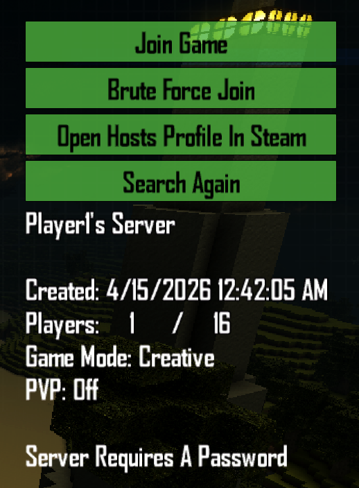
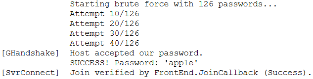

# BruteForceJoin


> **Status** : Proof‑of‑Concept

---

## Overview

**BruteForceJoin** adds a _Password Tester_ button to the multiplayer browser and will
automatically cycle through a word‑list against a locked server until it succeeds or
the list is exhausted.  
It originated as a study in async UI patching and network‑session introspection,
but it quickly became a handy admin‑side tool for **testing your own server** walls.

> ⚠️ **Use responsibly** Only test servers you control or have explicit
> permission to security‑audit.

---

## Why this mod stands out

- **One‑click UI integration** – the button feels native to CastleMiner Z.  
- **Fully asynchronous pipeline** – no game‑freezing loops.  
- **Configurable rate‑limiting** – avoids Steam kickbacks while staying fast.  
- **Editable word‑list** – ships with ~10 k common passwords; replace or trim as needed.  
- **Verbose logging** – every attempt is timestamped for later analysis.  
- **Graceful cancel** – press <kbd>Esc</kbd> or leave the screen to abort safely.  
- **Self‑cleaning** – Harmony hooks are removed when the game exits.  

---

## Feature highlights

### Seamless UI patch

| Main menu | Progress overlay |
|-----------|------------------|
|  |  |

### Async join pipeline

The mod taps into CastleMiner Z's existing *JoinOnlineGame* callback chain instead of
hammering raw sockets.  
Attempts are queued in a background task that:

1. Reads **`WordList.txt`** line‑by‑line.  
2. Sends a join request with the next candidate.  
3. Waits for the game's **success / wrong‑password** code‑path.  
4. Sleeps `DelayMs` (default = 100) before the next attempt.

### Rate‑limited & cancel‑safe

- Default speed ≈ **10 passwords / s**.  
- Minimum delay and max retries are hard‐coded constants (see *GamePatches.cs*).
  - Best rate to prevent steam from dropping requests.
- <kbd>Esc</kbd>, closing the browser, or switching menus stops the loop.

### Embedded dependency loader

Harmony and helper DLLs are shipped as embedded resources.  
If they do not exist next to the mod, they are extracted automatically at startup.

---

## Installation

1. Install **CastleForge ModLoader** (see repo root).  
2. Copy the compiled **`BruteForceJoin.dll`** folder to:

   ```text
   CastleMinerZ/!Mods/BruteForceJoin/
   ```

3. Launch the game and look for:

   ```
   [BruteForceJoin] ApplyAllPatches OK – WordList loaded (..... entries)
   ```

---

## Usage

1. Open **Join Online Game**.  
2. Select a locked server (padlock icon).  
3. Click **▶ Brute Force Join**.  
4. Watch the overlay - success stops the run, otherwise it ends when out of words.  

*Hint:* shorten **WordList.txt** for focused tests or custom dictionaries.

---

## Configuration

### Word‑list directives

The very first line in the distributed **`WordList.txt`** is:

```text
#ExampleComment
```

Lines that start with `#` are treated as *comments* and skipped when the mod streams the list.  
`#ExampleComment` is simply a reminder that **no automatic numeric‑suffix expansion** is applied when
testing passwords – the file is used *exactly* as written.  
Feel free to add other comment lines (`#MyNotes`, `#Region 1`, etc.) to organize larger lists.


| Path | Purpose | Default |
|------|---------|---------|
| `BruteForceJoin/WordList.txt` | Candidate passwords (one per line).     | **10 134** common passwords |
| `GamePatches.cs` `const`      | `DelayMs`, `MaxRetries`, log verbosity. | `100 ms`, `∞`, verbose     |

---

## Troubleshooting

| Symptom | Likely cause / fix |
|---------|-------------------|
| Button missing | ModLoader not installed or patch failed – check log. |
| Immediate disconnects | Server build mismatch – update game.          |
| Freeze after many attempts | Too many candidates; increase `DelayMs`. |

---

## Development notes

- Built against **.NET 4.8**, Harmony 2.4.2.  
- Follow CastleForge code‑style: XML summaries, region blocks, defensive finalizers.  
- PRs welcome - separate logic & UI patches, one feature per commit.  

---

## License & credits

* © 2025 **RussDev7** – GPL‑3.0-or‑later

---

## TL;DR

BruteForceJoin is a configurable password‑tester button for CastleMiner Z servers.
Great for admins verifying their own locks, terrible for griefers (don't be one).  
Patch, test, secure!