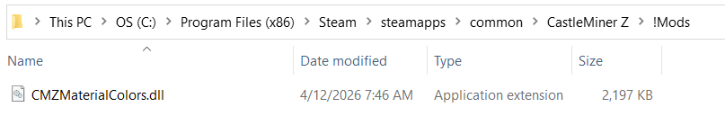
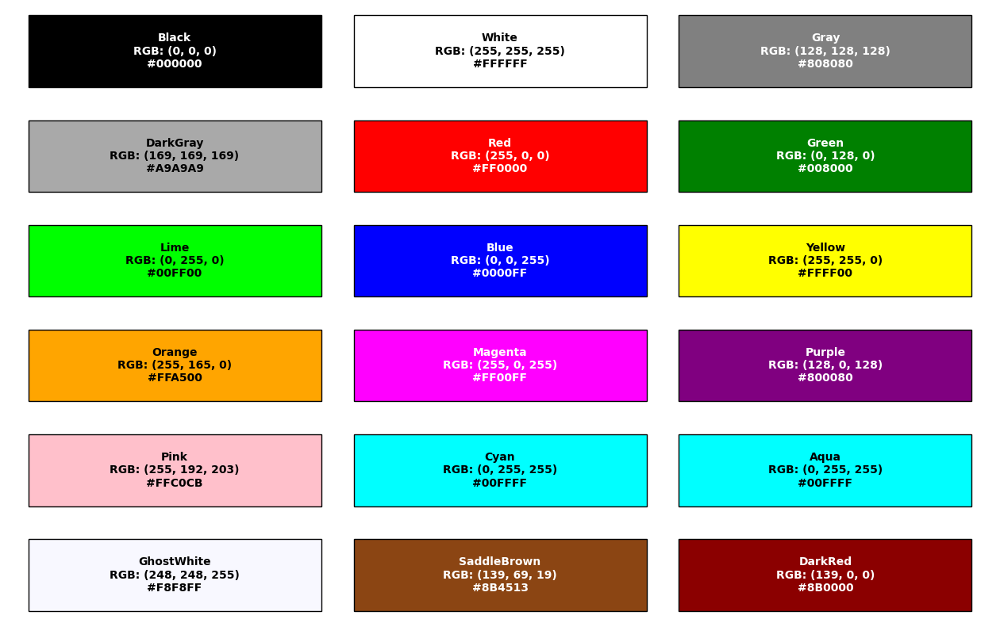

# CMZMaterialColors


**CMZMaterialColors** lets you recolor CastleMiner Z material-based tools and weapons without replacing models, textures, or gameplay behavior. It hooks the game's material color lookups, applies your custom body and laser colors from a simple INI file, refreshes already-registered item classes at runtime, and even supports an in-game hot reload so you can iterate on color palettes without relaunching the game.

Whether you want brighter laser weapons, a darker industrial iron set, fantasy-themed diamonds, or a full custom progression color pass, this mod gives you a lightweight, config-first way to do it.

---

## Overview

### What this mod does

- Overrides CastleMiner Z's **material/body colors** for supported material types.
- Overrides **laser / emissive / beam colors** where applicable.
- Reapplies colors to **already-cached item classes** after the game finishes item registration.
- Forces inventory icons to rebuild so UI visuals can reflect updated colors.
- Generates a config automatically on first launch.
- Supports a configurable **hot reload keybind** for in-game config reloading.

### What this mod does not do

- It does **not** add new items.
- It does **not** replace meshes or textures.
- It does **not** add chat commands or an in-game settings menu.
- It does **not** change gameplay stats, damage values, or progression.

---

## Why this mod stands out

Most recolor systems stop at patching a lookup function. This mod goes further:

- **Patches the game's internal color getters** so future lookups use your configured colors.
- **Refreshes already-built inventory item classes** so cached colors update correctly.
- **Rebuilds icon atlases** so inventory art is refreshed instead of staying stuck with old colors.
- **Separates material colors and laser colors**, which is especially useful for laser guns and sabers.
- **Reloads in-game** with a hotkey, making color iteration much faster while testing.

That makes CMZMaterialColors a strong fit for themed modpacks, visual overhauls, progression re-colors, and style-focused CastleForge setups.

---

## Supported behavior

### Material / body color overrides
These are the primary colors used on supported material-based gear.

### Laser / emissive color overrides
These are used for laser-style visuals, including beam, tracer, and emissive effects where the underlying item class supports them.

### Runtime refresh of cached item colors
After CastleMiner Z initializes its item definitions, this mod reapplies your configured colors directly onto the already-registered item classes.

### Inventory icon refresh
The mod invalidates the cached 2D item icon atlases so the UI can regenerate icons using the updated colors.

---

## Item behavior by category

| Category | Behavior |
|---|---|
| **Sabers** | Keeps the saber hilt behavior intact and refreshes the **beam color** only. |
| **Laser guns** | Uses **material color** for the weapon body and **laser color** for tracer/emissive visuals. |
| **Conventional guns** | Refreshes **ToolColor** and **TracerColor** from the configured material color. |
| **Picks / axes / spades / knives / chainsaws** | Refreshes **ToolColor** directly from the configured material color. |

### Refreshed item classes

<details>
<summary><strong>Show the runtime item types this mod explicitly refreshes</strong></summary>

- `SaberInventoryItemClass`
- `LaserGunInventoryItemClass`
- `GunInventoryItemClass`
- `PickInventoryItemClass`
- `AxeInventoryClass`
- `SpadeInventoryClass`
- `KnifeInventoryItemClass`
- `ChainsawInventoryItemClass`

</details>

---

## Supported material entries


*Image suggestion: a horizontal material strip with one representative item from each material tier.*

The generated default config includes entries for these material names:

- **Wood**
- **Stone**
- **Copper**
- **Iron**
- **Gold**
- **Diamond**
- **BloodStone**

The mod reads values per `ToolMaterialTypes` entry and falls back to the game's vanilla colors whenever no valid override is available.

---

## Installation



### Requirements

- **CastleForge ModLoader**
- **CastleMiner Z**
- Release/build environment compatible with the mod's **x86 / .NET Framework 4.8.1** target

### Basic install

1. Install and verify your CastleForge ModLoader setup.
2. Place **`CMZMaterialColors.dll`** into your `!Mods` folder.
3. Launch the game once.
4. The mod will create its working folder and config file at:

```text
!Mods/CMZMaterialColors/CMZMaterialColors.Config.ini
```

5. Edit the config.
6. Restart the game or use the configured hot reload key while in-game.

### Generated / used files

```text
!Mods/
├─ CMZMaterialColors.dll
└─ CMZMaterialColors/
   └─ CMZMaterialColors.Config.ini
```

---

## Configuration

CMZMaterialColors is driven by a simple INI file.

### Config path

```text
!Mods/CMZMaterialColors/CMZMaterialColors.Config.ini
```

### Config sections

| Section | Purpose |
|---|---|
| **[General]** | Enables or disables the mod and stores the logging toggle present in the config. |
| **[MaterialColors]** | Defines body/material colors by material name. |
| **[LaserColors]** | Defines beam / tracer / emissive colors by material name where applicable. |
| **[Hotkeys]** | Defines the reload hotkey used to re-read the config in-game. |

### Default generated config

<details>
<summary><strong>Show full default config</strong></summary>

```ini
# CMZMaterialColors - Configuration
# Supports named colors (Magenta, GhostWhite, DarkRed, etc.) or RGBA values like 255,0,255,255.

[General]
Enabled   = true
DoLogging = false

[MaterialColors]
Wood       = SaddleBrown
Stone      = DarkGray
Copper     = 184,115,51,255
Iron       = 128,128,128,255
Gold       = 255,189,0,255
Diamond    = 26,168,177,255
BloodStone = DarkRed

[LaserColors]
Copper     = Lime
Iron       = Red
Gold       = Yellow
Diamond    = Blue
BloodStone = GhostWhite

[Hotkeys]
; Reload this config while in-game:
ReloadConfig = Ctrl+Shift+R
```

</details>

---

## Color format reference



You can define colors in either of these formats:

### 1) Named color

```ini
Diamond = Blue
BloodStone = GhostWhite
Wood = SaddleBrown
```

### 2) RGBA values

```ini
Copper = 184,115,51,255
Gold   = 255,189,0,255
```

### Notes

- RGB uses **0–255** integer ranges.
- Alpha is optional, but supported when provided.
- Invalid or unrecognized color values fall back to the vanilla default for that material.

### Named colors recognized by the parser

<details>
<summary><strong>Show built-in named color keywords recognized by this version</strong></summary>

- `Black`
- `White`
- `Gray`
- `DarkGray`
- `Red`
- `Green`
- `Lime`
- `Blue`
- `Yellow`
- `Orange`
- `Magenta`
- `Purple`
- `Pink`
- `Cyan`
- `Aqua`
- `GhostWhite`
- `SaddleBrown`
- `DarkRed`

</details>

---

## Vanilla default palette used for fallback

When a value is missing or invalid, the mod falls back to the game's vanilla palette.

### Default material/body colors

| Material | Vanilla fallback |
|---|---|
| **Wood** | `SaddleBrown` |
| **Stone** | `DarkGray` |
| **Copper** | `184,115,51,255` |
| **Iron** | `128,128,128,255` |
| **Gold** | `255,189,0,255` |
| **Diamond** | `26,168,177,255` |
| **BloodStone** | `DarkRed` |

### Default laser colors

| Material | Vanilla fallback |
|---|---|
| **Copper** | `Lime` |
| **Iron** | `Red` |
| **Gold** | `Yellow` |
| **Diamond** | `Blue` |
| **BloodStone** | `GhostWhite` |
| **Other / unspecified** | `Gray` |

---

## Hot reload workflow


This mod includes an in-game hot reload path that listens during HUD input processing and reloads the config on the main game thread.

### Default hotkey

```text
Ctrl+Shift+R
```

### Supported hotkey style
The parser accepts flexible bindings such as:

- `F9`
- `Ctrl+F3`
- `Ctrl+Shift+F12`
- `Win+R`
- `Alt+0`
- `A`

### Notes

- Leaving the main key empty effectively disables the binding.
- The hotkey uses a rising-edge press check, so it fires once when pressed rather than every frame while held.
- After reload, the mod reapplies runtime colors and rebuilds cached item icons.

---

## How it works under the hood

CMZMaterialColors combines three pieces to make the recolor system stick reliably:

### 1) Harmony patches for internal color getters
The mod resolves and patches CastleMiner Z's internal material color methods at runtime:

- `CMZColors.GetMaterialcColor(ToolMaterialTypes)`
- `CMZColors.GetLaserMaterialcColor(ToolMaterialTypes)`

These patches return your configured overrides when the mod is enabled.

### 2) Post-initialization runtime refresh
The game caches some item colors during registration. To handle that, the mod applies a postfix to:

- `InventoryItem.Initalize(ContentManager)`

Once item registration finishes, the mod walks all registered inventory item IDs and reapplies the correct colors onto the item class instances.

### 3) Cached icon invalidation
The mod disposes and clears the cached 2D inventory icon atlases so the game can rebuild them using the updated colors.

This is the reason the mod affects both the held item visuals and the related inventory icon visuals more reliably than a simple getter override alone.

---

## Example customization ideas

<details>
<summary><strong>Show example palette ideas</strong></summary>

### Vanilla-plus
Keep the vanilla palette, but slightly brighten metals and make laser colors more vivid.

### Industrial set
Use dark iron, muted gold, worn copper, and a cold pale-blue diamond.

### Sci-fi neon
Use dark weapon bodies with glowing magenta, cyan, lime, and white beam colors.

### Fantasy overhaul
Re-theme the progression path with magical tones such as violet gold, silver-blue iron, or crimson bloodstone.

</details>

---

## Troubleshooting

### My edits did not show up

- Make sure `Enabled = true` in the config.
- Use the reload hotkey while in-game, or restart the game.
- Check that the config file is in the expected `!Mods/CMZMaterialColors` folder.

### A color value does not seem to apply

- Verify the material name is spelled exactly as expected in the config.
- Try a known-good named color such as `Blue`, `Red`, or `GhostWhite`.
- If a value is invalid, the mod falls back to the vanilla default.

### The hotkey is not triggering

- Try a simpler keybind like `F9`.
- Avoid bindings that may be intercepted by overlays or the OS.
- Re-check the `ReloadConfig` line for typos.

---

## Compatibility notes

- Best suited for CastleForge / CastleMiner Z setups where **item color lookups** are still driven through the game's standard material-color flow.
- Mods that also patch the same internal `CMZColors` methods may compete depending on patch order and behavior.
- Because this mod refreshes cached item class colors after item initialization, it is more resilient than a patch-only recolor approach.

---

### Source layout

```text
CMZMaterialColors/
├─ CMZMaterialColors.cs
├─ RuntimeColorRefresh.cs
├─ Startup/
│  └─ ColorConfig.cs
├─ Patching/
│  └─ GamePatches.cs
└─ Embedded/
   ├─ EmbeddedExporter.cs
   ├─ EmbeddedResolver.cs
   └─ 0Harmony.dll
```

### Project notes

- Assembly / mod name: **CMZMaterialColors**
- Mod constructor version: **0.0.1**
- Assembly target: **.NET Framework 4.8.1**
- Platform target: **x86**
- Uses **Harmony** for patching
- References CastleMiner Z, DNA.Common, XNA, and CastleForge ModLoader

---

## License

This mod's source headers indicate:

**SPDX-License-Identifier: GPL-3.0-or-later**

Keep the README aligned with the root repository license and attribution details in your CastleForge project.
