# CastleWalls Mk2

> An all-in-one CastleMiner Z overlay mod focused on power-user tools, sandbox controls, live editors, session utilities, networking diagnostics, moderation workflows, and experimental gameplay manipulation.

---

## Contents

- [Overview](#overview)
- [Why this mod stands out](#why-this-mod-stands-out)
- [Requirements](#requirements)
- [Installation](#installation)
- [Configuration](#configuration)
- [Bonus quality-of-life tweaks](#bonus-quality-of-life-tweaks)
- [Overlay tabs](#overlay-tabs)
- [Main tab](#main-tab)
- [Editors tab](#editors-tab)
- [Code-Injector tab](#code-injector-tab)
- [Network-Sniffer tab](#network-sniffer-tab)
- [Network-Calls tab](#network-calls-tab)
- [Server-Commands tab](#server-commands-tab)
- [Server-History tab](#server-history-tab)
- [Player-Enforcement tab](#player-enforcement-tab)
- [Log tab](#log-tab)
- [Homes system](#homes-system)
- [Blacklist system](#blacklist-system)
- [Built-in chat commands](#built-in-chat-commands)
- [Files created by the mod](#files-created-by-the-mod)

---

## Overview

CastleWallsMk2 is one of the largest and most feature-dense mods in the CastleForge ecosystem. It is not a single-purpose add-on. It is a broad in-game toolkit that combines:

- player powers and movement tools
- combat and weapon modifiers
- world and entity controls
- live inventory, enemy, dragon, and world editors
- named homes and blacklist utilities
- chat command utilities
- code injection / script execution
- packet capture and network message inspection
- server history tracking and reconnect helpers
- player enforcement, kicks, bans, and persistent moderation data
- integrated logs, debug views, and quality-of-life helpers

This mod is best described as a **power overlay for advanced players, hosts, testers, modders, and server operators**.


> Inspired by the original **CastleWalls** by **cNoEvil**, with the UI design paying homage to the original bare-bones version.

---

## Why this mod stands out

CastleWallsMk2 is not limited to “toggle a few cheats and move on.” It goes much further:

- It exposes an in-game ImGui overlay with a large multi-tab interface.
- It includes **live editors** for player inventory, world metadata, enemies, and dragons.
- It bundles **network-focused tools** such as packet sniffing, message-level block rules, host history, and persistent player enforcement.
- It ships with a **Code-Injector** tab that can run C# snippets or full-source scripts.
- It persists multiple types of data to disk, including config, homes, blacklists, server history, user snapshots, and bans.
- It includes both **host-oriented utilities** and **client-side experimental tools**, which makes it useful for testing, administration, debugging, and sandbox play.

---

## Requirements

- **CastleForge ModLoader**
- **ModLoaderExtensions**
- CastleMiner Z runtime / reference assemblies as expected by CastleForge
- Windows for packet-capture features
- **Npcap** for the **Network-Sniffer** tab and capture-related features

### Embedded / bundled support files

This mod embeds and extracts a number of support components, including:

- Harmony
- ImGui.NET + cimgui
- PacketDotNet
- SharpPcap
- System support assemblies
- an embedded `npcap-1.87.exe` installer for easier setup of capture features

---

## Installation

1. Install CastleForge and confirm the mod loader is working.
2. Place `CastleWallsMk2.dll` in your `!Mods` folder.
3. Launch the game once so the mod can extract its embedded support files.
4. Open the overlay in-game.
5. Adjust the generated config file if needed.

### Default hotkeys

- **Toggle overlay:** `` ` `` / `OemTilde`
- **Toggle free-fly camera:** `F6`
- **Reload config:** `Ctrl+Shift+R`

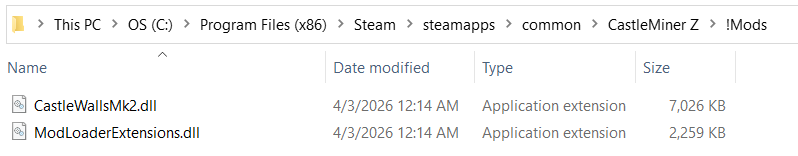

---

## First launch behavior

On startup, the mod can:

- extract embedded files into `!Mods/CastleWallsMk2`
- create a default config if one does not exist
- optionally randomize your username from `UsernameList.txt`
- apply Harmony patches
- load server history
- initialize public/server chat command handling
- initialize console capture and optional rolling log streaming

---

## Configuration

The main config file is:

```text
!Mods/CastleWallsMk2/CastleWallsMk2.Config.ini
```

### Supported config keys

| Key | Purpose | Default |
|---|---|---|
| `ToggleKey` | Overlay toggle key | `OemTilde` |
| `FreeFlyToggleKey` | Free-fly/spectator camera toggle key | `F6` |
| `ReloadConfigHotkey` | Hotkey to reload config while in-game | `Ctrl+Shift+R` |
| `ShowMenuOnLaunch` | Show UI automatically on launch | `false` |
| `RandomizeUsernameOnLaunch` | Randomize your name from `UsernameList.txt` on startup | `false` |
| `StreamLogToFile` | Continuously write logs to disk | `true` |
| `ShowInGameUIFeedback` | Show UI feedback messages in-game | `true` |
| `Theme` | UI theme | `Dark` |
| `Scale` | UI scale multiplier | `1.0` |
| `NetCapturePreferredAdapter` | Preferred packet-capture adapter by partial name | empty |
| `NetCapturePreferredIndex` | Preferred packet-capture adapter index | `-1` |
| `NetCaptureHideOwnIp` | Hide your own local IP in sniffer views | `true` |
| `GeoConnectTimeoutMs` | Geo-IP connect timeout | `1500` |
| `GeoReadTimeoutMs` | Geo-IP read timeout | `1500` |
| `RemoveMaxWorldHeight` | Removes the vanilla max-height clamp | `true` |

## Bonus quality-of-life tweaks

CastleWallsMk2 also includes a handful of smaller quality-of-life improvements that make the base game feel less restrictive and more convenient during normal play.

#### Included tweaks

- **Improved text input support**
  - restores **Ctrl+V paste** in text boxes
  - allows a wider range of printable characters instead of the stricter vanilla input filter
  - still blocks raw control characters to keep text input safe and clean

- **Teleport stays visible in the vanilla menu**
  - keeps the **Teleport** option in its normal vanilla slot
  - prevents it from disappearing in cases where vanilla would normally hide it, such as certain mode/difficulty combinations

- **Removes the PvP restriction from “Teleport To Player”**
  - keeps the normal **online-only** requirement
  - removes the extra PvP visibility gate so the option is available more consistently

- **Optional max world height removal**
  - can remove the vanilla world-height ceiling
  - controlled through config with `RemoveMaxWorldHeight = true`

- **Config hot-reload shortcut**
  - supports reloading the mod config in-game without restarting
  - default hotkey: `Ctrl+Shift+R`

#### Why it matters

These tweaks are not flashy headline features, but they make CastleWallsMk2 smoother to use day to day by improving text entry, reducing menu friction, keeping teleport options available, and making config iteration faster.


### Theme options

- `Classic`
- `Light`
- `Dark`

### Helpful startup extras

- `UsernameList.txt` is used when `RandomizeUsernameOnLaunch=true`
- the mod can hide or show the overlay automatically on launch
- the config hot-reload binding makes iteration faster when tuning the UI or capture settings

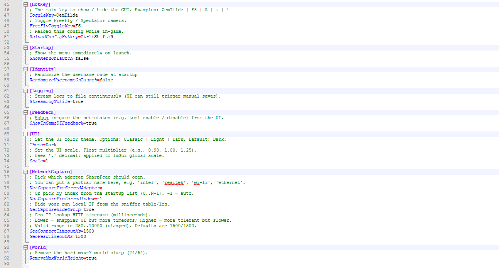

---

## Overlay tabs

CastleWallsMk2 exposes the following major tabs:

- **Main**
- **Editors**
  - Player
  - World
  - Enemies
  - Dragon
- **Code-Injector**
- **Network-Sniffer**
- **Network-Calls**
  - Calls
  - Rules
- **Server-Commands**
- **Server-History**
- **Player-Enforcement**
- **Log**

The next sections break down each tab in detail.

---

## Main tab

The Main tab is the heart of the mod. It combines self-targeted tools, world/visual tools, combat modifiers, moderation utilities, teleporting, spawning, item-giving, and action buttons.

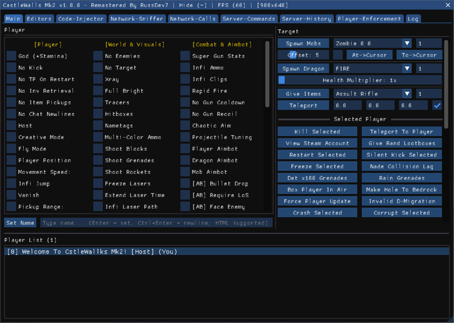

### Main tab at a glance

- quick self tools
- visibility and visual control
- world and movement control
- inventory and item behavior changes
- host/admin punishment tools
- homes and blacklist widgets
- combat and aimbot systems
- quick target tools for players, mobs, dragons, items, and teleportation
- categorized action buttons for selected players, all players, local player, world, and debug

<details>
<summary><strong>Main tab — full feature breakdown</strong></summary>

### Player / self tools

- God (+Stamina)
- No Kick
- No TP On Restart
- No Inv Retrieval
- No Item Pickups
- No Chat Newlines
- Host
- Creative Mode
- Fly Mode
- Player Position
- Movement Speed with multiplier slider
- Infinite Jump
- Vanish
  - Player Is Dead toggle
  - Vanish scopes:
    - InPlace
    - Spawn
    - Distant
    - Zero
- Pickup Range with slider
- Corrupt On Kick
- Free Camera
- No Clip
- Hat / Boots block-wear system
  - block picker for the worn block

### Admin & punishments

- Mute
  - Warn Offender
  - Show Message
  - multi-player target selection
- Disable Controls
  - multi-player target selection
- Force Respawn
  - multi-player target selection
- Rapid Items
  - target picker
  - item picker
  - speed slider
- Shower Items
  - target picker
  - item picker
  - speed slider
- Block Trail
  - Make Private
  - target picker
  - block picker
- Hug
  - single target picker
  - random spread slider
- App-Layer DoS
  - multi-player target selection
  - burst slider
- Soft Crash
- Spam Text
  - start toggle
  - sudo-player mode
  - target picker
  - speed slider
  - expandable text box
- Sudo Player
  - single target picker
  - custom name override text box
- Door Spam
  - multi-player target selection
- Homes widget

### World & visuals

- No Enemies
- No Target
- Xray
- Full Bright
- Tracers
- Hitboxes
- Nametags
- ESP color picker
- Multi-Color Ammo
  - Random Colors toggle
- Shoot Blocks
  - scope: You / Everyone
- Shoot Grenades
- Shoot Rockets
  - scope: You / Everyone
- Freeze Lasers
- Extend Laser Time
- Infi Laser Path
- Infi Laser Bounce
- Explosive Lasers
  - scope: You / Everyone
- Ride Dragon
- Gravity with slider
- Camera XYZ with X/Y/Z sliders
- Item Vortex
  - Beacon Mode
  - target picker
  - item picker
  - beacon height slider
  - speed slider
- DE Dragon Counter
- No Lava Visuals
- Block ESP
  - multi-block selection
  - max chunk radius slider
  - max match count slider
  - Hide Tracers toggle
- Always Day Sky
- Change Game Title
  - apply button
  - custom title text box

### Building & mining

- Instant Mine
- Rapid Place
- Rapid Tools
- Infi Items
- Infi Durability
- All Guns Harvest
- Block Nuker
  - range slider

### Ghost / test

- Ghost Mode
  - Hide Join Msg
- Trial Mode

### Combat & aimbot

- Super Gun Stats
- Infi Ammo
- Infi Clips
- Rapid Fire
- No Gun Cooldown
- No Gun Recoil
- Chaotic Aim
- Projectile Tuning with multiplier slider
- Player Aimbot
- Dragon Aimbot
- Mob Aimbot
- Bullet Drop compensation
- Require Line of Sight
- Face Enemy
- Random aim delay slider
- No Mob Blocking
- Shoot Host Ammo
- Shoot Bow Ammo
- Shoot Fireballs
  - fireball type picker
- Rocket Speed
  - rocket multiplier slider
  - guided rocket multiplier slider
- PvP Thorns
- Death Aura with range slider
- Begone Aura with range slider

### World rules / utility widgets

- Game Difficulty picker
- Game Mode picker
- Set World Time
  - day slider
  - time scale slider
- Exploding Ores
- Discord mode
  - timer slider
  - Auto Clock
  - Auto Dragon
- Blacklist widget

### Target tools section

- Set Name with multiline / Enter-to-submit input
- Spawn Mobs
  - enemy type picker
  - amount input
  - random offset slider
  - same-position toggle
  - At->Cursor
  - To->Cursor
- Spawn Dragon
  - dragon type picker
  - amount input
  - health multiplier slider
- Give Items
  - item picker
  - amount input
- Teleport
  - X / Y / Z inputs
  - Spawn On Top toggle

### Quick action sections

#### Selected Player

- Kill Selected
- Teleport To Player
- View Steam Account
- Give Rand Lootboxes
- Restart Selected
- Silent Kick Selected
- Freeze Selected
- Nade Collision Lag
- Det x100 Grenades
- Rain Grenades
- Box Player In Air
- Make Hole To Bedrock
- Force Player Update
- Invalid D-Migration
- Crash Selected
- Corrupt Selected

#### All Players

- Kill All Players
- Restart All Players
- Kick All Players
- Freeze All Players
- Crash All Players
- Corrupt All Players

#### Local Player

- Drop All Items
- Revive Player
- Unlock All Modes
- Unlock All Achiev's
- Max Stack All Items
- Repair All Items

#### World / Entities

- Kill All Mobs
- Clear Ground Items
- Activate Spawners
- Remove Dragon Msg
- Current Dragon HP
- Clear Projectiles
- cNoEvil (Cave Lighter)
  - max distance slider

#### Debug

- Show Demo Window
- Show Stats Window

</details>

---

## Editors tab

The Editors tab contains four specialized editors: **Player**, **World**, **Enemies**, and **Dragon**.

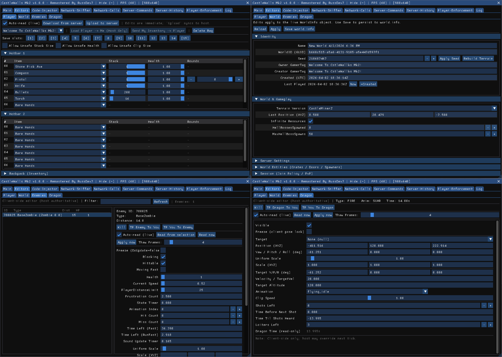

### Player editor

This is a live inventory editor for the local player.

#### Highlights

- edits **Hotbar 1**, **Hotbar 2**, and **Backpack**
- can create or swap items directly from the item list
- can edit stack count, item health, and gun rounds
- can download current inventory from the server
- can upload current layout through the normal HUD/save path
- can clone another player's inventory to yourself
- can send your inventory to another player
- supports **(All Players)** targeting in the player dropdown
- can clear selected inventories
- includes **local inventory save slots** with persistence
- supports optional **unsafe** stack, health, and clip values for advanced testing

#### Saved data

Inventory save slots are persisted to:

```text
!Mods/CastleWallsMk2/CastleWallsMk2.UserData.ini
```


### World editor

This tab edits the live `WorldInfo` object for the current world and gives you a more deliberate Apply / Save flow.

#### Editable areas

- **Identity**
  - Name
  - WorldID (GUID)
  - Seed
  - Owner Gamertag
  - Creator Gamertag
  - Created date
  - Last played date
- **World & Gameplay**
  - Terrain version
  - Last position
  - Infinite resource mode
  - HellBossesSpawned
  - MaxHellBossSpawns
- **Server Settings**
  - Server message
  - Server password
- **World Entities**
  - view counts for crates, doors, and spawners
  - clear crates, doors, and spawners with SHIFT confirmation
- **Session-only settings**
  - join policy
  - PvP mode/state

#### Special behaviors

- seed changes are intentionally gated behind explicit apply/rebuild actions
- dangerous edits are SHIFT-gated
- save writes back to `world.info`
- non-host multiplayer edits may remain local-only unless separately synchronized


### Enemy editor

A live editor for spawned enemies.

#### Features

- left-pane enemy list with filtering
- right-pane details/editor panel
- read from live selection
- read now / apply now workflow
- kill selected enemy
- teleport enemy to you
- teleport yourself to enemy
- freeze / thaw behavior with temporary thaw-on-apply handling
- live editing of enemy data such as:
  - health
  - scale
  - distance limits
  - movement values
  - state timers
  - animation state
  - hit / miss counters
  - sound timer
  - blocking / hittable / moving-fast flags
  - position / scale / lighting vectors
  - AABB bounds
  - rotation via Euler conversion helpers


### Dragon editor

A live editor for both the server-side dragon entity and the client-rendered dragon object.

#### Features

- kill dragon
- teleport dragon to you
- teleport yourself to dragon
- read now / apply now workflow
- freeze pose / thaw-on-apply support
- editable target player selection
- editable client transform and server intent values
- editable animation, clip speed, visibility, velocity, altitude, target angles, shots left, loiters left, timers, and scaling


---

## Code-Injector tab

The Code-Injector tab is a built-in C# execution environment for advanced users.

#### What it supports

- C# snippet execution
- full-source mode via `// @full`
- main-thread dispatch support for game-safe operations
- script load/save
- copy script / copy output
- Ctrl+Enter execution while focused
- output panel for results and errors

#### Included example scripts

- Teleport Player
- List All Gamers
- Play Sound
- Show Position
- Place Loot Boxes
- Give Builder Kit
- Disable Controls
- Enable Controls
- Infinite Vitals
- Restore Vitals
- Freeze Noon
- Restore Time

This makes CastleWallsMk2 unusually useful for **testing ideas live before turning them into full mods**.

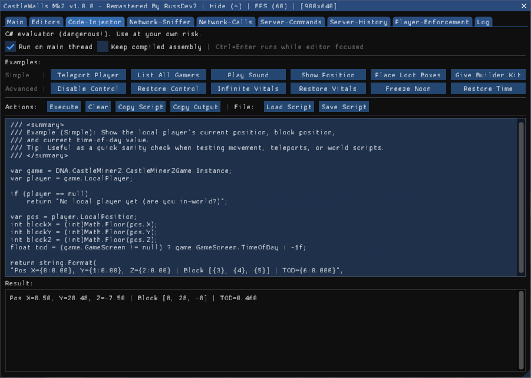

---

## Network-Sniffer tab

The Network-Sniffer tab passively captures CastleMiner Z / Steam UDP traffic and correlates it to local processes by port ownership.

#### Features

- passive packet capture for CMZ / Steam traffic
- adapter selection preferences via config
- refresh ports
- reset and re-learn sessions
- clear rows
- save captured rows
- per-row process / PID / direction / local endpoint / remote endpoint display
- Geo / ISP enrichment for remote IPs
- optional masking of your own local IP
- bundled **Npcap** install prompt when capture support is missing

#### Best use cases

- identifying remote server endpoints
- diagnosing session traffic
- collecting host/server IP information for history tools

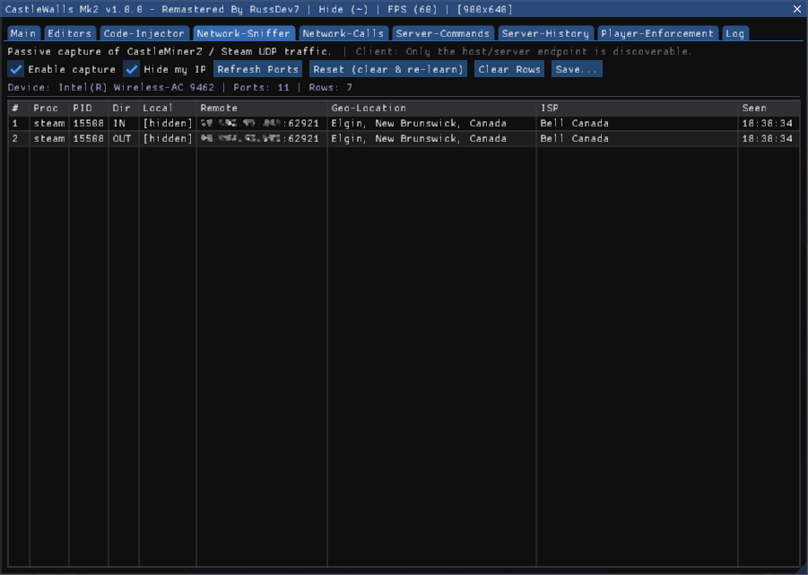

---

## Network-Calls tab

This tab is split into **Calls** and **Rules**.

### Calls

- live log of send/receive activity
- start / stop capture toggle
- clear / save
- auto-scroll and pause support
- filterable view
- max-line cap
- automatic file streaming to:

```text
!Mods/CastleWallsMk2/!NetLogs
```

### Rules

- per-message block rules
- supports:
  - Allow All
  - Block IN
  - Block OUT
  - Block BOTH
- filter-aware rule application
- intended to affect underlying send/receive behavior, not just the display log

This is effectively a **message-level diagnostics and blocking console** for networking.

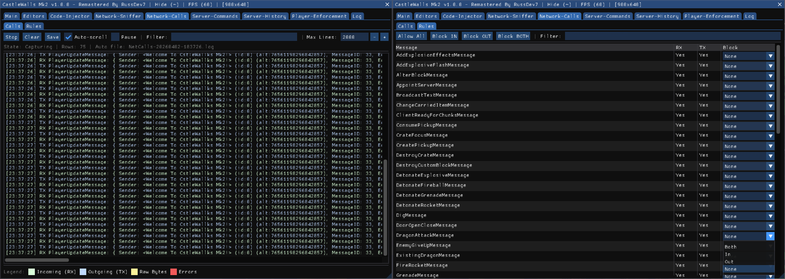

---

## Server-Commands tab

This tab configures **public chat commands** that remote players can use through regular chat.

#### Input formats supported

- `/command`
- `!command`

#### Built-in member commands

- `/help [page]`
- `/whoami`
- `/itemids [page]`
- `/enemyids [page]`
- `/blockids [page]`
- `/summon [id] [amount] [offset]`
- `/item [id] [amount]`
- `/time [day|noon|night|midnight]`
- `/butcher`
- `/spawn`
- `/suicide`
- `/lootbox [amount]`
- `/dragon [id]`

#### Built-in admin commands

- `/kick [player]`
- `/ban [player]`

#### Host-side management features

- enable/disable the entire server command system
- toggle individual commands on or off
- promote selected players to **Admin** for the current session
- optionally hide handled command messages from public chat
- optionally announce state changes / replies depending on configuration

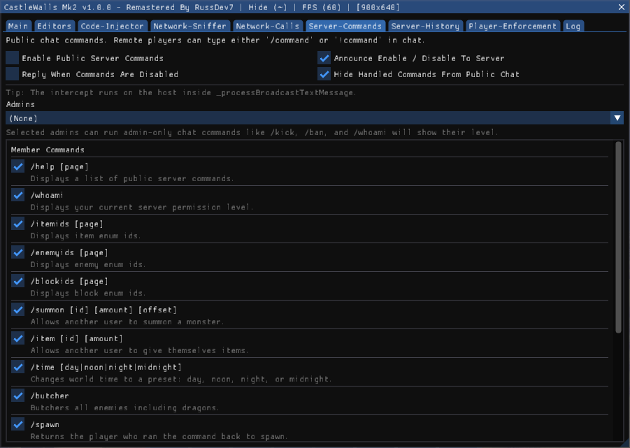

---

## Server-History tab

The Server-History tab maintains a persistent record of hosts you have joined.

#### Stored data per entry

- host name / Gamertag
- alternate address / stable identity
- optional last-known password
- optional sniffed IP data
- first seen / last seen timestamps
- times connected

#### Features

- searchable host history table
- reload / save / remove all
- connect to saved entries
- connect using **front-end flow**
- connect using **ghost-cli** flow
- optional password field
- view player Steam profile from history entry
- delete history entries

#### File location

```text
!Mods/CastleWallsMk2/CastleWallsMk2.ServerHistory.ini
```

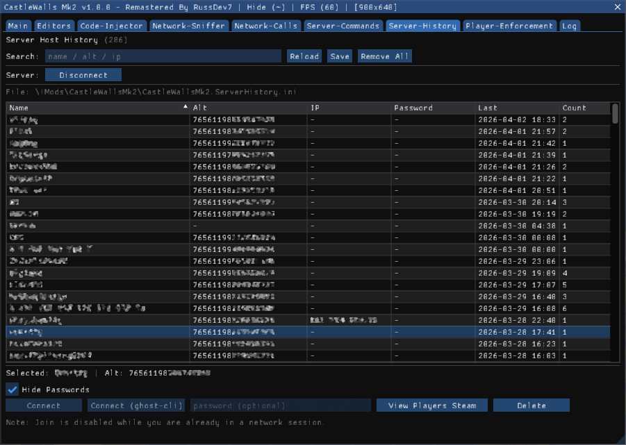

---

## Player-Enforcement tab

This is one of the strongest host/moderation-oriented sections in the mod.

#### Core features

- view current players
- see IDs and Steam-backed identity data when available
- issue:
  - vanilla kick
  - vanilla ban
  - hard kick
  - hard ban
- manage persistent bans
- remove bans
- reload and save ban data
- configure non-host fallback behavior
- edit custom hard-ban deny text

#### Persistent files used

```text
!Mods/CastleWallsMk2/CastleWallsMk2.PlayerEnforcement.ini
!Mods/CastleWallsMk2/CastleWallsMk2.Bans.ini
```

#### Important behavior notes

- host mode uses SteamID-backed enforcement when identity is known
- off-host fallback can use local Gamertag matching plus private kick behavior
- deny text for hard bans is persisted and supports multiline storage
- both SteamID-backed and Gamertag-backed bans are supported by the store

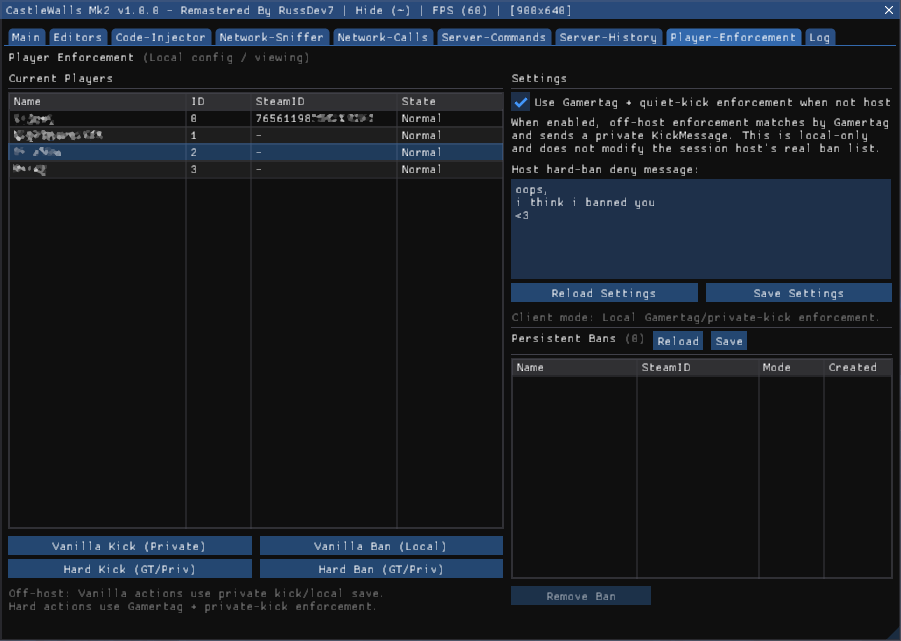

---

## Log tab

The Log tab is the general-purpose logging and message console for the mod.

#### Features

- merged log/chat style display
- clear / save
- auto-scroll
- pause
- filter
- max-line cap
- row context menu for copying lines, source, sequence, and timestamps
- send-message row
- color-coded legend
- optional stats/debug windows

#### Streaming logs

When enabled by config, rolling logs are written under:

```text
!Mods/CastleWallsMk2/!Logs
```

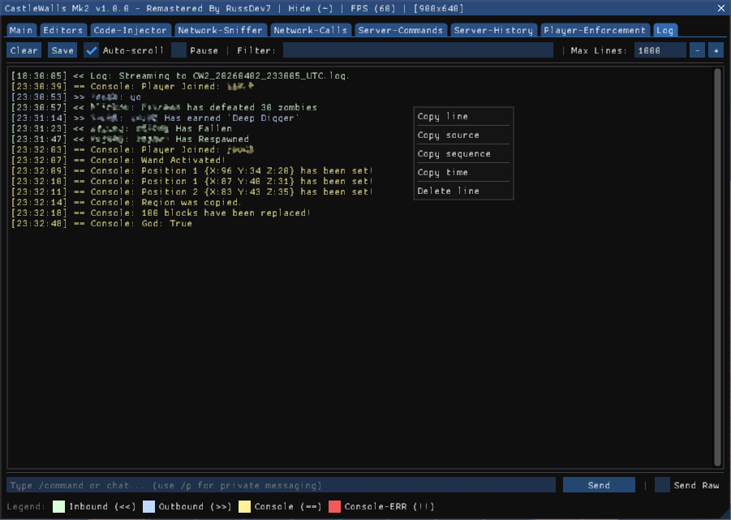

---

## Homes system

CastleWallsMk2 includes a persistent **per-world homes** system.

#### Features

- save named homes per world
- auto-name homes when the input is empty
- load / teleport to saved homes
- rename homes
- delete homes
- stores not only position, but also:
  - player rotation
  - torso pitch

#### File location

```text
!Mods/CastleWallsMk2/CastleWallsMk2.Homes.ini
```

This is more advanced than a simple coordinate bookmark system because it preserves orientation data as well.

---

## Blacklist system

The mod also includes a persistent **blacklist** widget and an automatic enforcer.

#### Features

- save blacklisted names
- rename or delete entries
- choose blacklist response mode
- periodic enforcement tick scans the session and reacts when a listed player appears

#### Enforcement modes

- private kick behavior
- crash behavior when `UseCrash=true`

#### File location

```text
!Mods/CastleWallsMk2/CastleWallsMk2.Blacklist.ini
```

---

## Built-in chat commands

In addition to the server/public command system, the mod also registers local helper commands.

### Private messaging

Aliases:

- `/privatechat`
- `/private`
- `/p`

Usage:

```text
/privatechat [to gamer] [message]
```

### Sudo chat

```text
/sudo [gamer|id:##] [message]
```

These commands support internal target resolution and even include `/check` debugging behavior for resolution testing.

---

## Files created by the mod

CastleWallsMk2 writes or maintains several files under `!Mods/CastleWallsMk2`.

```text
CastleWallsMk2.Config.ini
CastleWallsMk2.UserData.ini
CastleWallsMk2.Homes.ini
CastleWallsMk2.Blacklist.ini
CastleWallsMk2.ServerHistory.ini
CastleWallsMk2.PlayerEnforcement.ini
CastleWallsMk2.Bans.ini
!Logs/
!NetLogs/
UsernameList.txt
```

---

## Best fit / who this mod is for

CastleWallsMk2 is best suited for players who want one or more of the following:

- a powerful sandbox overlay
- live control over movement, combat, and visuals
- host-side moderation and enforcement tools
- network diagnostics and message inspection
- experimental/debugging workflows
- rapid in-game testing through scripting and live editors

If your goal is to showcase the depth of CastleForge as a platform, this is a strong mod to highlight because it demonstrates **UI systems, persistence, patching, runtime editors, networking, automation, and debugging** all in one package.

---

## Notes for users

- Some tools are **local/client-side**, while others depend on **host authority**.
- Some actions are clearly intended for testing, moderation, or experimental sessions rather than normal public play.
- Packet capture features require **Npcap**.
- The code injector is intentionally powerful and should be treated as an advanced feature.
- Several destructive world/session actions are guarded by explicit UI flows or SHIFT confirmation.

---

## License

This project is part of **CastleForge** and follows the repository license and notice structure.