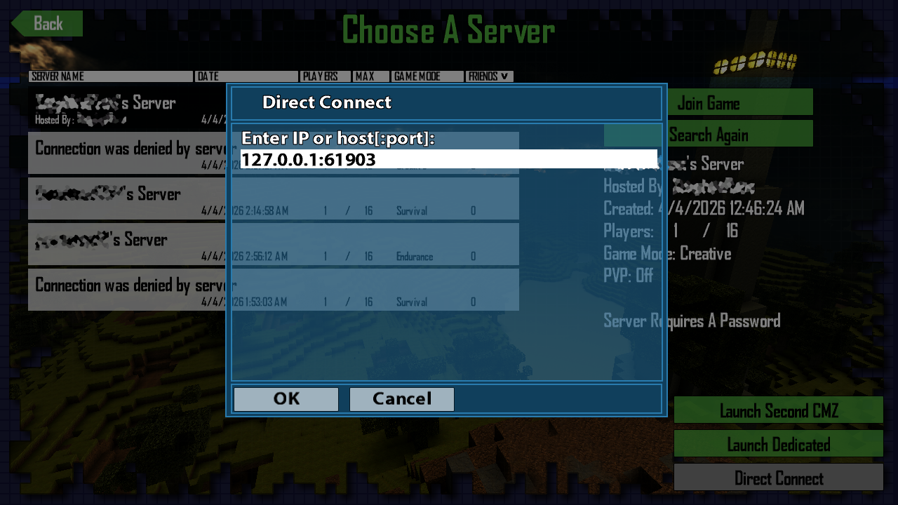
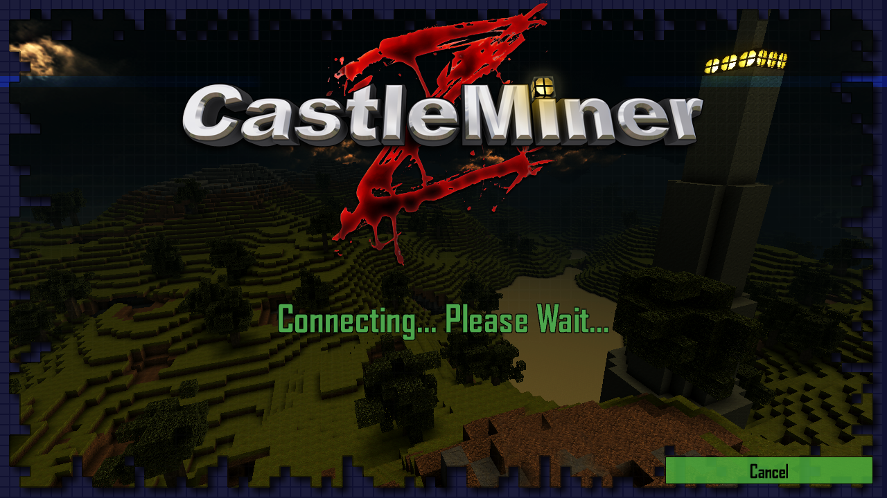
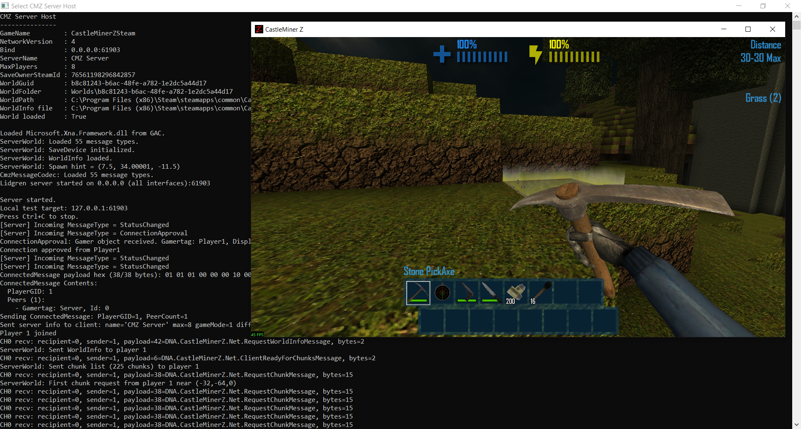
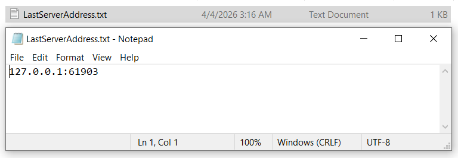

# DirectConnect

> Add a clean, vanilla-feeling **direct IP connection flow** to CastleMiner Z, launch a compatible dedicated server from the menu, and skip the friction of relying entirely on the normal browser flow.

**DirectConnect** is a CastleForge mod that improves CastleMiner Z's manual and test-hosting workflow. It adds a direct-IP join path for compatible **Lidgren-backed servers**, remembers the last address you entered, includes a cleaner cancel flow while joining, and now adds quick-launch buttons for:

- **Launch Second CMZ**
- **Launch Dedicated (Lidgren)**
- **Launch Dedicated (Steam)**
- **Direct Connect**

DirectConnect is especially useful alongside **CMZDedicatedLidgrenServer**, and it also includes a convenience launcher for **CMZDedicatedSteamServer**.

---

## Image Placeholder: Preview


---

## Why use DirectConnect?

CastleMiner Z was not built around a modern “type in an IP and join” experience for custom dedicated hosting. DirectConnect fills that gap by blending a manual connection flow directly into the game’s frontend instead of forcing players to use external tools or awkward workarounds.

### Highlights
- **Direct Connect by IP** from inside the game.
- Supports **`IP`** or **`IP:Port`** input.
- **Remembers your last address** for quick reconnects.
- Adds a **real Cancel button** while joining.
- Can **launch a second CastleMiner Z instance** from the menu.
- Can **launch CMZDedicatedLidgrenServer** directly from the menu.
- Can **launch CMZDedicatedSteamServer** directly from the menu.
- Uses a **vanilla-styled UI flow** so it feels native to the game.
- Restores the normal provider when you return to the main menu so regular browsing still works.

---

## Image Placeholder: Direct Connect Flow


---

## What this mod adds

### 1) A new **Direct Connect** button in the online menu
When the online game screen is opened, DirectConnect injects a new button into the bottom-right corner of the menu.

Selecting it opens a keyboard dialog where you can enter:
- `IP`
- `IP:Port`

If you omit the port, the mod defaults to:
- **`61903`**

### 2) A new **Launch Dedicated (Lidgren)** button
This button starts a compatible Lidgren dedicated server executable directly from the frontend.

The mod checks for:
- `CMZDedicatedLidgrenServer.exe` next to `CastleMinerZ.exe`
- `!Mods\CMZDedicatedLidgrenServer\CMZDedicatedLidgrenServer.exe`
- `!Mods\DirectConnect\CMZDedicatedLidgrenServer.exe`

It also supports the older legacy name:
- `CMZServerHost.exe`

If no compatible executable is found, the mod shows a user-facing dialog explaining the expected locations.

### 3) A new **Launch Dedicated (Steam)** button
This button starts the Steam-native dedicated server launcher.

Because the Steam dedicated server uses the active Steam runtime rather than the live game process, this flow first warns the user that the game will close. If confirmed, DirectConnect:
- closes the current CastleMiner Z process
- waits for the game to fully exit
- launches `CMZDedicatedSteamServer.exe`

The mod checks for:
- `CMZDedicatedSteamServer.exe` next to `CastleMinerZ.exe`
- `!Mods\CMZDedicatedSteamServer\CMZDedicatedSteamServer.exe`
- `!Mods\DirectConnect\CMZDedicatedSteamServer.exe`

### 4) A new **Launch Second CMZ** button
This launches another instance of the currently running CastleMiner Z executable.

This is useful for:
- local testing
- quick multiplayer checks
- host/client workflow debugging
- mod validation against multiple game instances

### 5) Last server memory
DirectConnect stores the last successfully accepted direct-connect address and pre-fills it the next time you open the dialog.

That means quick reconnects without retyping the same address every session.

### 6) A proper **Cancel** button during join
While a join is in progress, the mod adds a dedicated Cancel button to the frontend connecting screen.

You can cancel by:
- clicking **Cancel**
- pressing **Esc**
- pressing controller **B** or **Back**

The cancel flow is designed to unwind cleanly without leaving a half-open join state behind.

---

## Image Placeholder: Connecting Screen


---

## Feature Breakdown

<details>
<summary><strong>Direct IP Join</strong></summary>

### What it does
DirectConnect creates a direct join path for compatible Lidgren-based sessions by building a synthetic available-session entry and forwarding it into the game’s join pipeline.

### User-facing behavior
- Enter an address in the dialog.
- The mod validates the address.
- The join is forwarded into the frontend using the mod’s direct-connect provider path.

### Input rules
Accepted formats:
- `127.0.0.1`
- `127.0.0.1:61903`

Current parser behavior:
- defaults to port `61903` if omitted
- validates the port range
- currently expects a **numeric IP address**
- does **not** currently resolve hostnames in the active direct-entry parser

So `example.com:61903` is not the intended input format right now, while `192.168.0.15:61903` is.

</details>

<details>
<summary><strong>Vanilla-Styled Menu Integration</strong></summary>

DirectConnect styles its buttons using the game’s existing menu controls so they blend into the normal frontend instead of looking like an external overlay.

The buttons are anchored in the bottom-right and are re-positioned repeatedly so they continue to track screen scaling and resolution changes.

Button order from top to bottom:
1. **Launch Second CMZ**
2. **Launch Dedicated (Lidgren)**
3. **Launch Dedicated (Steam)**
4. **Direct Connect**

</details>

<details>
<summary><strong>Dedicated Server Launch Integration</strong></summary>

DirectConnect now supports two dedicated-server launch buttons.

### Launch Dedicated (Lidgren)
Starts a compatible **Lidgren** dedicated server executable from the menu.

Supported search targets include:
- `CMZDedicatedLidgrenServer.exe`
- legacy `CMZServerHost.exe`

### Launch Dedicated (Steam)
Starts **CMZDedicatedSteamServer** from the menu.

Because the Steam dedicated server needs the live game process to exit first, this button:
- prompts the user that CastleMiner Z will close
- closes the current game process if confirmed
- launches the Steam dedicated server after the game exits

This keeps the Steam hosting flow convenient while still respecting how that runtime is started.

</details>

<details>
<summary><strong>Launch Second Instance</strong></summary>

This button launches the current CastleMiner Z executable again.

Useful scenarios include:
- testing frontend flows
- verifying client/server behavior on one machine
- checking menu patches quickly
- validating join/cancel behavior without needing another PC

Note that any external single-instance enforcement from Steam or the game environment may still affect whether multiple instances are allowed.

</details>

<details>
<summary><strong>Join Cancel Protection</strong></summary>

The built-in cancel flow is one of the nicest quality-of-life features in this mod.

It is designed to do more than just hide the screen. On cancellation, the mod attempts to:
- stop duplicate cancellation requests
- clear pending world-load continuation state
- re-enable normal message processing
- silently dispose partial join sessions
- avoid bouncing through the game’s normal session-ended UI flow
- return you cleanly to the main menu

It also swallows late join callbacks after cancellation so a delayed result does not drag the player back into the flow they already abandoned.

</details>

<details>
<summary><strong>Provider Swap + Restore</strong></summary>

For the direct-connect path, the mod swaps the game over to a **Lidgren-based network provider** before joining.

When you return to the main menu and there is no active session, DirectConnect restores the original provider so regular browsing behavior can continue normally.

This helps keep the direct-connect functionality isolated to the join flow where it is actually needed.

</details>

<details>
<summary><strong>Address Persistence</strong></summary>

The last entered address is saved to disk and reused later.

Saved file:

```text
!Mods\DirectConnect\LastServerAddress.txt
```

This is especially useful if you reconnect to the same host often during testing or normal play.

</details>

---

## How to use it

### Joining a server directly
1. Open the game.
2. Navigate to the online game browser screen.
3. Click **Direct Connect**.
4. Enter a valid address such as:
   - `127.0.0.1`
   - `127.0.0.1:61903`
5. Confirm the dialog.
6. Let the game continue through the join pipeline.

### Launching a Lidgren dedicated server from the menu
1. Place `CMZDedicatedLidgrenServer.exe` in one of the supported locations.
2. Open the online game browser.
3. Click **Launch Dedicated (Lidgren)**.
4. Wait for the server to start.
5. Use **Direct Connect** to join it.

### Launching a Steam dedicated server from the menu
1. Place `CMZDedicatedSteamServer.exe` in one of the supported locations.
2. Open the online game browser.
3. Click **Launch Dedicated (Steam)**.
4. Confirm the warning that the game will close.
5. Let the game exit and the Steam dedicated server start.

### Launching a second CMZ instance
1. Open the online game browser.
2. Click **Launch Second CMZ**.
3. Use the second instance for local testing or side-by-side validation.

---

## Image Placeholder: Local Test Workflow


---

## Installation

### Requirements
- CastleForge / ModLoader installed
- CastleMiner Z
- A build of **DirectConnect.dll**
- A compatible direct-connect target such as a **Lidgren-backed dedicated server**

### Basic install
Place the mod DLL in your mods output/load path.

Typical CastleForge-style layout:

```text
!Mods\DirectConnect.dll
```

The mod also creates and uses its own support folder:

```text
!Mods\DirectConnect\
```

That folder is used for saved direct-connect data such as the last entered address.

### Embedded dependency handling
The project embeds Harmony and can extract embedded resources into the DirectConnect mod folder when needed.

---

## Project layout

```text
CastleForge/
└─ CastleForge/
   └─ Mods/
      └─ DirectConnect/
         ├─ README.md
         ├─ DirectConnect.cs
         ├─ DirectConnect.csproj
         ├─ Embedded/
         │  ├─ 0Harmony.dll
         │  ├─ EmbeddedExporter.cs
         │  └─ EmbeddedResolver.cs
         ├─ Patching/
         │  └─ GamePatches.cs
         └─ Properties/
            └─ AssemblyInfo.cs
```

---

## Configuration

DirectConnect currently does **not** expose a normal end-user config file with gameplay settings or toggles.

Instead, it is primarily behavior-driven:
- menu button injection
- direct-connect dialog flow
- saved last-address persistence
- optional dedicated EXE launch support

### Persistent data written by the mod

```text
!Mods\DirectConnect\LastServerAddress.txt
```

That file stores the last address entered through the direct connect dialog.

---

## Image Placeholder: Saved Address Example


---

## Compatibility Notes

DirectConnect is built specifically around a **Lidgren-based direct-connect flow** for CastleMiner Z.

It is best suited for:
- compatible dedicated server hosting setups
- direct-IP local testing
- development workflows
- players who want manual host entry without relying on the default browser flow alone

### Important notes
- The active direct-entry parser currently expects a **numeric IP address**.
- If no port is specified, DirectConnect uses **61903**.
- **Direct Connect** is intended for compatible **Lidgren / direct-IP** join targets.
- The built-in launcher supports:
  - `CMZDedicatedLidgrenServer.exe`
  - `CMZDedicatedSteamServer.exe`
  - legacy `CMZServerHost.exe` compatibility for older Lidgren deployments

---

## Troubleshooting

<details>
<summary><strong>I clicked Direct Connect and it says the address is invalid</strong></summary>

Use one of these formats:
- `127.0.0.1`
- `127.0.0.1:61903`

Right now, the active parser is intended for numeric IP input.

</details>

<details>
<summary><strong>The dedicated server launcher cannot find my server</strong></summary>

For the Lidgren launcher, supported names/locations include:
- `CMZDedicatedLidgrenServer.exe` next to `CastleMinerZ.exe`
- `!Mods\CMZDedicatedLidgrenServer\CMZDedicatedLidgrenServer.exe`
- `!Mods\DirectConnect\CMZDedicatedLidgrenServer.exe`
- legacy `CMZServerHost.exe` compatibility paths

For the Steam launcher, supported names/locations include:
- `CMZDedicatedSteamServer.exe` next to `CastleMinerZ.exe`
- `!Mods\CMZDedicatedSteamServer\CMZDedicatedSteamServer.exe`
- `!Mods\DirectConnect\CMZDedicatedSteamServer.exe`

</details>

<details>
<summary><strong>My last server is not being remembered</strong></summary>

Check whether this file exists and is writable:

```text
!Mods\DirectConnect\LastServerAddress.txt
```

The address is saved after the dialog accepts a valid entry.

</details>

<details>
<summary><strong>I canceled a join and want normal browsing back</strong></summary>

The mod is designed to restore the original provider when returning to the main menu and there is no active network session.

If you are troubleshooting provider-related behavior, fully returning to the frontend is the intended reset path.

</details>

<details>
<summary><strong>The buttons do not appear where I expected</strong></summary>

The custom buttons are injected into the **online game selection screen** and anchored to the **bottom-right** of the screen.

Their placement is recalculated repeatedly so they stay aligned with resolution and UI scaling changes.

</details>

---

## Technical Overview

<details>
<summary><strong>Implementation Notes</strong></summary>

### Core behavior
DirectConnect is a CastleForge mod that:
- initializes through `ModBase`
- loads embedded dependencies through `EmbeddedResolver`
- applies Harmony patches from a central `GamePatches` container
- extracts embedded resources into `!Mods\DirectConnect` when needed

### UI patches
The mod patches the online screen to:
- inject custom buttons on push
- keep them positioned during update
- shut down active discovery objects when the screen is popped

### Join path
The active direct-connect flow:
- parses the user-entered address
- builds a synthetic `AvailableNetworkSession`
- switches to a `LidgrenNetworkSessionStaticProvider`
- calls the game’s private `FrontEnd.JoinGame(...)` path through reflection

### Cancel flow
The connecting-screen cancel system:
- arms when join begins
- draws a manual cancel button
- intercepts mouse, keyboard, and controller cancel input
- silently disposes partial sessions
- swallows late callbacks after cancel

### Additional internal support
The project also includes reusable discovery/helper plumbing for host lookup and a password prompt path for protected discovered sessions, even though the active direct-entry flow currently joins directly after address parsing.

### Build details
Current project metadata indicates:
- target framework: **.NET Framework 4.8.1**
- platform target: **x86**
- assembly name: **DirectConnect**
- mod version in constructor: **0.0.1**

</details>

---

## Technical Diagrams
```mermaid
flowchart LR
    A[Open Online Menu] --> B[Inject Buttons]
    B --> C{User Choice}
    C --> D[Direct Connect]
    C --> E[Launch Dedicated (Lidgren)]
    C --> F[Launch Dedicated (Steam)]
    C --> G[Launch Second CMZ]
    D --> H[Parse IP / Port]
    H --> I[Swap to Lidgren Provider]
    I --> J[Call Join Flow]
    J --> K[Optional Cancel Handling]
    E --> L[Find and launch Lidgren server]
    F --> M[Warn, close game, then launch Steam server]
```

---

## Best Use Cases

- **Joining a private dedicated host by IP**
- **Testing your server locally without relying on Steam browsing**
- **Spinning up a host and client from one machine**
- **Faster reconnect loops during development**
- **Cleaner frontend flow for custom CastleMiner Z networking setups**

---

## Pairing With Other CastleForge Components

DirectConnect is especially useful alongside:
- **CMZDedicatedLidgrenServer** for direct-IP dedicated hosting
- **CMZDedicatedSteamServer** for quick menu-based Steam dedicated host launching
- your broader **CastleForge** mod ecosystem
- local testing workflows for networking-related mods

It acts as the in-game bridge between the player-facing frontend and a manual direct-IP join workflow.

---

## Status Snapshot

### User-facing features included
- Direct Connect button
- Launch Dedicated (Lidgren) button
- Launch Dedicated (Steam) button
- Launch Second CMZ button
- Last server address memory
- Connecting-screen Cancel button
- Provider restore on return to main menu
- Vanilla-style placement and look

### End-user config
- No traditional config file at this time

### Saved data
- `!Mods\DirectConnect\LastServerAddress.txt`

---

## License

This project is licensed under **GPL-3.0-or-later**.
See the repository license for full details.

---

## Credits

Developed and maintained by **RussDev7** as part of the **CastleForge** ecosystem.