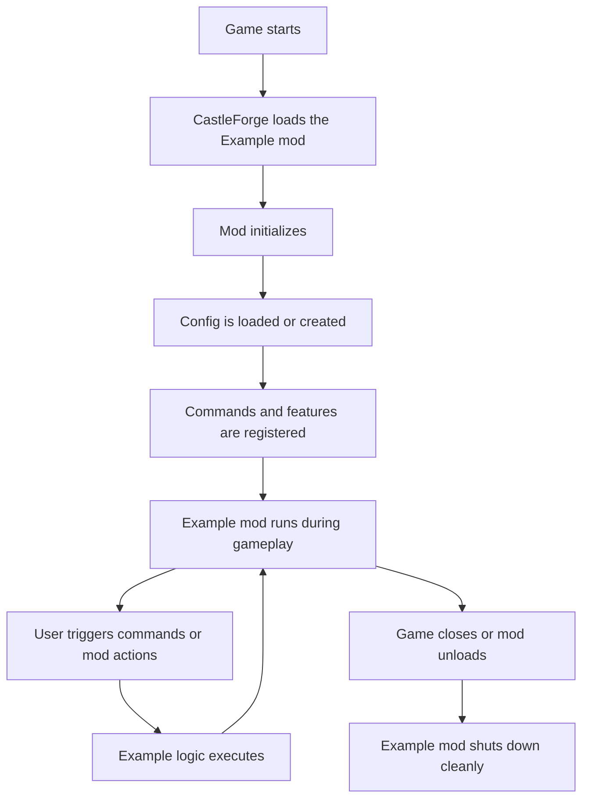
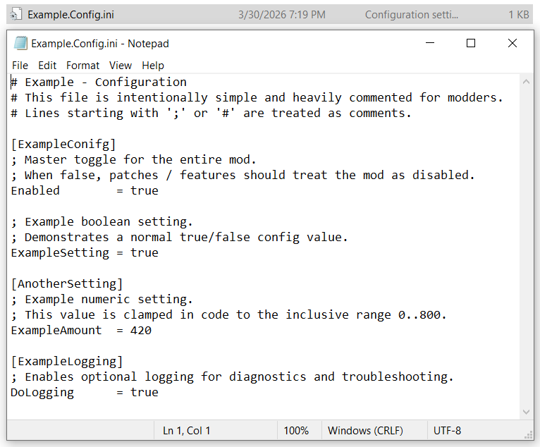
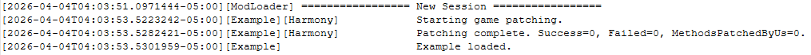
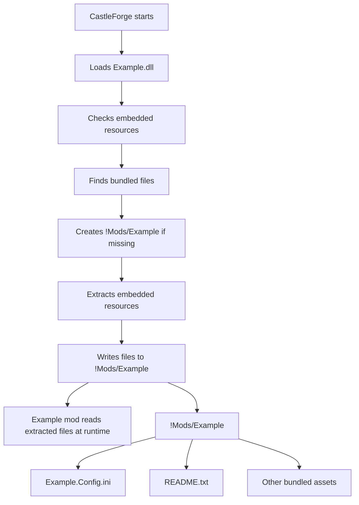

# Example


> A clean starter mod for **CastleForge** that demonstrates the core pieces most mods need: dependency setup, startup/shutdown flow, command registration, config loading, embedded dependency handling, and a reusable Harmony patch bootstrap.

> **Best for:** mod authors, contributors, and anyone using CastleForge as a base for new projects.

---

## What This Mod Is

**Example** is a starter/template mod included with CastleForge. It is designed to show how a well-structured CastleMiner Z mod can be organized without overwhelming a new modder with unnecessary complexity.

Rather than shipping a full gameplay feature set, it provides a strong foundation you can copy, rename, and expand into your own mod. Out of the box, it demonstrates:

- Mod metadata and dependency declarations.
- Safe startup and shutdown flow.
- Embedded DLL resolution.
- Optional embedded file extraction to the mod folder.
- INI-based config creation, loading, validation, and application.
- Chat command registration and dispatch.
- Help registry integration.
- A reusable Harmony patch bootstrap with logging and unpatch support.
- A per-tick update hook for future runtime logic.

---

## Why It Exists

When building new CastleForge mods, there are a handful of systems almost every project ends up needing:

- a clean `ModBase` entrypoint,
- a config file that can be created automatically,
- a patch container that can be enabled and disabled safely,
- command routing,
- embedded dependency support,
- and a predictable folder layout for long-term maintenance.

This mod gives you all of that in one place.

---

## Highlights

### Included Out of the Box

- **`ModBase` startup class** with a clear constructor, `Start()`, `Tick()`, and shutdown flow.
- **Dependency declaration** requiring `ModLoaderExtensions` before the mod can load.
- **Priority declaration** using `Priority.Normal`.
- **Embedded resolver** for loading embedded managed DLLs and preloading native DLLs.
- **Embedded exporter** for writing packaged resources into `!Mods/Example`.
- **Harmony patch bootstrap** that scans patch classes, applies patches, and logs results.
- **Selective patch log silencing** via a custom `HarmonySilentAttribute`.
- **INI config system** with auto-create, parse, validation, and runtime statics.
- **Example command handlers** showing command aliasing and argument parsing structure.
- **Global help registration** hookup for command discoverability.
- **Safe shutdown** that unpatches only this mod's Harmony patches.

### What Is Intentionally Left as a Placeholder

This template is also intentionally unfinished in a few areas so modders can replace the sample logic with their own:

- The actual gameplay logic in the example commands is empty.
- The patch container is ready to use, but currently ships with **no active `[HarmonyPatch]` classes**.
- The `Tick()` world-caching example is present but commented out.
- The help command list contains placeholder entries you are expected to replace.

That is by design. The point of this mod is to teach structure, not lock you into a finished feature set.

---

## Folder Layout

```text
Example/
├─ Embedded/
│  ├─ 0Harmony.dll
│  ├─ EmbeddedExporter.cs
│  └─ EmbeddedResolver.cs
├─ Patching/
│  └─ GamePatches.cs
├─ Properties/
│  └─ AssemblyInfo.cs
├─ Startup/
│  └─ ExConfig.cs
├─ Example.cs
└─ Example.csproj
```

### What Each File Does

| File | Purpose |
|---|---|
| `Example.cs` | Main mod entrypoint. Handles startup, command registration, config loading, and tick flow. |
| `Patching/GamePatches.cs` | Central Harmony bootstrap and unpatch logic. Ready for future patch classes. |
| `Startup/ExConfig.cs` | INI-backed config system with load/create/apply helpers and a lightweight INI parser. |
| `Embedded/EmbeddedResolver.cs` | Loads embedded managed DLLs from memory and preloads native DLLs from disk. |
| `Embedded/EmbeddedExporter.cs` | Extracts embedded files/resources into the mod folder while preserving folder structure. |
| `Embedded/0Harmony.dll` | Embedded Harmony dependency used by the resolver/exporter flow. |
| `Example.csproj` | Project settings, references, output path, and embedded resource configuration. |

---

## Startup Flow

This is the basic flow the template follows when CastleForge loads the mod:

1. The mod is instantiated as `Example : ModBase`.
2. Embedded dependency loading is initialized.
3. A `CommandDispatcher` is created for chat commands.
4. The game exit event is hooked so the mod can clean up on shutdown.
5. `Start()` runs.
6. Embedded resources are optionally extracted into `!Mods/Example`.
7. Harmony patch scanning/apply is performed.
8. The config file is created or loaded.
9. Chat command handling is registered.
10. Help entries are registered.
11. The mod logs that it is ready.

<details>
<summary><strong>Full Example mod's lifecycle overview</strong></summary>



</details>

---

## Core Systems

### 1) Mod Metadata and Load Requirements

The template declares:

- **Priority:** `Priority.Normal`
- **Required dependency:** `ModLoaderExtensions`

This means the mod will not start unless `ModLoaderExtensions` is available. That is useful because the template relies on shared extension systems like command dispatching, chat interception, and help registration.

### 2) Embedded Dependency Handling

The mod initializes `EmbeddedResolver.Init()` in the constructor.

This gives the template two important capabilities:

- **Managed DLL loading from embedded resources** using `AssemblyResolve`.
- **Native DLL preloading** by extracting them to disk and calling `LoadLibrary`.

This is especially useful for mods that package helper libraries or native dependencies and do not want to rely on users manually placing those files.

### 3) Embedded File Export

During startup, the template tries to extract embedded files into:

```text
!Mods/Example
```

This is useful for mods that want to ship default assets, examples, data packs, documentation, or first-run resources.

### 4) Harmony Patch Bootstrap

`GamePatches.ApplyAllPatches()` scans the assembly for classes marked with `[HarmonyPatch]` and patches them individually.

Benefits of this approach:

- One bad patch does not stop the entire patching phase.
- Patch results are logged per patch class.
- Patched methods are summarized after patching.
- The system supports a custom `HarmonySilentAttribute` to keep noisy patch containers out of logs.
- Shutdown cleanly unpatches only this mod's Harmony ID.

### 5) Config Lifecycle

`ExConfig.LoadApply()` demonstrates a complete config workflow:

- create the config folder if needed,
- write a default INI file on first launch,
- parse current settings,
- clamp values into safe ranges,
- copy values into shared runtime statics.

This keeps gameplay or patch code from constantly reading the file from disk.

### 6) Chat Command Routing

The template creates a `CommandDispatcher` and registers it with the chat interceptor. This allows `/commands` typed in chat to be routed to methods marked with `[Command(...)]`.

### 7) Help Registry Integration

The mod also registers a help list through `HelpRegistry.Register(...)`, which makes it easier to surface command information to users.

### 8) Tick Hook

`Tick(InputManager inputManager, GameTime gameTime)` is present for future per-frame or per-tick logic.

In the template, the world acquisition example is included but commented out, making this a safe place to extend the mod later.

---

## Commands

The template includes two command handler examples.

<details>
<summary><strong>Show command reference</strong></summary>

### `/test`
Aliases:
- `/experiment`
- `/trial`
- `/test`

Purpose:
- Demonstrates how to register multiple aliases that all point to the same handler.
- Good for testing command binding and shared command entrypoints.

Current behavior:
- The body is intentionally empty and is meant to be replaced with your own feature logic.

---

### `/example`
Usage:
```text
/example [switch]
```

Supported switches in the template:
- `a`
- `b`

Purpose:
- Demonstrates basic argument validation and switch-based command branching.
- Shows how to provide user-facing error text when parameters are missing or invalid.

Current behavior:
- The switch branches are placeholders and do not yet perform gameplay actions.

---

### Important Note About Help Text

The template also contains a placeholder help list with these entries:

- `launch`
- `exit`
- `debug`

Those entries are **sample help text only** and do **not** match the actual implemented command methods yet.

Before releasing a real mod built from this template, you should update the help list so it accurately reflects the commands you expose.

</details>


---

## Configuration

The Example template automatically creates this file on first run:

```text
!Mods/Example/Example.Config.ini
```

<details>
<summary><strong>Show default config</strong></summary>

```ini
# Example - Configuration
# This file is intentionally simple and heavily commented for modders.
# Lines starting with ';' or '#' are treated as comments.

[ExampleConifg]
; Master toggle for the entire mod.
; When false, patches / features should treat the mod as disabled.
Enabled        = true

; Example boolean setting.
; Demonstrates a normal true/false config value.
ExampleSetting = true

[AnotherSetting]
; Example numeric setting.
; This value is clamped in code to the inclusive range 0..800.
ExampleAmount  = 420

[ExampleLogging]
; Enables optional logging for diagnostics and troubleshooting.
DoLogging      = true
```

</details>

### Config Keys

| Section | Key | Default | Description |
|---|---|---:|---|
| `ExampleConifg` | `Enabled` | `true` | Master toggle for the template mod. |
| `ExampleConifg` | `ExampleSetting` | `true` | Demonstrates a standard on/off feature setting. |
| `AnotherSetting` | `ExampleAmount` | `420` | Example numeric value. Clamped to `0..800`. |
| `ExampleLogging` | `DoLogging` | `true` in the generated file | Enables optional diagnostic logging. |

### Runtime Settings Mirror

Parsed config values are copied into shared runtime statics in `Example_Settings`, which means the rest of the mod can read the current state quickly without repeatedly touching the file system.

### Important Note

The section name is spelled exactly as:

```ini
[ExampleConifg]
```

That spelling is intentional in the current template and should be preserved unless you also update the code that reads it.



---

## Patch Framework

Although the template does not currently ship active gameplay patches, the patch framework is already in place and ready to expand.

### Included Patch Infrastructure

- automatic patch type discovery,
- best-effort per-class patch application,
- patch summary logging,
- targeted unpatching by Harmony ID,
- optional patch log silencing via `HarmonySilentAttribute`.

### Why This Matters

This lets you start simple and scale upward without having to rewrite your patching approach later.

Once your mod grows, you can keep all patch wiring centralized in `GamePatches.cs` and add nested or separate patch classes as needed.



---

## Embedded Resource Support

The template includes two reusable helper systems that are valuable far beyond this one mod.

### `EmbeddedResolver`

Use this when your mod needs to ship managed or native DLLs inside the assembly.

It supports:
- cached embedded resource discovery,
- native DLL extraction to `!Mods/<ModName>/Natives`,
- `LoadLibrary(...)` preloading,
- managed `Assembly.Load(...)` from embedded bytes,
- a lightweight PE inspector to distinguish managed vs native DLLs.

### `EmbeddedExporter`

Use this when you want to package assets or example files and write them out to disk on startup.

It supports:
- folder-style resource extraction,
- directory recreation from dot-separated manifest names,
- overwrite or extract-once behavior,
- cross-mod reuse by passing a destination path and assembly.

<details>
<summary><strong>Show embedded resource extraction diagram</strong></summary>

<br>



</details>

---

## Developer Notes

### This Is a Starter, Not a Finished Feature Mod

If you are browsing the CastleForge mod catalog as a player, this entry is primarily here as a reference for developers. It is meant to be copied, renamed, and extended into something custom.

### Good First Changes for Modders

If you use this template as your starting point, these are the first things you will probably want to change:

1. Rename the project, namespace, and output assembly.
2. Update the command list registered with the help system.
3. Replace the example command bodies with real logic.
4. Add your first `[HarmonyPatch]` classes.
5. Rename config keys and sections to match your feature set.
6. Add a proper README hero image and usage screenshots.

### Build Target

The project targets:

```text
.NET Framework 4.8.1
```

It is configured as an **x86** library and outputs to the CastleForge build structure under `!Mods`.

---

## Installation

### For End Users

1. Install CastleForge and its required core components.
2. Make sure `ModLoader` and `ModLoaderExtensions` are available.
3. Place the built `Example.dll` in your CastleForge `!Mods` folder if it is not already included by your build process.
4. Launch the game.
5. On first run, the mod can generate `Example.Config.ini` under `!Mods/Example`.

### For Developers

1. Open the CastleForge solution.
2. Build the `Example` project.
3. Launch the game with CastleForge.
4. Use the template as the basis for your own renamed mod.

---

## Recommended Screenshots to Add

<details>
<summary><strong>Show image checklist</strong></summary>

### 1) Hero Banner
A polished splash image that communicates this is a developer template included with CastleForge.

### 2) Startup Flow Diagram
A simple visual showing constructor → startup → config → command registration → shutdown.

### 3) Command Demo
A chat screenshot showing command aliases or argument handling.

### 4) Config Screenshot
A text-editor screenshot of `Example.Config.ini` with the most important values highlighted.

### 5) Harmony/Logs Screenshot
A cropped console or log view showing patch bootstrap output.

### 6) Embedded Files Screenshot
A file explorer view showing how assets or dependencies are extracted into the mod folder.

</details>

---

## Best Use Cases

This template is a good fit for:

- first-time CastleForge mod authors,
- contributors who want a clean starting point,
- mods that need commands and config before gameplay logic,
- mods that depend on Harmony or embedded helper libraries,
- projects that want a standardized CastleForge folder and startup pattern.

---

## Known Template Caveats

Before shipping a real mod based on Example, keep these in mind:

- The help list still contains placeholder command names.
- The command handlers are demonstration stubs.
- No live gameplay patches are included yet.
- The `Tick()` example is intentionally commented out.
- The config section name uses the exact label `ExampleConifg`, which should only be changed if code is updated too.

---

## FAQ

<details>
<summary><strong>Is this meant for players or modders?</strong></summary>

Mostly modders. Players can load it, but its real value is as a reference/template project.

</details>

<details>
<summary><strong>Does it patch the game right now?</strong></summary>

It includes the full Harmony patch framework, but the shipped template does not currently define active `[HarmonyPatch]` classes.

</details>

<details>
<summary><strong>Does it create a config automatically?</strong></summary>

Yes. On first run it creates `!Mods/Example/Example.Config.ini` if the file does not already exist.

</details>

<details>
<summary><strong>Can I copy this to start a real mod?</strong></summary>

Yes. That is the main purpose of the project.

</details>

---

## Repository Placement

Within your planned repository structure, this README belongs here:

```text
CastleForge/
└─ CastleForge/
   └─ Mods/
      └─ Example/
         └─ README.md
```

If you keep screenshots local to the mod folder, a clean layout would be:

```text
CastleForge/
└─ CastleForge/
   └─ Mods/
      └─ Example/
         ├─ README.md
         └─ Images/
            ├─ Example_Hero_Banner.png
            ├─ Example_Startup_Flow.png
            ├─ Example_Commands.png
            ├─ Example_Config.png
            ├─ Example_Harmony.png
            └─ Example_Embedded.png
```

---

## TL;DR

**Example** is the CastleForge starter mod. It is a reusable foundation for building new mods, showing how to wire together startup, config, commands, embedded dependencies, and Harmony patch infrastructure in a clean and maintainable way.

If you want a project you can copy and turn into a real feature mod, this is the one.