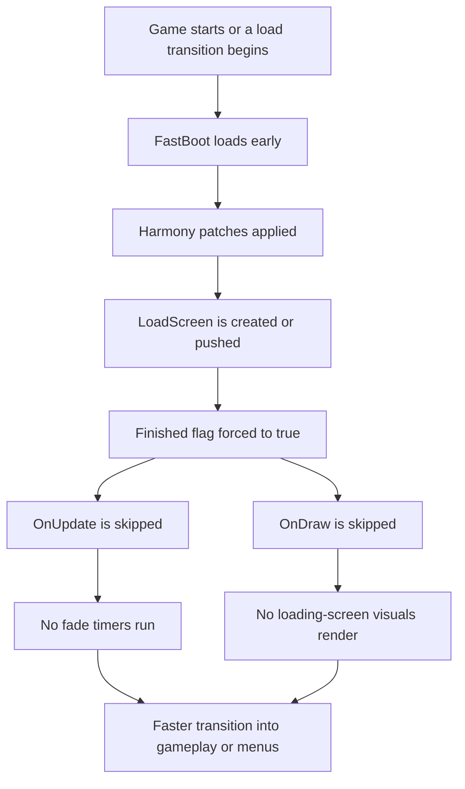

# FastBoot

> Skip the long loading-screen ceremony and get into CastleMiner Z faster.

FastBoot is a lightweight CastleForge mod that short-circuits the game's `LoadScreen` flow so startup and load transitions feel dramatically snappier without rewriting the game's deeper load pipeline. Instead of tearing out screen flow completely, FastBoot keeps the expected screen objects alive, marks them finished immediately, and suppresses their visuals and timer logic.

---

## Overview

FastBoot is built for players who want a cleaner, faster startup experience with as little friction as possible.

It does **not** add menus, hotkeys, chat commands, or gameplay systems. Its entire goal is simple:

- get the loading screen out of the way,
- prevent fade timers from wasting time,
- avoid flicker/black overlay frames,
- and do it in a way that preserves the game's expected screen-stack behavior.


---

## Why Use FastBoot?

FastBoot is ideal if you want:

- **Less waiting at startup or during load-screen transitions**
- **A cleaner experience** with no drawn splash/fade screen
- **A minimal mod** with no setup burden
- **Safer behavior than brute-force screen removal**, since the screen is still pushed and kept inert instead of being ripped out entirely

---

## At a Glance

| Category | Details |
|---|---|
| Mod Name | `FastBoot` |
| Version | `1.0.0` |
| Type | Quality-of-life / startup-speed mod |
| UI | None |
| Commands | None |
| Config File | None in the current source |
| Load Priority | `HigherThanNormal` |
| Target Framework | `.NET Framework 4.8.1` |
| Primary Technique | Harmony patches on `LoadScreen` behavior |
| Dependency Style | Uses CastleForge `ModLoader` and embedded Harmony bootstrap |

---

## What FastBoot Actually Does

FastBoot focuses on **neutralizing the game's loading screen behavior** while leaving the rest of the loading pipeline intact.

### Core behavior

- Marks `LoadScreen` instances as **finished immediately**
- Prevents the loading screen's **update timers** from running
- Prevents the loading screen's **draw routine** from rendering anything
- Preserves the normal screen push flow so code waiting on the screen object does not break
- Loads early and applies all Harmony patches on mod startup
- Unpatches itself on shutdown

---

## Feature Breakdown

### 1) Instant completion of pushed loading screens
When the game pushes a `LoadScreen` into a `ScreenGroup`, FastBoot intercepts that action and immediately sets the screen's `Finished` flag to `true`.

This is important because it keeps waiting loops and screen-stack logic satisfied without forcing a hard removal of the screen object.

### 2) Constructor-level safety catch
FastBoot also patches the `LoadScreen` constructor so newly created loading screens are already marked finished as soon as construction completes.

This helps in cases where something creates or inspects a load screen before it is officially pushed.

### 3) Update loop short-circuit
FastBoot blocks the original `LoadScreen.OnUpdate(...)` logic.

That means the normal fade phases and timing stages do not continue running behind the scenes, including logic associated with:

- pre-blackness
- fade-in
- display duration
- fade-out
- post-blackness

### 4) Draw suppression
FastBoot also blocks `LoadScreen.OnDraw(...)`, which prevents the screen image, black overlay, and fade visuals from rendering.

This is what removes the visible flash/fade behavior instead of merely speeding it up.

### 5) Safe startup/shutdown lifecycle
On mod start, FastBoot:

- initializes embedded dependency resolution,
- applies all Harmony patches found in the assembly,
- and logs that the mod finished loading.

On shutdown, it cleanly unpatches only the Harmony hooks owned by FastBoot.

---

## How It Works

FastBoot does **not** directly cancel the broader loading process.

Instead, it follows a safer pattern:

1. let the loading screen object exist,
2. mark it as finished immediately,
3. stop it from updating,
4. stop it from drawing.

That design matters because some game flows may expect a `LoadScreen` instance to exist in the stack or may poll its completion state. FastBoot keeps those expectations intact while stripping out the delay and visuals.



---

## Installation

### For players
1. Install **CastleForge / ModLoader**.
2. Copy the FastBoot mod build into your CastleMiner Z mods folder.
3. Launch the game normally.
4. FastBoot applies automatically at startup.

### Typical placement
```text
CastleMinerZ/
└─ !Mods/
   └─ FastBoot.dll
```


---

## Configuration

FastBoot currently has **no user-facing config file** in the uploaded source.

There are also:

- **no chat commands**,
- **no hotkeys**,
- **no in-game UI toggles**.

That makes it a true drop-in mod: install it and it simply does its job.

<details>
<summary><strong>What would a future config likely control?</strong></summary>

If FastBoot later gains configuration, the most likely candidate would be a toggle for disabling or enabling the loading-screen bypass behavior without removing the mod entirely.

The source code even includes a note suggesting this kind of future wrap around the forced `Finished` assignments.

</details>

---

## Compatibility Notes

FastBoot is intentionally narrow in scope, which usually helps compatibility.

That said, it directly patches `LoadScreen` behavior, so you should be aware of the following:

- Mods that also patch `LoadScreen`, `ScreenGroup.PushScreen`, `LoadScreen.OnUpdate`, or `LoadScreen.OnDraw` could conflict depending on patch order and intent.
- FastBoot is designed to keep the screen object alive rather than canceling the push, which is safer than more aggressive approaches.
- Because it suppresses drawing entirely, any mod that expects to visibly customize the loading screen will not be able to show its visuals while FastBoot is active.

### Good fit for
- Players who want a faster-feeling boot experience
- Minimalist mod stacks
- Utility-focused client setups

### Use caution if
- You are testing other screen-system mods
- You rely on custom loading-screen visuals for branding or diagnostics

---

## Logging and Internal Behavior

FastBoot includes a fairly clean startup and patching lifecycle:

- embedded dependency initialization at construction time,
- patch discovery by scanning the assembly for `[HarmonyPatch]` classes,
- best-effort per-class patching with logging,
- and clean unpatching on exit.

It also includes helper systems for:

- **embedded managed DLL resolution** via `AssemblyResolve`
- **native DLL preloading** via `LoadLibrary`
- **optional embedded resource extraction helpers** for file payloads

In the uploaded FastBoot source, the main embedded payload is Harmony itself.

<details>
<summary><strong>Technical notes for contributors</strong></summary>

### Startup class
The main mod class is `FastBoot : ModBase`.

It:
- loads embedded dependencies,
- hooks game exit to `Shutdown()`,
- attempts embedded resource extraction to `!Mods/FastBoot`,
- applies all Harmony patches,
- and logs readiness.

### Patch container
`GamePatches.cs` scans the assembly for Harmony patch classes and applies them individually.

This gives the mod:
- better resilience if a single patch fails,
- a readable patch log,
- and clean owner-based unpatching.

### Actual gameplay-facing patch targets
FastBoot's user-visible behavior comes from these patch points:

- `ScreenGroup.PushScreen(Screen)`
- `LoadScreen(Texture2D, TimeSpan)` constructor
- `LoadScreen.OnUpdate(DNAGame, GameTime)`
- `LoadScreen.OnDraw(GraphicsDevice, SpriteBatch, GameTime)`

### Why this design is safer than deleting the screen outright
Some systems may still expect the load screen object to exist. FastBoot avoids breaking those assumptions by keeping the screen in the flow but making it inert.

</details>

---

## Repository Placement

For the project layout you shared, this README is best placed at:

```text
CastleForge/
└─ CastleForge/
   └─ Mods/
      └─ FastBoot/
         └─ README.md
```

A good companion image folder pattern would be something like:

```text
CastleForge/
└─ Assets/
   └─ Images/
      └─ Mods/
         └─ FastBoot/
            ├─ FastBootHero.png
            ├─ FastBootFeatures.png
            ├─ FastBootFlow.png
            └─ FastBootInstall.png
```

If you later add those assets, you can replace each placeholder block with normal GitHub image links.

---

## Suggested Screenshot / Art Plan

### 1) Hero banner
Show the value proposition immediately.
- Left side: normal loading screen / fade screen
- Right side: gameplay or main menu already visible
- Text overlay idea: **Boot Faster. Wait Less.**

### 2) Feature explainer image
Use arrows or labels pointing to:
- pushed screen,
- forced finished state,
- skipped draw,
- skipped update.

### 3) Flow graphic
Turn the included Mermaid flow into a polished static diagram if you want a cleaner showcase image.

### 4) Installation screenshot
Show the exact folder users need to drop the mod into.

---

## FAQ

### Does FastBoot change gameplay?
No. Based on the uploaded source, it is focused on loading-screen behavior and startup flow only.

### Does it add settings or commands?
No. There is no user-facing config, hotkey, menu, or command system in the current version.

### Does it remove loading logic completely?
No. It removes the **visible and timing behavior of the loading screen**, but it does not try to rip out the broader load flow itself.

### Why not just stop the screen from being pushed?
Because some code paths may expect the screen instance to exist or may poll whether it is finished. FastBoot preserves that expectation while making the screen effectively inert.

---

## Troubleshooting

### The mod does not appear to do anything
Check that:
- CastleForge / ModLoader is installed correctly
- the FastBoot DLL is in the correct `!Mods` folder
- the release was built for the expected environment

### Another mod changes loading-screen behavior too
Try disabling other screen- or UI-related mods first. FastBoot patches very specific loading-screen methods, so overlap is the most likely source of odd behavior.

### I want visual loading screens, just faster ones
FastBoot is currently designed to suppress the screen visuals entirely. If you want shortened but still visible loading screens, that would require a different design than the current source.

---

## Summary

FastBoot is a compact, focused quality-of-life mod that makes CastleMiner Z feel quicker and cleaner by neutralizing the loading screen instead of brute-forcing the entire loading process.

It is best described as:

- **small**,
- **automatic**,
- **zero-config**,
- **screen-safe**,
- and **purpose-built for faster transitions**.

If your goal is to streamline startup with minimal fuss, FastBoot does exactly that.