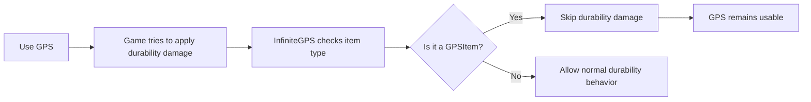

# InfiniteGPS

> Never let your GPS burn out again.

**InfiniteGPS** is a lightweight CastleForge mod for **CastleMiner Z** that gives **infinite durability to GPS-based items**. If an item derives from `GPSItem`, this mod prevents its durability loss and stops it from breaking, so your navigation tool stays available for the entire session.

---

## At a Glance

- **Purpose:** Prevent GPS items from losing durability
- **Scope:** Applies to `GPSItem`-based items, including normal GPS and TeleportGPS-style variants
- **Config File:** None in the current build
- **Commands:** None in the current build
- **UI / Menu:** None
- **Patch Style:** Harmony runtime patch
- **Version in source:** `0.1.0`


---

## What This Mod Does

InfiniteGPS patches the game's durability flow for GPS items so that when the game attempts to damage one, the mod intercepts that call and reports that the item did **not** break.

### Result

- Your **GPS stays usable indefinitely**
- **GPS-derived items** are protected by the same logic
- **Non-GPS items remain vanilla** and are not altered by this mod

This makes InfiniteGPS a great quality-of-life mod for players who rely on GPS tools regularly and do not want to keep replacing them.

<p align="center">
  
  
</p>

---

## Why Use InfiniteGPS?

GPS items are utility tools. They are not usually the kind of item players want to micromanage, replace, or lose in the middle of exploration, travel, or coordinate-based gameplay.

InfiniteGPS keeps that utility item dependable by removing the wear-and-break loop specifically for GPS-class items.

### Good fit for players who want:

- a small, focused quality-of-life mod
- less inventory maintenance
- persistent utility items during long sessions
- compatibility with GPS-style item variants that inherit from the same game class

---

## Feature Overview

### Core Feature

- **Infinite GPS durability**  
  Prevents `InventoryItem.InflictDamage()` from consuming durability when the item is a `GPSItem`.

### Smart Targeting

- **GPS-only behavior**  
  The patch checks whether the item being damaged is a `GPSItem`. If it is not, vanilla behavior is left alone.

### Broad Variant Coverage

- **Covers GPS-derived variants**  
  Because the check is type-based, the mod is designed to cover:
  - standard GPS items
  - TeleportGPS-style items
  - future or custom GPS variants that inherit from `GPSItem`

### Lightweight Runtime Footprint

- **No active tick logic**  
  The mod does not run gameplay logic every frame for its main effect.
- **No command parsing**  
  No chat commands or command dispatcher are active in the current build.
- **No user configuration required**  
  Drop it in and use it.


---

## How It Works

Under the hood, InfiniteGPS uses **Harmony** to patch the game's `InventoryItem.InflictDamage` method.

### Patch Behavior

When the game calls `InflictDamage()` on an inventory item:

1. InfiniteGPS checks whether the current item is a `GPSItem`
2. If it is **not** a GPS item, the original game logic continues normally
3. If it **is** a GPS item, the mod:
   - sets the return result to **false**
   - skips the original durability logic
4. The GPS item therefore **does not break**

### In plain terms

Instead of rewriting broad inventory behavior, the mod intercepts exactly the moment where GPS durability would be consumed and cleanly short-circuits it.

<details>
<summary><strong>Technical Breakdown</strong></summary>

### Patch Target

- `InventoryItem.InflictDamage`

### Conditional Logic

- if `__instance is GPSItem` → skip original method
- set `__result = false`
- return `false` from the Harmony prefix

### Effect

- the caller is told the item did not break
- vanilla damage logic does not run for GPS items
- all non-GPS items continue through the original method untouched

### Startup / Shutdown Flow

- initializes embedded dependency resolution
- extracts embedded resources to `!Mods/InfiniteGPS` when applicable
- applies Harmony patches at startup
- unpatches on shutdown via the mod's Harmony ID

</details>



---

## Installation

### Requirements

- **CastleMiner Z**
- **CastleForge / ModLoader** setup
- Correct mod deployment into your `!Mods` environment

### Install Steps

1. Build or obtain the `InfiniteGPS.dll`
2. Place the mod into your CastleForge mod deployment location
3. Launch the game through your CastleForge-enabled setup
4. Enter a world and use a GPS item normally

### Typical Project / Output Context

This project is built as a **library** targeting **.NET Framework 4.8.1** and outputs into the CastleForge mod deployment structure.

```text
Build/<Configuration>/!Mods/InfiniteGPS.dll
```

If your CastleForge setup uses a different release or packaging flow, place the resulting DLL wherever your normal mod loader expects user mods.


---

## Usage

There is nothing special you need to configure or toggle.

### Normal Use

- load the mod
- start the game
- use your GPS item as usual

If the item is a `GPSItem`-based item, InfiniteGPS will protect it automatically.

### What You Should Notice

- GPS items continue working normally
- GPS items do not consume durability through the patched damage path
- other inventory items behave as usual

---

## Configuration

**This mod does not expose a user config file in the current source build.**

There are also:

- **no chat commands**
- **no in-game menu options**
- **no hotkeys**

That makes InfiniteGPS especially easy to install and forget.

<details>
<summary><strong>Why there is no config</strong></summary>

The current implementation is purpose-built around a single Harmony patch. Since the mod has one clear job and no alternate runtime modes exposed to players, there is no `.ini`, `.json`, or command-based control surface in the present code.

</details>

---

## Compatibility Notes

InfiniteGPS is designed to be low-impact because it only intervenes when an item is a `GPSItem`.

### Safe assumptions

- It should leave unrelated inventory items untouched
- It does not replace UI, HUD, or movement systems
- It does not add world data, save format changes, or content packs

### Things to keep in mind

- If another mod also patches `InventoryItem.InflictDamage` for GPS behavior, load order or patch interaction could matter
- If a custom item does **not** inherit from `GPSItem`, this mod will not affect it
- If another mod uses a completely separate durability or break path, that separate logic would need its own compatibility check

---

## Logging / Lifecycle Notes

The mod includes startup and shutdown handling and logs its patching process.

### On startup

- initializes embedded dependency resolution
- extracts embedded files when present
- applies Harmony patches
- logs that the mod loaded

### On shutdown

- unpatches using its mod-specific Harmony ID
- logs shutdown completion

This is useful for troubleshooting and helps keep the mod self-contained during launch and exit.

---

## Included Files in This Mod Project

```text
InfiniteGPS/
├─ InfiniteGPS.cs
├─ InfiniteGPS.csproj
├─ Embedded/
│  ├─ 0Harmony.dll
│  ├─ EmbeddedExporter.cs
│  └─ EmbeddedResolver.cs
├─ Patching/
│  └─ GamePatches.cs
└─ Properties/
   └─ AssemblyInfo.cs
```

### What each part is for

- **InfiniteGPS.cs**  
  Mod entrypoint, startup, shutdown, and lifecycle hooks
- **Patching/GamePatches.cs**  
  Harmony bootstrap and the GPS durability patch
- **Embedded/0Harmony.dll**  
  Embedded patching dependency
- **EmbeddedResolver.cs / EmbeddedExporter.cs**  
  Dependency loading and optional resource extraction helpers

---

## Best Repository Placement

For the project tree you shared, this README fits naturally at:

```text
CastleForge/
└─ Mods/
   └─ InfiniteGPS/
      └─ README.md
```

If you want to keep per-mod media next to each mod README, a clean companion structure would be:

```text
CastleForge/
└─ Mods/
   └─ InfiniteGPS/
      ├─ README.md
      └─ Images/
         ├─ InfiniteGPSPreview.png
         ├─ InfiniteGPSComparison.png
         ├─ InfiniteGPSFlow.png
         └─ InfiniteGPSInstall.png
```

That keeps the README portable and the image paths simple.

---

## Suggested Image Set for This README

If you want this page to feel polished on GitHub, these are the best images to create:

1. **Hero Preview**  
   Player holding or actively using a GPS item in-game
2. **Before / After Comparison**  
   Vanilla expectation vs. InfiniteGPS active
3. **Inventory Highlight**  
   GPS item highlighted in hotbar or inventory
4. **Flow Diagram**  
   Simple visual showing the durability block logic
5. **Installation Screenshot**  
   `InfiniteGPS.dll` inside the proper `!Mods` folder
6. **Project Layout Image**  
   Small diagram of the mod's internal file structure

---

## Troubleshooting

<details>
<summary><strong>The mod loads, but I do not notice any change</strong></summary>

Check the following:

- make sure the mod is actually being loaded by CastleForge / ModLoader
- confirm you are testing with a GPS item that derives from `GPSItem`
- verify another mod is not overriding the same durability behavior afterward
- review startup logs for Harmony patch success messages

</details>

<details>
<summary><strong>Will this affect every item in the game?</strong></summary>

No. The patch specifically checks whether the item instance is a `GPSItem`. Non-GPS items continue using vanilla durability behavior.

</details>

<details>
<summary><strong>Does this add commands or config support?</strong></summary>

Not in the current build. The source currently exposes no user commands, hotkeys, or config file.

</details>

---

## Summary

InfiniteGPS is a focused quality-of-life CastleForge mod that makes GPS-based items effectively permanent by preventing their durability damage through a small, targeted Harmony patch.

If you want a mod page that is easy for players to understand, this one sells itself best as:

- **simple**
- **practical**
- **low-overhead**
- **always useful**

---