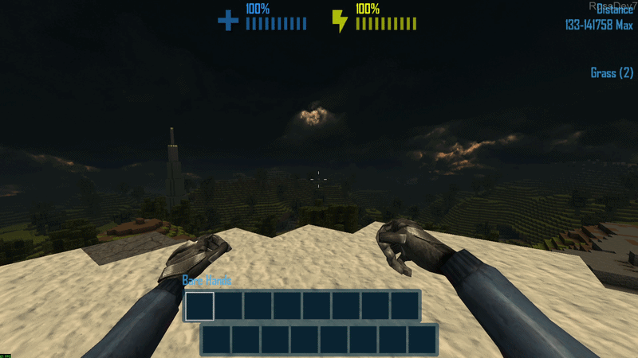
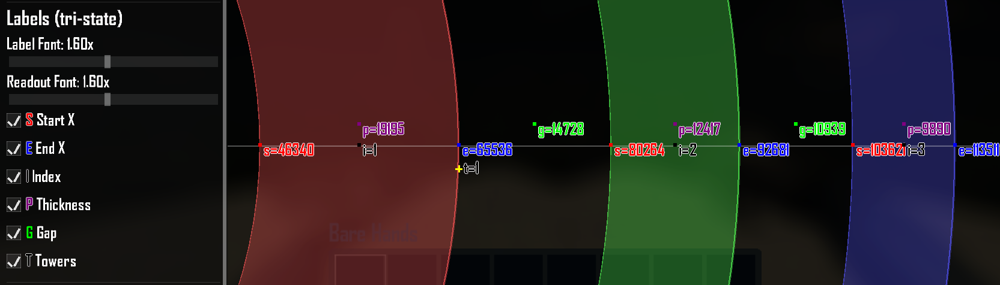
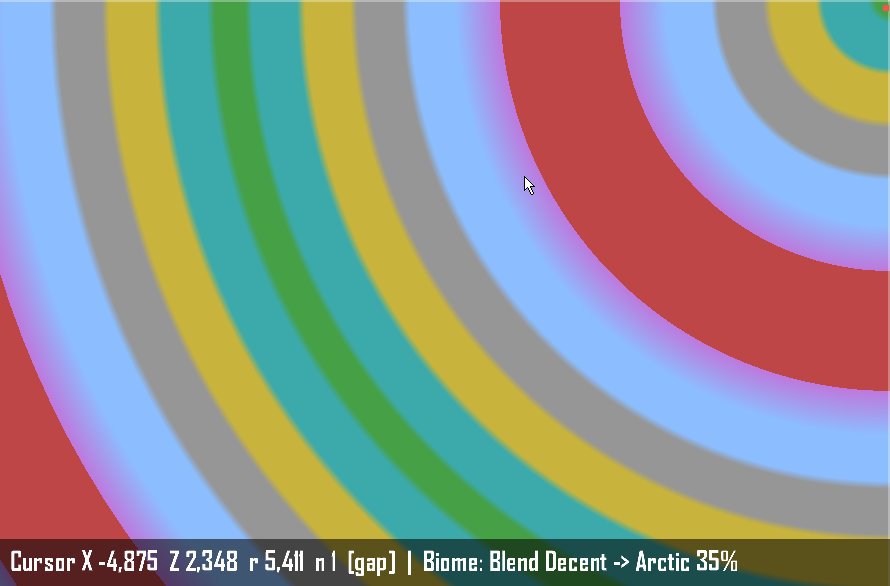
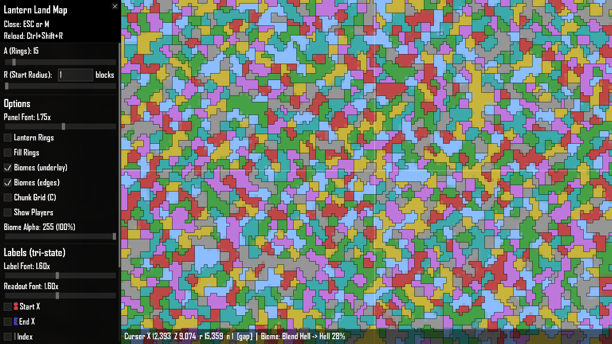
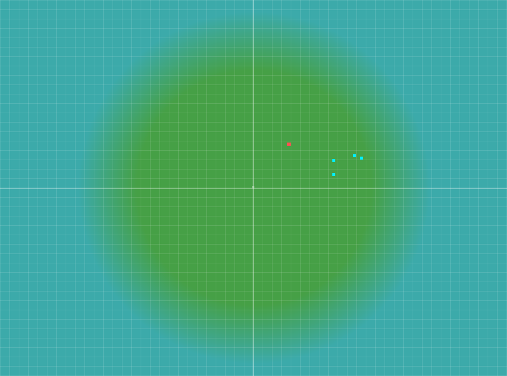
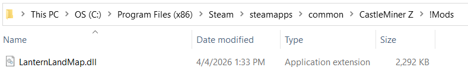
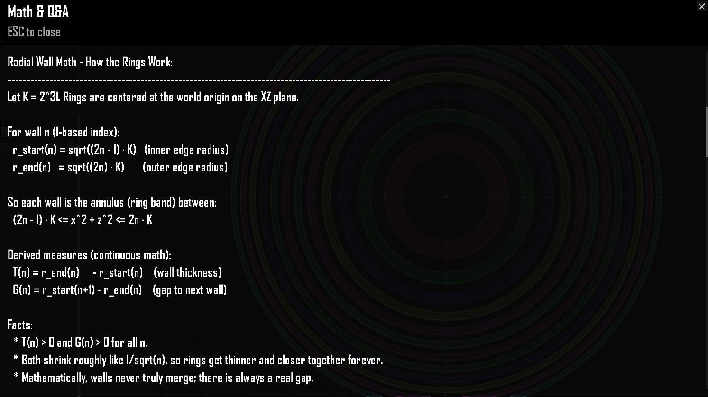
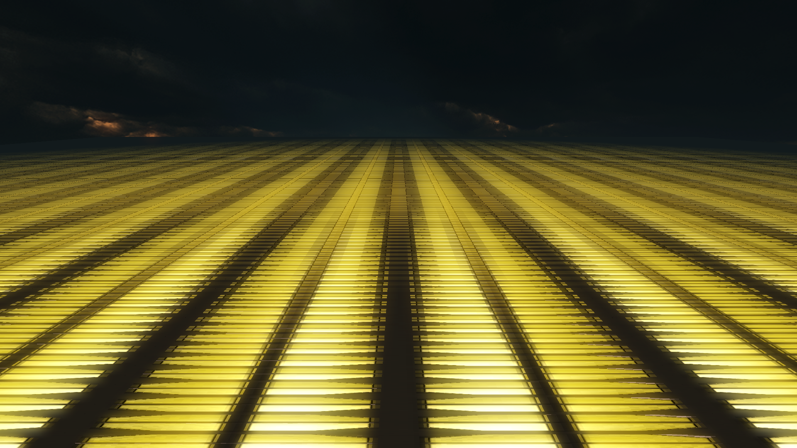
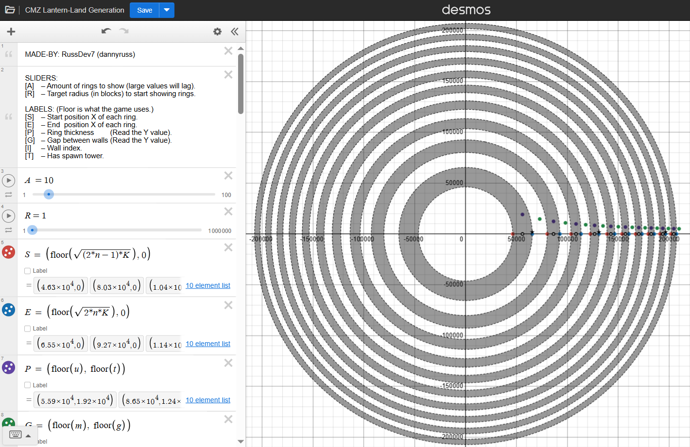

# LanternLandMap

> A full-screen, in-game **Lantern Land visualization and analysis overlay** for CastleMiner Z.
> It can be used both as a detailed biome/ring analysis tool and as a practical **world overview map**, letting you quickly understand the larger layout around you at a glance.
> Explore ring walls, gaps, spawn-tower rings, biome boundaries, and optional **WorldGenPlus** surface generation previews without leaving the game.

<p align="center">
  
  
</p>

---

## Contents

- [Overview](#overview)
- [Why this mod stands out](#why-this-mod-stands-out)
- [Feature overview](#feature-overview)
- [Installation](#installation)
- [How to use](#how-to-use)
- [Default controls](#default-controls)
- [WorldGenPlus integration](#worldgenplus-integration)
- [Configuration](#configuration)
- [Built-in math & Q\&A overlay](#built-in-math--qa-overlay)
- [Files created by the mod](#files-created-by-the-mod)
- [Troubleshooting](#troubleshooting)
- [Credits](#credits)

---

## Overview

**LanternLandMap** turns CastleMiner Z's mysterious Lantern Land ring system into a live, interactive, in-game map.

Instead of guessing where a wall starts, where the next gap lands, or what biome band a distant region belongs to, this mod lets you **see it immediately** on a clean 2D overlay. It is designed for players, explorers, builders, testers, and worldgen tinkerers who want a much clearer view of how the outer world is laid out.

At its core, the mod gives you:

- A **full-screen XZ-plane map** centered on the world.
- **Live ring visualization** with configurable ring count and target radius.
- **Label overlays** for start radius, end radius, thickness, gap size, ring index, and tower rings.
- **Biome underlays** for vanilla surface bands.
- **Optional WorldGenPlus-aware previews** for custom surface generation modes.
- A **cursor readout** that tells you exactly where you are and whether the cursor is over a wall or a gap.
- A built-in **Math & Q\&A** modal that explains how Lantern Land works.

If you have ever wanted a mod that makes CastleMiner Z's ring math feel understandable and visual, this is it.

---

## Why this mod stands out

LanternLandMap is not just a minimap and not just a debug overlay.

It is a **purpose-built analysis screen** for one of CastleMiner Z's most unusual world systems:

- It helps you understand where **Lantern Land walls** really begin and end.
- It shows what the game's **integer block grid** effectively "sees" after continuous math gets floored to whole block positions.
- It highlights **perfect-square tower rings**.
- It supports **interactive inspection**, not static screenshots.
- It remains useful even when paired with **custom WorldGenPlus worlds**.

For players, it is an exploration helper.  
For builders, it is a planning tool.  
For modders, it is a worldgen visualization layer.


---

## Feature overview

### At a glance

| Category | What it does |
|---|---|
| Full-screen map | Opens a modal map overlay with its own panel, mouse handling, and view controls. |
| Ring analysis | Draws Lantern Land rings, wall thickness, gaps, start/end points, and ring indices. |
| Tower detection | Marks spawn-tower rings based on perfect-square ring indices. |
| Biome preview | Renders vanilla biome underlays and optional biome edge emphasis. |
| WorldGenPlus support | Detects active WorldGenPlus worlds and previews Rings, SquareBands, SingleBiome, and RandomRegions surfaces. |
| Cursor inspection | Shows cursor X/Z, radius, ring index, wall-or-gap state, and biome readout. |
| Teleport helper | Supports optional right-click teleporting to the cursor position. |
| Config persistence | Saves runtime UI changes and supports hot-reloading the INI file. |
| Multiplayer visibility | Can show other players with stable colors derived from Gamertag hashes. |
| Built-in documentation | Includes an in-game Math & Q\&A overlay explaining how the system works. |

---

<details>
<summary><strong>Live map screen and navigation</strong></summary>

### What you can do on the map

- Open a **full-screen modal map screen** from the HUD.
- Pan across the world using **left-click drag**.
- Zoom in and out with the **mouse wheel**.
- Optionally zoom **about the cursor** instead of the screen center.
- Reset the view back to the **player** or back to the **world origin**.
- Edit the **target radius** directly in a numeric text box.
- Adjust the visible **ring window** using sliders or `Ctrl + Mouse Wheel` over supported controls.
- Scroll the left panel when the list of controls exceeds the available space.

### What the left panel includes

- Ring count (`A`)
- Start radius (`R`)
- Map options toggles
- Biome alpha control
- Label font scale
- Readout font scale
- Panel font scale
- Live `n0` readout
- Live current view center
- A button to open the built-in **Math & Q\&A** modal

### UX polish built into the screen

- The map is treated as a **modal screen**, so it blocks conflicting gameplay input while open.
- The mod actively clears controller input to help avoid **stuck movement** and recentering problems.
- The HUD **crosshair is hidden** while the map is open to keep the screen clean.
- The map will not open on top of the block picker/crafting picker, helping avoid UI overlap issues.



</details>

<details>
<summary><strong>Ring analysis tools</strong></summary>

### Lantern Land ring rendering

LanternLandMap computes and caches a visible ring window based on your configured radius and ring count, then draws:

- **Ring outlines**
- Optional **solid filled annulus bands**
- **Per-ring labels**
- **Tower markers**
- Grid and axis helpers

### Supported ring labels

Each label category supports a tri-state mode:

- **Off**
- **Dot only**
- **Dot + label**

The mod supports tri-state toggles for:

- **Start X**
- **End X**
- **Index**
- **Thickness**
- **Gap**
- **Towers**

### Why this is useful

This makes it much easier to answer questions like:

- Where does this wall actually begin on the block grid?
- How thick is this ring in practice?
- Is this cursor position inside a wall or in a gap?
- At what point do walls and gaps effectively collapse on integer coordinates?

### Ring math exposed by the overlay

For each visible ring, the mod tracks:

- Inner radius
- Outer radius
- Floored axis positions
- Continuous thickness
- Floored thickness
- Continuous gap
- Floored gap
- Mid-ring and mid-gap positions
- Tower status



</details>

<details>
<summary><strong>Biome underlay and surface preview</strong></summary>

### Vanilla biome preview

LanternLandMap can render a biome underlay that matches the game's distance-based surface band logic, including:

- **Classic**
- **Lagoon**
- **Desert**
- **Mountain**
- **Arctic**
- **Decent**
- **Hell**

You can also enable **Biome Edges** for stronger visual separation.

### Readout support

When biome underlay display is enabled, the bottom cursor bar can report the biome under the cursor in addition to:

- X
- Z
- Radius
- Ring index
- Wall or gap state

### Biome alpha control

A dedicated slider lets you adjust underlay intensity, which is especially useful when you want:

- Stronger biome guidance while exploring
- Subtler overlays while keeping ring lines prominent



</details>

<details>
<summary><strong>WorldGenPlus-aware rendering</strong></summary>

LanternLandMap includes **optional integration logic** for **WorldGenPlus** without taking a hard assembly dependency on it.

If WorldGenPlus is active and has already swapped in its custom world builder, LanternLandMap can reflect the active worldgen settings and preview the current surface layout directly inside the map.

### Supported WorldGenPlus surface modes

- **VanillaRings**
- **SquareBands**
- **SingleBiome**
- **RandomRegions**

### What LanternLandMap mirrors

When WorldGenPlus is active, LanternLandMap can mirror:

- Current **surface mode**
- **Ring period**
- **Mirror repeat** behavior
- **Transition width**
- `@Random` ring picks
- Pipe-separated biome tokens
- Random ring bags
- Random region cell sampling
- Random region blend width and blend power
- Custom biome type names
- Active world seed for deterministic region placement

### RandomRegions support

For RandomRegions worlds, LanternLandMap does more than fake a radial guess:

- It samples the world in **2D**
- Detects the closest and second-closest biome feature regions
- Blends region colors when needed
- Optionally draws approximate **region boundaries**
- Uses deterministic hashing so previews line up with the actual world

### Custom biome colors

Known vanilla biome types use the configured palette.  
Unknown or custom WorldGenPlus biome types receive a **deterministic color** derived from the world seed and biome type name, so they stay visually stable instead of changing randomly every frame.



</details>

<details>
<summary><strong>Teleport, players, and quality-of-life helpers</strong></summary>

### Right-click teleport

The map supports optional **right-click teleporting** to the cursor location.

Configurable behavior includes:

- Enable or disable teleporting
- Require **Shift** while right-clicking
- Use a fixed configured **Y level**

### Player markers

The map can draw:

- The **local player**
- **Other players** when enabled

Other players can use either:

- A fixed configured color
- A **stable random color** based on the player's Gamertag hash

This is useful when testing with friends, checking formation spacing, or comparing relative positions on large-scale worlds.

### Config persistence and hot-reload

- Runtime option changes are saved back to the config.
- The config can be **hot-reloaded** in-game.
- Label state changes can be cycled without closing the map.

### Built-in safety behavior

- The map screen clears input while open to reduce stuck-key issues.
- The crosshair is hidden while the map is open.
- The mod uses a clean push/pop UI flow rather than trying to draw awkwardly over the base HUD.



</details>

---

## Installation

### Requirements

- **CastleForge / ModLoader** installed and working
- CastleMiner Z
- **WorldGenPlus is optional** and only needed if you want the enhanced biome/surface preview integration

### Basic install

1. Place **`LanternLandMap.dll`** into your CastleMiner Z `!Mods` folder.
2. Launch the game through your normal CastleForge / mod loader setup.
3. Open the map with the default hotkey: **`M`**.
4. On first run, the mod will create its config folder and INI file under:

```text
!Mods/LanternLandMap/LanternLandMap.Config.ini
```

### Recommended repository placement

For your GitHub repo layout, this README fits well here:

```text
CastleForge/Mods/LanternLandMap/README.md
```

Recommended image folder:

```text
CastleForge/Mods/LanternLandMap/_Images/
```

That keeps this mod self-contained and makes image paths clean in GitHub markdown.



---

## How to use

### Basic workflow

1. Press **`M`** to open the map.
2. Use the left panel to choose:
   - How many rings to draw
   - What radius window to start from
   - Which labels and helpers to show
3. Drag the map with **left mouse**.
4. Zoom with the **mouse wheel**.
5. Use the bottom readout to inspect the exact cursor location and biome.
6. Open the built-in **Math & Q\&A** panel if you want the formulas and practical explanation inside the game.

### Good use cases

- Planning routes through Lantern Land rings
- Verifying where tower rings land
- Inspecting wall vs gap behavior at large distances
- Checking how WorldGenPlus surface logic lays out the world
- Demonstrating Lantern Land math visually to other players

### Notes about the radius window

The mod uses:

- **A** = number of rings to draw
- **R** = target radius used to find the first visible ring window

This makes it easy to jump from early-world ring layouts to extremely distant ring behavior without needing to travel there manually first.

---

## Default controls

| Control | Default | Action |
|---|---|---|
| Toggle map | `M` | Open or close LanternLandMap |
| Reload config | `Ctrl+Shift+R` | Reload `LanternLandMap.Config.ini` without restarting |
| Toggle chunk grid | `C` | Show or hide the chunk grid |
| Reset to player | `Home` | Center the map on the local player |
| Reset to origin | `End` | Center the map on world origin |
| Start label mode | `S` | Cycle Start X labels: Off / Dot / Dot+Label |
| End label mode | `E` | Cycle End X labels: Off / Dot / Dot+Label |
| Thickness label mode | `P` | Cycle thickness labels |
| Gap label mode | `G` | Cycle gap labels |
| Index label mode | `I` | Cycle ring index labels |
| Tower label mode | `T` | Cycle tower labels |
| Pan map | `LMB drag` | Move the view |
| Zoom | `Mouse Wheel` | Zoom in/out |
| Fine slider adjustment | `Ctrl + Mouse Wheel` | Adjust hovered sliders |
| Teleport | `Right Click` | Teleport to cursor if enabled |
| Close map | `Esc` | Close the map |
| Close Math & Q\&A overlay | `Esc` | Close the built-in readme modal |

---

## WorldGenPlus integration

LanternLandMap works perfectly fine on its own, but it becomes even more useful when paired with **WorldGenPlus**.

### What this means in practice

If you are generating custom worlds with:

- altered surface rings
- mirrored patterns
- square biome bands
- single-biome surfaces
- random region-based surfaces
- custom biome lists

LanternLandMap can preview those choices **inside the map** instead of showing only vanilla assumptions.

### Why that matters

That makes this mod especially useful for:

- testing WorldGenPlus presets
- visual debugging of custom biome layouts
- verifying custom biome transitions
- showing other players how a custom world is arranged

### Important detail

This integration is designed to be **optional**.  
LanternLandMap detects WorldGenPlus through runtime reflection and only uses the integration path when that custom builder is actually active.

That means:

- no hard dependency for normal use
- no forced install requirement
- better compatibility for players who only want the Lantern Land viewer

---

## Configuration

LanternLandMap uses:

```text
!Mods/LanternLandMap/LanternLandMap.Config.ini
```

The config is designed to be both **readable** and **safe to tweak**.  
Many values can also be changed from inside the map and then saved back to disk automatically.

### Main config categories

| Section | Purpose |
|---|---|
| `[Hotkeys]` | Open/close behavior and runtime toggles |
| `[Sliders]` | Ring window size and radius selection |
| `[View]` | Zoom and camera behavior |
| `[UI]` | Panel and readout font scaling |
| `[Drawing]` | Grid, ring fill, line thickness, segment density |
| `[Labels]` | Tri-state label modes, offsets, and outlines |
| `[Colors]` | Background, text, labels, ring colors, biome palette |
| `[Teleport]` | Right-click teleport behavior |
| `[Defaults]` | Default state for map toggles |
| `[Players]` | Other-player marker color and size |

### Especially useful settings

- `ToggleMap`
- `Rings`
- `TargetRadius`
- `FillRingsSolid`
- `BiomeUnderlayAlpha`
- `RightClickTeleport`
- `RequireShift`
- `OtherPlayerColor`
- `OtherPlayerDotSizePx`

---

<details>
<summary><strong>Full configuration reference</strong></summary>

### `[Hotkeys]`

| Key | Default | Description |
|---|---:|---|
| `ToggleMap` | `M` | Open or close the map |
| `ReloadConfig` | `Ctrl+Shift+R` | Reload config from disk |
| `ToggleChunkGrid` | `C` | Toggle chunk grid |
| `ResetViewToPlayer` | `Home` | Center on player |
| `ResetViewToOrigin` | `End` | Center on origin |
| `ToggleStartLabels` | `S` | Cycle Start X label mode |
| `ToggleEndLabels` | `E` | Cycle End X label mode |
| `ToggleThickness` | `P` | Cycle thickness label mode |
| `ToggleGap` | `G` | Cycle gap label mode |
| `ToggleIndex` | `I` | Cycle index label mode |
| `ToggleTowers` | `T` | Cycle tower label mode |

### `[Sliders]`

| Key | Default | Description |
|---|---:|---|
| `Rings` | `10` | Number of rings shown (`A`) |
| `RingsMin` | `1` | Minimum ring count |
| `RingsMax` | `200` | Maximum ring count |
| `TargetRadius` | `1` | Starting target radius (`R`) |
| `RadiusMin` | `1` | Minimum radius |
| `RadiusMax` | `2000000000` | Maximum radius |
| `RadiusLogScale` | `true` | Use logarithmic radius scaling |
| `RadiusWheelMul` | `1.15` | Radius step multiplier for wheel-based adjustments |

### `[View]`

| Key | Default | Description |
|---|---:|---|
| `InitialZoom` | `0.002` | Initial pixels-per-block zoom |
| `ZoomMin` | `0.000000001` | Minimum zoom |
| `ZoomMax` | `1.0` | Maximum zoom |
| `PanSpeed` | `1.0` | Drag panning speed |
| `ZoomAboutCursor` | `true` | Keep cursor world position stable while zooming |

### `[UI]`

| Key | Default | Description |
|---|---:|---|
| `PanelFontScale` | `1.75` | Left panel font scale |
| `ReadoutFontScale` | `1.60` | Bottom cursor readout font scale |
| `ReadoutPaddingPx` | `6` | Padding around the readout bar |

### `[Drawing]`

| Key | Default | Description |
|---|---:|---|
| `ChunkGridStepBlocks` | `16` | Chunk grid step in blocks |
| `MinGridPixels` | `30` | Minimum visible grid spacing |
| `CircleSegmentsMin` | `64` | Minimum ring segment resolution |
| `CircleSegmentsMax` | `512` | Maximum ring segment resolution |
| `RingLineThickness` | `2` | Ring outline thickness |
| `AxisThickness` | `2` | Axis line thickness |
| `GridThickness` | `1` | Grid line thickness |
| `FillRingsSolid` | `true` | Fill ring bands with solid annulus strips |
| `RingFillAlpha` | `80` | Ring fill alpha |

### `[Labels]`

Tri-state values use:

- `off`
- `dot`
- `label`

| Key | Default | Description |
|---|---:|---|
| `FontScaleMin` | `0.35` | Label font minimum |
| `FontScaleMax` | `3.00` | Label font maximum |
| `FontScale` | `1.60` | Active label font scale |
| `StartMode` | `dot` | Start label mode |
| `EndMode` | `dot` | End label mode |
| `IndexMode` | `dot` | Index label mode |
| `ThicknessMode` | `dot` | Thickness label mode |
| `GapMode` | `dot` | Gap label mode |
| `TowersMode` | `dot` | Tower label mode |
| `StartYOffsetPx` | `0` | Start label Y offset |
| `EndYOffsetPx` | `0` | End label Y offset |
| `IndexYOffsetPx` | `0` | Index label Y offset |
| `ThicknessYOffsetPx` | `35` | Thickness label Y offset |
| `GapYOffsetPx` | `35` | Gap label Y offset |
| `TowerYOffsetPx` | `-40` | Tower label Y offset |
| `OutlineEnabled` | `true` | Enable label outline |
| `OutlineThicknessPx` | `1` | Label outline thickness |
| `OutlineColor` | `255,255,255,255` | Label outline color |

### `[Colors]`

| Key | Default | Description |
|---|---:|---|
| `Background` | `0,0,0,180` | Map background |
| `Panel` | `10,10,10,200` | Left panel color |
| `Grid` | `255,255,255,30` | Grid color |
| `Axis` | `255,255,255,80` | Axis color |
| `Player` | `255,80,80,255` | Local player marker color |
| `PanelText` | `255,255,255,255` | Panel text color |
| `MapText` | `255,255,255,255` | Map overlay/readout text color |
| `StartLabel` | `255,0,0,255` | Start label color |
| `EndLabel` | `0,0,255,255` | End label color |
| `ThicknessLabel` | `128,0,128,255` | Thickness label color |
| `GapLabel` | `0,255,0,255` | Gap label color |
| `IndexLabel` | `0,0,0,255` | Index label color |
| `TowerLabel` | `0,0,0,255` | Tower label color |
| `Text` | `255,255,255,255` | Legacy text alias |
| `Tower` | `255,255,0,255` | Tower marker color |
| `RingColors` | `#ff5555aa,#55ff55aa,#5555ffaa,#ffff55aa,#ff55ffaa,#55ffffaa` | Ring color sequence |
| `ClassicBiomeColor` | `70,160,70,255` | Classic biome underlay color |
| `LagoonBiomeColor` | `60,170,170,255` | Lagoon biome underlay color |
| `DesertBiomeColor` | `200,180,60,255` | Desert biome underlay color |
| `MountainBiomeColor` | `150,150,150,255` | Mountain biome underlay color |
| `ArcticBiomeColor` | `140,190,255,255` | Arctic biome underlay color |
| `DecentBiomeColor` | `190,120,220,255` | Decent biome underlay color |
| `HellBiomeColor` | `190,70,70,255` | Hell biome underlay color |

### `[Teleport]`

| Key | Default | Description |
|---|---:|---|
| `RightClickTeleport` | `true` | Enable right-click teleport |
| `RequireShift` | `false` | Require Shift while teleporting |
| `Y` | `0` | Fixed Y value used for teleports |

### `[Defaults]`

| Key | Default | Description |
|---|---:|---|
| `ShowChunkGrid` | `false` | Chunk grid default |
| `ShowLanternRings` | `true` | Ring visibility default |
| `ShowBiomesUnderlay` | `false` | Biome underlay default |
| `BiomeUnderlayAlpha` | `60` | Underlay alpha default |
| `ShowBiomeEdges` | `false` | Biome edge display default |
| `ShowStartLabels` | `true` | Start labels default |
| `ShowEndLabels` | `true` | End labels default |
| `ShowThickness` | `true` | Thickness labels default |
| `ShowGap` | `true` | Gap labels default |
| `ShowIndex` | `true` | Index labels default |
| `ShowTowers` | `true` | Tower labels default |

### `[Players]`

| Key | Default | Description |
|---|---:|---|
| `OtherPlayerColor` | `0,240,255,255` | Other-player color, or use `random` in the INI for stable per-player colors |
| `OtherPlayerDotSizePx` | `5` | Dot size for non-local players |

### Example config snippet

```ini
[Hotkeys]
ToggleMap            = M
ReloadConfig         = Ctrl+Shift+R
ToggleChunkGrid      = C
ResetViewToPlayer    = Home
ResetViewToOrigin    = End

[Sliders]
Rings                = 10
TargetRadius         = 1
RadiusLogScale       = true

[Teleport]
RightClickTeleport   = true
RequireShift         = false
Y                    = 0
```

</details>

---

## Built-in math & Q\&A overlay

One of the nicest touches in this mod is that it does not just visualize Lantern Land — it also explains it.

Inside the map panel, there is a **`Math & Q&A (Read Me)`** button that opens an in-game overlay describing:

- what the rings represent
- how `A` and `R` work
- what the labels mean
- why flooring to integer block positions matters
- why tower rings line up the way they do
- when ultra-distant walls and gaps begin to collapse visually on the block grid

### Core formulas

Using:

```text
K = 2^31
```

For wall `n`:

```text
r_start(n) = sqrt((2n - 1) * K)
r_end(n)   = sqrt((2n) * K)
```

So the wall band is:

```text
(2n - 1) * K <= x^2 + z^2 <= 2n * K
```

Derived measures:

```text
T(n) = r_end(n) - r_start(n)
G(n) = r_start(n+1) - r_end(n)
```

First visible ring index from target radius `R`:

```text
n0 = max(1, ceil(R^2 / (2K)))
```

### Spawn tower rule

From the mod's built-in readme and ring logic, spawn towers occur on **perfect-square ring indices**:

```text
n = 1, 4, 9, 16, 25, ...
```

That leads to:

```text
r_end(k^2) = 65536 * k
```

So tower-aligned positions land on clean `65,536`-scaled steps.

### Practical block-grid behavior

The mod also calls out the difference between:

- **continuous math**
- **floored block coordinates**

That matters because:

- mathematically, walls and gaps always remain greater than zero
- practically, once both thickness and gap fall below one block, the game can no longer represent them separately on the integer grid

That is exactly the kind of detail this mod helps make visible.




> The Endless Wall (starts around radius ≈ 1.08B)

<details>
<summary><strong>Expanded math summary to include in docs or screenshots</strong></summary>

### What the built-in readme teaches

- The ring math is continuous, but block placement happens on an integer grid.
- Very thin walls and gaps can visually disappear after coordinate flooring.
- Thickness and gap shrink roughly like `1 / sqrt(n)`, so rings get thinner and closer forever.
- Mathematically the wall never becomes one single infinite wall, but on the block grid it can eventually behave that way.
- The built-in notes also summarize approximate practical thresholds where floor-snapped wall/gap representation changes dramatically.

### Useful interpretation for players

This is why LanternLandMap is valuable even if you never touch the formulas directly:

- It turns abstract radius math into something you can inspect visually.
- It helps explain why certain distant regions feel "merged" even though the formulas say they are not.
- It gives you a clean way to inspect tower spacing and ring placement without manually calculating anything.

</details>

---

## Interactive Ring Math Calculator

LanternLandMap is also backed by an external **Desmos** reference called **CMZ Lantern-Land Generation** that helps visualize the math behind the overlay:

**Desmos:** `https://www.desmos.com/calculator/1ofepcfrwo`

While the mod gives you an in-game overview map and live visualization, the calculator is useful for digging deeper into the underlying formulas that drive Lantern Land generation. It is especially helpful for understanding ring spacing, wall thickness, gap behavior, and how those values change as distance increases.

This makes it a useful companion tool for players, modders, and anyone curious about how CastleMiner Z’s Lantern Land structure works under the hood.



> **Image Placeholder:** Add a screenshot of the Desmos graph showing the Lantern Land generation math.

---

## Files created by the mod

Typical runtime files for this mod include:

```text
!Mods/LanternLandMap.dll
!Mods/LanternLandMap/LanternLandMap.Config.ini
```

Depending on your packaging and extraction flow, the mod may also extract embedded dependency files into its mod folder on first run.

---

## Troubleshooting

### The map does not open

Check the following:

- The DLL is actually in `!Mods`
- Your CastleForge / ModLoader install is working
- You are not trying to open the map while the block picker or crafting picker is already occupying that UI layer
- Your toggle key in the config has not been changed

### My config edits are not applying

Use the default reload hotkey:

```text
Ctrl + Shift + R
```

That reloads the INI without restarting the game.

### The map feels too cluttered

Try:

- lowering the ring count
- turning off some label categories
- reducing biome alpha
- disabling biome edges
- lowering font sizes
- hiding other player markers

### I only want the vanilla Lantern Land viewer

That is supported.  
WorldGenPlus is optional and only affects enhanced biome/surface preview behavior when active.

---

## Credits

**Made by RussDev7 (dannyruss)**

This mod blends together:

- practical exploration utility
- ring math visualization
- in-game documentation
- optional WorldGenPlus-aware surface previewing

It is one of those mods that makes hidden game systems feel visible, understandable, and immediately useful.
