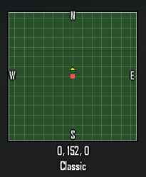
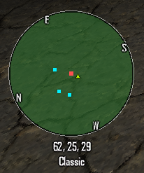
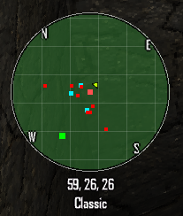
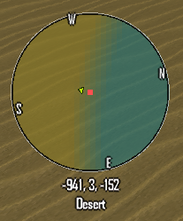
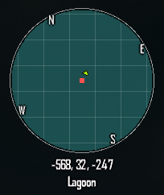
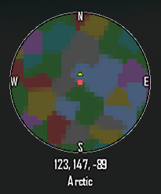
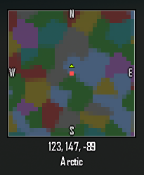
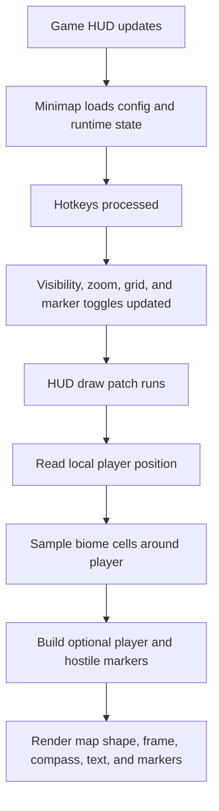

# Minimap

> A lightweight, configurable biome-aware minimap overlay for CastleMiner Z that adds live navigation, biome previewing, multiplayer markers, hostile tracking, and optional WorldGenPlus-aware rendering.

---

## Contents

- [Overview](#overview)
- [Why this mod stands out](#why-this-mod-stands-out)
- [Feature highlights](#feature-highlights)
- [Installation](#installation)
- [How to use](#how-to-use)
- [Hotkeys](#hotkeys)
- [What the minimap can show](#what-the-minimap-can-show)
- [WorldGenPlus integration](#worldgenplus-integration)
- [Configuration](#configuration)
- [Files created by the mod](#files-created-by-the-mod)
- [Compatibility notes](#compatibility-notes)
- [Known behavior and practical notes](#known-behavior-and-practical-notes)

---

## Overview

**Minimap** adds a live HUD overlay to CastleMiner Z that stays centered on the local player and paints the world around you using biome colors. It is designed to be readable, lightweight, and highly configurable while still feeling like a natural extension of the base HUD.

At a glance, the mod supports:

- live minimap rendering in **circle** or **square** mode
- configurable **corner anchoring**, **zoom**, **opacity**, and **text scaling**
- **player**, **other-player**, **enemy**, and **dragon** markers
- a **facing indicator** and optional **rotating compass**
- **coordinates** and **current biome** readouts under the map
- optional **chunk grid** and **biome edge** overlays
- automatic support for **vanilla biome rings**
- deeper biome matching for **WorldGenPlus** worlds, including **SquareBands**, **SingleBiome**, **RandomRegions**, and **custom biome types**
- hot-reloadable config and runtime toggles that persist key values back to disk


---

## Why this mod stands out

Minimap is more than a static "you are here" box. It actively interprets biome layout and adapts to the world-generation system that built the map.

What makes it especially nice:

- It works well as a **clean vanilla-style navigation aid** even without any other mods.
- It becomes much more powerful when paired with **WorldGenPlus**, because it can mirror the actual biome layout rules used by that generator instead of faking generic rings.
- It is built with a lot of quality-of-life behavior in mind: safe-area positioning, bottom-text spacing, runtime toggles, hot-reloadable config, and defensive rendering so HUD failures do not become game-breaking.
- It gives you practical information that matters during real gameplay: where you are, which biome you are approaching, where hostile pressure is coming from, and where other players are relative to you.

---

## Feature highlights

### Live minimap overlay

The map is drawn directly on the HUD and follows the local player in real time. It can render as either:

- **Circle** for a more polished compass/radar look
- **Square** for a more traditional tactical minimap look

Both shapes support:

- configurable size
- configurable screen corner placement
- configurable margins
- configurable background and biome opacity
- border frame and optional outline

<p align="center">
  
  
</p>

### Navigation-focused player guidance

Minimap is centered around helping the player orient quickly.

It includes:

- a local player marker in the center of the minimap
- an optional **facing indicator**
- triangle or line-style facing direction modes
- fill and outline options for the triangle indicator
- configurable indicator length, width, thickness, fill step, and offset
- a **N / E / S / W compass** around the edge of the map
- an option to make the compass **rotate with the player** or remain fixed
- live text showing **current coordinates**
- live text showing **current biome name**


### Multiplayer awareness

The overlay can display **other players** on the map.

Supported behavior includes:

- show or hide other-player markers
- configurable dot size for other players
- either a single fixed color or stable per-player random colors
- stable random colors keyed per player so the same player keeps the same color during play

A nice touch here is that the local player is excluded from the remote-player marker pass, so the center marker remains clean and distinct.



### Hostile awareness

Minimap can track and render:

- **enemy markers**
- **dragon marker**

These are separately configurable for color and dot size, and the runtime hotkey can toggle both hostile layers together for quick cleanup when you want a less busy HUD.



### Biome visualization

Instead of showing terrain tiles, this mod emphasizes **biome-space**. That makes it extremely useful for navigation, route planning, and understanding where biome boundaries are.

Supported biome-related features include:

- colored biome fill for vanilla worlds
- configurable biome palette colors
- optional biome-edge highlighting
- biome name readout under the minimap
- smoother interpretation of biome transitions when WorldGenPlus blending is involved



### Chunk/grid overlay

For building, planning, and spatial alignment, the minimap can draw a configurable grid overlay.

This includes:

- toggleable chunk/grid overlay
- configurable step size in blocks
- minimum grid pixel spacing to prevent visual clutter
- support for both square and circle map shapes



### WorldGenPlus-aware rendering

If WorldGenPlus is present and active, Minimap can read the active world-builder context and adapt the biome preview to match the generator.

That includes support for:

- **VanillaRings**-style repeating radial layouts
- **SquareBands** using Chebyshev-distance style square rings
- **SingleBiome** worlds
- **RandomRegions** worlds with blended borders
- **custom biome types**, including deterministic color assignment for unknown biome classes
- mirrored ring repetition and configurable ring period awareness

This is one of the strongest parts of the mod because it makes the minimap feel honest to the world rather than approximated.

<p align="center">
  
  
</p>

### Performance and stability-minded design

The renderer is built around throttled sampling and defensive behavior.

Notable implementation details that players benefit from:

- configurable update interval
- configurable sample-step size
- cache-based biome cell updates instead of brute-force redraw logic every frame
- exception swallowing around HUD hooks to avoid hard crashes from overlay failures
- safe-area placement so the map behaves better with different display layouts
- bottom text reserve handling so bottom-anchored minimaps do not push readout text off-screen
- hidden-UI respect so the minimap does not force itself onto a fully hidden HUD

---

## Installation

### Repository location

Within your GitHub tree, this README belongs here:

```text
CastleForge/
└─ CastleForge/
   └─ Mods/
      └─ Minimap/
         └─ README.md
```

### Runtime mod location

For players, the compiled mod belongs in the game's mod folder:

```text
!Mods/Minimap.dll
```

The mod will also create and use a config folder here:

```text
!Mods/Minimap/
```

### Requirements

- **CastleForge ModLoader**
- CastleMiner Z
- **WorldGenPlus is optional**, but strongly recommended if you want the minimap to reflect custom biome-generation rules

### Basic setup

1. Install CastleForge.
2. Place `Minimap.dll` into your `!Mods` folder.
3. Launch the game.
4. On first use, the mod will create `!Mods/Minimap/Minimap.Config.ini`.
5. Adjust hotkeys, visuals, colors, and performance settings to your preference.

---

## How to use

Minimap is designed to be mostly HUD-driven. There are no required chat commands or setup commands.

A typical first-use flow looks like this:

1. Launch the game with the mod enabled.
2. Use the default **ToggleMap** key to show or hide the overlay.
3. Use the zoom keys until the scale feels right for your playstyle.
4. Move the map to the corner you prefer.
5. Decide whether you want chunk-grid lines, hostile markers, and the facing indicator.
6. Edit `Minimap.Config.ini` for permanent styling and behavior changes.
7. Use the config reload hotkey to apply changes without restarting the game.

<details>
<summary><strong>Overlay lifecycle diagram</strong></summary>



</details>

---

## Hotkeys

Default hotkeys from the shipped config:

| Action | Default | What it does |
|---|---:|---|
| ToggleMap | `N` | Shows or hides the minimap overlay. |
| ReloadConfig | `Ctrl+Shift+R` | Reloads `Minimap.Config.ini` without restarting the game. |
| ToggleChunkGrid | `C` | Toggles the grid overlay on the minimap. |
| CycleLocation | `OemPipe` | Cycles through minimap anchor corners. |
| ZoomInHotkey | `OemPlus` | Zooms the minimap in. |
| ZoomOutHotkey | `OemMinus` | Zooms the minimap out. |
| ToggleIndicator | `I` | Toggles the player-facing indicator. |
| ToggleMobs | `B` | Toggles both enemy and dragon markers together. |

### Runtime persistence

Several hotkey-driven changes are written back to the config so they survive restarts.

That includes:

- minimap enabled/disabled state
- chunk grid state
- minimap location
- zoom value
- player-facing indicator state
- enemy visibility state
- dragon visibility state

### Important hotkey note

Hotkeys are intentionally ignored while the in-game chat box is active, which helps prevent accidental toggles while typing.

---

## What the minimap can show

### Always centered on the local player

The local player remains centered in the minimap, and the world moves relative to that center.

### Optional map contents

Depending on your settings, the minimap can draw:

- local player marker
- local player facing direction
- other-player markers
- enemy markers
- dragon marker
- biome fills
- biome edge lines
- chunk/grid overlay
- compass letters
- coordinate text
- current biome text

### Shape behavior

- **Square mode** draws directly into a rectangle.
- **Circle mode** uses clipped drawing so the map presents as a rounded radar-style overlay.

### Text readout under the map

The area under the minimap can show:

- `X, Y, Z` coordinates
- current biome name

This is especially useful when testing worldgen, exploring multiplayer worlds, or trying to document biome transitions.

---

## WorldGenPlus integration

Minimap contains explicit WorldGenPlus integration code rather than just treating WorldGenPlus worlds like vanilla rings.

### Supported surface modes

When WorldGenPlus is detected and active, the minimap can match these surface generation modes:

| Surface mode | Supported by Minimap | Notes |
|---|---:|---|
| VanillaRings | Yes | Uses ring-period style biome interpretation. |
| SquareBands | Yes | Uses square-distance sampling to mirror square biome bands. |
| SingleBiome | Yes | Renders a single configured biome across the whole map. |
| RandomRegions | Yes | Uses random-region feature sampling and blend-aware coloring. |

### Custom biome handling

If WorldGenPlus introduces custom biome classes:

- Minimap tries to read their type identity from the active builder context.
- Unknown biome types receive a **deterministic generated color** based on the biome type name and seed.
- Friendly names are shortened for display so the current-biome readout is more readable.

### Why this matters

This means Minimap can be genuinely useful for:

- testing biome layout experiments
- verifying that custom biome bags and region setups are producing expected transitions
- visually checking ring mirroring and square-band progression
- exploring RandomRegions worlds without relying only on guesswork from the terrain itself

<details>
<summary><strong>WorldGenPlus deep dive</strong></summary>

Minimap mirrors several important WorldGenPlus ideas internally so it can stay aligned with the generated world:

- ring period awareness
- mirror-repeat behavior
- square-band distance rules
- single-biome fallback path
- random-region feature sampling and blend weighting
- custom-biome color assignment

It also tracks the active WorldGenPlus builder through reflection so the overlay can react to the world that is actually loaded instead of assuming static settings.

</details>

---

## Configuration

The main config file is:

```ini
!Mods/Minimap/Minimap.Config.ini
```

The mod will create this file automatically on first run.

### Color formats supported

The config parser supports both:

```ini
#RRGGBB
#RRGGBBAA
```

and

```ini
R,G,B
R,G,B,A
```

### Most useful settings first

If you only want to tweak the most visible parts of the mod, start here:

| Section | Key examples | Why you would change them |
|---|---|---|
| `[Minimap]` | `Enabled`, `MinimapShape`, `MinimapScale`, `MinimapLocation`, `InitialZoom` | Overall presentation and placement. |
| `[Hotkeys]` | `ToggleMap`, `ReloadConfig`, `ZoomInHotkey`, `ZoomOutHotkey` | Core usability and comfort. |
| `[Players]` | `ShowOtherPlayers`, `OtherPlayerColor`, `OtherPlayerDotSizePx` | Multiplayer readability. |
| `[Mobs]` | `ShowEnemies`, `ShowDragon`, marker colors/sizes | Combat awareness. |
| `[Compass]` | `ShowCompass`, `CompassRotatesWithPlayer`, `CompassFontScale` | Navigation style. |
| `[Perf]` | `UpdateIntervalMs`, `SampleStepPx` | Performance vs. detail balance. |
| `[Palette]` | biome color entries | Personalize or standardize biome colors. |

### Practical config notes

- Set `OtherPlayerColor = random` if you want stable randomized colors for each remote player.
- Set `CompassOutlineThicknessPx = 0` if you want no compass outline.
- Smaller `SampleStepPx` values give a more detailed map, but at a higher cost.
- Higher `UpdateIntervalMs` values reduce refresh cost, but make the biome field update less frequently.
- `ShowBiomeEdges = true` is excellent for worldgen testing and biome-boundary hunting.
- `MinimapFillAlpha` and `BiomeFillAlpha` are the fastest way to make the overlay feel lighter or bolder.

### Example starter config

```ini
[Hotkeys]
ToggleMap       = N
ReloadConfig    = Ctrl+Shift+R
ToggleChunkGrid = C
CycleLocation   = OemPipe
ZoomInHotkey    = OemPlus
ZoomOutHotkey   = OemMinus
ToggleIndicator = I
ToggleMobs      = B

[Minimap]
Enabled          = true
MinimapShape     = Circle
MinimapScale     = 180
MinimapLocation  = TopLeft
InitialZoom      = 0.25
ShowBiomeEdges   = false
ShowCurrentBiome = true

[Players]
ShowOtherPlayers     = true
OtherPlayerColor     = random
OtherPlayerDotSizePx = 5

[Mobs]
ShowEnemies     = true
ShowDragon      = true
EnemyDotSizePx  = 4
DragonDotSizePx = 7

[Compass]
ShowCompass              = true
CompassRotatesWithPlayer = true
CompassFontScale         = 0.90

[Perf]
UpdateIntervalMs = 150
SampleStepPx     = 6
```

<details>
<summary><strong>Full configuration reference</strong></summary>

### `[Hotkeys]`

| Key | Purpose |
|---|---|
| `ToggleMap` | Show or hide the minimap. |
| `ReloadConfig` | Reload config from disk during play. |
| `ToggleChunkGrid` | Show or hide the grid overlay. |
| `CycleLocation` | Cycle the minimap anchor corner. |
| `ZoomInHotkey` | Increase minimap zoom. |
| `ZoomOutHotkey` | Decrease minimap zoom. |
| `ToggleIndicator` | Toggle the player-facing indicator. |
| `ToggleMobs` | Toggle enemy and dragon markers together. |

### `[Minimap]`

| Key | Purpose |
|---|---|
| `Enabled` | Default startup visibility for the minimap. |
| `Player` | Controls whether the local player marker is shown. |
| `ToggleChunkGrid` | Startup state for the grid overlay. |
| `ShowBiomeEdges` | Draw biome boundary lines. |
| `MinimapShape` | `Circle` or `Square`. |
| `MinimapScale` | Overall map size in pixels. |
| `MinimapCoordinates` | Show coordinates under the map. |
| `ShowCurrentBiome` | Show current biome name under the map. |
| `MinimapLocation` | `TopLeft`, `TopRight`, `BottomLeft`, or `BottomRight`. |
| `MarginPx` | Distance from the safe-area edge. |
| `TextSpacingPx` | Space between map and readout text. |
| `InitialZoom` | Startup zoom value. |
| `ZoomMin` | Minimum allowed zoom. |
| `ZoomMax` | Maximum allowed zoom. |
| `ZoomStepMul` | Per-keypress zoom multiplier. |
| `MinimapFillAlpha` | Base fill transparency of the map area. |
| `BiomeFillAlpha` | Transparency used for biome coloring. |
| `PlayerFacingIndicator` | Enable facing indicator. |
| `PlayerFacingUseTriangle` | Use triangle mode instead of simple line mode. |
| `PlayerFacingLengthPx` | Length of the facing indicator. |
| `PlayerFacingTriangleBaseWidthPx` | Width of the triangle base. |
| `PlayerFacingThicknessPx` | Thickness of line/outline elements. |
| `PlayerFacingTriangleFilled` | Fill the triangle instead of only outlining it. |
| `PlayerFacingTriangleFillStepPx` | Fill-line density for the triangle. |
| `PlayerFacingStartOffsetPx` | Offset the indicator away from the player marker. |
| `PlayerFacingColor` | Main facing-indicator color. |
| `PlayerFacingOutlineColor` | Outline color for the facing indicator. |

### `[Players]`

| Key | Purpose |
|---|---|
| `ShowOtherPlayers` | Show remote players on the minimap. |
| `OtherPlayerColor` | Fixed color, or `random` for deterministic per-player colors. |
| `OtherPlayerDotSizePx` | Dot size used for remote players. |

### `[Mobs]`

| Key | Purpose |
|---|---|
| `ShowEnemies` | Show enemy markers. |
| `EnemyColor` | Enemy marker color. |
| `EnemyDotSizePx` | Enemy marker size. |
| `ShowDragon` | Show the dragon marker. |
| `DragonColor` | Dragon marker color. |
| `DragonDotSizePx` | Dragon marker size. |

### `[Compass]`

| Key | Purpose |
|---|---|
| `ShowCompass` | Show compass letters around the map. |
| `CompassRotatesWithPlayer` | Rotate the compass with player heading. |
| `CompassPaddingPx` | Padding from the edge of the map. |
| `CompassFontScale` | Compass letter scale. |
| `CompassColor` | Compass fill color. |
| `CompassOutlineThicknessPx` | Outline thickness. Set `0` to disable. |
| `CompassOutlineColor` | Compass outline color. |

### `[Text]`

| Key | Purpose |
|---|---|
| `FontScaleMin` | Minimum allowed text scale. |
| `FontScaleMax` | Maximum allowed text scale. |
| `FontScale` | Current text scale. |

### `[Outline]`

| Key | Purpose |
|---|---|
| `OutlineEnabled` | Enables outline drawing for minimap frame/text systems that use it. |
| `OutlineThicknessPx` | Thickness of the minimap outline. |

### `[Perf]`

| Key | Purpose |
|---|---|
| `UpdateIntervalMs` | Cache refresh interval for biome sampling. |
| `SampleStepPx` | Distance between biome sample cells in pixels. |

### `[Colors]`

| Key | Purpose |
|---|---|
| `FrameColor` | Frame color of the minimap. |
| `CoordinatesColor` | Readout text color. |
| `OutlineColor` | General outline color used by minimap text/frame. |
| `PlayerColor` | Local player marker color. |
| `GridColor` | Grid overlay color. |
| `GridStepBlocks` | Grid spacing in blocks. |
| `MinGridPixels` | Minimum on-screen grid spacing to draw. |
| `BiomeEdgeColor` | Biome-edge line color. |

### `[Palette]`

| Key | Purpose |
|---|---|
| `ClassicBiomeColor` | Color for classic biome areas. |
| `LagoonBiomeColor` | Color for lagoon biome areas. |
| `DesertBiomeColor` | Color for desert biome areas. |
| `MountainBiomeColor` | Color for mountain biome areas. |
| `ArcticBiomeColor` | Color for arctic biome areas. |
| `DecentBiomeColor` | Color for decent biome areas. |
| `HellBiomeColor` | Color for hell biome areas. |

</details>

---

## Files created by the mod

### Expected runtime files

```text
!Mods/
├─ Minimap.dll
└─ Minimap/
   └─ Minimap.Config.ini
```

### Notes

- The config directory is created automatically if it does not already exist.
- The config file is also created automatically on first run.
- Key runtime toggles persist into this file as you use the mod.

---

## Compatibility notes

### Works without WorldGenPlus

Yes. In a vanilla setup, the mod still works as a biome minimap overlay and uses vanilla-style biome interpretation.

### Works better with WorldGenPlus

Also yes. When WorldGenPlus is active, Minimap can read the builder context and align itself with advanced biome generation patterns.

### Multiplayer

The mod supports multiplayer marker rendering by scanning the current session's gamers and building remote-player markers from their attached player objects.

### HUD behavior

The overlay respects the game's hidden-UI state and avoids drawing when the HUD is intentionally hidden.

---

## Known behavior and practical notes

- The minimap is **biome-focused**, not a full terrain-tile minimap.
- The hostile toggle controls **both** enemy and dragon markers together.
- In circle mode, drawing is clipped to preserve the rounded presentation.
- Bottom-anchored maps reserve space for the readout text underneath.
- Runtime hotkeys are designed to be safe and lightweight; config edits can be applied through hot reload.
- If you want a cleaner minimalist HUD, the fastest wins are disabling biome edges, reducing fill alpha, and hiding hostile markers.
- If you want a worldgen-testing HUD, enable biome edges, enable biome readout, and keep WorldGenPlus active.

### Small config quirk worth knowing

The parser supports `CompassRotatesWithPlayer` and uses `CompassOutlineThicknessPx` to control whether the compass outline is visible. That makes those the important compass-tuning keys to document and adjust.

---

## Final pitch

If you want a mod that makes exploration, navigation, multiplayer awareness, and biome testing feel dramatically better without turning the HUD into clutter, **Minimap** is an easy recommendation. It is practical in normal gameplay, genuinely useful for mod testing, and especially strong when paired with **WorldGenPlus**.
