# MoreAchievements

Give CastleMiner Z a much bigger sense of progression.

**MoreAchievements** expands the game's achievement experience with a large custom achievement set, a full achievement browser, custom icons, improved unlock popups, optional custom award sounds, helper/admin commands, and config-driven rules for when progress is allowed.


## Why this mod stands out

- Adds **69 registered custom achievements** on top of the vanilla achievement experience.
- Includes a full **achievement browser** accessible from both the **main menu** and the **in-game menu**.
- Shows **vanilla and custom achievements together** with icons, descriptions, IDs, progress text, difficulty grouping, and sorting.
- Supports **custom reward items** for custom achievements.
- Adds **admin/test commands** to grant, revoke, inspect, and troubleshoot achievement progress.
- Supports **config hot-reload** in game.
- Persists extra progress stats that vanilla does not reliably save locally.
- Lets you customize **which game modes** are allowed to unlock custom achievements.
- Supports **custom unlock sounds** and bundled icon packs.

## At a glance

| Category | Details |
|---|---|
| Mod type | Client-side gameplay/UI progression mod |
| Dependency | `ModLoaderExtensions` |
| Target framework | `.NET Framework 4.8.1` |
| Custom achievements | **69 registered** |
| Difficulty tiers | Easy, Normal, Hard, Brutal, Insane |
| Menus patched | Front-end main menu and in-game menu |
| Config file | `!Mods\MoreAchievements\MoreAchievements.Config.ini` |
| Default reload hotkey | `Ctrl+Shift+R` |
| Optional custom sound | `!Mods\MoreAchievements\CustomSounds\Award.wav` or `Award.mp3` |
| Asset extraction | Embedded icons/resources are extracted to `!Mods\MoreAchievements` on first launch |

## Feature overview

### 1) A full achievement browser

This mod injects an **Achievements** button into both the **front-end main menu** and the **in-game menu**. Selecting it opens a dedicated browser screen that:

- shows **vanilla + custom** achievements together
- shows each achievement's **icon, title, description, progress text, and ID/API name**
- color-codes achievements by **difficulty tier**
- includes an on-screen **difficulty legend**
- sorts achievements **unlocked first**, then by tier, then by **Name** or **Id** depending on config
- supports **mouse wheel scrolling**
- closes with **ESC** or the **CLOSE** button


### 2) Better unlock popups and icon handling

MoreAchievements reuses the game's achievement popup flow, then enhances it with a more polished presentation:

- bottom-right **Steam-style unlock toast**
- support for **custom icons** for MoreAchievements achievements
- support for **Steam/vanilla icons** for stock achievements
- popup filtering via config: `None`, `Custom`, `Steam`, or `All`
- optional chat announcements
- optional sound replacement for the award jingle

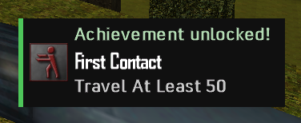

### 3) Custom reward items

Most custom achievements grant actual item rewards when unlocked. These rewards are themed around the achievement that earned them, which makes progression feel more tangible and gives players a reason to chase specific milestones.

Examples include:

- tools, ammo, and supplies for early progression
- teleport/GPS utilities for travel milestones
- explosives for demolition milestones
- weapon upgrades for combat tiers
- high-end gear and material bundles for brutal/endgame goals

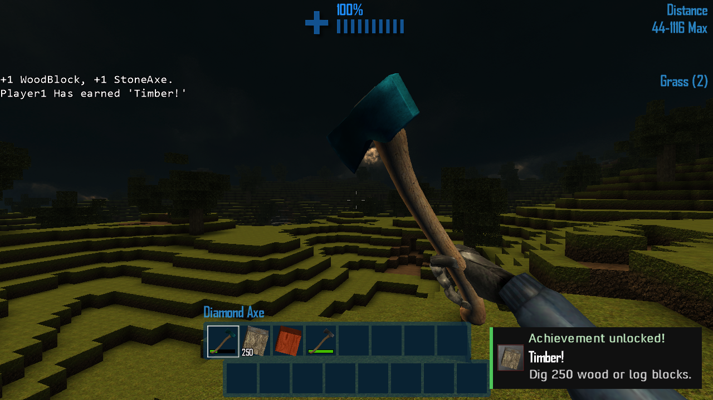

### 4) Helper and admin commands

The mod includes chat commands for both normal use and testing/showcase workflows.

You can:

- grant or revoke achievements by **ID** or **API name**
- grant or revoke **all**, **steam**, **custom**, or a specific **difficulty tier**
- print achievement unlock counts
- inspect which blocks/items are still needed for the “mine/craft/hold everything” style achievements

This is especially useful when testing configs, demoing the mod, or validating long-form completionist progress.

### 5) Configurable rules, UI, and hot reload

The config controls more than simple UI tweaks. It lets you change:

- which **game modes** can unlock custom achievements
- browser layout spacing and sorting
- popup behavior
- chat announcement behavior
- sound behavior
- the **reload hotkey**

Config changes can be applied live with the default hotkey: **`Ctrl+Shift+R`**.

### 6) Reliability / progress preservation work

This mod also includes important behind-the-scenes work so long-term achievement hunting is more reliable:

- swaps in an extended achievement manager at runtime
- keeps the achievement manager updating so UI and progress stay fresh
- persists extra stats that vanilla does not reliably save locally, including:
  - `MaxDistanceTraveled`
  - `MaxDepth`
  - `DragonsKilledWithGuidedMissile`
  - `UndeadDragonKills`
- reapplies those extra stats after load if Steam/user-stat callbacks would otherwise wipe them back out
- gates custom achievement progress by allowed game mode so stats do not advance when you do not want them to

## Installation

1. Install **CastleForge / ModLoader** and **ModLoaderExtensions**.
2. Place `MoreAchievements.dll` into your game's `!Mods` folder.
3. Launch the game once.
4. The mod will extract its bundled resources into `!Mods\MoreAchievements`.
5. Edit `MoreAchievements.Config.ini` if you want to change rules, UI, popup behavior, or sound behavior.

### Expected folder layout after first launch

```text
!Mods/
├─ MoreAchievements.dll
└─ MoreAchievements/
   ├─ MoreAchievements.Config.ini
   ├─ CustomIcons/
   │  ├─ Steam/
   │  └─ Custom/
   │     ├─ Easy/
   │     ├─ Normal/
   │     ├─ Hard/
   │     ├─ Brutal/
   │     └─ Insane/
   └─ CustomSounds/
      └─ Award.wav   (optional)
```

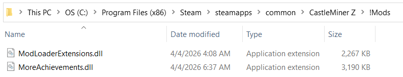

## How to use it

### Opening the browser

- From the **main menu**, open the menu and select **Achievements**.
- From the **in-game menu**, open the menu and select **Achievements**.

### Unlock flow

- Vanilla achievements continue to exist.
- MoreAchievements adds its own custom achievements on top.
- When an achievement unlocks, the mod can show a popup, play a sound, and optionally announce it in chat.
- Custom achievements can also grant items immediately through the local inventory.

## Command reference

| Command | Alias | What it does |
|---|---|---|
| `/achievement` | `/ach` | Grant, revoke, list, or inspect achievement progress |
| `/mineallblocks` | `/mab` | Lists minable block types or shows which tracked blocks remain for the “mine every block” style achievement |
| `/craftallitems` | `/cai` | Lists craftable tracked items or shows which still need to be crafted |
| `/holdallitems` | `/hai` | Lists craftable tracked items or shows which still need to be held long enough |

<details>
<summary><strong>Command details and examples</strong></summary>

### `/achievement` / `/ach`

**Supported actions**

- `grant all`
- `grant all steam`
- `grant all vanilla`
- `grant all custom`
- `grant all easy|normal|hard|brutal|insane`
- `grant <id>`
- `grant <apiName>`
- `grant easy|normal|hard|brutal|insane` *(shortcut for granting a tier)*
- `revoke all`
- `revoke all steam`
- `revoke all vanilla`
- `revoke all custom`
- `revoke all easy|normal|hard|brutal|insane`
- `revoke <id>`
- `revoke <apiName>`
- `revoke easy|normal|hard|brutal|insane` *(shortcut for revoking a tier)*
- `stats`
- `list`

**Examples**

```text
/achievement stats
/achievement list
/achievement grant all custom
/achievement grant hard
/achievement grant ACH_CRAFT_EVERY_ITEM
/achievement revoke brutal
/achievement revoke 12
```

### `/mineallblocks` / `/mab`

```text
/mineallblocks list
/mineallblocks remaining
```

### `/craftallitems` / `/cai`

```text
/craftallitems list
/craftallitems remaining
```

### `/holdallitems` / `/hai`

```text
/holdallitems list
/holdallitems remaining
```

</details>


## Configuration

### Quick reference

| Section | Key | Default | What it controls |
|---|---|---|---|
| Rules | `CustomUnlockGameModes` | `Endurance` | Which game modes are allowed to unlock custom achievements |
| UI | `RowH` | `80` | Browser row height |
| UI | `RowPad` | `4` | Vertical spacing between rows |
| UI | `PanelPad` | `20` | Main panel padding |
| UI | `TitleGap` | `12` | Gap between title and list |
| UI | `ButtonsGap` | `16` | Gap between list and bottom button row |
| UI | `IconPad` | `8` | Icon box padding |
| UI | `IconGap` | `12` | Gap between icon and text |
| UI | `SortAchievementsBy` | `Name` | Sort by `Name` or `Id` |
| Sound | `PlaySounds` | `true` | Whether achievement UI sounds are used |
| Sound | `UseCustomAwardSound` | `true` | Use `CustomSounds/Award.wav` or `.mp3` when present |
| Announce | `AnnounceChat` | `true` | Post a chat message when an achievement pops |
| Announce | `AnnounceAllAchievements` | `true` | Announce vanilla + custom achievements instead of only custom |
| Popup | `ShowAchievementPopup` | `All` | `None`, `Custom`, `Steam`, or `All` |
| Hotkeys | `ReloadConfig` | `Ctrl+Shift+R` | Reload config in-game |

### Game mode rule values

`CustomUnlockGameModes` accepts a comma-separated list of:

- `Endurance`
- `Survival`
- `DragonEndurance`
- `Creative`
- `Exploration`
- `Scavenger`
- `All`

`All` overrides the list and allows custom achievement progress everywhere.

<details>
<summary><strong>Default config file</strong></summary>

```ini
# MoreAchievements - UI Configuration
# Lines starting with ';' or '#' are comments.

[Rules]
; Which game modes allow custom achievements to unlock.
; Valid values (case-insensitive, comma separated):
;   Endurance, Survival, DragonEndurance, Creative, Exploration, Scavenger, All
; "All" overrides the list and allows every mode.
CustomUnlockGameModes = Endurance

[UI]
; Row height (per achievement entry).
RowH       = 80
; Extra vertical spacing between rows.
RowPad     = 4
; Padding inside the panel.
PanelPad   = 20
; Gap between title and top of list.
TitleGap   = 12
; Gap between list and buttons row.
ButtonsGap = 16
; Padding inside the icon box.
IconPad    = 8
; Horizontal gap between icon and text.
IconGap    = 12
; How to sort achievements within each difficulty group:
;   Name - Alphabetical by achievement name.
;   Id   - Numeric/ID-based ordering.
SortAchievementsBy = Name

[Sound]
; If true, achievement UI plays click/close sounds.
PlaySounds          = true
; If true and a custom Award.(mp3|wav) exists in
; !Mods\MoreAchievements\CustomSounds, use it instead of
; the stock "Award" sound cue.
UseCustomAwardSound = true

[Announce]
; If true, post a chat message when an achievement pops.
AnnounceChat            = true
; If true, announcements for all achievements (vanilla + MoreAchievements).
; If false, only announce custom achievements (MoreAchievements).
AnnounceAllAchievements = true

[Popup]
; Which achievements should show HUD popups:
;   None   - No HUD popup.
;   Custom - Only MoreAchievements custom achievements.
;   Steam  - Only vanilla/Steam achievements.
;   All    - Both vanilla + custom.
ShowAchievementPopup = All

[Hotkeys]
; Reload this config while in-game:
ReloadConfig = Ctrl+Shift+R
```

</details>


## Custom icons and sound overrides

MoreAchievements ships with bundled achievement art and also supports optional overrides/expansion through the extracted mod folder.

### Icons

The browser and toast systems look for icons under:

```text
!Mods\MoreAchievements\CustomIcons\Steam
!Mods\MoreAchievements\CustomIcons\Custom
```

The custom icon set is already organized into:

- Easy (**11**)
- Normal (**24**)
- Hard (**16**)
- Brutal (**11**)
- Insane (**7**)

The embedded Steam/vanilla icon bundle includes **31** stock achievement icons.

### Sound

To replace the normal award jingle, place one of the following files here:

```text
!Mods\MoreAchievements\CustomSounds\Award.wav
!Mods\MoreAchievements\CustomSounds\Award.mp3
```

If present and enabled, the mod will prefer that sound over the stock `Award` cue.

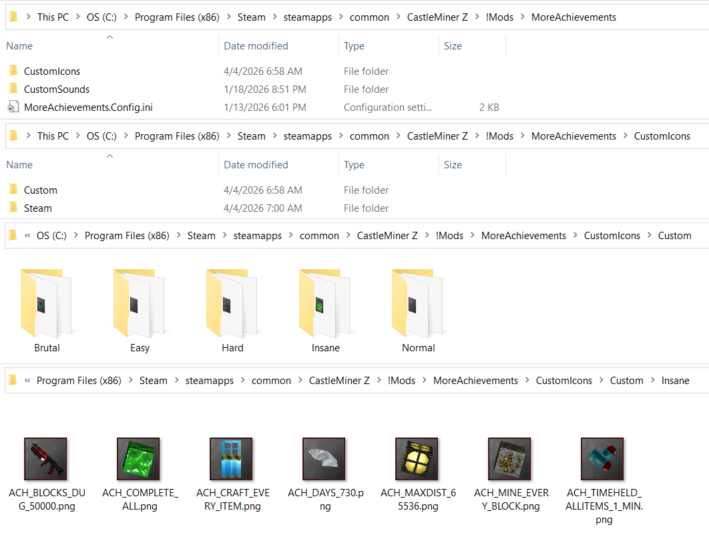
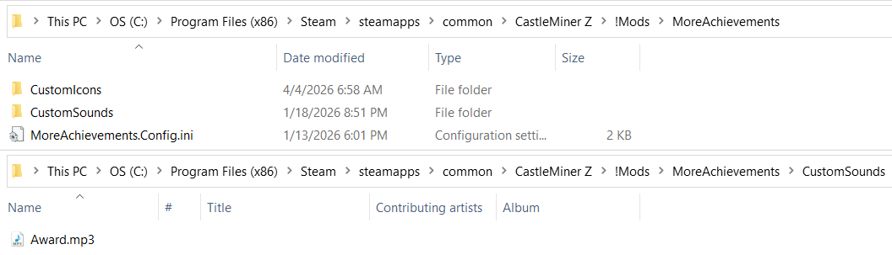

## Full custom achievement catalog

MoreAchievements registers **69 custom achievements** across five difficulty tiers:

- **Easy:** 11
- **Normal:** 24
- **Hard:** 16
- **Brutal:** 11
- **Insane:** 7

MoreAchievements also tracks the **31 vanilla achievements**:

- **Vanilla:** 31

For a total of **100 achievements**!

<details>
<summary><strong>Show the full achievement list, API names, requirements, and rewards</strong></summary>

### Easy (11)

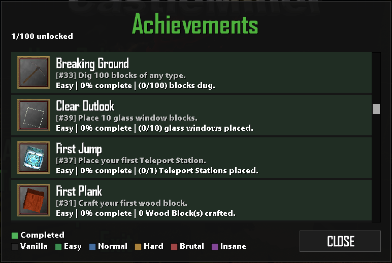

| Achievement | API Name | Requirement | Reward |
|---|---|---|---|
| First Plank | `ACH_CRAFT_WOODBLOCK` | Craft your first wood block. | +16 WoodBlock, +8 Stick. |
| Warmed Up | `ACH_TOTAL_KILLS_50` | Kill 50 enemies in total. | +64 Bullets. |
| Breaking Ground | `ACH_BLOCKS_DUG_100` | Dig 100 blocks of any type. | +1 StonePickAxe, +16 Torch. |
| Iron Age | `ACH_CRAFT_IRON_PICKAXE` | Craft an Iron Pickaxe. | +12 IronOre, +12 Coal. |
| Let There Be Light | `ACH_CRAFT_TORCH_10` | Craft 10 torches. | +32 Torch. |
| Torchbearer | `ACH_TORCH_100` | Use 100 torches. | +1 Clock, +32 Torch. |
| First Jump | `ACH_PLACE_TELEPORTER` | Place your first Teleport Station. | +1 TeleportGPS, +32 Torch. |
| Home Base | `ACH_PLACE_SPAWN_BASIC` | Place a basic spawn point block. | +1 Crate, +1 Door, +16 Torch. |
| Clear Outlook | `ACH_PLACE_GLASS_10` | Place 10 glass window blocks. | +8 GlassWindowWood, +4 GlassWindowIron. |
| Stash Basics | `ACH_PLACE_CRATES_10` | Place 10 crates or storage containers. | +2 Crate, +2 StoneContainer. |
| Raising Walls | `ACH_STRUCT_BLOCKS_USED_100` | Place 100 structural building blocks. | +64 WoodBlock, +32 RockBlock. |

### Normal (24)

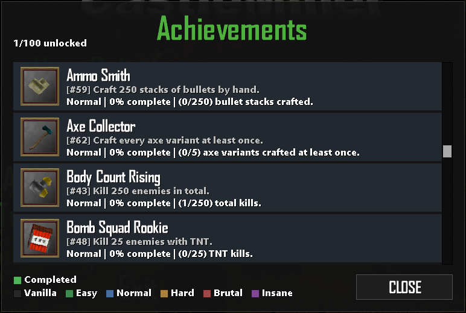

| Achievement | API Name | Requirement | Reward |
|---|---|---|---|
| Laser Tag | `ACH_LASER_KILLS_10` | Kill 10 enemies with laser weapons. | +1 CopperLaserSword, +128 LaserBullets. |
| Body Count Rising | `ACH_TOTAL_KILLS_250` | Kill 250 enemies in total. | +128 Bullets, +64 IronBullets. |
| Workshop Regular | `ACH_CRAFTED_250` | Craft 250 items in total. | +16 IronOre, +16 Coal, +8 CopperOre. |
| Trailblazer | `ACH_DISTANCE_2000` | Reach distance 2,000 from spawn. | +1 GPS, +1 Compass, +32 Torch. |
| Rock Bottom | `ACH_DEPTH_62` | Reach depth 62 below the surface. | +16 TNT. |
| Scale Scratcher | `ACH_DRAGON_KILL_5` | Kill 5 undead dragons. | +1 RocketLauncherGuided. |
| Bomb Squad Rookie | `ACH_TNT_KILLS_25` | Kill 25 enemies with TNT. | +32 TNT. |
| Frag Rookie | `ACH_GRENADE_KILLS_25` | Kill 25 enemies with grenades. | +32 Grenade. |
| Laser Specialist | `ACH_LASER_KILLS_50` | Kill 50 enemies with laser weapons. | +1 GoldLaserSword, +256 LaserBullets. |
| Stone Miner | `ACH_SPELUNKER_250_ROCK` | Mine 250 stone (rock) blocks. | +1 IronPickAxe, +16 TNT. |
| Timber! | `ACH_LUMBERJACK_250_WOOD` | Dig 250 wood or log blocks. | +1 WoodBlock, +1 StoneAxe. |
| Zombie Cleanup | `ACH_ZOMBIES_100` | Kill 100 zombies with any weapon. | +256 Bullets. |
| Bone Collector I | `ACH_SKELETONS_50` | Kill 50 skeletons with any weapon. | +128 IronBullets. |
| Spray and Pray | `ACH_TRIGGER_HAPPY_I` | Fire an assault rifle 1,000 times. | +1 AssultRifle, +256 Bullets. |
| Deadeye | `ACH_SHARPSHOOTER_I` | Score 250 hits with a sniper rifle. | +1 BoltActionRifle, +128 IronBullets. |
| Locked and Loaded | `ACH_ASST_TIMEHELD_10_MIN` | Spend 10 minutes holding any assault rifle. | +256 Bullets, +1 Clock. |
| Two Weeks Later | `ACH_DAYS_14_CUSTOM` | Survive a total of 14 in-game days. | +1 IronPickAxe, +1 IronSpade. |
| Ammo Smith | `ACH_CRAFT_AMMO_250` | Craft 250 stacks of bullets by hand. | +128 ExplosivePowder, +128 GunPowder, +128 BrassCasing. |
| Pickaxe Collector | `ACH_CRAFT_ALL_PICKAXES` | Craft every pickaxe variant at least once. | +64 RockBlock, +64 Ice. |
| Spade Collector | `ACH_CRAFT_ALL_SPADES` | Craft every spade variant at least once. | +64 DirtBlock, +64 SandBlock, +64 Snow. |
| Axe Collector | `ACH_CRAFT_ALL_AXES` | Craft every axe variant at least once. | +64 LogBlock, +64 WoodBlock. |
| Guided Missile Diplomacy | `ACH_DRAGON_GUIDED_5` | Kill 5 dragons using guided missiles. | +1 RocketLauncherGuided. |
| Fortress Rising | `ACH_STRUCT_BLOCKS_USED_1000` | Place 1,000 structural blocks. | +128 WoodBlock, +64 RockBlock, +32 IronWall. |
| Torchmaster | `ACH_TORCH_1000` | Use 1,000 torches. | +256 Torch, +16 Coal. |

### Hard (16)

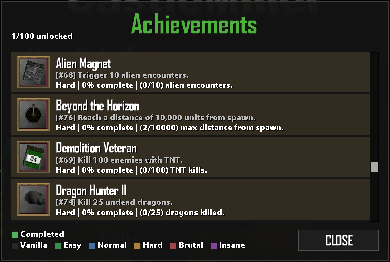

| Achievement | API Name | Requirement | Reward |
|---|---|---|---|
| Heavy Excavator | `ACH_BLOCKS_DUG_5000` | Dig 5,000 blocks of any type. | +1 IronPickAxe, +32 TNT, +16 C4. |
| Reapers Due | `ACH_MASS_KILLER_2000` | Kill 2,000 enemies of any type. | +256 DiamondBullets, +32 TNT. |
| Alien Magnet | `ACH_ALIEN_STALKER_10` | Trigger 10 alien encounters. | +256 GoldBullets. |
| Demolition Veteran | `ACH_TNT_KILLS_100` | Kill 100 enemies with TNT. | +64 TNT, +32 C4. |
| Laser Surgeon | `ACH_LASER_KILLS_250` | Kill 250 enemies with laser weapons. | +1 IronSpacePistol, +512 LaserBullets. |
| Production Manager | `ACH_CRAFTED_2000` | Craft a total of 2,000 items. | +32 Diamond, +64 Gold. |
| Zombie Eradicator | `ACH_ZOMBIES_500` | Kill 500 zombies with any weapons. | +512 DiamondBullets, +64 TNT. |
| Ossuary Keeper | `ACH_SKELETONS_250` | Kill 250 skeletons with any weapons. | +256 GoldBullets, +1 DiamondSpade. |
| Dragon Hunter II | `ACH_DRAGON_KILL_25` | Kill 25 undead dragons. | +2 RocketLauncherGuided. |
| Dragon Hunter III | `ACH_DRAGON_KILL_50` | Kill 50 undead dragons. | +3 RocketLauncherGuided, +16 C4. |
| Beyond the Horizon | `ACH_MAXDIST_10000` | Reach a distance of 10,000 units from spawn. | +1 TeleportGPS, +1 GPS, +64 Torch. |
| Point of No Return | `ACH_MAXDIST_20000` | Reach a distance of 20,000 units from spawn. | +2 TeleportGPS, +1 TeleportStation. |
| Married to the Rifle | `ACH_ASST_TIMEHELD_60_MIN` | Spend 60 minutes holding any assault rifle. | +1 DiamondAssultRifle, +128 GoldBullets. |
| Master Toolsmith | `ACH_MASTER_TOOLSMITH` | Craft every tool variant at least once. | +8 RockBlock, +8 Copper, +8 Iron, +8 Gold, +8 Diamond, +8 BloodStoneBlock. |
| Master Architect | `ACH_STRUCT_BLOCKS_USED_10000` | Place 10,000 structural blocks. | +256 WoodBlock, +256 RockBlock, +64 DiamondWall, +64 GoldenWall +64 IronWall, +64 CopperWall. |
| Guided Justice | `ACH_DRAGON_GUIDED_50` | Kill 50 dragons using guided missiles. | +1 RocketLauncherGuided, +64 ExplosivePowder, +32 C4. |

### Brutal (11)

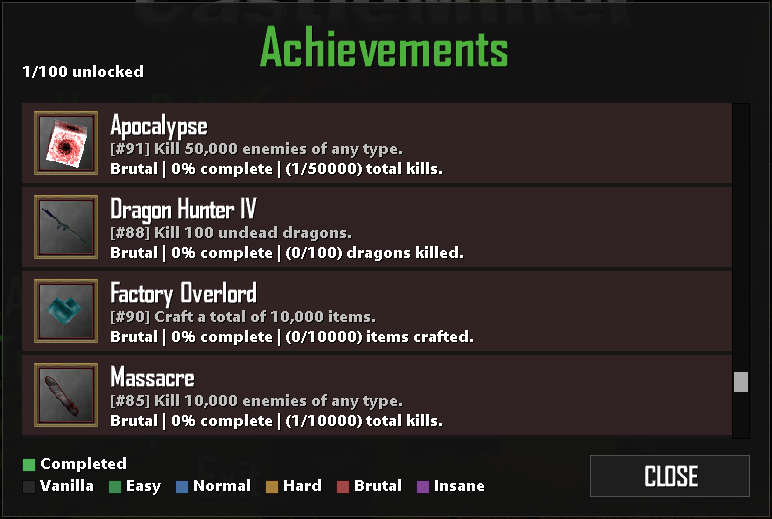

| Achievement | API Name | Requirement | Reward |
|---|---|---|---|
| Thirty Days Strong | `ACH_DAYS_30_CUSTOM` | Survive a total of 30 in-game days. | +1 GoldPickAxe, +1 GoldSpade, +1 GoldAssultRifle, +512 IronBullets. |
| Unbroken | `ACH_DAYS_60_CUSTOM` | Survive a total of 60 in-game days. | +1 DiamondPickAxe, +1 DiamondSpade, +1 DiamondAssultRifle, +512 GoldBullets. |
| Too Stubborn to Die | `ACH_DAYS_120_CUSTOM` | Survive a total of 120 in-game days. | +1 BloodstonePickAxe, +1 BloodStoneAssultRifle, +512 DiamondBullets. |
| Massacre | `ACH_MASS_KILLER_10000` | Kill 10,000 enemies of any type. | +1 DiamondLMGGun, +512 GoldBullets. |
| Road Trip from Hell | `ACH_MAXDIST_40000` | Reach a distance of 40,000 units from spawn. | +2 TeleportGPS, +1 TeleportStation, +128 Torch. |
| The Final Frontier | `ACH_MAXDIST_46340` | Reach the towering wall of bedrock & lanterns. | +3 TeleportGPS, +1 TeleportStation, +1 LaserDrill, +512 GoldBullets. |
| Dragon Hunter IV | `ACH_DRAGONS_100` | Kill 100 undead dragons. | +1 RocketLauncherGuided, +512 RocketAmmo, +64 C4. |
| One-Man Bomb Squad | `ACH_EXPLOSIVE_KILLS_1000` | Kill 1,000 enemies with explosives (TNT/Gr). | +128 TNT, +128 Grenade, +64 C4, +1 AdvancedGrenadeLauncher. |
| Factory Overlord | `ACH_CRAFTED_10000` | Craft a total of 10,000 items. | +128 Diamond, +64 BloodStoneBlock. |
| Apocalypse | `ACH_MASS_KILLER_50000` | Kill 50,000 enemies of any type. | +1 BloodStoneLMGGun, +512 DiamondBullets. |
| Master Excavator | `ACH_BLOCKS_DUG_25000` | Dig 25,000 blocks of any type. | +1 BloodstonePickAxe, +64 TNT, +32 C4. |

### Insane (7)

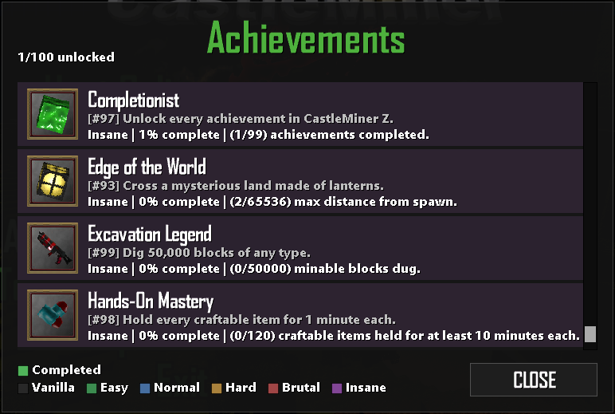

| Achievement | API Name | Requirement | Reward |
|---|---|---|---|
| Edge of the World | `ACH_MAXDIST_65536` | Cross a mysterious land made of lanterns. | +1 LaserDrill, +1 PrecisionLaser, +512 GoldBullets. |
| The Indomitable Survivor | `ACH_DAYS_730` | Survive for a total of 730 in-game days. | +1 Haunted Chainsaw, +1 BloodStoneLMGGun, +512 DiamondBullets. |
| Master Prospector | `ACH_MINE_EVERY_BLOCK` | Mine at least one of every diggable block. | +12 DiamondDoor, +12 SpaceRock, +1 BloodstonePickAxe, +64 TNT. |
| Master Crafter | `ACH_CRAFT_EVERY_ITEM` | Craft at least one of every craftable item. | +1 BasicGrenadeLauncher, +512 RocketAmmo, +32 DiamondWall, +16 GoldenWall. |
| Completionist | `ACH_COMPLETE_ALL` | Unlock every achievement in CastleMiner Z. | +2 Haunted Chainsaw, +2 PrecisionLaser, +64 BloodStoneBlock, +64 SpaceRockInventory, +64 Slime, +64 Diamond, +128 DiamondWall, +512 GoldBullets. |
| Hands-On Mastery | `ACH_TIMEHELD_ALLITEMS_1_MIN` | Hold every craftable item for 1 minute each. | +1 BloodstonePickAxe, +1 DiamondSpade, +1 DiamondAxe, +1 BloodStoneKnife, +64 BloodStoneBullets. |
| Excavation Legend | `ACH_BLOCKS_DUG_50000` | Dig 50,000 blocks of any type. | +128 TNT, +64 C4, +16 GunPowder, +1 BloodStoneLaserSword. |

### Vanilla (31)

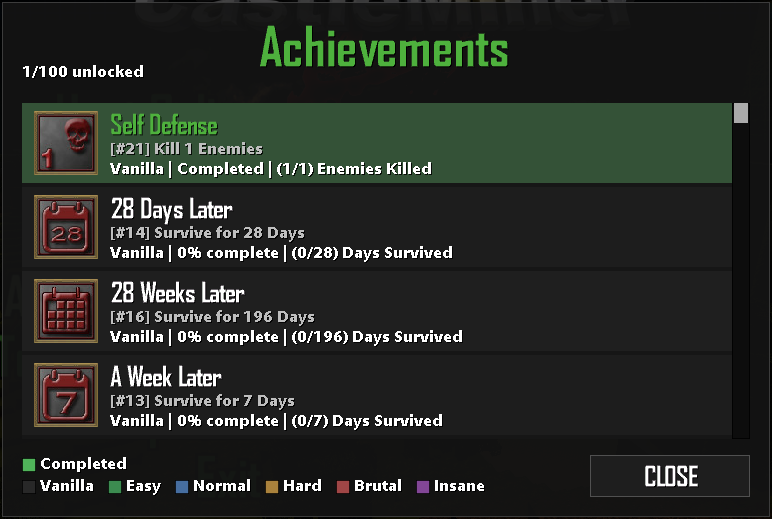

| Category | Details |
|---|---|
| Source | Base game / vanilla CastleMiner Z |
| Game version reviewed | `v1.9.9.8.5` source |
| Total vanilla achievements | **31** |

| Achievement | API Name | Requirement | Reward |
|---|---|---|---|
| Short Timer | `ACH_TIME_PLAYED_1` | Play online for 1 hour. | Platform unlock only. |
| Veteren MinerZ | `ACH_TIME_PLAYED_10` | Play online for 10 hours. | Platform unlock only. |
| MinerZ Potato | `ACH_TIME_PLAYED_100` | Play online for 100 hours. | Platform unlock only. |
| First Contact | `ACH_DISTANCE_50` | Reach a max distance of 50 from the start point. | Platform unlock only. |
| Leaving Home | `ACH_DISTANCE_200` | Reach a max distance of 200 from the start point. | Platform unlock only. |
| Desert Crawler | `ACH_DISTANCE_1000` | Reach a max distance of 1000 from the start point. | Platform unlock only. |
| Mountain Man | `ACH_DISTANCE_2300` | Reach a max distance of 2300 from the start point. | Platform unlock only. |
| Deep Freeze | `ACH_DISTANCE_3000` | Reach a max distance of 3000 from the start point. | Platform unlock only. |
| Hell On Earth | `ACH_DISTANCE_3600` | Reach a max distance of 3600 from the start point. | Platform unlock only. |
| Around the World | `ACH_DISTANCE_5000` | Reach a max distance of 5000 from the start point. | Platform unlock only. |
| Deep Digger | `ACH_DEPTH_20` | Travel down at least 20 depth. | Platform unlock only. |
| Welcome To Hell | `ACH_DEPTH_40` | Travel down at least 40 depth. | Platform unlock only. |
| Survived The Night | `ACH_DAYS_1` | Survive for 1 day. | Platform unlock only. |
| A Week Later | `ACH_DAYS_7` | Survive for 7 days. | Platform unlock only. |
| 28 Days Later | `ACH_DAYS_28` | Survive for 28 days. | Platform unlock only. |
| Survivor | `ACH_DAYS_100` | Survive for 100 days. | Platform unlock only. |
| 28 Weeks Later | `ACH_DAYS_196` | Survive for 196 days. | Platform unlock only. |
| Anniversary | `ACH_DAYS_365` | Survive for 365 days. | Platform unlock only. |
| Tinkerer | `ACH_CRAFTED_1` | Craft 1 item. | Platform unlock only. |
| Crafter | `ACH_CRAFTED_100` | Craft 100 items. | Platform unlock only. |
| Master Craftsman | `ACH_CRAFTED_1000` | Craft 1000 items. | Platform unlock only. |
| Demolition Expert | `ACH_CRAFT_TNT` | Craft TNT at least once. | Platform unlock only. |
| Self Defense | `ACH_TOTAL_KILLS_1` | Kill 1 enemy. | Platform unlock only. |
| No Fear | `ACH_TOTAL_KILLS_100` | Kill 100 enemies. | Platform unlock only. |
| Zombie Slayer | `ACH_TOTAL_KILLS_1000` | Kill 1000 enemies. | Platform unlock only. |
| Dragon Slayer | `ACH_UNDEAD_DRAGON_KILLED` | Kill the Undead Dragon. | Platform unlock only. |
| Alien Encounter | `ACH_ALIEN_ENCOUNTER` | Find an alien. | Platform unlock only. |
| Alien Technology | `ACH_LASER_KILLS` | Kill an enemy with a laser weapon. | Platform unlock only. |
| Air Defense | `ACH_GUIDED_MISSILE_KILL` | Kill a dragon with a guided missile. | Platform unlock only. |
| Fire In The Hole | `ACH_TNT_KILL` | Kill an enemy with TNT. | Platform unlock only. |
| Boom | `ACH_GRENADE_KILL` | Kill an enemy with a grenade. | Platform unlock only. |

</details>

## Notes on progression behavior

A few details are worth knowing when using the mod:

- Custom achievements are **not forced on in every mode by default**. Out of the box, they unlock only in **Endurance** until you change the config.
- The mod includes several **completion-helper commands** for the more demanding collection achievements.
- The achievement browser is intended to be a **real management tool**, not just a static list.
- The mod intentionally tracks both **vanilla** and **custom** progress in one place so the system feels cohesive instead of split.

## Compatibility notes

- Requires **ModLoaderExtensions**.
- Designed to work with CastleMiner Z's existing achievement flow rather than replace it outright.
- Hooks menu screens, HUD achievement display, player stat saving/loading, and achievement manager wiring.
- Uses embedded resources and extracts them automatically to the mod folder on first run.

## Developer/source notes

<details>
<summary><strong>Show implementation-oriented notes</strong></summary>

These notes are useful if you are documenting the mod for contributors or advanced users:

- The mod swaps the stock `CastleMinerZAchievementManager` for an `ExtendedAchievementManager` during `SetupNewGamer`.
- The browser is available from both the front-end and in-game menu systems via injected **Achievements** rows.
- The achievement manager is updated globally so UI state reflects completed achievements even outside the normal in-session flow.
- Two achievement source files exist but are **currently not registered** in the active achievement list:
  - `HellhoundSlayerIAchievement`
  - `SessionVeteranAchievement`
- The mod persists extra stats with a custom trailer appended to `CastleMinerZPlayerStats.SaveData`.
- Several stat gates are patched so custom achievement progress only advances in allowed modes.
- The config hotkey parser accepts common modifier strings like `Ctrl`, `Alt`, `Shift`, and `Win`, along with keys such as letters, digits, and function keys.

</details>

## Suggested screenshots / media to capture for this README

If you want this page to feel especially polished on GitHub, these are the best captures to add:

1. **Hero GIF or screenshot** showing the browser plus an unlock toast.
2. **Browser overview** with mixed vanilla/custom achievements and tier coloring.
3. **Unlock toast close-up** in actual gameplay.
4. **Reward inventory shot** after earning a custom achievement.
5. **Command showcase** in the chat box.
6. **Config file screenshot** with the most important settings highlighted.
7. **Icon sheet or folder screenshot** showing the custom icon set.
8. **File layout screenshot** of the extracted mod folder.

## Final pitch

If you want CastleMiner Z to feel more alive over long sessions, **MoreAchievements** is a huge upgrade. It does not just add more boxes to tick. It adds new goals, better feedback, cleaner browsing, richer reward loops, and far more reasons to keep pushing deeper into a world.
