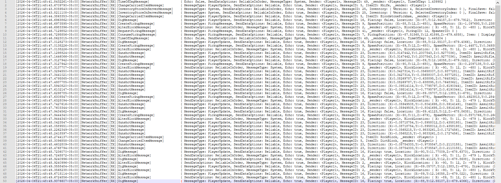
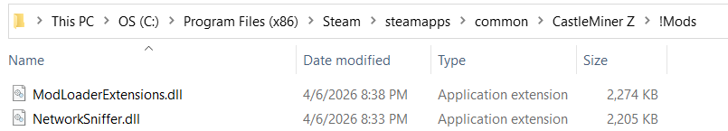

# NetworkSniffer

> A developer-focused **in-game network message logger** for CastleMiner Z that hooks the game's message pipeline, captures **incoming and outgoing network traffic**, and writes it to a clean, readable log file with optional **raw hex dumps**, **message filtering**, **sampling**, and **direction controls**.

> **Best for:** mod developers, reverse engineers, protocol tinkerers, multiplayer debuggers, and anyone trying to understand how CastleMiner Z messages move through the game.

---

## Contents

- [Overview](#overview)
- [Why this mod stands out](#why-this-mod-stands-out)
- [Key features](#key-features)
- [Requirements](#requirements)
- [Installation](#installation)
- [Quick start](#quick-start)
- [Command aliases](#command-aliases)
- [Common workflows](#common-workflows)
- [Full command reference](#full-command-reference)
- [Default behavior](#default-behavior)
- [Log output](#log-output)
- [What gets logged](#what-gets-logged)
- [Files created by the mod](#files-created-by-the-mod)
- [How it works](#how-it-works)
- [Troubleshooting](#troubleshooting)
- [Limitations and notes](#limitations-and-notes)

---

## Overview

NetworkSniffer is a runtime inspection mod for **CastleForge** that dynamically discovers CastleMiner Z network message classes, patches their **send** and **receive** methods, and records readable payload information to disk.

Instead of forcing you to rebuild the mod every time you want different logging behavior, NetworkSniffer exposes a full **in-game command interface** so you can turn logging on or off, focus on specific message types, exclude noisy traffic, limit payload size, enable raw byte capture, and switch between RX, TX, or both directions while the game is running.


---

## Why this mod stands out

Unlike a one-off debug patch, NetworkSniffer is built to be a **practical live analysis tool**:

- It hooks both **SendData** and **ReceiveData/RecieveData** paths.
- It discovers message targets **dynamically** from `DNA.CastleMinerZ.Net` instead of hardcoding one or two message types.
- It supports **runtime filtering** so you can narrow logs without recompiling.
- It can capture both **pretty payload dumps** and **raw byte slices**.
- It includes **noise controls** such as default exclusions, payload trimming, empty-payload skipping, member pruning, and sampling.
- It writes to a dedicated log file under `!Mods/NetworkSniffer`, making it easy to archive sessions or diff behavior between tests.
- It is designed defensively so logging failures do not break the game's send/receive pipeline.

---

## Key features

### Live network message logging
Patch all supported CastleMiner Z network messages and log traffic as it moves through the game.

### RX/TX direction control
Log only inbound traffic, only outbound traffic, both, or neither.

### Include and exclude filters
Whitelist specific message types or blacklist noisy ones without touching the source.

### Sampling
Reduce spam with **1/N sampling** when you only need representative traffic.

### Raw byte dumps
Capture a bounded hex slice of the bytes consumed or written by a message.

### Pretty payload formatting
Readable object dumps with support for common primitives, vectors, enums, GUIDs, arrays, collections, byte previews, and nested objects.

### Empty payload suppression
Skip lines that contain trivial payloads such as `null`, `{...}`, `[]`, or other low-value results.

### Pruned child members
Drop trivial child nodes inside reflected payload output to keep logs dense and useful.

### Runtime output file switching
Point logs to a different file path on demand.

### Known message type listing
Browse the discovered message types from inside the game with paged output.



---

## Requirements

- **CastleForge**
- **ModLoaderExtensions**
- CastleMiner Z game files compatible with your CastleForge setup

This mod declares **`ModLoaderExtensions`** as a required dependency and registers command/help functionality through that shared framework.

---

## Installation

1. Install **CastleForge** and confirm your base mod loader is working.
2. Make sure **ModLoaderExtensions** is present.
3. Place `NetworkSniffer.dll` in your `!Mods` folder.
4. Launch the game.
5. Open chat and run:

```text
/sniff status
```

If the mod loaded correctly, you should be able to use the sniffer commands immediately.

### Expected location

```text
CastleMinerZ/
└─ !Mods/
   ├─ ModLoaderExtensions.dll
   └─ NetworkSniffer.dll
```

### Notes

- The mod initializes on startup and applies Harmony patches automatically.
- A log session header is written when the patch bootstrap completes.
- Embedded resources are extracted into the mod's own `!Mods/NetworkSniffer` folder when needed.



---

## Quick start

### Start logging everything useful

```text
/sniff on
```

### See current runtime settings

```text
/sniff status
```

### Focus on a single message type

```text
/sniff only BroadcastTextMessage
```

### Add a second included message type

```text
/sniff onlyadd InventoryStoreOnServerMessage
```

### Switch to receive-side traffic only

```text
/sniff dir rx
```

### Enable raw byte dumps

```text
/sniff raw on
```

### Cap raw dumps to a smaller size

```text
/sniff raw cap 64
```

### Change output file

```text
/sniff file Session_01.txt
```

### Turn it back off

```text
/sniff off
```

---

## Command aliases

Any of the following command roots can be used:

- `/networksniffer`
- `/netsniffer`
- `/sniffer`
- `/sniff`
- `/log`

That means these are equivalent in practice:

```text
/sniff status
/sniffer status
/networksniffer status
```

---

## Common workflows

### 1) Investigate chat or text traffic

```text
/sniff on
/sniff only BroadcastTextMessage
/sniff dir both
```

### 2) Watch incoming state without outbound noise

```text
/sniff on
/sniff dir rx
```

### 3) Reduce spam while testing a busy multiplayer session

```text
/sniff on
/sniff sample 10
```

### 4) Hide low-value payloads

```text
/sniff ignoreempties on
/sniff prune on
```

### 5) Capture raw bytes for protocol work

```text
/sniff on
/sniff raw on
/sniff raw cap 256
```

### 6) Reset to a wider view after narrowing too much

```text
/sniff onlyclear
/sniff exclear
/sniff dir both
```

---

## Full command reference

<details>
<summary><strong>Show full /sniff command list</strong></summary>

### Core control

| Command | Description |
|---|---|
| `/sniff on` | Enables the sniffer. |
| `/sniff off` | Disables the sniffer. |
| `/sniff status` | Prints the current runtime settings in chat. |

### Include filters

| Command | Description |
|---|---|
| `/sniff only A,B` | Replaces the include list with the specified message types. |
| `/sniff onlyadd A,B` | Adds message types to the current include list. |
| `/sniff onlyclear` | Clears the include list and returns to logging all types except exclusions. |

### Exclude filters

| Command | Description |
|---|---|
| `/sniff exclude A,B` | Replaces the exclude list with the specified message types. |
| `/sniff excludeadd A,B` | Adds message types to the current exclude list. |
| `/sniff exclear` | Clears the exclude list. |

### Sampling and payload limits

| Command | Description |
|---|---|
| `/sniff sample N` | Uses 1/N sampling. Useful in very noisy sessions. |
| `/sniff maxbytes N` | Limits the pretty payload output length in characters. |

### Raw dump controls

| Command | Description |
|---|---|
| `/sniff raw` | Shows current raw dump state and cap. |
| `/sniff raw on` | Enables raw hex output. |
| `/sniff raw off` | Disables raw hex output. |
| `/sniff raw cap N` | Sets the raw hex byte cap. |

### Output file control

| Command | Description |
|---|---|
| `/sniff file <path>` | Changes the output file. Relative paths are rooted under `!Mods/NetworkSniffer`. |

### Message type discovery

| Command | Description |
|---|---|
| `/sniff types` | Lists known message types, paged. |
| `/sniff types 2` | Shows page 2 of discovered message types. |

### Noise reduction

| Command | Description |
|---|---|
| `/sniff ignoreempties on|off` | Toggles skipping trivial payloads like `null` or `{...}`. |
| `/sniff prune on|off` | Toggles pruning trivial child members inside reflected payloads. |

### Direction control

| Command | Description |
|---|---|
| `/sniff rx on|off` | Enables or disables receive-side logging. |
| `/sniff tx on|off` | Enables or disables send-side logging. |
| `/sniff dir both` | Logs RX and TX. |
| `/sniff dir rx` | Logs RX only. |
| `/sniff dir tx` | Logs TX only. |
| `/sniff dir none` | Disables both RX and TX directions without changing the master toggle. |

</details>

---

## Default behavior

These are the effective defaults found in the current source:

| Setting | Default |
|---|---|
| Sniffer enabled | `false` |
| RX logging | `true` |
| TX logging | `true` |
| Pretty payload cap | `1024` characters |
| Raw dumps | `off` |
| Raw dump cap | `256` bytes |
| Ignore empty/trivial payloads | `on` |
| Prune trivial child members | `on` |
| Sampling | `1/1` |
| Default excluded messages | `PlayerUpdateMessage`, `RequestChunkMessage` |
| Default output file | `!Mods/NetworkSniffer/NetworkCalls.txt` |

### Why those default exclusions matter

`PlayerUpdateMessage` and `RequestChunkMessage` are excluded by default to reduce log volume and help keep the output useful during normal multiplayer debugging.

If you want to inspect them anyway, you can clear or replace the exclude list at runtime.

---

## Log output

By default, NetworkSniffer writes to:

```text
!Mods/NetworkSniffer/NetworkCalls.txt
```

The logger writes a **session header** when a new run starts and uses a structured format built around:

- timestamp
- namespace tag
- message direction tag (`RX`, `TX`, `RXRAW`, `TXRAW`, `INFO`)
- message type
- payload text or hex data

### Example style

```text
[2026-01-01T12:34:56.7890000-05:00][NetworkSniffer][RX][BroadcastTextMessage] { Message: "Hello world" }
[2026-01-01T12:34:56.8000000-05:00][NetworkSniffer][RXRAW][BroadcastTextMessage] 48 65 6C 6C 6F ...
```

```text
[2026-04-06T21:48:48.4602809-05:00][NetworkSniffer][TX][GunshotMessage] { MessageType: PlayerUpdate, SendDataOptions: Reliable, Echo: true, Sender: <Player2>, MessageID: 23, Direction: {X:-0.08754333,Y:-0.9735547,Z:0.2110155}, ItemID: AssultRifle, _sender: <Player2> }
[2026-04-06T21:48:48.7236070-05:00][NetworkSniffer][RX][DigMessage]     { MessageType: PlayerUpdate, SendDataOptions: Reliable, Echo: true, Sender: <Player1>, MessageID: 16, Placing: true, Location: {X:-90,Y:11.77009,Z:-678.6373}, Direction: {X:1,Y:0,Z:0}, BlockType: Dirt, _sender: <Player1> }
```

The exact content depends on the message structure and your current runtime settings.

---

## What gets logged

NetworkSniffer targets concrete classes under:

```text
DNA.CastleMinerZ.Net
```

It dynamically discovers message classes and patches:

- `SendData(BinaryWriter)` for outbound logging
- `ReceiveData(BinaryReader)` or `RecieveData(BinaryReader)` for inbound logging

That means the mod is not limited to one handpicked packet type. It is built to cover the broader CastleMiner Z network message layer automatically.

### Pretty payload output

The readable payload formatter can handle:

- strings
- booleans
- chars
- numbers
- enums
- `Guid`
- `DateTime`
- `TimeSpan`
- `Vector2`
- `Vector3`
- `byte[]` with hex preview
- arrays and collections
- nested reflected objects

### Special-case handling

The formatter includes safe handling for certain gamer-related values so names can be printed more cleanly without depending on fragile property access patterns.

### Raw output

When raw logging is enabled, the mod captures a bounded byte slice from the stream region consumed or written between the patch prefix and postfix.

This is especially useful when:

- comparing two versions of a message,
- confirming serialization order,
- or debugging a protocol mismatch.

---

## Files created by the mod

### Primary output

```text
!Mods/NetworkSniffer/NetworkCalls.txt
```

### Runtime support folder

The mod may also create and use:

```text
!Mods/NetworkSniffer/
```

This is where relative output files are rooted and where extracted embedded resources can live.

### What is **not** included here

The current package does **not** expose a separate end-user config file in the uploaded source. Runtime behavior is controlled through chat commands instead.

---

## How it works

<details>
<summary><strong>Technical breakdown</strong></summary>

### Patch bootstrap

On startup, the mod:

1. initializes embedded dependency resolution,
2. extracts embedded resources when needed,
3. discovers network message targets inside `DNA.CastleMinerZ.Net`,
4. applies Harmony patches,
5. registers chat commands,
6. registers help text with the shared help system,
7. and writes startup information to the log.

### Dynamic message discovery

Rather than maintaining a hardcoded patch list, the mod scans the target assembly for non-abstract classes in the network namespace and looks for compatible:

- receive methods using `BinaryReader`, including the common `RecieveData` misspelling,
- send methods using `BinaryWriter`.

### RX/TX instrumentation

Each patched path records the current stream position in a prefix, then in the postfix:

- resolves the message type name,
- applies filters and direction checks,
- generates a pretty payload dump,
- optionally skips trivial results,
- writes the entry to file,
- and optionally writes a raw hex slice.

### Reflection-based payload formatting

The formatter caches fields and readable properties per type and builds compact object dumps recursively. It limits depth and item counts so logs stay readable instead of exploding into huge graphs.

### Defensive design

The sniffer swallows failures in its logging and formatting path so the game's actual network flow is not interrupted by a bad getter, a weird payload object, or a logging exception.

</details>

---

## Troubleshooting

### The file is not being created

Check that:

- the mod actually loaded,
- `ModLoaderExtensions` is installed,
- you enabled the sniffer with `/sniff on`,
- and the game process has permission to write under its `!Mods` folder.

### The log is too noisy

Try one or more of these:

```text
/sniff sample 10
/sniff dir rx
/sniff exclude PlayerUpdateMessage,RequestChunkMessage
/sniff ignoreempties on
/sniff prune on
```

### I only want one packet type

```text
/sniff only YourMessageType
```

Then use:

```text
/sniff types
```

if you need to discover the exact message name.

### I want to capture raw serialization bytes

```text
/sniff raw on
/sniff raw cap 128
```

### I changed the output file and want it back in the default location

```text
/sniff file NetworkCalls.txt
```

Because relative paths are rooted under `!Mods/NetworkSniffer`, that sends output back into the mod folder.

---

## Limitations and notes

- This mod is primarily a **developer and debugging utility**, not a general gameplay feature mod.
- It does not ship with a user-facing config file in this source package; runtime control happens through chat commands.
- Logging only occurs for message types that expose compatible send/receive methods discovered by the patch scan.
- Raw dumps are capped intentionally so logs do not balloon uncontrollably.
- Very large or complex payloads are intentionally trimmed and pruned for readability.
- The mod is self-contained enough to manage embedded dependencies, but it still expects the normal CastleForge environment to be present.

---

## Summary

NetworkSniffer turns CastleMiner Z's network layer into something you can actually inspect in real time. It gives you live send/receive logging, message filtering, sampling, raw byte capture, and in-game control through chat commands, making it a strong utility mod for multiplayer debugging, reverse engineering, and protocol analysis inside the CastleForge ecosystem.