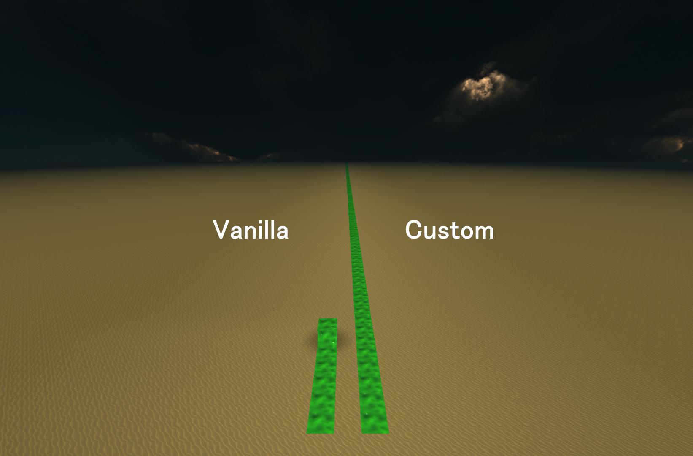
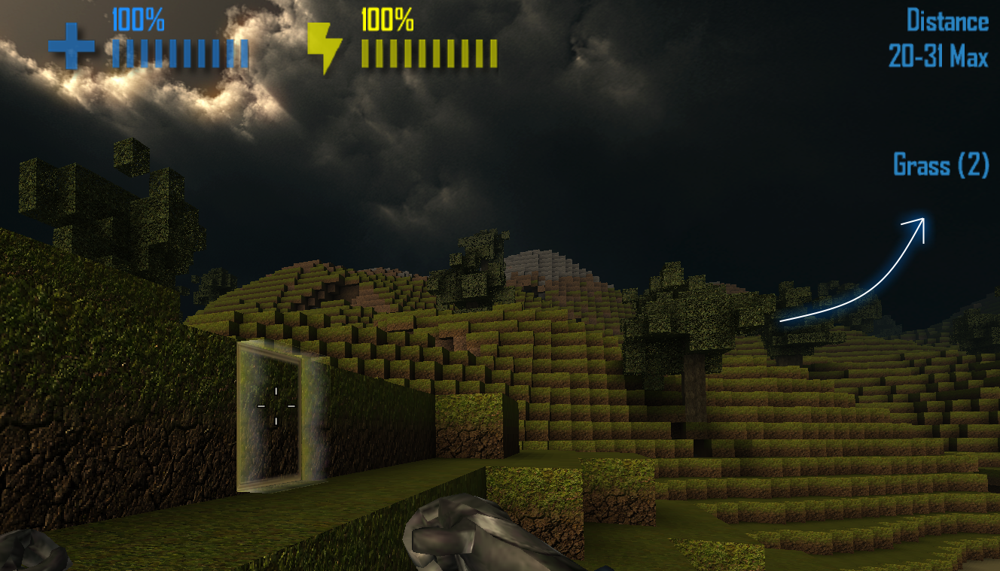
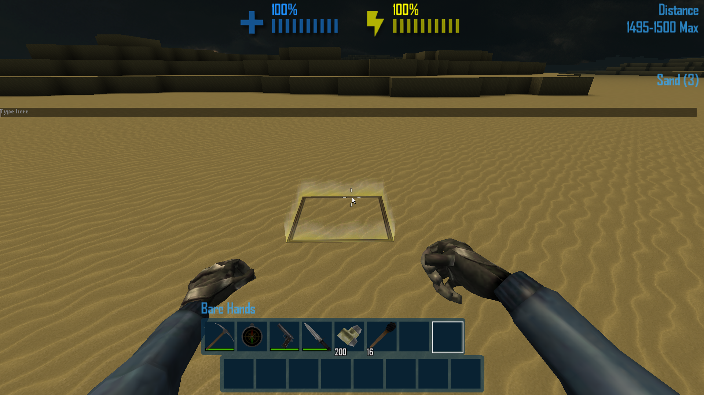
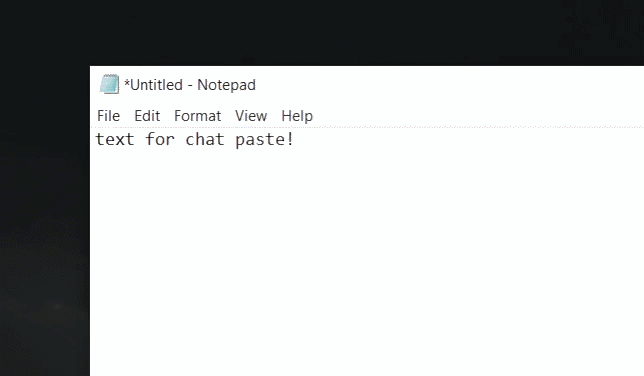

# QoLTweaks


> A lightweight **quality-of-life feature pack** for CastleMiner Z that improves building reach, offline chat, text input, HUD readability, chat usability, and vertical freedom—without burying the player under menus or setup.

---

## Overview

**QoLTweaks** is a standalone utility mod focused on smoothing out little pain points in everyday gameplay. Instead of adding a huge system or an in-game UI, it quietly patches a handful of vanilla behaviors so the game feels more flexible and less restrictive.

This mod is especially useful for players who:

- build a lot and want a larger construction reach,
- want to open chat in offline worlds,
- prefer a wider, easier-to-read chat input,
- want clearer targeted block info,
- want console messages to stay more visible,
- need better text entry and **Ctrl+V paste support**, and
- want to remove the vanilla upper world-height ceiling for testing, building, or free movement.

---

### Suggested feature gallery images
- **Placeholder:** `docs/images/mods/qoltweaks/construction-range.png`
- **Placeholder:** `docs/images/mods/qoltweaks/offline-chat.png`
- **Placeholder:** `docs/images/mods/qoltweaks/targeted-block-label.png`
- **Placeholder:** `docs/images/mods/qoltweaks/wide-chat-input.png`
- **Placeholder:** `docs/images/mods/qoltweaks/console-opacity.png`
- **Placeholder:** `docs/images/mods/qoltweaks/text-input-paste.png`
- **Placeholder:** `docs/images/mods/qoltweaks/world-height.png`

---

## Why this mod stands out

QoLTweaks is intentionally simple from the player’s point of view:

- **No command list to memorize**
- **No bulky in-game config menu**
- **Each tweak can be enabled or disabled independently**
- **Useful defaults out of the box**
- **INI-based config that is easy to read and edit**
- **Focused on everyday friction instead of feature bloat**

It is the kind of mod you install once and keep around because the game just feels better with it.

---

## Feature Summary

| Feature | Default | What it does |
|---|---:|---|
| Construction Range | Enabled | Replaces the vanilla construction distance with a configurable custom range |
| Offline Chat | Enabled | Lets you open the chat screen even in offline worlds |
| Targeted Block Label | Enabled | Replaces the default target text with `Block Name (ID)` |
| Wide Chat Input | Enabled | Expands the chat input width to follow the current game window width |
| Console Opacity Floor | Enabled | Makes fading console/HUD messages stay more visible |
| Text Input + Paste | Enabled | Broadens accepted text input and restores **Ctrl+V** paste handling |
| Remove Max World Height | Enabled | Removes the vanilla upper world-height clamp on player movement |
| QoL Logging | Disabled | Enables optional diagnostic logging for this mod |
| Reload Config Hotkey | `Ctrl+Shift+R` | Provides a configurable hotkey entry for reloading config behavior |

---

## Requirements

- **CastleMiner Z**
- **CastleForge ModLoader**
- .NET Framework **4.8.1** build target in the attached source
- Harmony-based patching support through the mod loader environment

---

## Installation

1. Install **CastleForge ModLoader** first.
2. Place the compiled **`QoLTweaks.dll`** into your CastleMiner Z `!Mods` folder.
3. Launch the game.
4. On first run, the mod creates its config file at:

```text
!Mods\QoLTweaks\QoLTweaks.Config.ini
```

5. Edit the config if you want to change defaults.

---

## Files created

QoLTweaks is designed to stay lightweight. In the attached source, you should expect the following working files and folders:

```text
!Mods\QoLTweaks\
├─ QoLTweaks.Config.ini
└─ (embedded resources extracted by the mod when applicable)
```

The startup code also supports extracting embedded resources for the mod into the `!Mods\QoLTweaks` folder when present.

---

## Default Configuration

```ini
# QoLTweaks - Configuration
# Standalone quality-of-life feature pack.

[QoLTweaks]
; Master toggle for the entire mod.
Enabled                      = true

[ConstructionRange]
; Replaces the vanilla construction range with the value below.
EnableConstructionRangePatch = true
ConstructionRange            = 420

[OfflineChat]
; Allows the chat screen to open in offline worlds.
EnableOfflineChat            = true

[TargetedBlockLabel]
; Replaces the default targeted block text with "Name (ID)".
EnableTargetedBlockNameAndId = true

[WideChatInput]
; Makes the chat input width follow the game window width.
EnableWideChatInput          = true

[ConsoleOpacity]
; Raises the console fade floor by this bonus amount.
; 0.25 means fading messages bottom out at roughly 25% more visibility.
EnableConsoleOpacityFloor    = true
ConsoleOpacityFloorBonus     = 0.25

[TextInput]
; Broadens accepted text input and restores Ctrl+V paste support.
EnableAllowAnyCharPlusPaste  = true

[WorldHeight]
; Removes the vanilla upper world-height clamp on player movement.
EnableRemoveMaxWorldHeight   = true

[QoLLogging]
; Enables optional diagnostic logging for this mod.
DoLogging                    = false

[Hotkeys]
; Reload this config while in-game:
ReloadConfig                 = Ctrl+Shift+R
```

---

## Configuration Reference

| Section | Key | Default | Notes |
|---|---|---:|---|
| `QoLTweaks` | `Enabled` | `true` | Master toggle for the whole mod |
| `ConstructionRange` | `EnableConstructionRangePatch` | `true` | Enables the custom construction distance patch |
| `ConstructionRange` | `ConstructionRange` | `420` | Clamped in code to **5** through **10000** |
| `OfflineChat` | `EnableOfflineChat` | `true` | Allows chat opening in offline worlds |
| `TargetedBlockLabel` | `EnableTargetedBlockNameAndId` | `true` | Shows targeted block name and numeric ID |
| `WideChatInput` | `EnableWideChatInput` | `true` | Makes the chat box follow window width |
| `ConsoleOpacity` | `EnableConsoleOpacityFloor` | `true` | Enables the visibility floor adjustment |
| `ConsoleOpacity` | `ConsoleOpacityFloorBonus` | `0.25` | Clamped in code to **0.0** through **1.0** |
| `TextInput` | `EnableAllowAnyCharPlusPaste` | `true` | Broadens input acceptance and adds paste handling |
| `WorldHeight` | `EnableRemoveMaxWorldHeight` | `true` | Removes the upper movement ceiling |
| `QoLLogging` | `DoLogging` | `false` | Optional diagnostic logging |
| `Hotkeys` | `ReloadConfig` | `Ctrl+Shift+R` | Human-readable hotkey string |

---

## Full Feature Breakdown

<details>
<summary><strong>Construction Range</strong></summary>
<br>

### What it does
This tweak replaces the vanilla construction-mode reach with a configurable value.

### Default behavior
- Enabled by default
- Default custom range: **420**

### Why it is useful
This is great for large builds, repair work, high platforms, testing environments, and quality-of-life creative sessions where the vanilla construction distance feels too restrictive.

### Technical behavior
The patch hooks `InGameHUD.DoConstructionModeUpdate` and reroutes the hard-coded vanilla construction distance literal through the mod’s runtime setting.



</details>

<details>
<summary><strong>Offline Chat</strong></summary>
<br>

### What it does
This allows the normal text chat screen to open in **offline worlds**, even when the game is not in an online session.

### Why it is useful
This is handy for testing UI flows, screenshots, command-like note taking, local sandbox play, or mods that still rely on the chat screen in offline contexts.

### Technical behavior
The patch replays the chat-open logic inside `InGameHUD.OnPlayerInput` when the world is offline and the chat trigger is released.


</details>

<details>
<summary><strong>Targeted Block Label</strong></summary>
<br>

### What it does
When enabled, the default targeted block text is replaced with a clearer format:

```text
Block Name (ID)
```

### Why it is useful
This is especially nice for builders, testers, modders, and anyone working with block identification who wants readable block info at a glance.

### Technical behavior
- Hooks `InGameHUD.OnDraw`
- Suppresses the default draw call for the targeted block label
- Draws a custom label afterward using the block’s resolved name and numeric ID
- Only draws when the construction probe is available and able to build

### Example
```text
Stone Block (1)
```



</details>

<details>
<summary><strong>Wide Chat Input</strong></summary>
<br>

### What it does
This makes the chat input width expand with the current game window width instead of staying at a smaller fixed size.

### Behavior details
- Enabled by default
- Uses the current game window client width
- Keeps a minimum width of **350**
- Updates dynamically while drawing, so resizing the window updates the chat box width too

### Why it is useful
Longer messages are easier to type, review, and edit without feeling cramped.

### Technical behavior
The mod patches both the `PlainChatInputScreen` constructor and `OnDraw` path so the width is applied immediately and kept synchronized during play.



</details>

<details>
<summary><strong>Console Opacity Floor</strong></summary>
<br>

### What it does
This raises the minimum visibility of fading HUD or console messages so they remain easier to read instead of fading too far toward invisibility.

### Default behavior
- Enabled by default
- Default bonus: **0.25**

### Why it is useful
This helps if you find normal fading notifications too faint during play, especially when you are multitasking, moving quickly, or watching multiple systems at once.

### Technical behavior
The patch hooks `ConsoleElement.OnDraw` and routes message visibility through a helper that adds a configurable bonus before clamping the result to `1.0`.


</details>

<details>
<summary><strong>Text Input + Ctrl+V Paste Support</strong></summary>
<br>

### What it does
This expands accepted text entry and restores **Ctrl+V paste support** for `TextEditControl`.

### Why it is useful
This is one of the most practical changes in the mod. It makes text entry less frustrating when entering names, notes, test values, copied strings, or anything else that benefits from paste support.

### Behavior details
When enabled, the mod:

- accepts a wider range of non-control characters,
- intercepts the game’s `Ctrl+V` character signal,
- reads clipboard text,
- strips control characters,
- converts newlines and tabs into spaces,
- respects `MaxChars`, and
- stops inserting text when the rendered width would overflow the text box.

### Technical behavior
This patch hooks `TextEditControl.OnChar` with:

- a **prefix** to handle `Ctrl+V`, and
- a **transpiler** that widens vanilla character acceptance rules.



</details>

<details>
<summary><strong>Remove Max World Height</strong></summary>
<br>

### What it does
This removes the vanilla upper world-height clamp from player movement.

### Why it is useful
This can be helpful for advanced building, testing, experimentation, debug-style play, aerial structures, or movement systems that would otherwise hit the vanilla ceiling.

### Technical behavior
The patch hooks `Player.OnUpdate` and replaces the hard-coded upper height ceiling literals with a runtime helper that returns `float.MaxValue` when the tweak is enabled.

<p align="center">
  
  
</p>

</details>

<details>
<summary><strong>Config Reload Hotkey</strong></summary>
<br>

### What it does
QoLTweaks includes a configurable hotkey string for reloading config-related behavior while in-game.

### Default binding
```text
Ctrl+Shift+R
```

### Accepted formats
The hotkey parser is forgiving and is designed to accept human-friendly entries such as:

```text
F9
Ctrl+F3
Control Shift F12
Win+R
Alt+0
A
```

### Notes
- The binding model supports **Ctrl**, **Alt**, **Shift**, and **Win** modifiers plus one main key.
- `Keys.None` effectively disables the binding.
- Windows keys may be swallowed by the OS or overlays depending on the environment.


</details>

<details>
<summary><strong>Optional Logging</strong></summary>
<br>

### What it does
This enables additional diagnostic log output for the mod.

### Why it is useful
Helpful for troubleshooting, development, patch verification, or figuring out whether a specific tweak is running.

### Default behavior
- Disabled by default

</details>

---

## What this mod does not include

To set expectations clearly, the attached source does **not** currently implement:

- slash commands,
- an in-game settings menu,
- a keybind UI,
- a custom overlay, or
- multiplayer admin systems.

QoLTweaks is intentionally a small, passive improvement pack.

---

## Good use cases

QoLTweaks is a strong fit for:

- everyday single-player quality-of-life,
- creative building sessions,
- mod testing and debugging,
- offline sandbox play,
- better text entry workflows, and
- players who want convenience without a complicated feature stack.

---

## Compatibility notes

Because this mod patches vanilla UI and player behavior, it may overlap with other mods that also change:

- `InGameHUD` drawing,
- chat screen behavior,
- `TextEditControl` input handling,
- `ConsoleElement` fading behavior, or
- `Player.OnUpdate` vertical movement logic.

If another mod rewrites the same methods heavily, load order or patch interaction may matter.

---

## Source-based implementation notes

<details>
<summary><strong>Developer notes from the attached source</strong></summary>
<br>

- The attached project is named **`QoLTweaks`** and targets **.NET Framework 4.8.1**.
- The mod class version in the constructor is **`0.0.1`**.
- The assembly file version is **`1.0.0.0`**.
- The mod uses Harmony patch scanning and applies all patch classes from its own assembly.
- The config is stored as a lightweight INI file and parsed through a tiny case-insensitive internal INI reader.
- The startup code also supports extracting embedded resources into `!Mods\QoLTweaks`.
- In the current attached source, the hotkey patch reports a config hot-reload event, but the handler path calls `LoadOrCreate()` rather than `LoadApply()`. If you want true runtime re-application of updated settings, that path likely needs to call `LoadApply()` instead.

</details>

---

## Uninstalling

To remove QoLTweaks completely:

1. Delete **`QoLTweaks.dll`** from your `!Mods` folder.
2. Delete the generated config folder if you no longer want its settings:

```text
!Mods\QoLTweaks\
```

That removes the mod and its standalone configuration files.

---

## In short

QoLTweaks is a clean, practical utility mod that improves several small parts of CastleMiner Z at once: build reach, chat access, HUD readability, text input, and movement freedom. It is easy to install, easy to configure, and easy to keep around as a permanent part of a modded setup.
