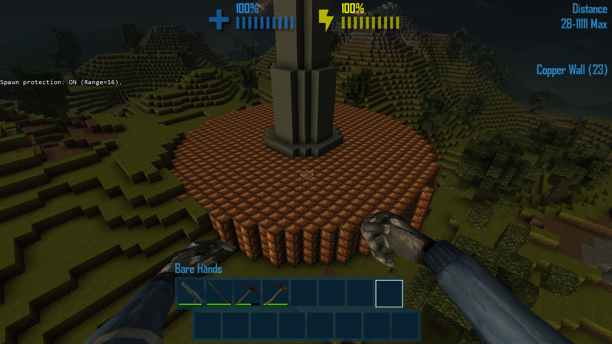
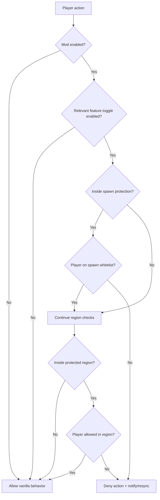
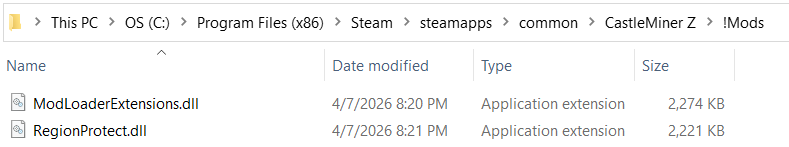

# RegionProtect

> A host-friendly **region and spawn protection mod** for CastleMiner Z.  
> Define protected build zones, lock down spawn, whitelist trusted players, and automatically deny griefing actions like mining, placing, explosions, and crate tampering.


## Contents

- [Overview](#overview)
- [What changed in this revision](#what-changed-in-this-revision)
- [Why this mod stands out](#why-this-mod-stands-out)
- [What RegionProtect protects](#what-regionprotect-protects)
- [Requirements](#requirements)
- [Installation](#installation)
- [Quick start](#quick-start)
- [How it works](#how-it-works)
- [Commands](#commands)
- [Configuration](#configuration)
- [World-specific data files](#world-specific-data-files)
- [Recommended screenshots / media](#recommended-screenshots--media)
- [Behavior notes and caveats](#behavior-notes-and-caveats)
- [Technical overview](#technical-overview)

---

## Overview

**RegionProtect** gives hosts a simple but powerful way to protect important parts of a world without needing a huge admin panel or external database.

At its core, the mod lets you:

- select two corners and create a named protected region,
- whitelist specific players for that region,
- optionally protect the **spawn area** using a configurable horizontal radius,
- block unauthorized **mining**, **building**, **crate access**, **crate destruction**, and **explosive damage**,
- persist protections **per world**, so each world keeps its own saved protection layout,
- hot-reload settings in-game with a configurable keybind,
- actively **restore and re-sync** denied actions so clients do not stay visually or inventory-desynced.

This makes it a strong fit for:

- community worlds,
- hosted multiplayer sessions,
- survival bases,
- public spawn hubs,
- private towns or claimed build zones,
- anti-grief setups that still allow trusted collaborators.


---

## What changed in this revision

This version is stronger and more reliable than the earlier README described.

### Host/local bypasses are now handled better
RegionProtect now includes **local pre-checks** for actions that could bypass normal network enforcement paths. That means protected crate access and protected crate mining behave much more consistently, including for the host/local player.

### Protected crates are harder to desync or abuse
The mod now:

- blocks unauthorized crate inventory edits,
- blocks unauthorized crate destruction,
- can prevent a protected crate screen from even staying open,
- re-broadcasts authoritative crate slot contents when a denied action needs to be undone.

### Gun-shot TNT/C4 attribution is smarter
If a player shoots TNT or C4 with a bullet or laser, RegionProtect now tracks the **actual shooter** so the deny message can go to the correct offender instead of incorrectly pointing at the host.

### Local denied mining is cleaner
When a local dig action is denied, the mod now tries to stop the action **before** vanilla side-effects happen. That helps avoid issues like crate contents ejecting first and needing a messy restore afterward.


---

## Why this mod stands out

### Clean, practical protection without heavy setup
RegionProtect is command-driven and easy to manage while playing. You can define regions directly in-world, edit trusted players, and save or reload everything without leaving the session.

### More than just block protection
The mod does not stop at normal mining. It also covers:

- block placement and replacement,
- crate inventory edits,
- crate destruction,
- explosive block removal,
- TNT/C4 detonation attempts inside protected spaces.

### Better local and host-side enforcement
Some game actions happen locally before normal authoritative processing fully resolves them. RegionProtect now patches those paths too, which helps the **host/local player obey the same rules** for protected crate use and protected crate destruction workflows.

### Designed around authoritative correction
When an action is denied, RegionProtect does more than say “no.” It also tries to restore or re-sync the authoritative state so clients do not stay visually desynced after an illegal action.

### World-by-world persistence
Every world gets its own protection database under the mod folder, which makes it much easier to keep server worlds, test worlds, and personal worlds separated.

### Friendly feedback for players
Unauthorized players can receive a private deny message explaining why the action failed, and those messages are rate-limited to avoid chat spam.

---

## What RegionProtect protects

### Regional protection
Named regions are saved as **inclusive 3D block bounds**. If a player is not on that region’s whitelist, RegionProtect can deny:

- mining blocks,
- placing or replacing blocks,
- taking from crates,
- putting items into crates,
- destroying crates,
- explosion-based block removal inside the region.


### Spawn protection
Spawn protection is a separate system that protects a configurable **horizontal XZ radius centered on world origin**.

Important details:

- spawn protection is optional,
- it uses a radius in blocks,
- the check is horizontal, not a small 3D box,
- it has its own whitelist,
- it can coexist with normal protected regions.



### Crate protection
RegionProtect handles two different crate-related actions:

- **crate item protection**: blocks unauthorized item movement in crate inventory slots,
- **crate destruction protection**: blocks unauthorized crate removal or breaking.

It also includes extra safety behavior for local play paths:

- a protected crate screen can be immediately closed if the player is not allowed,
- denied crate edits can be pushed back out as authoritative slot corrections,
- denied crate destruction can re-broadcast the crate inventory so clients restore the crate properly.

### Explosion handling
RegionProtect also covers griefing through explosives:

- explosion block removal packets are filtered block-by-block,
- denied blocks are corrected back to their authoritative state,
- denied TNT/C4 detonations can be prevented from consuming the explosive block in the first place,
- gun-triggered TNT/C4 attempts can attribute the denial to the **actual shooter** instead of the wrong player.


---

## Requirements

RegionProtect is built for the CastleForge ecosystem and depends on the core loader pieces.

### Required

- **ModLoader**
- **ModLoaderExtensions**

### Built for

- **CastleMiner Z**
- **.NET Framework 4.8.1** mod environment

### Recommended usage

For multiplayer, this mod is best used by the **host** so protection decisions remain authoritative.

---

## Installation

1. Install the CastleForge core loader.
2. Make sure **ModLoader** and **ModLoaderExtensions** are present and working.
3. Place `RegionProtect.dll` in your `!Mods` folder.
4. Launch the game once so the mod can create its configuration and world-data files.
5. Join or host a world.
6. Configure protections with chat commands and optional INI edits.

Typical output structure after first run:

```text
!Mods/
└─ RegionProtect/
   ├─ RegionProtect.Config.ini
   └─ Worlds/
      └─ <WorldID>/
         └─ RegionProtect.Regions.ini
```

---

## Quick start

Here is a practical first-use workflow.

### 1) Mark your region corners
Use the two selection commands while aiming at or standing near the desired corners.

```text
/regionpos 1
/regionpos 2
```

### 2) Create the region
Create a named region and optionally whitelist players immediately.

```text
/regioncreate MyBase Alice,Bob
```

### 3) Check where you are
Stand inside the area and verify the region is active.

```text
/region
```

### 4) Add or remove people later
You can edit permissions either by naming the region directly or by standing inside it.

```text
/regionedit MyBase add Charlie
/regionedit remove Bob
```

### 5) Enable spawn protection if needed
```text
/spawnprotect on
/spawnprotectrange 32
/spawnprotectedit add Alice
```

### 6) Save or reload manually
```text
/regionprotect save
/regionprotect reload
```

---

## How it works

### Region selection
RegionProtect keeps two temporary selection corners in memory:

- `Pos1`
- `Pos2`

When available, the mod uses the **construction probe target** for `/regionpos`; otherwise it falls back to the player’s position. After both corners are set, the mod normalizes them into min/max block bounds automatically.

### Permission model
A player action is checked against:

1. global config toggles,
2. optional spawn protection,
3. any region that contains the target block position.

If the action lands inside a protected area and the player is **not whitelisted**, it is denied.

### Denial behavior
Depending on the action, RegionProtect may:

- cancel the original action,
- send a private deny message,
- log the denial,
- broadcast a corrective block state,
- restore crate slot contents,
- rebroadcast crate contents to re-sync clients,
- prevent the local player from reaching some protected interactions in the first place.

<details>
<summary><strong>Protection flow diagram</strong></summary>



</details>

---

## Commands

RegionProtect includes a compact but capable command set.

### At a glance

| Command | Aliases | Purpose |
|---|---|---|
| `/regionpos 1|2` | `/rpos` | Set selection corners |
| `/regioncreate <name> [allowedCsv]` | `/rcreate`, `/radd` | Create a protected region |
| `/regionedit ...` | `/redit` | Add or remove allowed players |
| `/regiondelete <name>` | `/rdel` | Delete a region |
| `/region` | `/rg` | Show regions at your current position |
| `/spawnprotect on|off` | `/sprot` | Enable or disable spawn protection |
| `/spawnprotectrange <blocks>` | `/sprange`, `/spr` | Set spawn protection radius |
| `/spawnprotectedit add|remove <player>` | `/spe` | Edit spawn whitelist |
| `/regionprotect reload|save|list [page]` | `/rprot`, `/rp` | Admin utility commands |

<details>
<summary><strong>Full command reference</strong></summary>

### `/regionpos 1|2`
Sets one of the two region selection corners.

```text
/regionpos 1
/regionpos 2
```

Notes:

- uses the construction probe target when available,
- otherwise uses your local player position,
- stores the result in block coordinates.

---

### `/regioncreate <name> [allowedPlayersCsv]`
Creates a new named region from your saved corner selection.

```text
/regioncreate MyBase
/regioncreate MyBase Alice,Bob
```

Notes:

- both corners must already be set,
- region names are currently read as a single first argument,
- allowed players are comma-separated,
- bounds are normalized automatically.

---

### `/regionedit add|remove <player>`
### `/regionedit <name> add|remove <player>`
Edits a region whitelist.

```text
/regionedit add Alice
/regionedit remove Bob
/regionedit MyBase add Charlie
/regionedit MyBase remove Bob
```

Behavior:

- if the first argument matches an existing region name, that region is edited,
- otherwise the mod tries to edit the **first region at your current position**,
- useful for “stand inside it and edit it” workflows.

---

### `/regiondelete <name>`
Deletes a region by name.

```text
/regiondelete MyBase
```

---

### `/region`
Shows which protected regions contain your current position.

```text
/region
```

It also tells you whether you are allowed inside each returned region.

---

### `/spawnprotect on|off`
Turns spawn protection on or off.

```text
/spawnprotect on
/spawnprotect off
```

---

### `/spawnprotectrange <blocks>`
Sets the spawn protection radius.

```text
/spawnprotectrange 32
```

Notes:

- clamped to the range `0..512`,
- uses horizontal XZ radius from world origin.

---

### `/spawnprotectedit add|remove <player>`
Edits the spawn whitelist.

```text
/spawnprotectedit add Alice
/spawnprotectedit remove Bob
```

---

### `/regionprotect reload`
Reloads the config and region database.

```text
/regionprotect reload
```

---

### `/regionprotect save`
Writes the current region database to disk.

```text
/regionprotect save
```

---

### `/regionprotect list [page]`
Lists saved regions for the current world.

```text
/regionprotect list
/regionprotect list 2
```

Notes:

- paged at **10 entries per page**,
- useful for large community worlds.

</details>

---

## Configuration

RegionProtect uses a small INI file for runtime settings:

```text
!Mods/RegionProtect/RegionProtect.Config.ini
```

### Main toggles

| Key | What it does |
|---|---|
| `Enabled` | Master toggle for the mod |
| `ProtectMining` | Denies mining and explosion-based block removal |
| `ProtectPlacing` | Denies block placing and replacement |
| `ProtectCrateItems` | Denies moving items into or out of crates |
| `ProtectCrateMining` | Denies crate destruction |
| `EnforceHostOnly` | Restricts authoritative enforcement to the host |
| `DenyNotifyCooldownMs` | Throttles deny messages per player |
| `NotifyDeniedPlayer` | Sends a private deny message to the offender |
| `LogDenied` | Writes denied actions to the log |
| `ReloadConfig` | Hotkey used to reload config in-game |

<details>
<summary><strong>Generated config example</strong></summary>

```ini
# RegionProtect - Configuration
# Lines starting with ';' or '#' are comments.

[General]
Enabled              = true
; If true, deny digging (block -> Empty) in protected areas unless whitelisted.
ProtectMining        = true
; If true, also deny placing/replacing blocks in protected areas unless whitelisted.
ProtectPlacing       = true
; If true, deny taking/placing items in crates inside protected areas.
ProtectCrateItems    = true
; If true, deny destroying crates (mined/exploded) inside protected areas.
ProtectCrateMining   = true
; If true, only enforce on host (recommended).
EnforceHostOnly      = false
; Private message throttle (ms) per player to avoid chat spam.
DenyNotifyCooldownMs = 1200
; If true, send a private deny message to the offender.
NotifyDeniedPlayer   = true
; If true, log deny events to the console.
LogDenied            = false

[Hotkeys]
; Reload this config while in-game:
ReloadConfig         = Ctrl+Shift+R
```

</details>

### Recommended multiplayer tuning

For hosted multiplayer worlds, a practical starting point is:

```ini
[General]
Enabled              = true
ProtectMining        = true
ProtectPlacing       = true
ProtectCrateItems    = true
ProtectCrateMining   = true
EnforceHostOnly      = true
DenyNotifyCooldownMs = 1200
NotifyDeniedPlayer   = true
LogDenied            = false

[Hotkeys]
ReloadConfig         = Ctrl+Shift+R
```

### Hot reload support
You can reload the config in-game using:

- the chat command: `/regionprotect reload`
- the configured hotkey: default `Ctrl+Shift+R`

The hotkey parser is forgiving and supports formats like:

- `F9`
- `Ctrl+F3`
- `Control Shift F12`
- `Win+R`
- `Alt+0`



---

## World-specific data files

Region data is not stored in one giant shared file. Instead, RegionProtect writes a separate database for each world:

```text
!Mods/RegionProtect/Worlds/<WorldID>/RegionProtect.Regions.ini
```

That means:

- each world keeps its own region list,
- spawn protection settings are also per-world,
- switching worlds does not overwrite your protections from another world,
- the mod can safely keep server and personal worlds separated.

### Regions file format

```ini
# RegionProtect - Regions
# Lines starting with ';' or '#' are comments.

[SpawnProtection]
Enabled        = false
Range          = 16
AllowedPlayers = Alice,Bob

[Region:MyBase]
Min            = -10,0,-10
Max            = 10,50,10
AllowedPlayers = Alice,Bob
```

### What is stored here

- spawn protection enabled state,
- spawn protection radius,
- spawn whitelist,
- each region name,
- each region’s min/max bounds,
- each region’s allowed-player whitelist.

---

## Behavior notes and caveats

### Best used by trusted hosts
The source currently focuses on protection enforcement and does **not** add a separate in-mod admin permission layer for chat commands. In practice, this means RegionProtect is best managed by trusted hosts or moderators.

### Region names are case-insensitive
The store uses case-insensitive lookups for region names, which keeps management easier and avoids casing mistakes.

### Region names are single-argument names right now
`/regioncreate` currently reads the region name from the **first argument only**, so names with spaces are not the ideal workflow unless you plan around that limitation.

### Player names are normalized internally
Whitelists normalize player names internally, so exact letter case is not required.

### Spawn protection is origin-based
Spawn protection is based on a radius around **world origin**, not a custom moved spawn point.

### Empty spawn whitelist means nobody edits there
If spawn protection is enabled and the whitelist is empty, nobody is allowed to edit inside the protected spawn radius until players are added.

### Overlapping regions are supported
The store can return multiple regions at one position. In overlapping cases, RegionProtect checks all matching regions during enforcement.

### Temporary selection corners are not the same as saved regions
Your current `/regionpos` corner selections are runtime selection points. They help create regions, but the actual saved protections live in the world-specific regions file.

### Local pre-checks focus on the paths that matter most
The recent fixes specifically improve local/host behavior around:

- opening protected crates,
- editing protected crate contents,
- mining protected crates,
- explosive interactions that need better offender attribution.

---

## Technical overview

For people browsing the repository or evaluating architecture, RegionProtect is made up of four major parts:

### 1) Mod entrypoint
The main mod class:

- loads config,
- loads world data,
- applies Harmony patches,
- registers chat commands,
- registers help text with the command/help system.

### 2) Runtime enforcement core
The runtime core:

- holds config snapshots,
- holds region and spawn snapshots,
- normalizes player names,
- evaluates whether an action should be denied,
- builds deny messages,
- handles correction and private unicast feedback.

### 3) Persistent store
The store:

- loads and saves per-world INI data,
- tracks regions and spawn protection,
- supports region creation, deletion, editing, and listing,
- publishes lock-free snapshots to the runtime core.

### 4) Harmony patch layer
The patch layer intercepts gameplay actions such as:

- normal block mining and placing,
- explosion block removal,
- TNT/C4 detonation,
- crate inventory edits,
- crate destruction,
- protected crate opening,
- local dig paths that need early denial,
- config hot-reload input.

<details>
<summary><strong>Protected action matrix</strong></summary>

| Action | Controlled by | Protected by default | Notes |
|---|---|---:|---|
| Block mining | `ProtectMining` | Yes | Includes normal dig actions |
| Explosion block removal | `ProtectMining` | Yes | Handles per-block explosion removal |
| TNT/C4 detonation consumption | `ProtectMining` | Yes | Prevents explosive block consumption when denied |
| Block placing / replacing | `ProtectPlacing` | Yes in generated config | Useful for full anti-grief build claims |
| Crate item edits | `ProtectCrateItems` | Yes | Covers taking from and placing into crates |
| Crate destruction | `ProtectCrateMining` | Yes | Prevents unauthorized crate removal |
| Local protected crate open | `ProtectCrateItems` | Yes | Can immediately close a protected crate screen |
| Spawn area editing | Spawn settings + relevant feature toggles | Off until enabled | Uses a separate spawn whitelist |

</details>

<details>
<summary><strong>Repository-facing summary</strong></summary>

**RegionProtect** is a lightweight, per-world protection system for CastleMiner Z that combines region claims, spawn protection, player whitelists, and host-authoritative correction logic. It intercepts mining, building, explosives, and crate interactions, then denies or restores state when unauthorized actions target protected areas. The newer local pre-checks and explosive offender attribution also make protection behavior more consistent for crate workflows and shot-triggered TNT/C4 cases.

</details>