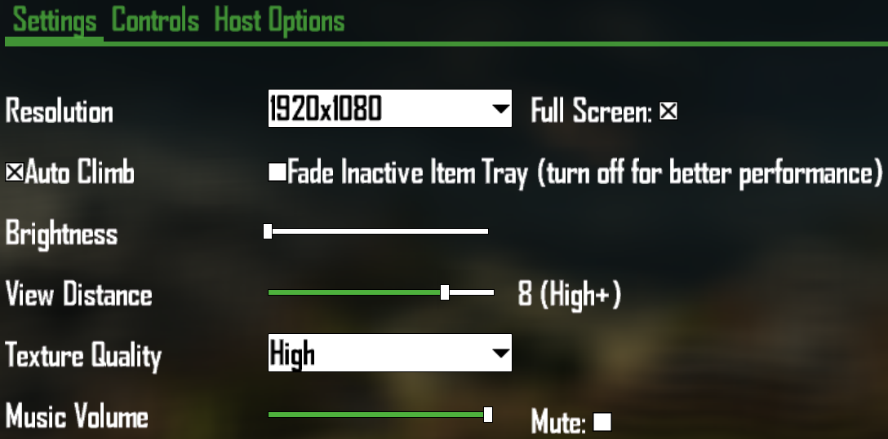
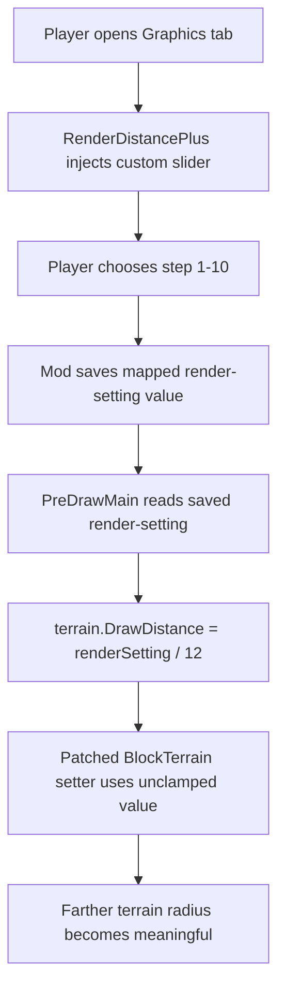
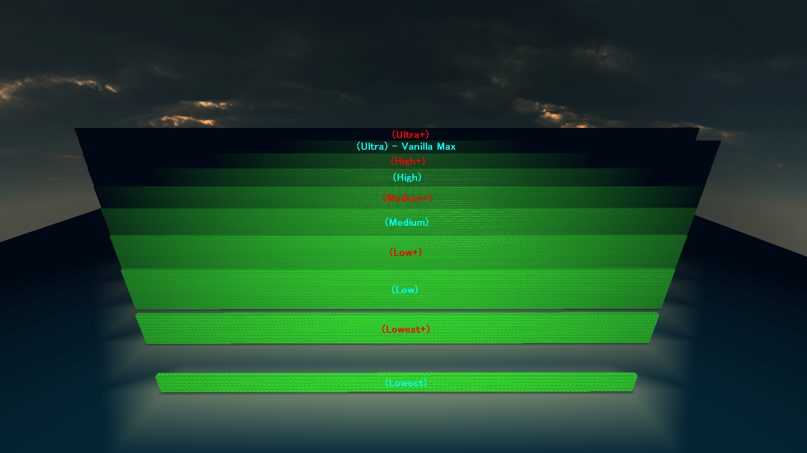

# RenderDistancePlus

> Extend CastleMiner Z's render distance beyond vanilla **Ultra** with a safer, more usable graphics menu.
> RenderDistancePlus removes the stock draw-distance clamp, replaces the vanilla drop-down with a **10-step slider**, preserves compatibility with the original UI flow, and pushes terrain rendering farther without forcing players to leave the game or edit saves manually.


## Overview

**RenderDistancePlus** is a quality-of-life and engine-enhancement mod for CastleMiner Z that expands how far terrain can be drawn while keeping the experience user friendly.

Vanilla CastleMiner Z effectively treats draw distance as a small set of built-in tiers and clamps the terrain draw scalar internally. This mod patches that behavior so larger values actually matter, then exposes those values through a cleaner **slider-based graphics setting** instead of the original limited drop-down.

The result is a mod that feels natural to use in-game:
- You still adjust view distance from the **Graphics** menu.
- The game still stores a view-distance value in the normal player stats path.
- The UI is safer around extended values that would otherwise break vanilla assumptions.
- Higher draw-distance tiers become practical and visible instead of being ignored by the engine.

---

## Why this mod stands out

RenderDistancePlus is not just a “number tweak.” It is a focused patch pack that solves **multiple parts of the vanilla render-distance pipeline** together:

- **Removes the internal draw-distance clamp** so values above the vanilla range actually increase terrain range.
- **Adds 10 distinct in-game slider steps** for smoother control instead of the stock coarse tiers.
- **Prevents the Graphics menu from crashing** when higher saved values exist.
- **Stops the hidden vanilla drop-down from overwriting** the extended setting.
- **Expands terrain offset consideration** so farther chunk candidates can be considered by the renderer.
- **Keeps labels readable** with familiar names like Lowest, Low, Medium, High, and Ultra, including “+” variants.

This makes the mod both a usability improvement and a technical compatibility fix.

---

## Feature highlights

### Extended render distance beyond vanilla Ultra
Vanilla stores and uses draw distance in a way that effectively caps meaningful terrain range. RenderDistancePlus patches `BlockTerrain.DrawDistance` so values above the normal 0..1 behavior are no longer wasted.

### 10-step in-game slider
The vanilla Graphics tab uses a limited drop-down. This mod replaces that control with a **TrackBar** that gives players **10 visible steps** with distinct behavior.

### Safer Graphics tab behavior
Vanilla UI logic expects a narrow set of draw-distance values. If extended values are saved, the original menu logic can become unsafe. RenderDistancePlus temporarily feeds vanilla a safe tier index during menu selection, then restores the real saved value immediately afterward.

### Better control without manual save editing
Instead of forcing players to edit values externally, the mod keeps everything accessible directly in the game menu.

### Localized tier names
The slider labels use the game’s existing resource strings for names like **Lowest**, **Low**, **Medium**, **High**, and **Ultra**, then adds `+` variants where appropriate.

### Self-contained patch pack
The mod initializes embedded dependencies, applies all Harmony patches at startup, and cleanly disables them again during shutdown.

---

## What the player sees in-game

When the mod is enabled, the **View Distance** entry in the Graphics tab is turned into a slider with 10 levels.

Each step updates the saved render setting and shows a more readable label like:
- `1 (Lowest)`
- `2 (Lowest+)`
- `3 (Low)`
- `4 (Low+)`
- `5 (Medium)`
- `6 (Medium+)`
- `7 (High)`
- `8 (High+)`
- `9 (Ultra)`
- `10 (Ultra+)`



---

## Slider levels and saved values

RenderDistancePlus uses a 10-step UI, but under the hood it stores a set of curated render-setting values so each step produces a meaningful visible jump.

| Slider Step | Display Label | Saved Render Setting |
|---|---|---:|
| 1 | Lowest | 1 |
| 2 | Lowest+ | 2 |
| 3 | Low | 3 |
| 4 | Low+ | 5 |
| 5 | Medium | 6 |
| 6 | Medium+ | 8 |
| 7 | High | 9 |
| 8 | High+ | 11 |
| 9 | Ultra | 12 |
| 10 | Ultra+ | 14 |

This mapping avoids duplicated-feeling tiers and gives the slider a smoother progression than the original menu.

---

## How it works

At a high level, the mod changes four major parts of the render-distance path:

1. **Unclamps the terrain draw-distance setter** so values above vanilla’s normal scalar are respected.
2. **Reapplies terrain draw distance every frame** based on the saved render setting.
3. **Replaces the Graphics tab view-distance drop-down** with a slider and value label.
4. **Shields vanilla UI logic** from higher saved values that would otherwise cause indexing issues.



---

## Full feature breakdown

<details>
<summary><strong>Click to expand the full technical breakdown</strong></summary>

### 1) Draw-distance unclamp patch
The mod intercepts `BlockTerrain.set_DrawDistance` and bypasses vanilla’s restrictive clamp behavior.

What this does:
- Accepts values greater than the old effective maximum.
- Recomputes the internal farthest-draw-distance radius using the raw value.
- Applies safety guards for invalid, negative, or absurd values.
- Preserves the familiar vanilla radius formula pattern.

### 2) PreDrawMain override
After vanilla prepares the frame, the mod re-applies terrain draw distance using the saved render-setting value.

The active mapping is:

```text
terrain.DrawDistance = renderSetting / 12f
```

Because the draw-distance setter is also patched, values above the old clamp now produce an actual increase in terrain draw range.

### 3) Graphics tab compatibility shim
Vanilla `GraphicsTab.OnSelected` expects a normal 0..4 index. Extended saved values such as 11, 12, or 14 would not fit that assumption cleanly.

To keep the menu stable:
- the mod stores the real value,
- temporarily substitutes a safe vanilla-compatible tier index,
- lets vanilla finish its selection logic,
- then restores the true saved value immediately after.

### 4) Custom slider injection
The mod injects a custom `TrackBarControl` and matching text label into the Graphics tab.

This injected UI:
- is added automatically when the tab is created or refreshed,
- is kept in sync with the current saved value,
- removes the vanilla view-distance drop-down from the visible children list,
- updates its on-screen label live.

### 5) Hidden vanilla handler suppression
Even after the original drop-down is removed visually, it may still try to fire its change handler. The mod blocks that path while RenderDistancePlus is enabled so the slider remains the single source of truth.

### 6) Extended radius-order offsets
The optional radius-order patch expands the offset table used when deciding which chunk offsets can be considered.

This means:
- vanilla’s fixed offset range is widened,
- farther terrain candidates can be evaluated,
- but practical results may still depend on engine cache or streaming limits.

### 7) Localization helper
The mod uses the game’s own localization resource bundle for familiar tier names. That keeps the labels feeling native instead of hardcoded and out of place.

### 8) Embedded dependency + clean teardown
On startup, the mod initializes its embedded resolver, extracts embedded resources to the `!Mods/RenderDistancePlus` folder when needed, applies Harmony patches, and logs readiness. On exit, it unpatches and logs shutdown completion.

</details>

---

## Configuration

At the moment, **RenderDistancePlus does not expose a separate end-user config file** in the code provided here. Its main tuning values are currently defined internally.

### Internal tuning values currently present in code

| Setting | Current Value | Purpose |
|---|---:|---|
| `Enabled` | `true` | Master switch for the patch pack |
| `UiMax` | `12f` | Divisor used for `terrain.DrawDistance = renderSetting / UiMax` |
| `MaxChunkRadius` | `64` | Safety cap for computed chunk radius |
| `RadiusOrderLimit` | `14` | Expands the offset range considered for chunk ordering |

### What this means for users
- There are **no chat commands** in this mod.
- There is **no separate config UI or `.ini`/`.json` file** in the provided implementation.
- All normal usage happens through the **Graphics** tab in-game.

> **Suggested screenshot placeholder:** A side-by-side image showing the vanilla drop-down versus the RenderDistancePlus slider.

---

## Installation

### Requirements
- **CastleForge ModLoader**
- CastleMiner Z
- RenderDistancePlus built or packaged as a mod assembly

### Basic install flow
1. Install and verify your CastleForge mod-loading setup.
2. Place the compiled `RenderDistancePlus` mod output into your `!Mods` directory according to your normal CastleForge layout.
3. Launch the game.
4. Open the **Graphics** tab and adjust **View Distance** using the new slider.

### Expected behavior on startup
- The mod initializes embedded dependencies.
- Harmony patches are applied.
- The mod logs that it has loaded.
- If embedded files are present, they may be extracted to `!Mods/RenderDistancePlus`.

### Uninstalling
To fully remove RenderDistancePlus, remove the mod from your `!Mods` folder and delete any files it extracted there.

If you want to clear the saved graphics setting that may still reference the extended render-distance values, also manually delete:

```text
%localappdata%\CastleMinerZ\<your SteamID64>\stats.sav
```

This forces CastleMiner Z to recreate its saved stats/config data on the next launch.

---

## Using RenderDistancePlus

### In normal gameplay
1. Start the game with the mod enabled.
2. Open **Options** / **Graphics**.
3. Find the custom **View Distance** slider.
4. Move the slider to the desired step.
5. Return to gameplay and observe farther terrain rendering.

### Recommended testing workflow
When showcasing this mod, compare the same scene at multiple slider steps:
- Lowest
- Medium
- High
- Ultra
- Ultra+

That makes the progression much easier to see in screenshots and videos.



---

## Technical notes and design choices

### Why the mod stores specific values instead of simple 1-10 integers
The slider is designed to expose **distinct practical jumps** while still respecting how the game internally interprets distance. Instead of blindly saving 1 through 10, the mod stores curated values:

```text
1, 2, 3, 5, 6, 8, 9, 11, 12, 14
```

This gives a more intentional progression and better compatibility with the patched render-distance pipeline.

### Why a compatibility shim is needed
Vanilla UI expects only a small fixed set of indices. Higher saved values can break that assumption. The shim preserves menu stability without sacrificing the extended setting.

### Why extended offsets are only part of the story
The radius-order offset patch helps the renderer consider farther chunk positions, but the comments in the code correctly note that cache and engine behavior may still cap practical results.

---

## Files created or touched at runtime

Depending on packaging and embedded resources, the mod may create or use:

```text
!Mods/RenderDistancePlus/
```

This is where extracted embedded resources may be written when the mod starts.

---

## Compatibility notes

### Designed for a vanilla-adjacent menu experience
This mod intentionally keeps the adjustment flow inside the existing Graphics tab rather than requiring separate commands or external editors.

### UI-safe handling of extended values
One of the most important compatibility features in this mod is not just the increased range, but the fact that it protects vanilla menu logic from the higher saved values.

### Practical rendering may still vary
The renderer can only go as far as the rest of the engine allows in practice. RenderDistancePlus increases the meaningful range and candidate consideration, but world complexity, streaming behavior, and engine constraints can still affect real-world results.