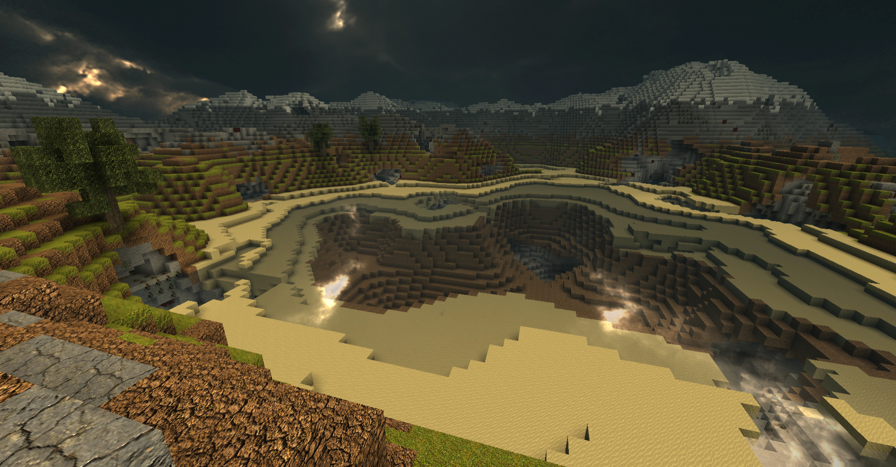
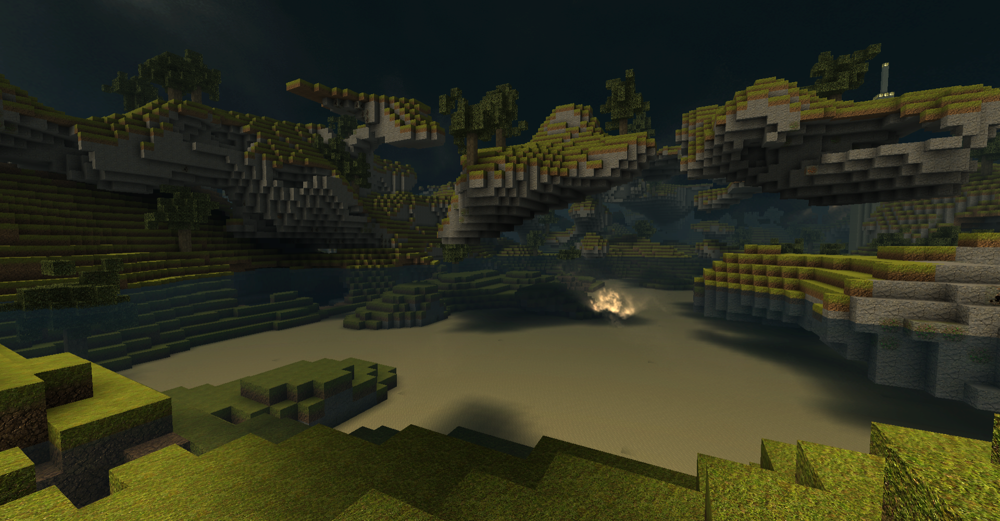
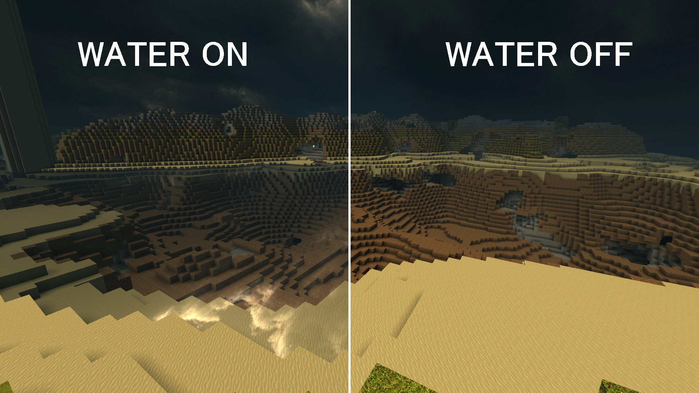
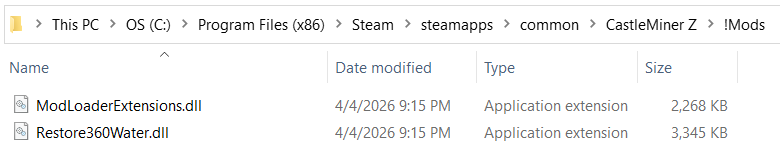
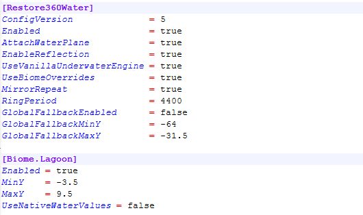
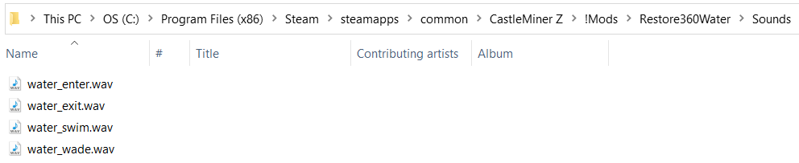
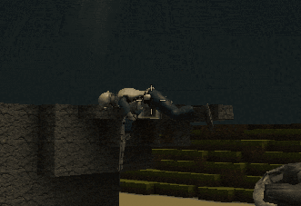

# Restore360Water

> Bring back the classic Xbox 360-style water feel in CastleMiner Z with biome-aware water bands, optional reflections, custom water audio, live config reloads, and WorldGenPlus-aware surface detection.


<p align="center">
  
  
</p>

## Contents

- [Overview](#overview)
- [Why this mod stands out](#why-this-mod-stands-out)
- [What it restores](#what-it-restores)
- [What it does not do](#what-it-does-not-do)
- [Feature highlights](#feature-highlights)
- [Requirements](#requirements)
- [Installation](#installation)
- [Quick start](#quick-start)
- [Chat commands](#chat-commands)
- [Configuration](#configuration)
- [Biome water bands](#biome-water-bands)
- [WorldGenPlus integration](#worldgenplus-integration)
- [Custom water audio](#custom-water-audio)
- [Files created by the mod](#files-created-by-the-mod)
- [Compatibility and behavior notes](#compatibility-and-behavior-notes)
- [Troubleshooting](#troubleshooting)
- [Technical deep dive](#technical-deep-dive)

---

## Overview

**Restore360Water** revives the dormant surface-water path in CastleMiner Z and modernizes it into a configurable, biome-aware system.

Instead of pretending the entire world is permanently flooded, the mod resolves water by **active biome** and **vertical water band**. That means you can restore the classic look and feel of water where it belongs, keep underwater behavior aligned with that band, and still avoid leaving caves, deep terrain, and unrelated regions submerged forever.

The current implementation also adds a surprising amount of quality-of-life around that core idea:

- a custom water plane that uses the game’s water shader
- optional reflection support with resize-safe target recovery
- band-aware water gameplay checks for `InWater`, `Underwater`, and `PercentSubmergedWater`
- custom local-player water sounds for entering, exiting, wading, and swimming
- live chat commands and a reload hotkey for tuning without restarting
- optional **WorldGenPlus** biome detection for non-vanilla surface layouts



---

## Why this mod stands out

Most “water restoration” ideas stop at simply drawing a plane. Restore360Water goes much further.

It does not just render water — it also updates the game’s runtime water behavior so the restored water is actually meaningful:

- **Biome-aware water bands:** Water can exist only within configured vertical ranges for specific biomes.
- **Gameplay-aware state rewrites:** Player water checks are redirected so movement, underwater state, HUD behavior, and audio respect the active band.
- **Optional vanilla underwater behavior:** You can keep the classic underwater engine active while still restricting it to the correct biome band.
- **WorldGenPlus support:** The mod can read custom surface layouts from WorldGenPlus, including rings, square bands, single-biome worlds, and random regions.
- **Live tuning workflow:** Reload config in-game through chat or a hotkey instead of relaunching every time.
- **Audio layer included:** Enter, exit, wade, and swim sounds are loaded directly from the mod folder and can be replaced or disabled individually.
- **Stability-oriented reflection handling:** Reflection targets are recreated safely when needed and rebound after window resize/maximize changes.

---

## What it restores

Restore360Water restores and extends the dormant **360-style surface water presentation path** in a way that fits modern CastleForge mod workflows.

### Restored / provided behavior

- Re-enables the game’s water-world style flow where appropriate.
- Recreates and attaches a custom water plane after game loading.
- Uses the game’s **WaterEffect** shader for above-water and underwater rendering.
- Scales the visible water volume to the configured biome band depth.
- Applies band-aware water logic to player state and HUD systems.
- Recomputes underwater tint against the current water band instead of one global level.
- Supports optional reflection rendering through a `ReflectionCamera` + `CameraView` scene path.
- Loads the water normal map from the mod’s own folder.
- Falls back to a generated normal map if the texture is missing.
- Restores local water sound behavior with configurable WAV files.

<!--  -->
> **Image Placeholder:** Add a feature showcase image with labels pointing to the water surface, underwater tint, reflection, and a shoreline/wading example.

---

## What it does not do

This mod is focused on **classic-style surface water presentation and behavior**, not full fluid simulation.

It does **not** currently:

- add true flowing voxel water
- simulate block-by-block fluid spread
- restore the older surrogate “Murky Water” block/item path as active gameplay
- force the entire world to behave like one giant flooded map

The repository still contains Murky Water art assets from earlier work, but the current build is centered on the plane-based approach.

---

## Feature highlights

| Feature | What it does | Why it matters |
|---|---|---|
| Biome-aware water bands | Resolves water by biome and `MinY` / `MaxY` range | Lets water exist only where it makes sense |
| Custom water plane | Draws a mod-owned water surface and well volume | Restores the visual identity of classic surface water |
| Vanilla underwater compatibility | Keeps underwater gameplay/tint behavior limited to the active band | Preserves familiar underwater feel without flooding everything |
| Reflection support | Attaches optional reflection camera/view and manages render targets | Adds extra polish while staying configurable |
| WorldGenPlus awareness | Reads WGP surface layout when available | Keeps water placement aligned with custom world generation |
| Live reload tools | Supports `/r360water reload` and a reload hotkey | Speeds up testing and tuning |
| Custom audio runtime | Plays enter/exit/wade/swim sounds from mod files | Makes restored water feel more alive |
| Safe runtime clamping | Prevents invalid underwater/drowning states from drifting | Improves stability during edge cases |

---

## Requirements

- **CastleForge / ModLoader**
- **ModLoaderExtensions**
- CastleMiner Z

This mod declares **ModLoaderExtensions** as a required dependency and is built as a CastleForge mod DLL.

---

## Installation

1. Install **CastleForge** and confirm your core loader is working.
2. Place `Restore360Water.dll` in your `!Mods` folder.
3. Launch the game once so the mod can extract its bundled assets.
4. Edit `!Mods\Restore360Water\Restore360Water.Config.ini` if you want to change defaults.
5. Relaunch the game or use the built-in reload tools after editing.

### Extracted mod assets

On startup, the mod extracts bundled assets into:

```text
!Mods\Restore360Water
```

That folder is used for config and runtime-loaded assets such as sounds and the normal map texture.



---

## Quick start

If you want to get the mod running fast:

1. Install the mod.
2. Leave **Enabled = true**.
3. Keep **UseVanillaUnderwaterEngine = true**.
4. Start with the included enabled bands for **Lagoon**, **Coastal**, and **Ocean**.
5. Use `/r360water status` to confirm the active biome and water band in-game.
6. Tweak `MinY` / `MaxY` values, then hot-reload the config.

A good first test is to stand in a coastal or lagoon area and verify:

- the plane is visible
- water only exists in the expected band
- wading/swimming sounds trigger correctly
- `/r360water status` reports the expected biome name

---

## Chat commands

Restore360Water includes built-in chat commands for live control.

| Command | What it does |
|---|---|
| `/r360water reload` | Reloads `Restore360Water.Config.ini` and reapplies live state |
| `/r360water status` | Prints current runtime status including biome, water band, water level, reflection, and underwater engine state |
| `/r360water on` | Enables the system for the current session |
| `/r360water off` | Disables the system for the current session |
| `/r360 ...` | Short alias for the same command group |

<details>
<summary><strong>Example status output details</strong></summary>

The status command reports values such as:

- whether the mod is enabled
- current biome name
- whether the current biome has water enabled
- current `MinY` and `MaxY`
- current live water level
- whether the terrain is in water-world mode
- whether the water plane is attached
- whether reflections are enabled
- whether the vanilla underwater engine is active

</details>

---

## Configuration

Restore360Water generates an INI file at:

```text
!Mods\Restore360Water\Restore360Water.Config.ini
```

### Core settings

| Setting | Default | Description |
|---|---:|---|
| `Enabled` | `true` | Master enable for the mod’s restored water runtime |
| `AttachWaterPlane` | `true` | Controls whether the visual water plane is attached to the scene |
| `EnableReflection` | `true` | Enables reflection camera/view support |
| `UseVanillaUnderwaterEngine` | `true` | Keeps the vanilla underwater path active, but limited to the resolved band |
| `UseBiomeOverrides` | `true` | Resolves water by biome instead of treating the world as one global band |
| `MirrorRepeat` | `true` | Mirrors alternating biome cycles for classic-style repeating ring behavior |
| `RingPeriod` | `4400` | Controls the repeating biome cycle width |
| `GlobalFallbackEnabled` | `false` | Uses a fallback water band when no biome band is enabled |
| `GlobalFallbackMinY` | `-64` | Lower bound of the fallback band |
| `GlobalFallbackMaxY` | `-31.5` | Upper bound of the fallback band |
| `DoLogging` | `false` | Enables detailed runtime logging |

### Reload hotkey

| Setting | Default | Description |
|---|---:|---|
| `ReloadConfig` | `Ctrl+Shift+R` | Reloads the config in-game on a rising-edge key press |

Supported examples include:

- `Ctrl+Shift+R`
- `F9`
- `Alt+F3`
- `Win+R`

If the binding is blank or invalid, the hotkey is effectively disabled.



<details>
<summary><strong>Example config snippet</strong></summary>

```ini
[Restore360Water]
Enabled                    = true
AttachWaterPlane           = true
EnableReflection           = true
UseVanillaUnderwaterEngine = true
UseBiomeOverrides          = true
MirrorRepeat               = true
RingPeriod                 = 4400
GlobalFallbackEnabled      = false
GlobalFallbackMinY         = -64
GlobalFallbackMaxY         = -31.5

[Biome.Lagoon]
Enabled = true
MinY    = -3.5
MaxY    = 9.5
UseNativeWaterValues = false

[Restore360WaterWorldGen]
EnableWorldGenPlusIntegration = true
WorldGenPlusSurfaceMode       = Auto

[Restore360WaterAudio]
EnableCustomSounds = true
SoundVolume        = 0.75
WaterEnterFile     = water_enter.wav
WaterExitFile      = water_exit.wav
WaterWadeFile      = water_wade.wav
WaterSwimFile      = water_swim.wav
EnableWaterEnter   = true
EnableWaterExit    = true
EnableWaterWade    = true
EnableWaterSwim    = true

[Hotkeys]
ReloadConfig = Ctrl+Shift+R
```

</details>

---

## Biome water bands

Restore360Water stores per-biome water band settings in dedicated config sections.

### Built-in biome band sections

| Section | Default enabled | Default band | Notes |
|---|---:|---|---|
| `Biome.Classic` | `false` | `-64` to `-31.5` | Classic inner biome support |
| `Biome.Lagoon` | `true` | `-3.5` to `9.5` | One of the main out-of-box restored water bands |
| `Biome.Desert` | `false` | `-43.5` to `-31.5` | Optional desert water band |
| `Biome.Mountain` | `false` | `-64` to `-31.5` | Optional mountain support |
| `Biome.Arctic` | `false` | `-43.5` to `-31.5` | Optional arctic support |
| `Biome.Decent` | `false` | `-64` to `-31.5` | Outer biome support |
| `Biome.Coastal` | `true` | `-64` to `-31.5` | Enabled by default |
| `Biome.Ocean` | `true` | `-64` to `-31.5` | Enabled by default |
| `Biome.Hell` | `false` | `-64` to `-64` | Present but disabled by default |

### Per-band option

| Setting | Description |
|---|---|
| `Enabled` | Allows that biome band to participate in runtime water resolution |
| `MinY` | Lower Y bound of the active water band |
| `MaxY` | Upper Y bound / water surface level |
| `UseNativeWaterValues` | Tells the runtime to prefer known native values for that biome when available |

### Native water values

The code currently includes a native water override for **Coastal** aliases, including:

- `Coastal`
- `CoastalBiome`
- `CostalBiome`

When enabled for a supported biome, the runtime uses hard native values instead of the configured band.


---

## WorldGenPlus integration

Restore360Water can optionally resolve biome identity from **WorldGenPlus** instead of only relying on classic radial biome math.

That means the mod can stay aligned with custom world layouts created by WGP.

### Integration settings

| Setting | Default | Description |
|---|---:|---|
| `EnableWorldGenPlusIntegration` | `true` | Enables WGP-aware biome resolution when WGP is active |
| `WorldGenPlusSurfaceMode` | `Auto` | Controls how surface resolution should interpret WGP worlds |

### Supported WGP surface layouts

| Mode | Supported | What happens |
|---|---:|---|
| `Auto` | Yes | Detects the active WGP mode and chooses the correct resolver |
| `Rings` | Yes | Resolves biomes from ring-based layouts |
| `Single` | Yes | Uses the configured single biome everywhere |
| `RandomRegions` | Yes | Resolves the dominant random-region biome at the current X/Z |
| `SquareBands` | Yes, through ring-style resolver path | Uses square-band distance behavior from WGP while still resolving the dominant banded biome |

### Resolver priority

When WGP integration is enabled, Restore360Water resolves water bands in this order:

1. Try to identify the current biome from the active **WorldGenPlus** surface layout.
2. If that biome has an enabled water band, use it.
3. Otherwise fall back to classic CastleMiner Z ring math.
4. If that classic biome has an enabled band, use it.
5. Otherwise use the global fallback band, if enabled.
6. Otherwise treat the location as having no active water band.

This is one of the strongest parts of the mod because it allows Restore360Water to remain useful even when the world no longer follows vanilla-style surface structure.


<details>
<summary><strong>Why this matters for custom worlds</strong></summary>

Without WGP integration, a water restoration mod would only make sense in worlds that still follow classic radial biome assumptions.

With WGP integration enabled, Restore360Water can stay biome-aware in worlds generated with:

- vanilla-like repeating rings
- square-band biome layouts
- single-biome challenge maps
- random region style worlds

That makes it much more useful for curated custom worlds, showcase seeds, and heavily customized CastleForge setups.

</details>

---

## Custom water audio

Restore360Water includes a dedicated runtime for local-player water sound effects.

### Audio events

| Event | Behavior |
|---|---|
| Enter water | Plays a one-shot splash when the player enters water |
| Exit water | Plays a one-shot splash when the player leaves water |
| Wade | Repeats a shallow-water movement sound while walking in shallow water |
| Swim | Plays a looped movement sound while underwater and moving |

### Audio settings

| Setting | Default | Description |
|---|---:|---|
| `EnableCustomSounds` | `true` | Master switch for the custom sound runtime |
| `SoundVolume` | `0.75` | Overall sound volume scalar |
| `WaterEnterFile` | `water_enter.wav` | Enter-water sound file |
| `WaterExitFile` | `water_exit.wav` | Exit-water sound file |
| `WaterWadeFile` | `water_wade.wav` | Wade sound file |
| `WaterSwimFile` | `water_swim.wav` | Swim loop sound file |
| `EnableWaterEnter` | `true` | Enables enter splash playback |
| `EnableWaterExit` | `true` | Enables exit splash playback |
| `EnableWaterWade` | `true` | Enables shallow-water wading playback |
| `EnableWaterSwim` | `true` | Enables underwater swim playback |

### Sound file location

```text
!Mods\Restore360Water\Sounds
```

The runtime loads WAV files directly from disk, so replacing the default audio is straightforward.



---

## Files created by the mod

Restore360Water creates or uses the following mod-local files/folders:

```text
!Mods\Restore360Water\Restore360Water.Config.ini
!Mods\Restore360Water\Sounds\water_enter.wav
!Mods\Restore360Water\Sounds\water_exit.wav
!Mods\Restore360Water\Sounds\water_wade.wav
!Mods\Restore360Water\Sounds\water_swim.wav
!Mods\Restore360Water\Textures\Terrain\water_normalmap.png
```

It also includes source-tree assets related to Murky Water art under the project, though the active runtime is focused on the plane-based water system.

---

## Compatibility and behavior notes

### Important behavior notes

- This is **plane-based classic water**, not modern fluid simulation.
- Water is resolved by **biome** and **vertical band**, not by a single global water height.
- When no biome water is active, the runtime pushes the terrain water level to a hidden off-state to avoid accidental world flooding.
- Runtime water updates are state-based, so the mod avoids unnecessary repeated scene attach/detach churn when nothing important has changed.
- The visual water plane can remain enabled while underwater behavior is still controlled through the band-aware runtime.

### Reflection notes

- Reflection support is optional.
- The mod recreates reflection targets when screen size changes.
- Existing reflection views are rebound to the new target after recreation.
- If you are testing for stability, reflections are one of the first features worth toggling off temporarily.

### Underwater compatibility notes

- The mod rewrites water getter usage in several player and HUD paths so water logic follows the active biome band.
- It also keeps safe postfix clamps as a fallback for any missed call sites.
- Underwater tint is recomputed against the current band rather than a world-wide plane.
- HUD health and oxygen are clamped to avoid underwater death edge cases drifting into invalid values.

### Swimming animation

Restore360Water also patches `Player.UpdateAnimation`, so the player’s swim-related animation checks follow the same biome-aware water rules as movement and underwater state. In practice, this helps the local player transition into swimming animation only when they are actually inside the active water band instead of relying on a single global water level.



---

## Troubleshooting

### Water plane is not visible

Check the following:

- `Enabled = true`
- `AttachWaterPlane = true`
- the current biome band is actually enabled
- your current `MinY` / `MaxY` values make sense for the biome you are testing
- `/r360water status` confirms the active biome and live water values

### Underwater behavior feels wrong

Verify:

- `UseVanillaUnderwaterEngine = true`
- the biome you are standing in has a valid enabled band
- your band is not too shallow for underwater checks
- the world is being resolved through the correct WGP mode if using WorldGenPlus

### Sounds are missing

Check:

- `EnableCustomSounds = true`
- the relevant per-event sound toggles are enabled
- the WAV files exist under `!Mods\Restore360Water\Sounds`

### Reflections look unstable or you are testing a graphics issue

Try setting:

```ini
EnableReflection = false
```

That keeps the restored water system active while removing the reflection scene path from the equation.

---

## Technical deep dive

<details>
<summary><strong>How the runtime works</strong></summary>

At a high level, Restore360Water works like this:

1. The mod starts, extracts bundled assets, initializes sound support, patches the game, and loads config.
2. Runtime water state is refreshed during HUD updates.
3. The current world position is used to resolve the active biome.
4. The biome is mapped to a configured `MinY` / `MaxY` water band.
5. Water-world state, live water level, water depth, and scene attachments are updated only when meaningful state changes occur.
6. Player water checks such as `InWater`, `Underwater`, and `PercentSubmergedWater` are redirected to biome-aware replacements.
7. The water plane draws with the game’s water shader, using the active band depth and current water surface height.
8. If reflections are enabled, a reflection camera/view is attached and rebound safely when the render target changes.

</details>

<details>
<summary><strong>Patched gameplay/UI paths</strong></summary>

The codebase patches or influences several key systems to make restored water feel coherent:

- terrain initialization
- secondary load resource creation
- game screen scene setup
- HUD update and draw paths
- player update, input, animation, audio, and jump logic
- underwater tint resolution
- getter-level fallback clamps for `Player.InWater` and `Player.Underwater`
- reflection compatibility for sky and terrain reflection drawing

This is why the mod feels more integrated than a simple cosmetic plane.

</details>

---

## Final notes

Restore360Water is not just a nostalgia mod. It is a careful restoration of classic-feeling water presentation with modern configurability, biome awareness, and CastleForge-friendly runtime controls.

If you want water to feel like it belongs in your world again — especially in curated or custom-generated worlds — this mod gives you a powerful foundation to build on.
