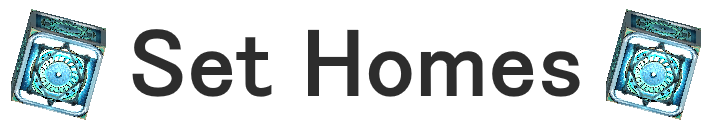
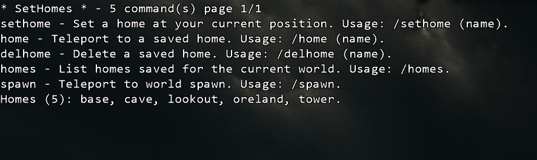

# SetHomes

> Save named homes per world, jump back to them instantly, and keep your exact facing direction when you arrive.

**Current mod version shown in source:** `0.0.1`



---

## Overview

**SetHomes** is a lightweight quality-of-life mod for CastleMiner Z that lets you save teleport destinations for the **local player** on a **per-world basis**. It supports:

- **Named homes** like `Base`, `Mine`, `Trader`, or `North Tower`
- A **default home** when no name is provided
- Fast teleporting back to saved locations with `/home`
- Quick world-spawn teleporting with `/spawn`
- Persistent storage on disk using simple `.ini` files
- Optional teleport sound effects
- Runtime config hot-reload with a configurable hotkey

Unlike a simple position bookmark, SetHomes also saves your:

- **Position**
- **Body rotation**
- **Torso pitch**

That means when you teleport back to a saved home, you return not only to the same place, but also with the same orientation.


---

## Why this mod stands out

SetHomes is intentionally simple to use, but it goes a little deeper than a basic teleport shortcut:

- **Per-world isolation**  
  Homes are stored separately for each world using the world ID, so names do not clash across saves.

- **Default + named home workflow**  
  You can keep one quick “main” home and still maintain a full list of named destinations.

- **Multi-word home names**  
  Commands like `/sethome North Tower` are supported.

- **Case-insensitive storage**  
  Home names are treated consistently even if you type different capitalization later.

- **Backward-compatible home storage**  
  The mod can read both legacy `x,y,z` entries and newer `x,y,z,qx,qy,qz,qw,pitch` entries.

- **Hot-reloadable config**  
  You do not need to restart the game just to change teleport sound settings.

---

## Features at a glance

| Feature | What it does |
|---|---|
| Named homes | Save any number of named teleport points per world |
| Default home | Omit the name to save or use a default home |
| `/home` teleport | Jump to a saved home instantly |
| `/spawn` teleport | Return to the world’s default spawn/start location |
| Orientation restore | Restores saved rotation and torso pitch on `/home` |
| Per-world storage | Each world gets its own isolated home list |
| Simple file format | Homes are stored in an easy-to-understand `.ini` file |
| Teleport sound config | Enable, disable, or customize teleport sounds |
| Per-command sound toggles | Separate sound toggles for `/home` and `/spawn` |
| Hotkey reload | Reload config in-game without restarting |


---

## Requirements

SetHomes is built for the CastleForge ecosystem and requires:

- **ModLoader**
- **ModLoaderExtensions**

The mod declares `ModLoaderExtensions` as a required dependency.

---

## Installation

1. Install **ModLoader** and **ModLoaderExtensions** first.
2. Place the **SetHomes** mod DLL into your CastleMiner Z `!Mods` folder.
3. Launch the game.
4. On first run, the mod will automatically create its working folder and config files.

### Files the mod creates

After first launch, SetHomes uses this folder:

```text
!Mods\SetHomes\
```

Expected files include:

```text
!Mods\SetHomes\SetHomes.Config.ini
!Mods\SetHomes\SetHomes.Homes.ini
```

The mod may also extract any embedded resources it ships with into the same folder.


---

## Quick start

Once you are in a world:

```text
/sethome
/home
```

That saves and uses your **default** home for the current world.

To create named homes:

```text
/sethome Base
/sethome Mine
/sethome North Tower
/homes
/home Mine
```

To delete a home:

```text
/delhome Mine
```

To return to world spawn:

```text
/spawn
```

---

## Command reference

### Core commands

| Command | Usage | What it does |
|---|---|---|
| `/sethome` | `/sethome` | Saves the **default** home for the current world |
| `/sethome <name>` | `/sethome Base` | Saves or overwrites a **named** home |
| `/home` | `/home` | Teleports to the **default** home for the current world |
| `/home <name>` | `/home Base` | Teleports to a **named** home |
| `/delhome` | `/delhome` | Deletes the **default** home for the current world |
| `/delhome <name>` | `/delhome Mine` | Deletes a **named** home |
| `/homes` | `/homes` | Lists all homes saved for the current world |
| `/spawn` | `/spawn` | Teleports the local player to the world spawn/start location |

### Important command behavior

- Home names can contain **multiple words**
- Home names are **case-insensitive**
- Omitting the name uses the world’s **default** home
- Saving a home with an existing name **overwrites** that entry for the current world
- `/spawn` ignores arguments and always teleports to spawn
- All commands operate on the **local player only**

<details>
<summary><strong>Examples</strong></summary>

#### Default home workflow

```text
/sethome
/home
/delhome
```

#### Named home workflow

```text
/sethome Main Base
/sethome Deep Mine
/homes
/home Main Base
/delhome Deep Mine
```

#### Spawn shortcut

```text
/spawn
```

</details>



---

## How homes work

SetHomes stores homes **per world**, not globally.

That means:

- A home named `Base` in one world is separate from a home named `Base` in another world
- Each world can also have its own **default** home
- The home list shown by `/homes` only reflects the **current world**

### Default home behavior

If you omit a name, SetHomes uses a reserved internal entry for the world’s default home. In chat, that default home is displayed as:

```text
<default>
```

The storage layer also treats both of these as the default home:

```text
default
<default>
```

### What gets saved

Each saved home can include:

- X, Y, Z position
- Quaternion rotation
- Torso pitch

This is why `/home` can restore your exact facing direction instead of just moving you to a coordinate.

### Listing behavior

When `/homes` is used:

- The default home is included if it exists
- The default home is shown first
- Remaining homes are listed in a clean, compact chat format

Example:

```text
Homes (3): <default>, Base, Mine.
```

---

## Configuration

SetHomes automatically creates this config file:

```text
!Mods\SetHomes\SetHomes.Config.ini
```

### Default config

```ini
# SetHomes - Configuration
# Controls teleport sound effects for SetHomes commands.

[Teleport]
PlaySound           = true
SoundName           = Teleport
PlayOnHomeTeleport  = true
PlayOnSpawnTeleport = true

[Hotkeys]
ReloadConfig        = Ctrl+Shift+R
```

### Config options

| Section | Key | Default | Description |
|---|---|---:|---|
| `[Teleport]` | `PlaySound` | `true` | Master toggle for all teleport sounds |
| `[Teleport]` | `SoundName` | `Teleport` | Sound cue passed to the game audio system |
| `[Teleport]` | `PlayOnHomeTeleport` | `true` | Enables sound when using `/home` |
| `[Teleport]` | `PlayOnSpawnTeleport` | `true` | Enables sound when using `/spawn` |
| `[Hotkeys]` | `ReloadConfig` | `Ctrl+Shift+R` | Reloads the config in-game |

### Supported hotkey style

The reload hotkey parser accepts common formats such as:

```text
Ctrl+Shift+R
Control Shift F12
Win+R
Alt+0
F9
A
```

### Runtime reload

SetHomes includes a Harmony patch that listens during `InGameHUD.OnPlayerInput`, allowing the config to be hot-reloaded safely on the main game thread.

When reloaded successfully in-game, the mod reports that the config was refreshed from disk.

---

## Teleport sound customization

If you like audible feedback when teleporting, SetHomes can play a sound cue when you use:

- `/home`
- `/spawn`

You can:

- disable all teleport sounds entirely
- use one sound for both actions
- keep sound enabled only for `/home`
- keep sound enabled only for `/spawn`

If the configured sound cue is missing or invalid, the mod safely ignores the failure rather than breaking the command.

<details>
<summary><strong>Included sound name list from the generated config</strong></summary>

```text
Click, Error, Award, Popup, Teleport, Reload, BulletHitHuman, thunderBig,
craft, dropitem, pickupitem, punch, punchMiss, arrow, AssaultReload, Shotgun,
ShotGunReload, Song1, Song2, lostSouls, CreatureUnearth, HorrorStinger,
Fireball, Iceball, DoorClose, DoorOpen, Song5, Song3, Song4, Song6, locator,
Fuse, LaserGun1, LaserGun2, LaserGun3, LaserGun4, LaserGun5, Beep, SolidTone,
RPGLaunch, Alien, SpaceTheme, GrenadeArm, RocketWhoosh, LightSaber,
LightSaberSwing, GroundCrash, ZombieDig, ChainSawIdle, ChainSawSpinning,
ChainSawCutting, Birds, FootStep, Theme, Pick, Place, Crickets, Drips,
BulletHitDirt, GunShot1, GunShot2, GunShot3, GunShot4, BulletHitSpray,
thunderLow, Sand, leaves, dirt, Skeleton, ZombieCry, ZombieGrowl, Hit, Fall,
Douse, DragonScream, Explosion, WingFlap, DragonFall, Freeze, Felguard
```

</details>

---

## Data storage

SetHomes stores saved homes here:

```text
!Mods\SetHomes\SetHomes.Homes.ini
```

### Format overview

Homes are stored in sections keyed by the world ID:

```ini
[world-guid-here]
__default__ = x,y,z,qx,qy,qz,qw,pitch
Base = x,y,z,qx,qy,qz,qw,pitch
Mine = x,y,z,qx,qy,qz,qw,pitch
```

### Notes about the format

- The storage uses **invariant culture**
- The default home is stored under the internal key `__default__`
- Existing legacy entries using only `x,y,z` are still supported
- The file is meant to be durable and simple, but it is **best not edited while the game is running**

<details>
<summary><strong>Technical behavior</strong></summary>

SetHomes sanitizes invalid rotation and pitch values when loading or saving. If rotation data is corrupt or invalid, it falls back to an identity rotation instead of failing. If pitch data is invalid, it falls back to zero. This makes the homes file more tolerant of old or damaged entries.

</details>

---

## Local-only behavior

This mod is designed around the **local player** and local convenience commands.

That means:

- it does **not** create shared team homes
- it does **not** add region ownership rules
- it does **not** synchronize home lists across players
- it is focused on fast personal travel and quality-of-life usage

This keeps the mod lightweight and easy to understand.

It is best thought of as a **personal travel utility** rather than a shared server-home system.

---

## What happens on first run

On startup, SetHomes:

1. initializes embedded dependency resolution
2. applies its Harmony patches
3. loads or creates its config file
4. registers its chat commands
5. registers command help
6. prepares its file storage under `!Mods\SetHomes`

Because of this, the mod is usually ready to use as soon as the world and player are available.

---

## Compatibility notes

- SetHomes is designed as a lightweight client-side utility.
- It stores homes by **world ID**, so each world gets an isolated home list.
- It preserves compatibility with older saved home entries that only stored `x,y,z`.
- It safely falls back if saved rotation or pitch data is invalid.

## Troubleshooting

### “Home not found”
This usually means:

- the home name does not exist in the **current world**
- you are trying to use a home from another world
- the default home has not been created yet

Try:

```text
/homes
```

### “No world/player loaded yet”
You attempted to use a command before the local player or current world was available.

Wait until the world is fully loaded, then try again.

### Teleport sound is not playing
Check:

- `PlaySound = true`
- the per-command toggle is enabled
- the configured `SoundName` is valid

### Config changes are not applying
Use your configured reload hotkey, which defaults to:

```text
Ctrl+Shift+R
```

---

## Uninstalling

To remove SetHomes:

1. Remove the mod DLL from your `!Mods` folder.
2. Optionally delete the SetHomes working folder:

```text
!Mods\SetHomes\
```

That removes:

- the config file
- the saved homes file
- any extracted embedded resources used by the mod

---

## Summary

SetHomes is a clean, focused travel utility for CastleMiner Z that gives you fast per-world teleport points without turning the experience into a bloated system. It is easy to install, easy to configure, and powerful enough to support both simple default-home workflows and more organized named destination setups.

If you want fast access to your base, mine, tower, bunker, or favorite world landmarks, SetHomes gives you a simple way to get there instantly.