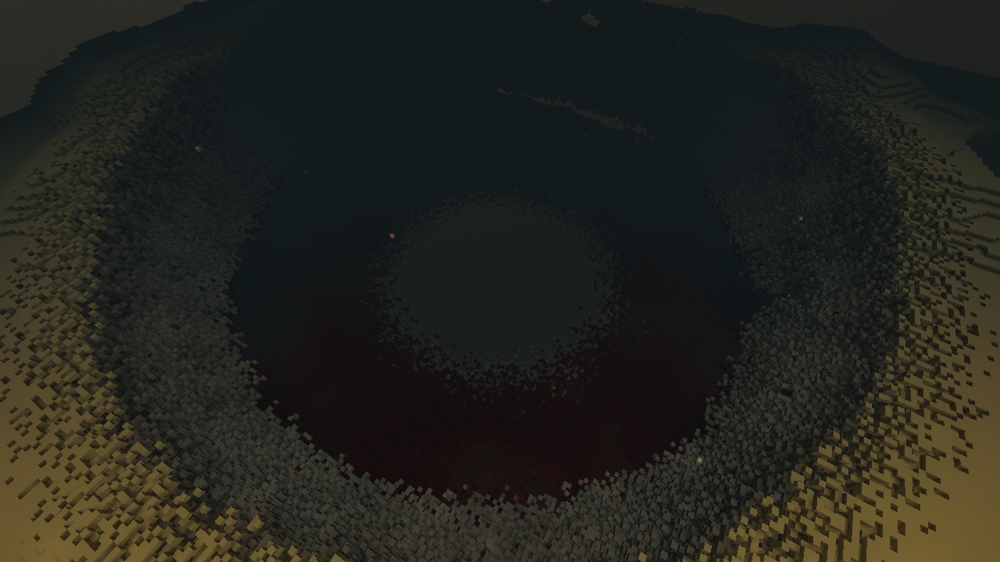
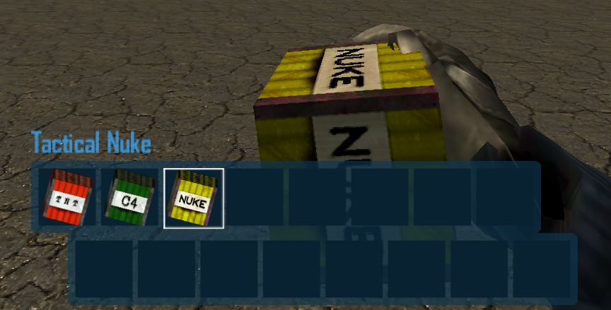
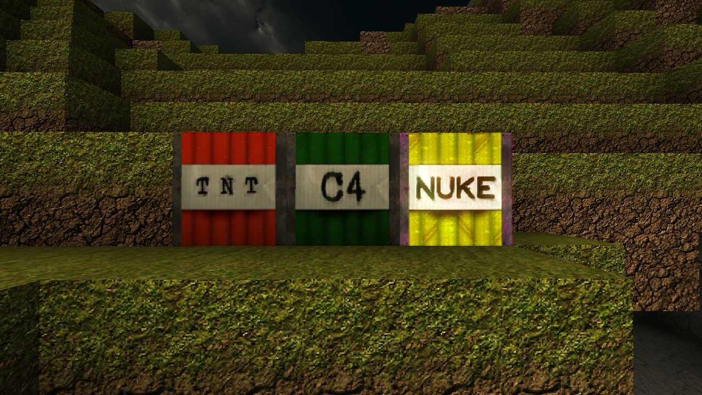
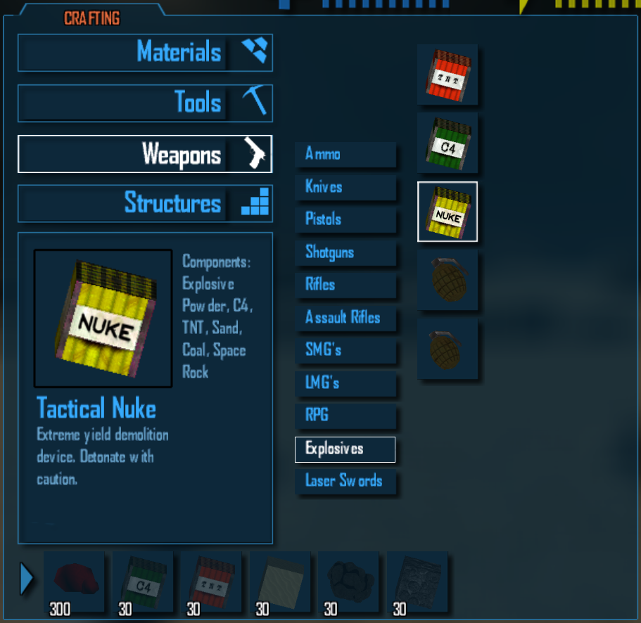
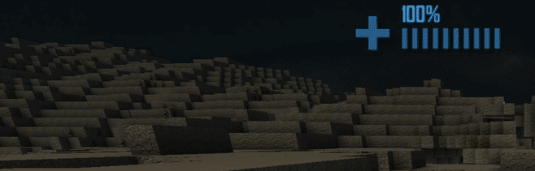
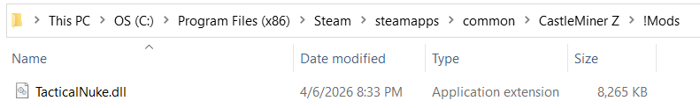
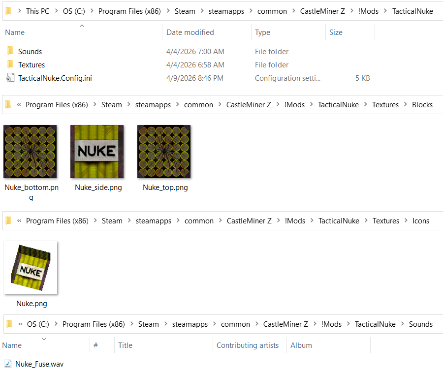

# TacticalNuke

> Turn demolition into an event.  
> **TacticalNuke** adds a custom nuke item, custom icon and block skinning, longer timed fuses, warning announcements, configurable crater shaping, chain reactions, projectile-triggered detonation, and an optional async explosion pipeline to keep massive blasts more manageable.


---

## Overview

TacticalNuke is more than a bigger C4. It is a full custom explosive workflow built on top of CastleMiner Z’s existing explosive systems.



At load, the mod:

- registers a custom inventory item at a configurable `InventoryItemIDs` slot,
- paints a custom icon into the game’s inventory atlases,
- re-skins a configurable surrogate block in the terrain atlas so the placed explosive has its own look,
- injects a configurable crafting recipe into the **Explosives** tab,
- extends fuse timing, blinking, and audio,
- applies custom blast radius / damage / kill tuning per detonation,
- optionally shapes the crater with custom geometry,
- and can process large explosions through a paced async block-clearing pipeline.

This makes the mod feel like a complete gameplay feature instead of a single hardcoded blast patch.

> **Recommended:** Back up your world before testing large-radius or custom-shaped blasts.

---

## Why this mod stands out

- **Feels native to the game**  
  The nuke is integrated as an actual inventory item with a painted icon, recipe support, in-world block skinning, and vanilla-style fuse behavior.

- **Highly configurable**  
  Blast radius, kill radius, damage radius, recipe, fuse timing, announcements, crater shape, edge jitter, async pacing, and TNT/C4 tuning are all configurable.

- **Supports dramatic presentation**  
  The mod adds a longer fuse, blinking cadence changes, custom 3D fuse audio, countdown warnings, and chain-reaction announcements.

- **Built with multiplayer safety in mind**  
  It includes special local-only pickup handling for vanilla-network-unsafe custom item IDs so unsafe pickup packets do not get sent to vanilla clients.

- **Designed for experimentation**  
  Want a vanilla-style blast, a hollow shell, a bowl-shaped crater, or an ellipsoid impact zone? This mod supports all of that without needing a rebuild.

---

## Core features

### 1) Custom nuke item registration
The mod registers a custom `BlockInventoryItemClass` for the configured nuke ID and ties it to a configurable surrogate block. By default, it uses:

- `NukeId = SpaceKnife`
- `TextureSurrogate = BombBlock`

That gives the mod a dedicated item slot and a dedicated in-world visual representation without replacing the entire explosive system.

### 2) Custom icon injection
The nuke gets its own inventory icon, which is painted directly into the game’s small and large inventory icon atlases. This is done in a CPU-safe way specifically to avoid common render-target / atlas binding issues.



### 3) Custom block retexture
The placed nuke is not just renamed C4. The mod paints custom **top**, **bottom**, and **side** textures into the terrain atlas and makes sure the surrogate block uses unique face slots when needed.

This gives the placed explosive a distinct visual identity in-world.



### 4) Configurable crafting recipe
A custom recipe is injected into the **Explosives** tab and, by default, is inserted immediately after the vanilla C4 recipe.



Default ingredients:

- `ExplosivePowder:30`
- `C4:30`
- `TNT:30`
- `SandBlock:30`
- `Coal:30`
- `SpaceRockInventory:30`

### 5) Extended fuse system
Placed nukes use an extended fuse instead of vanilla C4 timing. The mod also:


- keeps the flash entity alive for the longer fuse,
- changes blink cadence as detonation gets closer,
- plays a custom spatial fuse sound loop,
- and emits countdown warnings at **10**, **5**, and **1** seconds.

### 6) Arm / place / detonate flow
When the nuke item is selected, the next valid placement is converted from a C4 placement into the configured surrogate block and tracked as a real TacticalNuke placement.

Once placed, the nuke can be triggered like an explosive block:

- **Left-click to place** while holding the nuke item.
- **Right-click a placed nuke** to arm it like C4.
- **Shoot a placed nuke** to detonate it via projectile hit handling.
- Certain left-click interactions can also trigger fuse logic when the game is not attempting a block placement.

### 7) Projectile-triggered detonation
The mod patches both tracer and blaster collision flows so shots that hit a tracked nuke voxel can immediately trigger a detonation.

This makes nukes viable as remotely triggered trap-style explosives.


### 8) Disarm / mining support
Placed nukes are tracked in a dedicated world-position map. If the surrogate block is removed or replaced, the mod cleans up its internal fuse, flash, and audio state.

It also patches digging behavior so the surrogate can be treated more like C4 for spade-based interaction and cleanup.

### 9) Announcement system
Optional status announcements can notify the local player or the whole server about key events:



- armed,
- detonated,
- chain reaction,
- 10 second warning,
- 5 second warning,
- 1 second warning,
- disarmed.

By default, announcements are enabled locally and throttled to avoid spam.

### 10) Chain reactions
If another blast reaches a tracked nuke, the mod can mark it and detonate it as part of a chain reaction. This applies both in the custom async path and in the helper path that watches nearby nukes during otherwise-vanilla TNT/C4 explosions.

### 11) Per-detonation nuke blast overrides
The mod temporarily overrides the engine’s explosion tables for the specific detonation that occurs at a tracked nuke location. That means each nuke can temporarily use:

- its own block-destruction radius,
- its own splash-damage radius,
- and its own kill radius,

without permanently overwriting the game’s global tables.

### 12) Hardness handling + extra breakables
The mod supports two different approaches for tough blocks:

- **Ignore hardness entirely** for nuke blasts, or
- keep hardness behavior but explicitly whitelist **extra breakable** blocks.

By default, the extra breakables list includes:

- `Bedrock`
- `FixedLantern`

### 13) Custom crater shaping
Instead of always relying on a simple vanilla-style blast volume, TacticalNuke can carve custom crater shapes.


Supported shapes:

- `Vanilla`
- `Cube`
- `Sphere`
- `Diamond`
- `CylinderY`
- `Ellipsoid`
- `Bowl`

You can also add:

- hollow shell carving,
- adjustable shell thickness,
- vertical and horizontal scaling,
- deterministic edge jitter,
- and a configurable noise seed.

### 14) Async explosion manager
For large blasts, the mod can offload explosion voxel preparation to a background worker and then apply block edits over time on the main thread using a configurable per-frame budget.

Default behavior:

- async explosion handling is **enabled**,
- it applies to **nukes** by default,
- vanilla TNT/C4 remain vanilla unless you explicitly enable default explosive inclusion.

This helps reduce hitching compared to attempting massive world edits all at once.

### 15) Optional TNT / C4 tuning
The mod can also update vanilla TNT and C4 blast tables at load, letting you tune their destruction, damage, and kill radii independently.

---

## How it plays

### Basic usage flow

1. Craft or spawn the Tactical Nuke item.
2. Equip the nuke item.
3. Place it like a block.
4. Arm it by interacting with the placed nuke.
5. Evacuate.
6. Watch the custom fuse countdown, audio, and crater shaping do the rest.

### Alternate trigger methods

- Shoot the nuke to trigger it remotely.
- Let another explosion hit it to trigger a chain reaction.
- Remove or replace the block to disarm it before detonation.

---

## Feature deep dive

<details>
<summary><strong>Custom item, icon, and block skin pipeline</strong></summary>

### What this includes

- Runtime registration of a custom inventory item class.
- Custom inventory icon painting into both icon atlases.
- Runtime terrain atlas painting for top, bottom, and side block faces.
- Separate face-slot allocation so the surrogate block can display different textures per side.

### Why it matters
This is what makes TacticalNuke feel like a real item and not just a renamed vanilla explosive.

### Included mod assets
The source archive includes:

- `Textures/Blocks/Nuke_top.png`
- `Textures/Blocks/Nuke_bottom.png`
- `Textures/Blocks/Nuke_side.png`
- `Textures/Icons/Nuke.png`
- `Sounds/Nuke_Fuse.wav`

The included block face textures are `256x256` PNGs, and the included item icon is `128x128` PNG.

</details>

<details>
<summary><strong>Fuse, flash, audio, and countdown behavior</strong></summary>

### Fuse changes
By default, nukes use a **15 second** fuse instead of normal C4 timing.

### Visual timing support
The mod keeps the flash entity alive long enough for the extended fuse and adjusts blink cadence as detonation approaches:

- slow blink phase,
- medium blink phase,
- fast blink phase.

### Audio behavior
A custom looping 3D fuse sound is played from the placed block’s position and refreshed against the active listener every frame.

### Countdown feedback
The mod emits warning messages at:
- 10 seconds,
- 5 seconds,
- 1 second.

</details>

<details>
<summary><strong>Blast logic, hardness behavior, and chain reactions</strong></summary>

### Per-detonation override model
When a tracked nuke detonates, the mod temporarily expands the engine’s radius tables for just that detonation, then restores the original values immediately afterward.

### Hardness controls
You can choose between:
- allowing nukes to ignore hardness entirely, or
- letting nukes respect hardness while still force-breaking specific configured block types.

### Chain reactions
If another explosion reaches a tracked nuke block, the mod can flag that block and send a detonation message for it, allowing cascading blast chains.

</details>

<details>
<summary><strong>Async explosion pipeline</strong></summary>

### What it does


The async explosion manager:
- prepares explosion voxel offsets off-thread,
- keeps all actual world edits on the main thread,
- and applies those edits over multiple frames using a configurable block budget.

### Default behavior
By default:
- async mode is enabled,
- nukes use the async path,
- vanilla TNT/C4 do not unless you opt in.

### Why this matters
Large-radius explosives can cause severe hitches if every affected block is processed in a single spike. The async pipeline helps spread that work out.

</details>

<details>
<summary><strong>Multiplayer and network safety notes</strong></summary>

### Custom pickup protection
If your configured `NukeId` uses a slot that vanilla clients cannot safely deserialize, the mod intercepts pickup creation / consume / request flows and keeps those interactions local instead of sending unsafe packets.


### What this solves
This specifically helps avoid pickup-related crashes or bad deserialize paths when using vanilla-network-unsafe item IDs.

### Important note
This is a targeted safety feature, not a blanket promise that every mixed-mod environment will behave perfectly. TacticalNuke still works best in sessions where players are expected to share the same gameplay setup.

</details>

---

## Requirements

- **CastleMiner Z**
- **CastleForge ModLoader** (or your compatible CastleForge loader setup)
- **TacticalNuke.dll** placed in your mod folder
- A world backup if you plan on testing large blast radii or custom crater shapes

---

## Installation



1. Install your CastleForge loader setup.
2. Place `TacticalNuke.dll` into your game's `!Mods` folder.
3. Launch the game once.
4. On first load, the mod can extract its bundled content into:

```text
!Mods\TacticalNuke\
```

That folder is used for:
- the generated config,
- overrideable textures,
- and overrideable sound assets.

### Expected file layout after first run

```text
!Mods\
├─ TacticalNuke.dll
└─ TacticalNuke\
   ├─ TacticalNuke.Config.ini
   ├─ Sounds\
   │  └─ Nuke_Fuse.wav
   └─ Textures\
      ├─ Blocks\
      │  ├─ Nuke_top.png
      │  ├─ Nuke_side.png
      │  └─ Nuke_bottom.png
      └─ Icons\
         └─ Nuke.png
```

---

## Configuration



TacticalNuke uses:

```text
!Mods\TacticalNuke\TacticalNuke.Config.ini
```

Most gameplay, presentation, and explosion settings can be changed there.

### Hot reload support
The mod supports in-game config hot reload with the default hotkey:

```text
Ctrl+Shift+R
```

Hot reload updates most runtime values, including:

- blast tuning,
- fuse timing,
- recipe data,
- name / description overrides,
- TNT / C4 tuning,
- and block retexturing.

### Important hot reload limitation
Changing `NukeId` still requires a **game restart** because the item registration and icon-cell setup are one-time initialization paths.

---

## Default config reference

<details>
<summary><strong>Open full config breakdown</strong></summary>

### `[Nuke]`

- **`NukeId = SpaceKnife`**  
  Inventory item ID used for the nuke item.

- **`TextureSurrogate = BombBlock`**  
  The in-world block type that gets re-skinned and tracked as a nuke placement.

- **`DoBlockRetexture = true`**  
  Enables runtime terrain atlas painting for the nuke block.

- **`TextureSurrogateName = Tactical Nuke`**  
  Optional display-name override for the surrogate block.

- **`TextureSurrogateDescription = Extreme yield demolition device. Detonate with caution.`**  
  Tooltip / description override for the registered nuke item.

- **`NUKE_BLOCK_RADIUS = 50`**  
  Destruction radius in blocks for nuke detonation behavior.

- **`NUKE_KILL_RADIUS = 32`**  
  Kill radius used for splash lethality.

- **`NUKE_DMG_RADIUS = 128`**  
  Damage radius used for splash damage.

- **`NukeIgnoresHardness = true`**  
  If enabled, nuke crater checks can ignore block hardness restrictions.

- **`ExtraBreakables = Bedrock, FixedLantern`**  
  Extra block types that can be made breakable for nuke blasts.

> **Caution:** The generated config comments explicitly warn that when playing online **without** the async explosion manager, pushing `NUKE_BLOCK_RADIUS` above `50` increases crash risk.

---

### `[Recipe]`

- **`Enabled = true`**  
  Adds the custom nuke recipe.

- **`OutputCount = 1`**  
  Number of nukes crafted per recipe.

- **`InsertAfterC4 = true`**  
  Places the recipe immediately after vanilla C4 in the Explosives tab.

- **`Ingredients = ExplosivePowder:30, C4:30, TNT:30, SandBlock:30, Coal:30, SpaceRockInventory:30`**  
  Flexible ingredient list. Item names are matched forgivingly.

---

### `[Fuse]`

- **`NukeFuseSeconds = 15`**  
  Total fuse time.

- **`FastBlinkLastSeconds = 5`**  
  Final fast-blink window.

- **`MidBlinkLastSeconds = 10`**  
  Mid-blink window.

- **`SlowBlink = 0.50`**  
  Slow blink interval in seconds.

- **`MidBlink = 0.25`**  
  Medium blink interval in seconds.

- **`FastBlink = 0.125`**  
  Fast blink interval in seconds.

- **`FuseVolume = 0.75`**  
  3D fuse loop volume.

---

### `[Crater]`

- **`Shape = Sphere`**  
  Supported options: `Vanilla`, `Cube`, `Sphere`, `Diamond`, `CylinderY`, `Ellipsoid`, `Bowl`.

- **`Hollow = false`**  
  Only remove the shell instead of the full volume.

- **`ShellThick = 2`**  
  Thickness of the shell when hollow mode is enabled.

- **`YScale = 0.70`**  
  Vertical scale. Lower values flatten the blast.

- **`XZScale = 1.00`**  
  Horizontal scale applied to X and Z.

- **`EdgeJitter = 0.15`**  
  Rim roughness amount.

- **`NoiseSeed = 1337`**  
  Deterministic noise seed for edge jitter.

---

### `[Announcement]`

- **`Enabled = true`**  
  Master switch for armed / detonation / chain / countdown messaging.

- **`AnnounceToServer = false`**  
  `false` = local HUD feedback only.  
  `true` = broadcast to the server.

- **`MinRepeatSeconds = 2`**  
  Message spam guard for repeated events at the same location.

---

### `[AsyncExplosionManager]`

- **`Enabled = true`**  
  Enables the async producer / consumer explosion path.

- **`IncludeDefaults = false`**  
  If enabled, vanilla TNT/C4 can also use the async path.  
  If disabled, nukes use async while TNT/C4 stay vanilla.

- **`MaxBlocksPerFrame = 500`**  
  Per-frame block-application budget.

---

### `[VanillaExplosives]`

- **`TweakVanillaExplosives = true`**  
  Master switch for TNT/C4 table tuning.

- **`TNT_BlockRadius = 2`**
- **`C4_BlockRadius = 3`**
- **`TNT_DmgRadius = 6`**
- **`TNT_KillRadius = 3`**
- **`C4_DmgRadius = 12`**
- **`C4_KillRadius = 6`**

These default to vanilla-style values, but the section gives you a clean place to change them if desired.

---

### `[Hotkeys]`

- **`ReloadConfig = Ctrl+Shift+R`**  
  Reloads TacticalNuke’s config while in-game.

</details>

---

## Customizing the look and sound


One of the nicest implementation details in this mod is that content is loaded **disk-first**, with embedded-resource fallback.

That means you can replace the visuals and fuse sound without rebuilding the DLL, as long as you preserve the expected paths.

### Replaceable files

```text
!Mods\TacticalNuke\Textures\Blocks\Nuke_top.png
!Mods\TacticalNuke\Textures\Blocks\Nuke_side.png
!Mods\TacticalNuke\Textures\Blocks\Nuke_bottom.png
!Mods\TacticalNuke\Textures\Icons\Nuke.png
!Mods\TacticalNuke\Sounds\Nuke_Fuse.wav
```

### Good use cases
- reskin the nuke block to fit your server pack,
- swap in a different inventory icon,
- replace the fuse loop with a more dramatic or more subtle sound,
- or keep alternate art packs outside the source project.

---

## Compatibility notes

### Item ID / block surrogate conflicts
This mod intentionally repurposes:

- a configurable **inventory item ID**, and
- a configurable **surrogate block type**.

If another mod also uses the same slots, you may need to change:

- `NukeId`
- `TextureSurrogate`

### Best practice
If you are building a larger mod stack, pick surrogate IDs and item IDs deliberately so visuals, names, icons, and recipes do not overlap.

### Hot reload vs restart
Most config edits hot-reload correctly.  
Changing **`NukeId`** should be treated as a restart-required change.

---

## Known behavior notes

- The nuke recipe is safe to reapply and update on config reload.
- Name and description overrides can also be updated on config reload.
- The mod restores temporary explosion-table edits after each nuke detonation.
- If async mode is disabled, pending queued async jobs are cleared.
- The mod is intentionally defensive around content and reflection failures to avoid crashing the game if a single hook misbehaves.

---

## Files this mod creates or uses

### Runtime / generated
```text
!Mods\TacticalNuke\TacticalNuke.Config.ini
```

### Runtime / extracted or overrideable assets
```text
!Mods\TacticalNuke\Sounds\Nuke_Fuse.wav
!Mods\TacticalNuke\Textures\Blocks\Nuke_top.png
!Mods\TacticalNuke\Textures\Blocks\Nuke_side.png
!Mods\TacticalNuke\Textures\Blocks\Nuke_bottom.png
!Mods\TacticalNuke\Textures\Icons\Nuke.png
```

---

## Uninstalling

To remove TacticalNuke:

1. Delete `TacticalNuke.dll` from your `!Mods` folder.
2. Delete the `!Mods\TacticalNuke\` folder if you also want to remove:
   - the config file,
   - extracted textures,
   - extracted sound assets.

Because this is a destructive explosive mod, any terrain changes it already made to a world will remain in that world unless you restore from backup.

---

## Final summary

TacticalNuke is a fully featured explosive mod built around a custom item, custom visuals, extended fuse presentation, configurable crater carving, chain reactions, and optional async world destruction pacing.

If you want a CastleForge mod page that feels substantial on GitHub, this one has everything you want for a strong showcase:

- clear visuals,
- strong gameplay identity,
- lots of tunable behavior,
- and enough advanced implementation detail to interest technical users too.