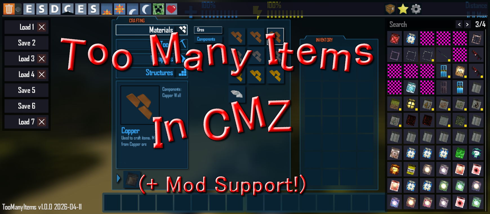
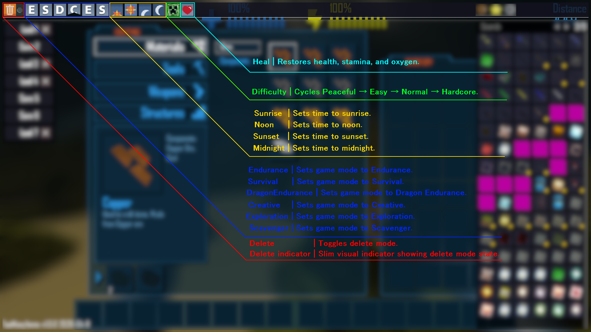
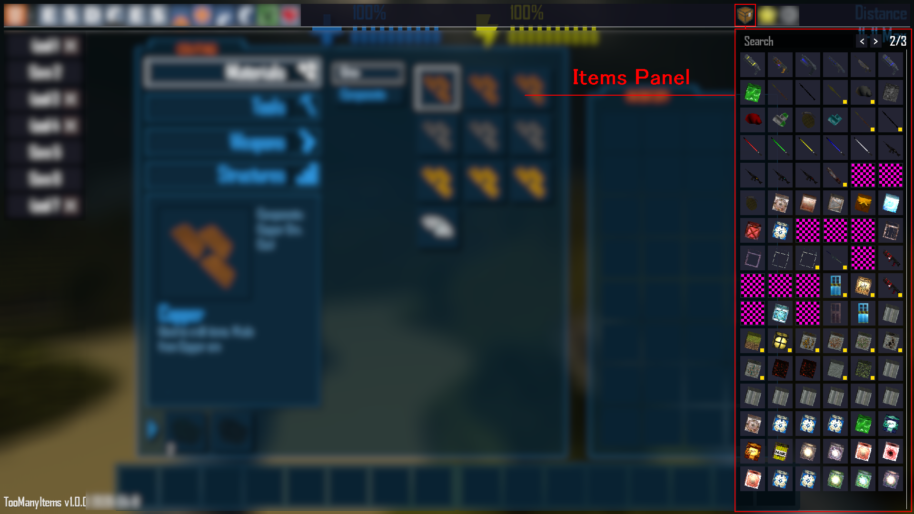
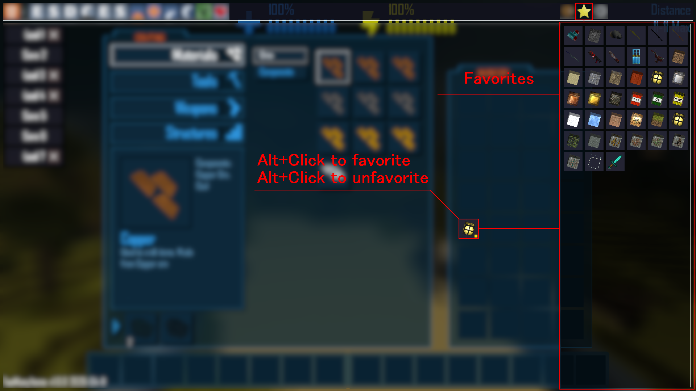
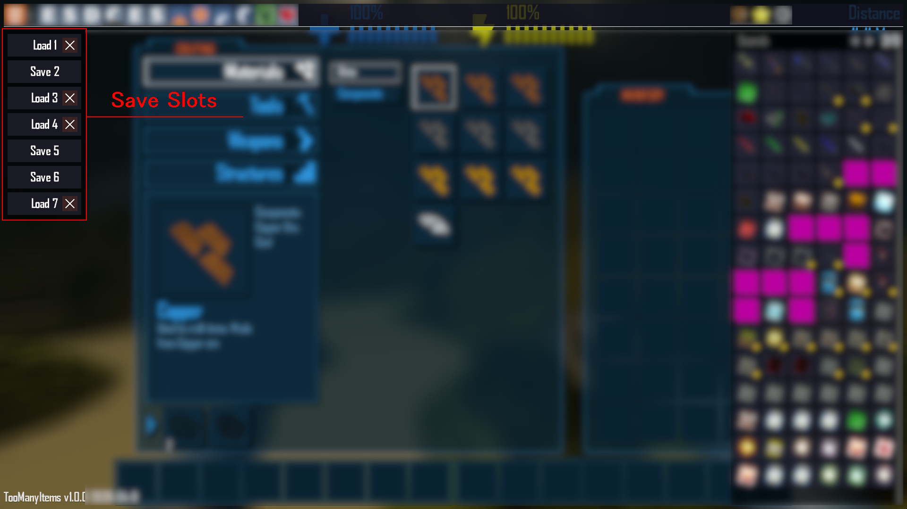
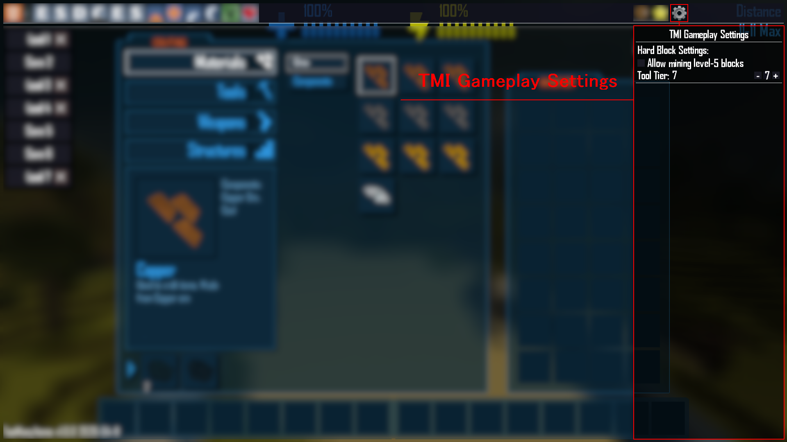

# TooManyItems

> A full-featured in-game item browser, hidden-block exposer, inventory helper, and quick-action overlay for CastleMiner Z.

---

## Overview

TooManyItems is designed to make CastleMiner Z feel far less restrictive when you are building, testing, recording, or just experimenting.

Instead of stopping at the vanilla item list, this mod goes further by:

- exposing registered items in a browsable in-game overlay,
- injecting missing block-backed items that vanilla does not normally expose,
- giving you fast search, favorites, save/load inventory snapshots, and quick utility actions,
- adding multiplayer-aware handling for synthetic items so those extra items behave safely,
- and giving you a clean way to tweak very-hard blocks, time, difficulty, and mode from inside the inventory screen.

For creators, testers, hosts, and sandbox players, this makes TooManyItems much more than “just an item giver.” It becomes a lightweight creative-control panel built directly into the game.



---

## A CastleMiner Z take on the original TooManyItems

The original Marglyph TooManyItems for Minecraft became popular because it let players open their inventory, instantly grab items, save whole inventories, swap modes, and use quick world controls from one compact overlay.

This CastleForge version keeps that same spirit while adapting it to CastleMiner Z:

- **open inventory, browse items, and spawn them quickly**,
- **left click for a stack / right click for one**,
- **save and restore entire loadouts**,
- **toggle or focus the overlay with a dedicated key**,
- **switch modes and adjust time/difficulty from the same screen**,
- **keep favorite items close at hand**,
- **surface content the base game normally does not expose cleanly**.

This is **not** a 1:1 Minecraft port, and that is intentional. CastleMiner Z does not map cleanly to features like Minecraft-style enchant, potion, firework, or weather panels, so this version focuses on the parts of TooManyItems that are the most useful for CastleMiner Z sandboxing, building, testing, and mod workflows.

---

## Why this mod stands out

TooManyItems is not just a static cheat list. It is a carefully integrated overlay with quality-of-life behaviors that make it feel native to the game:

- **Synthetic block exposure** so hidden or otherwise unavailable blocks can be surfaced as real inventory entries.
- **Searchable item browser** with fast full-stack or single-item give behavior.
- **Favorites workflow** for frequently used items.
- **Persistent inventory snapshots** so you can save and restore loadouts.
- **Quick world/session controls** like game mode, difficulty, time-of-day, and healing.
- **Hard-block tuning** for specific building/testing scenarios.
- **Multiplayer-safe pickup handling** for synthetic items.
- **Hot-reloadable configuration** so you can tune the UI without restarting every time.

---

## Quick start

1. Install **ModLoader** and **ModLoaderExtensions**.
2. Drop `TooManyItems.dll` into your `!Mods` folder.
3. Launch CastleMiner Z.
4. Open the **inventory / crafting screen**.
5. Press the configured **toggle key** if the overlay is hidden. By default, that key is **O**.
6. Left click an item to receive a stack, or right click it to receive one.

If the overlay does not appear at first, make sure you are actually inside the inventory screen. TooManyItems is meant to live there, just like the classic original mod.

---

## Core feature set

<details>
<summary><strong>Click to expand the full feature breakdown</strong></summary>

### 1) In-game TooManyItems overlay

The overlay is drawn directly in the **crafting/inventory screen** and includes:

- a **left toolbar** for utility and gameplay actions,
- a **right toolbar** for switching between **Items**, **Favorites**, and **Settings** panels,
- a **left-side save slot column** for inventory snapshot save/load/clear actions,
- delayed **tooltips** for both items and toolbar buttons,
- click guards so the overlay does not accidentally pass clicks through to the vanilla UI,
- top-most rendering so the interface stays readable above the rest of the screen.

### 2) Item browser

The Items panel supports:

- **search filtering**,
- **paging**,
- **mouse-wheel page navigation**,
- **left click = give full stack**,
- **right click = give one item**,
- **optional sort mode**,
- **optional hide-unusable filtering**,
- and safe fallback handling for bad/broken item IDs.

When an item cannot be safely created or drawn, the mod quarantines it so it does not keep throwing errors every frame.

### 3) Favorites panel

The Favorites panel gives you a reusable shortlist of commonly used items.

Supported flows include:

- **Alt + click** on an item in the Items panel to add/remove favorites,
- **Alt + click** in Favorites to remove an item from the list,
- persistent favorites saved to disk,
- the same give behavior as the main item grid:
  - **left click = full stack**
  - **right click = single item**

### 4) Save/load inventory snapshots

TooManyItems can persist inventory snapshots for quick switching between builds or playstyles.

That includes:

- **save slots** shown on the left panel,
- save current trays + backpack,
- load saved inventory back into the player,
- clear individual slots,
- configurable slot count,
- state persistence to disk.

This is extremely useful for:

- build kits,
- mining kits,
- PvE test kits,
- admin/support kits,
- video/demo setups.

### 5) Utility toolbar actions

The left toolbar includes:

- **Delete mode** toggle,
- **Shift-modified delete-all**,
- **game mode switching**,
- **time-of-day controls**,
- **difficulty cycling**,
- **heal / restore stats**.

### 6) Synthetic block item injection

A major part of this mod is not just showing existing items, but **reflectively registering missing block-backed inventory entries** for blocks that vanilla does not normally expose.

The injector:

- scans block enums,
- avoids duplicates using a coverage table,
- respects special family rules such as doors and torch variants,
- allocates synthetic IDs at runtime,
- merges those synthetic IDs into the item universe shown by the UI.

### 7) Expanded atlas support

Vanilla hard-coded item atlas assumptions are patched so TooManyItems can support a much larger visible item set without clipping or centering issues.

### 8) Multiplayer-aware synthetic item handling

Synthetic items are handled specially so they do not break normal pickup/network behavior.

The mod includes custom logic for:

- local-only synthetic drops,
- host-local synthetic pickup consumes,
- client-local synthetic pickup requests,
- cosmetic flying pickup effects,
- preventing vanilla clients/hosts from trying to process unknown synthetic IDs the wrong way.

### 9) Hard block settings

The Settings panel includes controls for a “hard block” group.

This lets you:

- enable mining for very-hard blocks,
- choose the required tool tier,
- dynamically apply or restore behavior.

The hard-block group is based on blocks that started with **hardness >= 5**, with a few special-case blocks also included.

### 10) Torch drop behavior toggle

TooManyItems can control whether torches drop as:

- the normal vanilla torch item, or
- the synthetic block-backed torch item.

### 11) Item icon extraction for development

A built-in debug export path can dump the game’s item atlases and extracted per-item PNGs for tooling, wiki work, pack authoring, or documentation screenshots.

</details>

---

## Toolbar and panel breakdown

### Left toolbar

The left toolbar is the fast-action side of the mod.

| Button | What it does |
|---|---|
| Delete | Toggles delete mode. |
| Delete indicator | Slim visual indicator showing delete mode state. |
| Endurance | Sets game mode to Endurance. |
| Survival | Sets game mode to Survival. |
| DragonEndurance | Sets game mode to Dragon Endurance. |
| Creative | Sets game mode to Creative. |
| Exploration | Sets game mode to Exploration. |
| Scavenger | Sets game mode to Scavenger. |
| Sunrise | Sets time to sunrise. |
| Noon | Sets time to noon. |
| Sunset | Sets time to sunset. |
| Midnight | Sets time to midnight. |
| Difficulty | Cycles Peaceful → Easy → Normal → Hardcore. |
| Heal | Restores health, stamina, and oxygen. |

### Right toolbar

| Button | What it does |
|---|---|
| Items | Opens the main item browser. |
| Favorites | Opens the favorites grid. |
| Settings | Opens TMI gameplay settings. |



---

## Items panel

The Items panel is the main browsing surface.

### Supported interactions

- **Left click** an item to give a full stack.
- **Right click** an item to give a single item.
- **Alt + click** an item to add or remove it from Favorites.
- **Mouse wheel** inside the grid to page through results.
- **Search box** supports focused text entry.
- **ESC** clears or unfocuses the search box.

### Search behavior

The search box is designed to be simple and stable:

- A-Z input supported
- 0-9 input supported
- space supported
- backspace supported
- escape clears/unfocuses
- once-per-press input handling avoids spammy repeat behavior

### Filters and sorting

The panel supports two useful behavior toggles:

- **HideUnusable** – removes items the mod considers unsafe or unusable from the grid.
- **SortItems** – changes ordering behavior.

When you search, results are kept stable and alphabetically useful.



---

## Favorites panel

The Favorites panel gives you a compact list of your most-used items.

### Favorite workflows

- **Alt + click** an item in the main Items panel to add/remove it from favorites.
- **Alt + click** inside Favorites to remove a favorite.
- **Left click** a favorite to give a full stack.
- **Right click** a favorite to give one.
- favorites persist to `TooManyItems.UserData.ini`

This is ideal for builders and testers who keep using the same blocks, tools, torches, containers, or admin items repeatedly.



---

## Save slots

TooManyItems includes a persistent inventory snapshot system.

### What gets saved

- tray/hotbar contents,
- secondary tray contents,
- backpack contents.

### What you can do

- **Save** current inventory into a slot,
- **Load** that snapshot later,
- **Clear** the saved slot with the slot’s X button,
- keep a configurable number of slots.

### Why it matters

This is one of the most useful quality-of-life features in the mod. It lets you instantly switch between:

- a building loadout,
- an exploration loadout,
- a mining loadout,
- a testing/debug loadout,
- an event/admin loadout.

This carries forward one of the best ideas from the original TooManyItems documentation: being able to save your “real” inventory, swap into a build or testing kit, and then restore yourself later without rebuilding everything by hand.



---

## Settings panel

The built-in Settings panel currently focuses on **hard block controls**.

### Hard Block Settings

- **Allow mining level-5 blocks** checkbox
- **Tool Tier** selector from **0 to 12**

### What this actually affects

The mod snapshots blocks whose default hardness was **5 or greater** at startup, then can temporarily relax those rules for testing/building scenarios.

It also explicitly includes a small special-case group such as:

- `DeepLava`
- `BombBlock`
- `TurretBlock`

When disabled, the mod restores the original defaults it captured earlier.



---

## Commands

TooManyItems currently exposes one chat command directly.

### `/give`

Give yourself or another player an item by item name or numeric item ID.

```text
/give [username] [item name|id] (amount) (health%)
```

### Examples

```text
/give me dirt
/give me dirt 5
/give me dirt 5 50%
/give me dirt 5 hp=75
/give me dirt 5 health=75
/give Russ Torch 50
/give Russ 42 1 100%
```

### Command behavior notes

- Player resolution supports:
  - exact match,
  - substring match,
  - fuzzy match.
- Item resolution supports:
  - numeric item IDs,
  - item enum names,
  - display names,
  - fuzzy matching.
- Health can be provided as:
  - `75%`
  - `hp=75`
  - `health=75`
- Large amounts are split internally into sane stack-sized chunks.

This command fills the same practical role the original Minecraft TMI docs described for multiplayer: when direct inventory insertion is not the right path, a command-based item give flow still provides a clean and flexible fallback.


---

## Installation

### Requirements

- CastleForge ModLoader
- **ModLoaderExtensions**
- CastleMiner Z

TooManyItems declares **ModLoaderExtensions** as a required dependency and is intended to load late so it can capture more complete item coverage, including content added by other mods.

### Install steps

1. Install the CastleForge core loader and required dependencies.
2. Place `TooManyItems.dll` into your game’s `!Mods` folder.
3. Launch the game.
4. Open the inventory/crafting screen and use the configured toggle key if needed.

### First-run behavior

On startup, the mod can extract its embedded resources into:

```text
!Mods\TooManyItems\
```

This includes the toolbar texture and missing-texture fallback assets used by the overlay.

---

## Configuration

TooManyItems writes a config file here:

```text
!Mods\TooManyItems\TooManyItems.Config.ini
```

### Default config example

<details>
<summary><strong>Show default TooManyItems.Config.ini</strong></summary>

```ini
; TooManyItems - Configuration
; Lines starting with ';' or '#' are comments.

[General]
Enabled=true
ToggleKey=O
DebugKey=F3
ReloadKey=F9
ShowEnums=false
ShowBlockIds=false
ShowBlockInfo=false
ShowItemInfo=false

[Behavior]
ItemColumns=6
SaveSlots=7
HideUnusable=false
SortItems=false
MidnightIsNewday=false
TorchesDropBlock=false

[Layout]
Margin=8
TopbarH=48
SearchH=28
SaveBtnW=172
SaveBtnH=48
ItemsColW=0
Cell=52
CellPad=6

[Appearance]
PanelColor=#000000A0
PanelHiColor=#0F0F19D2
ButtonColor=#191923DC
ButtonHotColor=#28283CEC
XButtonColor=#371E1EDC
XButtonHotColor=#502828E6
LineColor=#DCDCDC28
TextColor=#FFFFFFEA

[Textures]
ToolbarTexture=!Mods\TooManyItems\Textures\tmi.png
MissingTexture=!Mods\TooManyItems\Textures\MissingTexture.png

[Tooltips]
UseTooltips=true
ItemDelay=0.70
ToolbarDelay=0.35

[Sounds]
UseSounds=true

[Logging]
; Options:
;   - 'SendFeedback' (Emits to console plus logs.)
;   - 'Log'          (Logs only.)
;   - 'None'         (Do nothing.)
LoggingType=SendFeedback
```

</details>

### Config reference

#### `[General]`

| Key | Default | Description |
|---|---:|---|
| `Enabled` | `true` | Master enable for the overlay. |
| `ToggleKey` | `O` | Main overlay toggle key. |
| `DebugKey` | `F3` | Exports item atlas/item icon PNGs when pressed. |
| `ReloadKey` | `F9` | Reloads config live. |
| `ShowEnums` | `false` | Shows enum-style names in item/block info displays. |
| `ShowBlockIds` | `false` | Shows block IDs in info/tooltip views. |
| `ShowBlockInfo` | `false` | Expands block metadata in item tooltips/info views. |
| `ShowItemInfo` | `false` | Expands item metadata in item tooltips/info views. |

#### `[Behavior]`

| Key | Default | Description |
|---|---:|---|
| `ItemColumns` | `6` | Number of item columns used by the expanded item atlas/grid logic. |
| `SaveSlots` | `7` | Number of persistent inventory snapshot slots. |
| `HideUnusable` | `false` | Hides items the mod marks as unusable or problematic. |
| `SortItems` | `false` | Changes item ordering behavior in the browser. |
| `MidnightIsNewday` | `false` | Makes the Midnight action jump to the next day boundary instead of a late-night value. |
| `TorchesDropBlock` | `false` | Makes torches drop the synthetic block-backed torch item instead of the vanilla torch item. |

#### `[Layout]`

| Key | Default | Description |
|---|---:|---|
| `Margin` | `8` | General UI margin/padding. |
| `TopbarH` | `48` | Top toolbar height. |
| `SearchH` | `28` | Search bar height. |
| `SaveBtnW` | `172` | Save/load button width in the left panel. |
| `SaveBtnH` | `48` | Save/load button height in the left panel. |
| `ItemsColW` | `0` | Item panel width override. `0` means auto. |
| `Cell` | `52` | Item cell size. |
| `CellPad` | `6` | Item cell padding/gap. |

#### `[Appearance]`

All appearance values are colors used by the overlay theme.

| Key | Description |
|---|---|
| `PanelColor` | Base panel background. |
| `PanelHiColor` | Highlighted panel background. |
| `ButtonColor` | Normal button fill. |
| `ButtonHotColor` | Hovered button fill. |
| `XButtonColor` | Delete/clear button fill. |
| `XButtonHotColor` | Hovered delete/clear button fill. |
| `LineColor` | Separator line color. |
| `TextColor` | Main text color. |

#### `[Textures]`

| Key | Default | Description |
|---|---|---|
| `ToolbarTexture` | `!Mods\TooManyItems\Textures\tmi.png` | Toolbar atlas used for toolbar icons. |
| `MissingTexture` | `!Mods\TooManyItems\Textures\MissingTexture.png` | Fallback texture used when an item icon cannot be drawn. |

#### `[Tooltips]`

| Key | Default | Description |
|---|---:|---|
| `UseTooltips` | `true` | Enables delayed item and toolbar tooltips. |
| `ItemDelay` | `0.70` | Delay before item tooltip appears. |
| `ToolbarDelay` | `0.35` | Delay before toolbar tooltip appears. |

#### `[Sounds]`

| Key | Default | Description |
|---|---:|---|
| `UseSounds` | `true` | Enables click/craft/pickup/award sound feedback for TMI actions. |

#### `[Logging]`

| Key | Options | Description |
|---|---|---|
| `LoggingType` | `SendFeedback`, `Log`, `None` | Controls where TMI messages are routed. |

---

## Persistent user data

TooManyItems stores per-user state here:

```text
!Mods\TooManyItems\TooManyItems.UserData.ini
```

### What gets saved

- whether the overlay is enabled,
- favorites,
- save slot count and slot metadata,
- per-slot inventory snapshots,
- hard-block setting state,
- hard-block tool tier.

### Data sections

The user data file contains sections such as:

- `[State]`
- `[UI]`
- `[Favorites]`
- `[SlotNames]`
- `[Slot0]`, `[Slot1]`, etc.

### Resetting user state

Delete `TooManyItems.UserData.ini` if you want to reset:

- favorites,
- saved inventory slots,
- persisted UI state,
- hard-block settings.

---

## Files created by the mod

### Runtime/config files

```text
!Mods\TooManyItems\TooManyItems.Config.ini
!Mods\TooManyItems\TooManyItems.UserData.ini
!Mods\TooManyItems\Textures\TMI.png
!Mods\TooManyItems\Textures\MissingTexture.png
```

### Debug export output

When the debug export key is pressed, the mod can write:

```text
!Mods\TooManyItems\Extracted\2DImages\
!Mods\TooManyItems\Extracted\2DImagesLarge\
```

Including atlas dumps such as:

```text
items_atlas.png
```

and per-item exports named like:

```text
0001_Dirt.png
0042_Torch.png
```

---

## Troubleshooting

### The overlay does not show up

- Open the **inventory / crafting screen** first.
- Press the configured toggle key. By default this is **O**.
- Check that `Enabled=true` in `TooManyItems.Config.ini`.
- If needed, delete `TooManyItems.UserData.ini` to reset persisted UI state.

### Some items are missing or hidden

- Disable `HideUnusable` if you want to see everything the mod is willing to surface.
- Remember that some entries may be deliberately filtered or quarantined if they are unsafe to create or repeatedly error while drawing.
- TooManyItems also loads late on purpose so it can capture more registered content, including content introduced by other mods.

### The UI layout feels cramped or too large

Adjust the layout values in:

```text
!Mods\TooManyItems\TooManyItems.Config.ini
```

The most useful keys are usually:

- `ItemColumns`
- `Cell`
- `CellPad`
- `TopbarH`
- `SaveBtnW`
- `SaveBtnH`

### I changed config values and nothing happened

Press the configured reload key. By default this is **F9**.

---

## Technical highlights

<details>
<summary><strong>Show implementation highlights</strong></summary>

### Dynamic atlas expansion patch

TooManyItems patches the game’s hard-coded atlas size assumptions so the item atlas can scale beyond vanilla limits.

### Safe late registration

It waits until a safe draw point before registering synthetic item content, reducing the chance of device/content timing issues.

### Native-feeling overlay rendering

The overlay is drawn after the game UI with rendering states chosen specifically to avoid:

- stale scissor clipping,
- depth/stencil interference,
- drawing into the wrong render target.

### Synthetic item coverage system

The mod builds a block coverage table from vanilla item classes first, then only injects what is actually missing.

### Synthetic item network safety

Synthetic pickups are handled locally in the right places so they do not break normal host/client pickup logic.

### Fallback icon safety

Broken or missing icons fall back to a missing-texture path instead of repeatedly crashing the draw flow.

</details>

---

## Good use cases

TooManyItems is especially useful for:

- **creative building**,
- **admin/test worlds**,
- **mod development**,
- **YouTube or screenshot setup worlds**,
- **multiplayer event prep**,
- **fast inventory kit switching**,
- **finding hidden or otherwise unavailable block content**.

---

## Notes and behavior details

- The overlay is primarily meant for the **inventory/crafting screen**.
- The mod loads **late on purpose** so it can see as much registered content as possible.
- Search input suppresses overlay toggle conflicts while the search box is focused.
- Delete mode is designed to avoid stealing clicks from TooManyItems’ own UI.
- Favorites and save slots are intended to persist between sessions.
- Hard-block settings are reversible because defaults are captured before they are changed.
- Torch behavior is configurable because synthetic block-backed torch items are useful in some workflows, but vanilla torch drops are safer as a default.
- Like the original TMI, the most natural way to use the mod is: **open inventory, browse, click, keep building**.

---

## Compatibility / dependency note

TooManyItems depends on the CastleForge loader stack and expects the CastleForge mod environment to be present.

At minimum, make sure the following are available:

- `ModLoader`
- `ModLoaderExtensions`
- the normal CastleMiner Z runtime/reference setup used by CastleForge mods

---

## Uninstalling

To remove TooManyItems, delete the mod from your `!Mods` folder.

If you also want to clear its saved state, delete:

```text
!Mods\TooManyItems\TooManyItems.Config.ini
!Mods\TooManyItems\TooManyItems.UserData.ini
!Mods\TooManyItems\Textures\TMI.png
!Mods\TooManyItems\Textures\MissingTexture.png
```

If you used the icon export/debug feature and want a completely clean removal, also delete:

```text
!Mods\TooManyItems\Extracted\
```

---

## Summary

TooManyItems is a powerful utility mod for CastleMiner Z that combines item browsing, hidden block exposure, favorites, loadout snapshots, world/session quick actions, configurable hard-block behavior, and multiplayer-aware synthetic item handling into one polished in-game overlay.

It also preserves the most useful ideas that made the original TooManyItems memorable: immediate inventory access, quick utility controls, favorites, and saved inventories that help you spend more time building and testing and less time fighting menus.

If your goal is to build faster, test faster, debug faster, or just have a much more capable sandbox workflow, this is one of the most practical mods in the CastleForge collection.