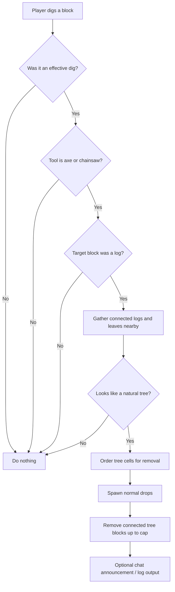
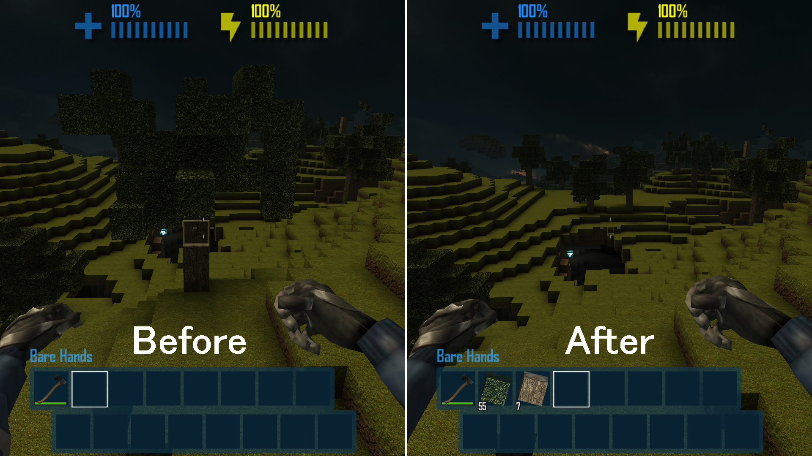

# TreeFeller

> Chop one trunk block and let the rest of the tree come down with it.


**TreeFeller** is a quality-of-life mod for **CastleMiner Z** that automatically fells connected tree blocks after you chop into a natural tree with an **axe** or **chainsaw**. It is designed to feel fast and satisfying without being reckless: the mod uses **bounded search limits**, **tree-shape heuristics**, and **caps on removal size** so it helps with real trees while reducing the odds of tearing through player-made structures.

It also keeps the workflow lightweight:
- No menus required.
- No slash commands required.
- No special tool mode required.
- Includes a **runtime config hot-reload hotkey** so you can tune behavior in-game.

---

## Table of contents
- [What this mod does](#what-this-mod-does)
- [Why TreeFeller stands out](#why-treefeller-stands-out)
- [How it works](#how-it-works)
- [Features](#features)
- [Installation](#installation)
- [Configuration](#configuration)
- [Recommended screenshots for this README](#recommended-screenshots-for-this-readme)
- [How TreeFeller decides what counts as a tree](#how-treefeller-decides-what-counts-as-a-tree)
- [Safety notes](#safety-notes)
- [Hot-reloading config in-game](#hot-reloading-config-in-game)
- [Troubleshooting](#troubleshooting)
- [Technical notes](#technical-notes)
- [Files created by the mod](#files-created-by-the-mod)
- [Compatibility notes](#compatibility-notes)
- [FAQ](#faq)
- [License](#license)

---

## What this mod does
When you **effectively dig a log block** using a supported tool, TreeFeller:

1. Detects the chopped log position.
2. Searches the surrounding connected **logs and leaves**.
3. Checks whether the structure still looks like a **natural tree**.
4. Removes the connected tree blocks in a controlled order.
5. Spawns the same kind of drops the tool would normally create when digging those blocks.

The result is a simple “cut once, collect faster” experience that keeps lumber gathering smooth and satisfying.


---

## Why TreeFeller stands out
Unlike a blunt “delete every connected log” approach, TreeFeller is built with guardrails:

- **Natural-tree detection** helps avoid flattening random log builds.
- **Search bounds** restrict how far the mod can scan horizontally and vertically.
- **Traversal caps** prevent runaway searches.
- **Removal caps** limit how many extra blocks can be removed from a single chop.
- **Vanilla-style drops** keep the result consistent with normal gameplay.
- **In-game config reload** lets you adjust behavior without restarting.

This makes TreeFeller feel more like a polished survival utility than a brute-force destruction tool.

---

## How it works
At a high level, the mod patches the game’s dig flow and reacts **after** the initial log has been broken by vanilla behavior.

### Simple flow


### Removal behavior
TreeFeller removes blocks in a deliberate order:
- **Leaves first**
- Then **higher blocks first**
- Then **farther blocks as a tie-breaker**

That ordering helps the felling feel natural and visually clean.



---

## Features

### Core gameplay features
- Automatic tree felling after chopping a valid log.
- Supports **axes**.
- Supports **chainsaws**.
- Uses **connected log + leaf traversal**.
- Uses **natural-tree heuristics** by default.
- Uses **bounded search windows** for safety.
- Uses **maximum traversal and removal caps** for performance and control.
- Uses the tool’s **normal dig drop generation** for block drops.
- Can optionally show **in-game announcements**.
- Can optionally write detailed actions to the **log**.
- Supports **runtime config hot-reload** via a configurable hotkey.

### What it does *not* rely on
- No UI menu.
- No command list.
- No extra action key.
- No special “TreeFeller mode” toggle.

---

## Installation

### Requirements
- **CastleForge ModLoader**
- **CastleMiner Z**
- TreeFeller mod files in your `!Mods` setup

### Typical install steps
1. Install the CastleForge mod loader.
2. Place the TreeFeller mod assembly in your `!Mods` folder.
3. Launch the game.
4. Let the mod create its config file on first run.
5. Chop a tree using an **axe** or **chainsaw**.

### Expected folder location
TreeFeller stores its config under:

```text
!Mods\TreeFeller\TreeFeller.Config.ini
```

If the mod has embedded resources to extract, they are written under the same mod folder.

---

## Configuration
TreeFeller creates and reads an INI config file at:

```text
!Mods\TreeFeller\TreeFeller.Config.ini
```

### Default config
<details>
<summary>Show full default config</summary>

```ini
# TreeFeller - Configuration
# Lines starting with ';' or '#' are comments.

[TreeFeller]
; Master toggle for the entire mod.
Enabled            = true
; If true, only fell structures that look like natural trees (logs + canopy leaves).
RequireNaturalTree = true

[Safety]
; Maximum number of cells the bounded flood-fill may visit.
MaxTraversalCells     = 512
; Hard cap on extra blocks removed after the first chopped log.
MaxBlocksToRemove     = 384
; Horizontal scan radius from the chopped log.
MaxHorizontalRadius   = 6
; Maximum upward scan distance from the chopped log.
MaxVerticalSearchUp   = 20
; Maximum downward scan distance from the chopped log.
MaxVerticalSearchDown = 3

[Heuristics]
; Minimum connected remaining log blocks required to count as a tree.
MinRemainingLogs    = 2
; Minimum connected leaves required to count as a tree canopy.
MinLeafCount        = 6
; Minimum canopy leaves near the top of the trunk.
MinLeavesNearCanopy = 4

[Logging]
; Show an in-game announcement to the player.
DoAnnouncement = false
; Write the action to the log.
DoLogging      = false

[Hotkeys]
; Reload this config while in-game:
ReloadConfig = Ctrl+Shift+R
```

</details>

### Setting reference

| Section | Setting | Default | What it controls |
|---|---:|---:|---|
| `TreeFeller` | `Enabled` | `true` | Master on/off switch for the mod. |
| `TreeFeller` | `RequireNaturalTree` | `true` | Only fells structures that pass the natural-tree heuristics. |
| `Safety` | `MaxTraversalCells` | `512` | Maximum number of cells the search can visit while gathering connected tree blocks. |
| `Safety` | `MaxBlocksToRemove` | `384` | Hard cap on how many extra connected blocks TreeFeller can remove after the initial chop. |
| `Safety` | `MaxHorizontalRadius` | `6` | Horizontal search limit from the chopped block on the X/Z axes. |
| `Safety` | `MaxVerticalSearchUp` | `20` | Maximum search distance upward from the chopped block. |
| `Safety` | `MaxVerticalSearchDown` | `3` | Maximum search distance downward from the chopped block. |
| `Heuristics` | `MinRemainingLogs` | `2` | Minimum number of connected remaining log blocks needed to still qualify as a tree. |
| `Heuristics` | `MinLeafCount` | `6` | Minimum number of connected leaves needed for the canopy check. |
| `Heuristics` | `MinLeavesNearCanopy` | `4` | Minimum number of leaves near the upper trunk/canopy region. |
| `Logging` | `DoAnnouncement` | `false` | Shows an in-game message when TreeFeller removes a tree. |
| `Logging` | `DoLogging` | `false` | Writes action details to the mod log. |
| `Hotkeys` | `ReloadConfig` | `Ctrl+Shift+R` | Hot-reloads the INI file while you are in-game. |

### Important config note
The safest default is:

```ini
RequireNaturalTree = true
```

If you turn that off, TreeFeller becomes much more permissive and may remove connected log/leaf structures that were intentionally built by players.

---

## How TreeFeller decides what counts as a tree
TreeFeller does **not** blindly remove every connected log block. By default, it tries to determine whether the structure still looks like a real tree.

### Natural-tree heuristics
A connected structure must satisfy checks like these:
- Enough **remaining log blocks** are still present.
- Enough **leaves** are connected.
- The leaf canopy sits **above** the chop point.
- Leaves are not significantly **below** the top logs.
- Enough leaves exist **near the canopy/top of trunk**.

### Practical effect
This helps stop things like:
- Small decorative log builds
- Basic wooden supports
- Random chopped log clusters
- Strange partial structures with no believable canopy

from being treated as a full tree.

<details>
<summary>Show the default heuristic thresholds</summary>

- `MinRemainingLogs = 2`
- `MinLeafCount = 6`
- `MinLeavesNearCanopy = 4`

</details>


---

## Safety notes
TreeFeller is built with several layers of protection, but configuration still matters.

### Built-in safety behavior
- Search is constrained by **horizontal** and **vertical** bounds.
- Connected traversal is capped by **MaxTraversalCells**.
- Actual removal is capped by **MaxBlocksToRemove**.
- By default, only **natural-looking trees** are eligible.
- Only **logs** and **leaves** are considered part of the removable tree component.

### Recommended safe setup
For general play, keep these defaults unless you have a reason to loosen them:

```ini
RequireNaturalTree     = true
MaxTraversalCells      = 512
MaxBlocksToRemove      = 384
MaxHorizontalRadius    = 6
MaxVerticalSearchUp    = 20
MaxVerticalSearchDown  = 3
```

### When to be careful
Be extra careful if you:
- Build large custom trees made from normal logs and leaves.
- Use decorative structures that look like organic trees.
- Disable `RequireNaturalTree`.
- Increase the search bounds far beyond the defaults.
- Increase removal caps in worlds with unusual vegetation builds.

---

## Hot-reloading config in-game
TreeFeller includes a configurable reload hotkey so you can tweak settings and apply them without restarting.

### Default hotkey
```text
Ctrl+Shift+R
```

### Supported hotkey formats
The parser is flexible and accepts formats like:

```text
F9
Ctrl+F3
Control Shift F12
Win+R
Alt+0
A
PageUp
Insert
```

### Notes
- The hotkey uses **edge detection**, so it triggers once when the keys are newly pressed.
- Leaving the key blank or setting no recognized main key effectively disables the binding.
- Some systems or overlays may swallow the **Windows key**, so `Win+...` combinations may be less reliable depending on environment.

---

## Troubleshooting

### TreeFeller is not doing anything
Check the following:
- You are using an **axe** or **chainsaw**.
- The chopped block is actually a **log**.
- The dig was **effective**.
- The structure still qualifies as a **natural tree**.
- `Enabled = true` in the config.
- The mod loader successfully loaded the mod.

### It only removes part of the tree
That usually means one of the safety limits was reached:
- `MaxTraversalCells`
- `MaxBlocksToRemove`
- `MaxHorizontalRadius`
- `MaxVerticalSearchUp`
- `MaxVerticalSearchDown`

Increase those carefully and test again.

### It will not fell my custom tree build
That is often expected when `RequireNaturalTree = true`.

You can either:
- Leave it on for safer general gameplay, or
- Turn it off for a more permissive behavior in controlled worlds

### It is removing structures I did not want removed
Set or keep:

```ini
RequireNaturalTree = true
```

Then lower any search or removal caps you previously increased.

### My config changes are not taking effect
- Save the INI file.
- Press your configured reload hotkey in-game.
- Make sure the hotkey string is valid.
- If needed, restart the game to verify the mod is reading the expected config file path.

---

## Technical notes
<details>
<summary>Show implementation-focused details</summary>

### Mod metadata
- Mod name: `TreeFeller`
- Version in constructor: `0.0.1`
- Target framework: `.NET Framework 4.8.1`

### Supported trigger tools
The trigger check currently accepts:
- `AxeInventoryItem`
- `ChainsawInventoryItem`

### Traversal model
- Starts from the **3×3×3 area around the chopped block** because the original chopped log has already been removed by vanilla before TreeFeller runs its follow-up logic.
- Traverses connected tree cells using a **full 26-neighbor search**.
- Only the following block types are treated as tree components:
  - `Log`
  - `Leaves`

### Removal ordering
Connected tree cells are ordered by:
1. Leaves before logs
2. Higher Y values first
3. Greater distance from the chopped location as a tie-breaker

### Drop behavior
Drops are generated through the tool’s normal dig logic, which helps keep the output aligned with how the selected tool would normally produce items.

### Multiplayer / game integration
The mod removes blocks using the game’s block alteration messaging path tied to the local network gamer, rather than doing a naive local-only terrain wipe.

### Config parsing
- INI parser is case-insensitive.
- Supports comments beginning with `;` or `#`.
- Supports section headers and simple `key=value` entries.

### Harmony integration
TreeFeller applies Harmony patches on startup and unpatches its own Harmony ID on shutdown.

</details>

---

## Files created by the mod
On first run, TreeFeller creates or uses:

```text
!Mods\TreeFeller\TreeFeller.Config.ini
```

It may also extract embedded resources into the same mod folder if present.

---

## Compatibility notes
### Good fit for
- Survival-focused quality-of-life setups
- Single-player wood gathering
- Multiplayer sessions where faster tree harvesting is desirable
- Players who want convenience without adding a big UI or command system

### Things to keep in mind
- Mods that heavily change **digging**, **tool classes**, or **tree block semantics** could affect behavior.
- Mods that introduce unusual custom tree structures may need config tuning.
- If custom content uses different block types instead of normal `Log` / `Leaves`, TreeFeller will not automatically treat those as standard tree parts unless its logic is expanded.

---

## FAQ

### Does TreeFeller need commands?
No. The mod is designed to work automatically when you chop a valid tree with a supported tool.

### Does it work with any tool?
No. The current trigger tools are **axes** and **chainsaws**.

### Does it remove the first chopped block?
The first chopped block is still handled by normal game behavior. TreeFeller then handles the connected remainder of the tree.

### Does it preserve normal drops?
Yes. It uses the tool’s normal block-dig item creation path for drop generation.

### Can I disable the natural-tree requirement?
Yes. Set:

```ini
RequireNaturalTree = false
```

Be careful: that makes the mod much more permissive.

### Can I tune performance and aggressiveness?
Yes. The safety and heuristic sections are specifically there so you can balance convenience, safety, and scan size.

### Do I have to restart the game after editing the config?
Not necessarily. By default you can press:

```text
Ctrl+Shift+R
```

to hot-reload the configuration in-game.

---

## License
TreeFeller source headers indicate:

```text
SPDX-License-Identifier: GPL-3.0-or-later
```

Refer to your repository’s root `LICENSE` file for the full license text.

---

## Suggested repository placement
Based on your CastleForge layout, this README belongs here:

```text
CastleForge/
└─ CastleForge/
   └─ Mods/
      └─ TreeFeller/
         └─ README.md
```

If you want, this page pairs especially well with a small GIF near the top showing one chop instantly clearing a full tree canopy.
