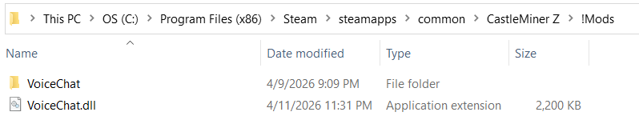

# VoiceChat

**Bring multiplayer voice back to life in CastleMiner Z with safer packet handling, push-to-talk, self-mute, speaker HUD feedback, and cleaner session behavior.**


## Overview

VoiceChat is a CastleForge mod that strengthens and modernizes the game's built-in voice pipeline instead of replacing it with a completely separate system.

The result is a more practical multiplayer voice experience with:

- **Push-to-talk by default** instead of always-open microphone capture.
- **Safer voice packet fragmentation** to reduce oversized-packet issues.
- **Self-mute / sidetone suppression** so you do not hear your own transmitted voice back locally.
- **Automatic voice startup** when a valid network session and local gamer are present.
- **A lightweight speaker HUD** that shows who is currently talking.
- **Cleaner playback behavior** by submitting the exact decoded audio length.
- **Safer cleanup on leave** so microphone and playback resources do not linger after leaving a game.
- **Optional suppression of buggy `Reverb*` XACT global calls** that can produce noisy first-chance exceptions.
- **Hot-reloadable config** so most settings can be adjusted by saving the config file while the game is running.

This makes VoiceChat especially useful for players who want in-session communication without constant open-mic behavior or the brittle edge cases that can show up in the stock voice path.

---

## Table of Contents

- [Why this mod stands out](#why-this-mod-stands-out)
- [Feature highlights](#feature-highlights)
- [Installation](#installation)
- [How to use](#how-to-use)
- [Configuration](#configuration)
- [Speaker HUD](#speaker-hud)
- [File layout](#file-layout)
- [Compatibility and behavior notes](#compatibility-and-behavior-notes)
- [Troubleshooting](#troubleshooting)
- [Technical deep dive](#technical-deep-dive)
- [Credits](#credits)

---

## Why this mod stands out

A lot of "voice chat" mods stop at simply enabling transmission. VoiceChat goes further by directly patching the weak points in the game's voice flow:

- It fixes a **signed-sample A-law indexing issue** during microphone encoding.
- It **splits captured voice into smaller fragments** instead of pushing one large packet buffer.
- It **submits only the audio that was actually decoded**, avoiding stale tail data in playback.
- It adds **push-to-talk logic that respects chat screens and common modifier-key combos**.
- It adds **quality-of-life feedback** with a simple on-screen speaking banner.
- It **cleans up voice resources on session leave** instead of leaving capture/playback state hanging.

In other words, this mod is not just about talking — it is about making the entire voice path more reliable and more usable.

---

## Feature highlights

### Core player-facing features

- **Push-to-talk**
  - Default key is `V`.
  - The mic starts when the configured key is held and stops when released.
  - PTT is ignored while the chat UI is open.
  - Ctrl/Alt/Windows key combos are ignored to prevent accidental transmission while using shortcuts.

- **Self-mute support**
  - By default, local self-voice playback is suppressed.
  - This prevents the confusing "I can hear myself" effect often described as sidetone or self-echo.

- **Auto-start voice initialization**
  - If enabled, the mod makes sure voice chat starts once a local gamer exists in an active session.
  - This helps avoid cases where voice chat never properly initializes after joining.

- **Speaker HUD banner**
  - Shows a lightweight `"<Gamertag> is talking"` banner.
  - Supports top-left, top-right, bottom-left, and bottom-right anchors.
  - Includes configurable display time and fade duration.

### Stability and quality improvements

- **Fragmented outgoing voice packets**
  - Instead of trying to send one large voice chunk, VoiceChat breaks audio into smaller slices.
  - This is designed to reduce buffer pressure and oversized-packet issues.

- **Exact-length playback submission**
  - Incoming A-law voice data is decoded and only the exact decoded byte count is submitted to playback.
  - This avoids submitting a larger stale buffer than the actual packet content.

- **Safe leave-game teardown**
  - Stops the microphone.
  - Unsubscribes the buffer-ready handler.
  - Stops and disposes playback.
  - Clears the runtime voice-chat instance.

- **Optional XACT reverb skip patch**
  - Skips `Reverb*` global variable calls that can trigger noisy first-chance exceptions when the expected XACT globals are missing.
  - Logging for these skips is optional and disabled by default.

### Configuration quality-of-life

- **Auto-generated config file** on first launch.
- **Config hot reload** through a file watcher.
- **Flexible boolean parsing**:
  - `true/false`
  - `1/0`
  - `yes/no`
  - `y/n`
  - `on/off`
- **Built-in clamping for important values** so broken settings are less likely to destabilize the session.

### What this build does *not* try to be

This version is focused on making the existing voice flow safer and more usable. It is **not** presenting itself as:

- a proximity / positional voice system
- a full in-game voice settings menu
- a radial voice wheel
- a full multi-speaker roster overlay
- a custom external VoIP backend

That focused scope is part of why the mod stays lean and practical.

---

## Installation

### Requirements

- CastleMiner Z
- CastleForge ModLoader
- A working microphone / recording device
- A multiplayer session where voice communication is relevant

### Install steps

1. Install and verify your CastleForge ModLoader setup.
2. Place the `VoiceChat` mod DLL into your game's `!Mods` folder.
3. Launch the game.
4. Let the mod create its config folder and config file on first startup.
5. Join or host a multiplayer session.
6. Hold the configured push-to-talk key to speak.

### Config file location

On first run, the mod creates:

```text
!Mods/VoiceChat/VoiceChat.Config.ini
```

### Extra dependency handling

This build embeds Harmony internally, so there is no separate Harmony install step for the player.



---

## How to use

Once installed:

1. Start the game and enter a multiplayer session.
2. Hold **`V`** to speak by default.
3. Release the key to stop transmitting.
4. Watch for the speaker HUD when remote players talk.
5. Edit the config file if you want to change the keybind, HUD position, or packet behavior.
6. Save the config file while the game is running to hot-reload most settings.

### Good first adjustments

If you want a quick tuning pass, these are the most likely settings to change first:

- `PttKey`
- `FragmentSize`
- `ShowSpeakerHud`
- `HudAnchor`
- `MuteSelf`

---

## Configuration

VoiceChat uses a simple INI-like config with `key=value` lines.

### Config summary

| Key | Default | What it does |
|---|---:|---|
| `PttKey` | `V` | Push-to-talk key. Uses `Microsoft.Xna.Framework.Input.Keys` names. |
| `FragmentSize` | `3500` | Outgoing voice fragment size in bytes. Clamped to `600..4000`. |
| `EnsureStart` | `true` | Automatically starts voice chat when a valid local gamer exists in session. |
| `MuteSelf` | `true` | Prevents local self-voice playback. |
| `LogReverbSkips` | `false` | Logs skipped `Reverb*` XACT global calls once per name. Mostly for debugging. |
| `ShowSpeakerHud` | `true` | Enables the `"is talking"` HUD banner. |
| `HudAnchor` | `TopLeft` | Banner corner. Accepts `TopLeft`, `TopRight`, `BottomLeft`, `BottomRight`, plus `TL/TR/BL/BR`. |
| `HudSeconds` | `1.20` | How long the speaker banner stays visible after the last packet. Clamped to `0.2..3.0`. |
| `HudFadeSeconds` | `0.30` | Fade-out duration for the banner tail. Clamped to `0.05..1.0`. |

### Tuning note for `FragmentSize`

The generated config comments recommend **`1800-2400`** as a practical range on some peers, even though the shipped default is **`3500`**. That means:

- keep the default if your session is already stable
- lower it if you want smaller packets and more conservative network behavior
- remember that smaller fragments mean more packets

### Full default config example

<details>
<summary><strong>Show full default <code>VoiceChat.Config.ini</code></strong></summary>

```ini
# VoiceChat - Configuration
# Lines starting with ';' or '#' are comments.

# =================================================================================================

[Hotkeys]
; Push-to-talk hotkey. Must be a Microsoft.Xna.Framework.Input.Keys name.
; Examples: V, LeftShift, CapsLock, T, NumPad0 (case-insensitive).
PttKey=V

[Voice]
; Voice fragment size in bytes for sending audio.
; Bigger fragments = smoother audio (fewer packets), but risk packet drops on some peers.
; Recommended range: 1800-2400. Clamp is 600..4000.
FragmentSize=3500

; If true, ensure a VoiceChat instance is started automatically once a session + local gamer exist.
; Set false if you prefer to start it only via your join hook.
EnsureStart=true

[Startup]
; If true, do NOT play your own voice locally (mutes sidetone).
MuteSelf=true

[Audio]
; Developer-only logging: When true, writes one log line the first time each
; missing 'Reverb*' XACT global is skipped by the patch.
; Leave false for players to keep logs quiet.
LogReverbSkips=false

# =================================================================================================

[HUD]
; Show the on-screen "<Gamertag> is talking" banner.
ShowSpeakerHud=true

; Banner corner: TopLeft | TopRight | BottomLeft | BottomRight
; Shorthands TL/TR/BL/BR are also accepted.
HudAnchor=TopLeft

; How long (in seconds) to keep the banner visible after the last received voice packet.
; Clamp is 0.2..3.0.
HudSeconds=1.2

; Tail fade duration in seconds. Clamp is 0.05..1.0.
HudFadeSeconds=0.3
```

</details>

### Example customization

```ini
PttKey=LeftShift
FragmentSize=2200
EnsureStart=true
MuteSelf=true
ShowSpeakerHud=true
HudAnchor=BottomRight
HudSeconds=1.5
HudFadeSeconds=0.4
LogReverbSkips=false
```

---

## Speaker HUD

The included HUD is intentionally minimal and readable.

### What it shows

When a **remote** player is heard, the HUD displays:

```text
<Gamertag> is talking
```

### HUD behavior

- Uses a simple pill-style background with text.
- Fades out near the end of the configured display time.
- Anchors to one of four screen corners.
- Tracks the **most recently heard speaker** rather than maintaining a stacked speaker list.

### HUD note

The HUD tries to discover an already-loaded `SpriteFont` from the game at runtime. If one is not available, audio can still work normally and the HUD will simply skip drawing.

---

## File layout

After installation and first launch, the most important runtime files are:

```text
!Mods/
└── VoiceChat/
    └── VoiceChat.Config.ini
```

### Source layout in CastleForge

```text
CastleForge/
└── Mods/
    └── VoiceChat/
        ├── Embedded/
        │   ├── 0Harmony.dll
        │   ├── EmbeddedExporter.cs
        │   └── EmbeddedResolver.cs
        ├── Overlays/
        │   └── SpeakerHUD.cs
        ├── Patching/
        │   └── GamePatches.cs
        ├── Startup/
        │   └── VoiceChatConfig.cs
        ├── Properties/
        │   └── AssemblyInfo.cs
        ├── VoiceChat.cs
        ├── VoiceChat.csproj
        └── README.md
```

This is useful to mention in the README because the project is very intentionally split into:

- **startup/bootstrap logic**
- **config management**
- **overlay rendering**
- **Harmony patch set**
- **embedded dependency handling**

---

## Compatibility and behavior notes

### Best experience

VoiceChat is built around the game's internal voice system and patches both the capture/send side and the receive/playback side. For the most reliable results, the best experience will usually come from sessions where everyone relevant is using the same VoiceChat build.

### Notes worth knowing

- There are **no slash commands** in this build.
- There is **no in-game settings UI** in this build.
- The mod is centered around **push-to-talk**, not always-open voice.
- The speaker HUD is **single-speaker oriented**, not a Discord-style participant list.
- The leave-game cleanup is designed to reduce dangling voice state when exiting a session.

### Good fit for

- private multiplayer sessions
- cooperative building/mining sessions
- players who want lightweight voice feedback without a big overlay
- users who want configuration through a simple file instead of a UI layer

---

## Troubleshooting

<details>
<summary><strong>I installed it, but I do not hear anyone.</strong></summary>

Check the obvious first:

- confirm you are in a multiplayer session
- confirm your microphone is available and not muted
- make sure you are actually holding the push-to-talk key
- verify `PttKey` in `VoiceChat.Config.ini`
- make sure voice auto-start is enabled with `EnsureStart=true`

If you changed the config while the game was running, save the file again to trigger the watcher reload.

</details>

<details>
<summary><strong>I hear myself talking back.</strong></summary>

Make sure:

```ini
MuteSelf=true
```

That setting suppresses local self-playback.

</details>

<details>
<summary><strong>I want smaller / safer voice packets.</strong></summary>

Lower `FragmentSize`.

Example:

```ini
FragmentSize=2200
```

That produces smaller voice fragments, which may behave better on some peers, though it also increases packet count.

</details>

<details>
<summary><strong>The speaker HUD is not showing.</strong></summary>

Check:

```ini
ShowSpeakerHud=true
```

Also note that the HUD only appears for **remote** speakers and depends on finding a usable in-game `SpriteFont`. If no suitable font is discoverable at runtime, audio may still function while the HUD stays hidden.

</details>

<details>
<summary><strong>I see noisy XACT reverb-related exceptions in logs.</strong></summary>

This mod already includes a narrow shim that skips `Reverb*` global variable calls. If you want visibility into those skips for debugging, enable:

```ini
LogReverbSkips=true
```

Leave it `false` for regular play to keep logs quieter.

</details>

---

## Technical deep dive

<details>
<summary><strong>Patch-by-patch breakdown</strong></summary>

### 1) Microphone buffer patch: fragmented safe encode

VoiceChat replaces the private microphone buffer-ready handler used by the game's voice system.

What it changes:

- reads one microphone buffer
- encodes PCM to A-law safely using an unsigned sample index path
- fragments the encoded payload into multiple `VoiceChatMessage` packets
- respects the configured `FragmentSize`

Why it matters:

- avoids the signed-index bug path during encoding
- avoids sending one oversized voice payload at once
- reduces the chance of buffer-pressure issues and oversized receive behavior

### 2) Ensure-start patch

A postfix on `DNAGame.Update` checks whether `_voiceChat` is still null while a session and local gamer already exist.

If so, it calls the game's `StartVoiceChat(LocalNetworkGamer)` path.

Why it matters:

- helps with join timing problems
- reduces cases where voice never fully starts for a participant

### 3) ProcessMessage patch

The receive/playback path is replaced so that incoming voice packets are decoded and submitted using the exact decoded size.

What it changes:

- optionally suppresses local self-packets when `MuteSelf=true`
- decodes only the packet that was actually received
- submits the exact playback byte range
- notifies the HUD about the remote speaker

Why it matters:

- reduces stale-tail playback behavior
- keeps HUD updates tied to real incoming remote voice packets

### 4) Push-to-talk patch

A postfix on `DNAGame.Update` checks keyboard state every frame and starts/stops the microphone only while the configured PTT key is held.

Extra protections:

- skips PTT while the chat UI is active
- ignores Ctrl, Alt, and Windows key combos to avoid accidental mic keying from shortcuts

### 5) Leave-game teardown patch

A postfix on `DNAGame.LeaveGame()` performs cleanup:

- unsubscribes the microphone buffer-ready handler
- stops the mic if needed
- stops playback
- disposes playback
- clears the voice-chat instance reference

Why it matters:

- reduces dangling device state after leaving a session
- makes session transitions cleaner

### 6) Speaker HUD update/draw patches

Two small patches hook `DNAGame.Update` and `DNAGame.Draw` so the speaker HUD can tick and render every frame.

This keeps the HUD lightweight and separated from the voice packet handling logic.

### 7) XACT reverb skip patch

A Harmony prefix intercepts `AudioEngine.SetGlobalVariable(string, float)` and bypasses calls whose names start with `Reverb`.

Why it matters:

- prevents noisy first-chance exceptions when expected XACT reverb globals are missing
- keeps scope narrow so it does not broadly rewrite unrelated audio behavior

</details>

<details>
<summary><strong>Dependency/bootstrap notes</strong></summary>

VoiceChat initializes an embedded dependency resolver during construction and embeds Harmony as a resource.

That means:

- managed embedded DLLs can be resolved from memory
- native DLL support is already scaffolded in the resolver
- the mod can stay self-contained without requiring the player to manually install Harmony beside the DLL

The mod also creates/loads config during startup and applies all Harmony patches through a central `GamePatches.ApplyAllPatches()` bootstrap path.

</details>

---

## Credits

- **RussDev7 / CastleForge** for the mod and patch set
- **CastleForge ModLoader** for the mod-loading framework
- **Harmony** for runtime patching
- **CastleMiner Z / DNA voice pipeline** as the base system this mod improves