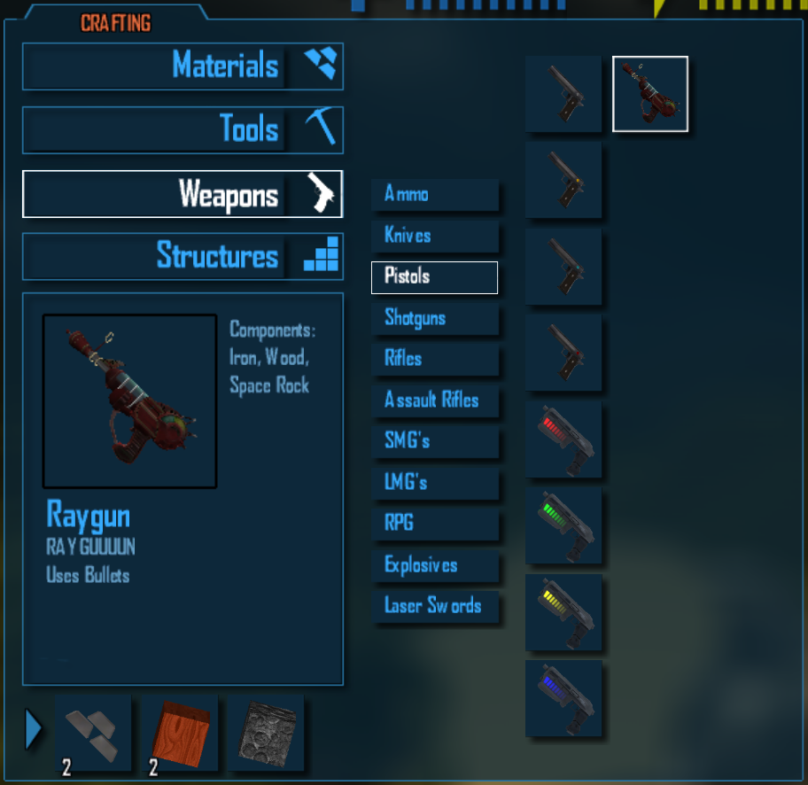

# WeaponAddons

> Turn CastleMiner Z weapons into data-driven content packs.  
> Build custom guns and other weapon-style addons with a `.clag` file, optional custom models, custom icons, custom sounds, optional crafting recipes, and runtime-safe synthetic item IDs.


---

## Overview

**WeaponAddons** is a CastleForge mod that lets you define custom weapons as pack folders instead of hardcoding every weapon into the game itself.

At runtime, the mod:

- scans your weapon pack folders,
- reads a forgiving `.clag` definition file,
- resolves the weapon’s base slot behavior,
- optionally creates a brand-new **synthetic runtime item ID**,
- loads a custom `.xnb` model,
- loads or renders a custom icon,
- injects optional custom crafting recipes,
- applies per-weapon stats and colors,
- routes optional custom shoot/reload audio, and
- keeps the whole system as multiplayer-safe as possible by remapping synthetic IDs back to a vanilla-safe base slot when necessary.

This makes **WeaponAddons** useful in two different ways:

1. **As a player-facing mod** that adds custom weapons and sample content.
2. **As a creator framework** for building your own weapon packs and shipping them without writing a separate compiled mod for every single item.

It also pairs naturally with the included authoring workflow built around **FbxToXnb** and **DNA.SkinnedPipeline**, which are extremely useful when preparing models for use inside packs.

---

## Why this mod stands out

### Data-driven weapon packs
You do not need a separate mod project just to add one new weapon. A pack can be driven from a single `.clag` file plus its assets.

### Runtime-created item IDs
WeaponAddons can clone an existing vanilla item class at runtime and register it under a new numeric ID. That means you can make a weapon behave like a pistol, laser gun, shotgun, or rocket launcher without rewriting the entire underlying class.

### Custom models and icons
Each pack can point to a compiled `.xnb` model, a custom `.png` icon, or even render an icon directly from the 3D model if you do not want to hand-paint one.

### Custom audio without replacing vanilla cues
Shoot and reload sounds can be normal engine cue names or pack-local `.wav` / `.mp3` files.

### Optional crafting recipe injection
A pack can add its own crafting recipe, choose the crafting tab, and even influence where its icon appears in the crafting UI.

### Hot reload support
The config and packs can be reloaded at runtime with a configurable hotkey, which is a huge quality-of-life feature while iterating on balance or assets.

### Creator-friendly toolchain
The included **FbxToXnb** and **DNA.SkinnedPipeline** tools help convert your FBX models into XNA-ready `.xnb` assets for use inside WeaponAddons packs.

---

## What ships with WeaponAddons

WeaponAddons is more than a DLL. The project includes:

- the **WeaponAddons** runtime mod,
- an embedded sample pack named **Raygun**,
- bundled Harmony support,
- bundled `NLayer` support for MP3 decoding,
- pack extraction logic that writes embedded content into `!Mods\WeaponAddons`,
- hot-reload support,
- recipe injection and crafting UI layout support,
- file-backed custom audio routing,
- and a companion asset authoring path via **FbxToXnb** and **DNA.SkinnedPipeline**.

On first launch, the mod can extract embedded content into your mod folder so you have a working example pack to learn from.

---

## Feature highlights


### 1) Custom weapon definitions through `.clag`
Each pack contains a `.clag` file with weapon metadata, balance, visuals, sounds, and optional crafting settings.

### 2) Base behavior inheritance through `SLOT_ID`
The most important design choice in a pack is the base slot it clones.  
That base slot determines the underlying behavior class.

Examples:
- clone a pistol slot if you want pistol-like behavior,
- clone a laser slot if you want laser behavior,
- clone a rocket slot if you want rocket-style behavior.

This is the foundation of the system.

### 3) Synthetic runtime item IDs
When `AS_NEW_ITEM` is enabled, the mod can create a new runtime item ID by cloning the chosen base class and registering it in the game’s internal item class dictionary.

This lets you make a new item **without replacing the original slot**.

### 4) Vanilla-safe network remapping
Synthetic items are not blindly broadcast as unknown IDs.  
WeaponAddons patches pickup, held-item visibility, and fire-message flows so synthetic items remain safer around vanilla expectations.

In practice, that means the local player can still use the custom weapon while peers are shown a compatible base-slot representation where required.

### 5) Custom held-model swapping
After content is loaded, WeaponAddons patches item entity creation and swaps in the pack’s custom model for the matching runtime item ID.

### 6) Custom icons with fallback chain
WeaponAddons uses this priority order:

1. **PNG icon** from the pack  
2. **Rendered model icon** from the pack model  
3. **Vanilla fallback icon** from the base slot

That gives creators a very flexible pipeline.

### 7) Custom file-backed audio
Shoot and reload sounds can be:
- vanilla cue names, or
- pack-relative `.wav` / `.mp3` files

If file-based audio is used, WeaponAddons registers audio tokens internally and reroutes playback through `SoundEffect` / `SoundEffectInstance`.

### 8) Pack-specific crafting recipes
A weapon can inject its own recipe into the cookbook and optionally place itself **after** another recipe or **to the right of** another recipe row in the crafting UI.

### 9) Runtime hot reload
The default reload hotkey is:

```ini
Ctrl+Shift+R
```

That hotkey can be changed in config and lets you reload packs while testing.

---

## Installation

### Requirements

- CastleForge / ModLoader setup
- CastleMiner Z environment compatible with your CastleForge mod stack
- `WeaponAddons.dll` in your `!Mods` folder

### Recommended install layout

The mod DLL itself belongs in the normal mod load folder.

WeaponAddons then uses its own working directory here:

```text
!Mods/
├─ WeaponAddons.dll
└─ WeaponAddons/
   ├─ WeaponAddons.Config.ini
   └─ Packs/
      └─ YourPack/
         ├─ yourpack.clag
         ├─ icon.png
         ├─ models/
         └─ sounds/
```

### Important folder note
The runtime scans:

- `!Mods\WeaponAddons\Packs\...` **if the `Packs` folder exists**
- otherwise it scans `!Mods\WeaponAddons\...`

Because of that, the safest and cleanest structure is:

```text
!Mods\WeaponAddons\Packs\<PackName>\
```

That is the structure I recommend documenting and shipping.

### First launch behavior

On startup, WeaponAddons:

- initializes embedded dependency loading,
- applies Harmony patches,
- loads the config,
- waits for the game’s secondary content load,
- then scans and applies packs.

The included sample **Raygun** pack is embedded in the project and can be extracted into the WeaponAddons working folder.

---

## Quick start

### Create a simple pack

1. Create a folder:

```text
!Mods\WeaponAddons\Packs\MyWeapon\
```

2. Put exactly one `.clag` file at the root of that pack folder.
3. Add your optional assets:
   - `icon.png`
   - `models\yourmodel.xnb`
   - texture `.xnb` files beside the model
   - `sounds\shoot.wav`
   - `sounds\reload.wav`

4. Reference those assets inside the `.clag`.
5. Launch the game or use the reload hotkey.

### Minimal pack tree

```text
!Mods\WeaponAddons\Packs\MyWeapon\
├─ myweapon.clag
├─ icon.png
├─ models\
│  ├─ myweapon.xnb
│  └─ texture_0.xnb
└─ sounds\
   ├─ shoot.wav
   └─ reload.wav
```


---

## Included sample pack: Raygun

The project ships with a real example pack named **Raygun**. It is a great reference because it demonstrates:

- synthetic new item IDs,
- a custom icon,
- model-based icon rendering,
- a custom `.xnb` model,
- custom shoot/reload file-based audio,
- weapon stat overrides,
- tracer color tuning,
- model tint colors,
- and a custom crafting recipe with `RIGHT_OF` placement.

### Example pack tree

```text
WeaponAddons/Packs/Raygun/
├─ raygun.clag
├─ icon.png
├─ models/
│  ├─ raygun.xnb
│  └─ texture_0.xnb
└─ sounds/
   ├─ reload.wav
   └─ shoot.wav
```

<details>
<summary><strong>Show the full included Raygun <code>.clag</code> example</strong></summary>

```ini
Firearm
$NAME:         Raygun
$AUTHOR:       RussDev7
$DESCRIPTION1: RAYGUUUUN
$DESCRIPTION2: Uses Bullets

$AS_NEW_ITEM: true
$ITEM_ID:     204

$SLOT_ID: Pistol
$AMMO_ID: Bullets

$ICON:         icon.png
$ICON_ENABLED: true

$ICON_RENDER_MODEL: true
$ICON_RENDER_SIZE:  64

$ICON_RENDER_YAW_DEG:   -58
$ICON_RENDER_PITCH_DEG: -162
$ICON_RENDER_ROLL_DEG:  41

$ICON_RENDER_OFFSET_X: -0.15
$ICON_RENDER_OFFSET_Y: 0.22
$ICON_RENDER_OFFSET_Z: 0

$ICON_RENDER_ZOOM: 1.0

$MODEL: models\raygun
$SHOOT_SFX:  sounds\shoot.wav
$RELOAD_SFX: sounds\reload.wav

$SHOOT_VOL:    1.0
$SHOOT_PITCH:  0.0
$RELOAD_VOL:   1.0
$RELOAD_PITCH: 0.0

$AUTOMATIC: false

$DAMAGE:             1800
$SELF_DAMAGE:        0.001
$INACCURACY_DEG:     0.01
$BULLETS_PER_SECOND: 8
$RECOIL_DEG:         3

$CLIP_SIZE:         20
$ROUNDS_PER_RELOAD: 20

$SECONDS_TO_RELOAD: 1
$BULLET_LIFETIME:   3
$BULLET_SPEED:      100

$PROJECTILE_TYPE:  Laser
$PROJECTILE_COLOR: 0,255,64
$MODEL_COLOR1:     255,50,50
$MODEL_COLOR2:     30,30,30

$RECIPE_ENABLED:      true
$RECIPE_TYPE:         Pistols
$RECIPE_OUTPUT_COUNT: 1
$RECIPE_INGREDIENTS:  Iron:2, WoodBlock:2, SpaceRockInventory:1

$RECIPE_INSERT_AFTER: Pistol
$RECIPE_INSERT_MODE:  RIGHT_OF
```

</details>

---

## Configuration

WeaponAddons stores its config here:

```text
!Mods\WeaponAddons\WeaponAddons.Config.ini
```

### Default config shape

```ini
# WeaponAddons - Configuration
# Lines starting with ';' or '#' are comments.

[General]
Enabled = true

[Slots]
; Map pack folder name -> InventoryItemIDs (or numeric).
; Raygun = PrecisionLaser

[Hotkeys]
ReloadConfig = Ctrl+Shift+R

[NewItemIds]
; PackKey = ItemId (numeric). Autogenerated/updated by WeaponAddons.
; Raygun = 204
```

### What each section does

### `[General]`
- `Enabled` turns the entire mod pipeline on or off.

### `[Slots]`
Maps a pack folder name to a target slot if the pack does **not** define `SLOT_ID` in its `.clag`.

Example:

```ini
[Slots]
MyWeapon = Pistol
```

### `[Hotkeys]`
Controls the runtime reload hotkey.

Example:

```ini
[Hotkeys]
ReloadConfig = Ctrl+Shift+R
```

The parser is forgiving and accepts formats like:

- `F9`
- `Ctrl+F3`
- `Control Shift F12`
- `Alt+0`
- `Win+R`
- `A`

### `[NewItemIds]`
This section is automatically maintained by WeaponAddons when a pack uses synthetic IDs without a hard-pinned numeric ID.

You generally should not need to manage this section by hand.

### Synthetic ID persistence behavior
If a pack has:

```ini
$AS_NEW_ITEM: true
$ITEM_ID: 0
```

or omits a pinned numeric ID, WeaponAddons will allocate the next free runtime ID and save it under `[NewItemIds]` so reloads stay consistent.

If the requested `ITEM_ID` is already occupied, the mod walks forward until it finds a free ID and logs the reassignment.

---

## How pack scanning works

WeaponAddons scans pack folders and loads the **first `*.clag` file it finds at the top level of that pack folder**.

That means each pack should ideally contain:

- one root-level `.clag`,
- optional root-level icon,
- optional subfolders for models and sounds.

If multiple packs map to the same slot, the runtime uses **last-wins** behavior for that slot mapping.

---

## `.clag` format reference

WeaponAddons uses a forgiving line-based format.

## Parsing rules

- The **first non-empty, non-comment line** is treated as the pack **Type**.
- Later lines are parsed as:

```text
KEY: VALUE
```

- Leading sigils like `$`, `"`, `%`, `#`, `=`, `*` are stripped before key parsing.
- `;` and `//` are treated as comment styles.
- `#` is **not** treated as a comment leader because keys like `#CLIP_SIZE` are intentionally tolerated.
- Floats accept both `0.8` and `0,8`.
- Missing or invalid values fall back safely where possible.

## Supported keys

<details>
<summary><strong>Identity and descriptive fields</strong></summary>

```ini
Firearm
$NAME: My Weapon
$AUTHOR: YourName
$DESCRIPTION1: First line
$DESCRIPTION2: Second line
```

- The first line becomes the pack type, such as `Firearm`.
- `NAME` sets the in-game item name.
- `AUTHOR` is informational and useful for documentation.
- `DESCRIPTION1` and `DESCRIPTION2` are combined into the final description with a newline between them.

</details>

<details>
<summary><strong>Base behavior and item identity</strong></summary>

```ini
$SLOT_ID: Pistol
$AS_NEW_ITEM: true
$NEW_ITEM: true
$ITEM_ID: 204
$AMMO_ID: Bullets
$AMMO_NAME: Bullets
```

- `SLOT_ID` is the most important field. It selects the vanilla class to inherit.
- `AS_NEW_ITEM` and `NEW_ITEM` both enable synthetic runtime item creation.
- `ITEM_ID` is the desired numeric runtime ID.
- `AMMO_ID` sets the ammo type by enum name or numeric ID.
- `AMMO_NAME` is accepted as an alias for `AMMO_ID`.

</details>

<details>
<summary><strong>Icon fields</strong></summary>

```ini
$ICON: icon.png
$ICON_PNG: icon.png
$ICON_ENABLED: true

$ICON_RENDER_MODEL: true
$ICON_FROM_MODEL: true
$ICON_RENDER_SIZE: 64

$ICON_RENDER_YAW_DEG: -68.75
$ICON_RENDER_PITCH_DEG: -20
$ICON_RENDER_ROLL_DEG: 0

$ICON_RENDER_OFFSET_X: 0
$ICON_RENDER_OFFSET_Y: 0
$ICON_RENDER_OFFSET_Z: 0

$ICON_RENDER_ZOOM: 1.0
```

- `ICON` and `ICON_PNG` are supported for a PNG icon path.
- `ICON_ENABLED` defaults on if an icon path is provided.
- `ICON_RENDER_MODEL` and `ICON_FROM_MODEL` let the mod render an icon from the model if no PNG icon is used.
- `ICON_RENDER_SIZE` is clamped to **16..256**.
- `ICON_RENDER_ZOOM` is clamped to **0.25..4.0**.
- Yaw, pitch, roll, and offsets let you frame the model nicely inside the icon.

</details>

<details>
<summary><strong>Model and audio fields</strong></summary>

```ini
$MODEL: models\myweapon
$SHOOT_SFX: sounds\shoot.wav
$RELOAD_SFX: sounds\reload.wav
$SHOOT_VOL: 1.0
$SHOOT_PITCH: 0.0
$RELOAD_VOL: 1.0
$RELOAD_PITCH: 0.0
```

- `MODEL` is a path relative to the pack root and should omit the `.xnb` extension.
- Shoot and reload SFX can be:
  - a vanilla cue name, or
  - a pack-relative file path ending in `.wav` or `.mp3`
- File-based sound volume is clamped to **0..1**
- File-based sound pitch is clamped to **-1..1**

</details>

<details>
<summary><strong>Weapon behavior and balance fields</strong></summary>

```ini
$AUTOMATIC: false
$DAMAGE: 100
$SELF_DAMAGE: 0
$INACCURACY_DEG: 0.25
$INACCURACY: 0.25
$BULLETS_PER_SECOND: 8
$RECOIL_DEG: 2
$RECOIL: 2

$CLIP_SIZE: 20
$ROUNDS_PER_RELOAD: 20
$SECONDS_TO_RELOAD: 1.2
$BULLET_LIFETIME: 3
$BULLET_SPEED: 100
```

These values are applied onto the cloned or targeted `GunInventoryItemClass` where supported.

Aliases:
- `INACCURACY` can be used instead of `INACCURACY_DEG`
- `RECOIL` can be used instead of `RECOIL_DEG`

</details>

<details>
<summary><strong>Visual tuning fields</strong></summary>

```ini
$PROJECTILE_TYPE: Laser
$PROJECTILE_COLOR: 0,255,64
$MODEL_COLOR1: 255,50,50
$MODEL_COLOR2: 30,30,30
```

- `PROJECTILE_COLOR` is parsed from `R,G,B` and applied to tracer color.
- `MODEL_COLOR1` and `MODEL_COLOR2` are best-effort tint values for supported item classes.
- `PROJECTILE_TYPE` is parsed and stored, but in the current runtime the most clearly applied projectile-facing visual field is the tracer color. Treat `PROJECTILE_TYPE` as runtime-dependent / forward-facing rather than guaranteed in every current behavior path.

</details>

<details>
<summary><strong>Crafting recipe fields</strong></summary>

```ini
$RECIPE_ENABLED: true
$CRAFT_ENABLED: true

$RECIPE_TYPE: Pistols
$RECIPE_TAB: Pistols

$RECIPE_OUTPUT_COUNT: 1
$RECIPE_INGREDIENTS: Iron:2, WoodBlock:2
$RECIPE_ITEMS: Iron:2, WoodBlock:2

$RECIPE_INSERT_AFTER: Pistol
$RECIPE_AFTER: Pistol

$RECIPE_INSERT_MODE: AFTER
$RECIPE_INSERT_MODE: RIGHT_OF
```

Supported behavior:
- `RECIPE_ENABLED` or `CRAFT_ENABLED` turns the recipe on.
- `RECIPE_TYPE` or `RECIPE_TAB` selects the crafting tab.
- `RECIPE_OUTPUT_COUNT` sets output stack size.
- `RECIPE_INGREDIENTS` or `RECIPE_ITEMS` defines ingredients.
- `RECIPE_INSERT_AFTER` or `RECIPE_AFTER` chooses an anchor result item in the same tab.
- `RECIPE_INSERT_MODE` supports:
  - `AFTER`
  - `RIGHT_OF`

If the recipe tab is missing or invalid, the runtime falls back to **Advanced**.

</details>

---

## Crafting recipe syntax

Ingredient parsing is intentionally forgiving.

All of these styles are accepted:

```ini
$RECIPE_INGREDIENTS: Iron:2, WoodBlock:2
$RECIPE_INGREDIENTS: Iron=2; WoodBlock=2
$RECIPE_INGREDIENTS: Iron*2
$RECIPE_INGREDIENTS: Iron x 2
```

Separators supported:
- comma
- semicolon
- newline

Item identifiers supported:
- numeric ID
- enum name
- normalized name lookup that ignores spaces and underscores

That means names like these are easier to match:
- `DiamondPistol`
- `Diamond_Pistol`
- `Diamond Pistol`

## `RIGHT_OF` recipe placement

WeaponAddons includes a crafting UI layout patch because vanilla `Tier2Item` is not a true grid.

When you use:

```ini
$RECIPE_INSERT_AFTER: Pistol
$RECIPE_INSERT_MODE: RIGHT_OF
```

WeaponAddons:
- inserts the recipe after the anchor in the cookbook,
- and then applies a UI-only rule that places the icon to the right of the anchor row.

That placement logic only affects the crafting interface layout.  
It does **not** change the actual crafting requirements.



---

## Icon system

WeaponAddons has a surprisingly polished icon pipeline.

### Priority order

1. **PNG icon**
2. **Rendered model icon**
3. **Vanilla base-slot icon**

### PNG icon path
PNG icons are loaded directly from disk using `Texture2D.FromStream`, so they do not need to go through the XNA content pipeline.

### Model-rendered icons
If no PNG icon is loaded and `ICON_RENDER_MODEL` is enabled, WeaponAddons can render a snapshot of the model into a small `RenderTarget2D`.

That rendered icon supports:
- size,
- yaw,
- pitch,
- roll,
- XYZ offsets,
- zoom.

This is especially useful when:
- you want a clean icon quickly,
- your weapon model already looks good from a specific angle,
- or you want your README screenshots and in-game icon to stay visually consistent.

---

## Audio system

WeaponAddons supports two kinds of sound values in `.clag`:

### Vanilla cue strings
Example:

```ini
$SHOOT_SFX: LaserGun4
```

In that case, the game continues through the normal cue-based route.

### File-backed sound paths
Example:

```ini
$SHOOT_SFX: sounds\shoot.wav
$RELOAD_SFX: sounds\reload.mp3
```

In that case, WeaponAddons:
- resolves the path relative to the pack root,
- safely blocks path traversal outside the pack folder,
- decodes the file,
- caches the `SoundEffect`,
- injects an internal token into the weapon class,
- intercepts `SoundManager.PlayInstance(...)`,
- and plays the file-backed sound instead.

### Supported file formats
- `.wav`
- `.mp3`

### Notes
- **16-bit PCM WAV** is the safest recommendation.
- MP3 support is backed by **NLayer**.
- Volume and pitch tuning are stored per item.
- Finished sound instances are cleaned up during `SoundManager.Update()`.

---

## Multiplayer and runtime safety

One of the smartest parts of this mod is that synthetic runtime IDs are not treated as if every client naturally understands them.

WeaponAddons patches several network and local-visual flows to keep synthetic items safer around vanilla assumptions.

### What that means in practice

### Pickups
Synthetic pickup traffic is filtered so unknown runtime IDs are not casually broadcast like normal vanilla items.

### Carried item visibility
When needed, the mod remaps the held item to the base `SLOT_ID` for peer visibility so other clients see a valid, compatible item.

### Fire messages
Gunshot, shotgun, and rocket messages are remapped so the network-facing ID stays base-safe while the local player can still get the expected custom visuals and behavior.

### Local feel remains custom
The local player can still see:
- the synthetic/custom weapon,
- the custom model,
- the local tracer or projectile feel,
- and the custom sounds.

## Important expectation
If you build a custom weapon on top of `Pistol`, peers may effectively see a pistol-compatible representation in places where the network path must stay vanilla-safe.

That is a feature, not a bug. It is part of how WeaponAddons avoids blasting unknown synthetic item IDs directly through systems that expect vanilla values.

---

## How runtime application works

For each discovered pack, WeaponAddons follows a pipeline like this:

1. Load config.
2. Scan pack folders.
3. Parse the pack’s `.clag`.
4. Resolve `SLOT_ID` from the pack or config fallback.
5. If `AS_NEW_ITEM` is enabled:
   - choose the requested ID or allocate one,
   - clone the base item class,
   - register the cloned class under the runtime ID.
6. Inject or update the crafting recipe.
7. Load the pack model if specified.
8. Load the PNG icon if specified.
9. If no PNG icon was loaded, optionally render an icon from the model.
10. Apply runtime stat overrides to the final item class.
11. Register custom shoot/reload audio routing if file-backed sounds were provided.
12. After content load, patch entity creation so held/world models can be swapped correctly.

That is why WeaponAddons feels like both a content system and a runtime framework.

---

## FbxToXnb and DNA.SkinnedPipeline

WeaponAddons becomes much more powerful when paired with the two attached tools:

- **FbxToXnb**
- **DNA.SkinnedPipeline**

These are extremely useful when converting source FBX assets into `.xnb` files that WeaponAddons can load from pack folders.


## FbxToXnb at a glance

FbxToXnb is a small console converter that builds one or more `.fbx` files into XNA `.xnb` output using the XNA Game Studio 4.0 content pipeline.

### Core benefits
- drag-and-drop friendly
- batch conversion friendly
- isolates each FBX into its own output folder
- stages texture files into a temp build root
- supports custom pipeline assemblies and custom processors
- can prompt-install missing XNA pipeline references through an embedded MSI helper

## Output layout

Each source FBX is built into its own folder named after the asset stem.

Example:

```text
Input:
C:\Models\raygun.fbx

Output:
C:\Models\raygun\
├─ raygun.xnb
└─ texture_0.xnb
```

That per-asset foldering is important because many models end up producing generically named dependencies like `texture.xnb`.

## Texture staging behavior

The attached FbxToXnb implementation is especially useful because it stages **candidate texture files recursively** from the FBX source directory into a temp build folder while preserving relative paths.

That means it supports:

- textures beside the FBX,
- textures in subfolders,
- multi-texture FBXs,
- exporters that preserve relative texture paths.

It also preserves a legacy compatibility rule where `<asset>.png` can be exposed as `texture.png` in the temp root.

### Why that matters
This avoids the old problem where a model only worked if every texture sat in one hardcoded `textures\` folder next to the FBX.

## Command-line examples

```bat
FbxToXnb.exe "C:\Models\raygun.fbx"
```

```bat
FbxToXnb.exe --pipelineDir "C:\YourPipelineBin" --processor SkinedModelProcessor "C:\Models\ALIEN.fbx"
```

## Supported flags

```text
--pipeline <dllOrDir>
--pipelineDir <dir>
--processor <name>
--help
```

## Environment variable support

```text
CMZ_PIPELINE=path1;path2;...
```

That lets you predefine custom pipeline DLL or folder paths so you do not have to pass them every time.

## Drag-and-drop helpers

The attached packages include drag-and-drop batch helpers:

### Normal / rigid model helper
```text
FbxToXnb_Drop_Normal.bat
```

This runs:

```bat
FbxToXnb.exe "<yourfile>.fbx"
```

### Skinned model helper
```text
FbxToXnb_Drop_Skinned.bat
```

This runs with:

- `--processor SkinedModelProcessor`
- `--pipeline <path to DNA.SkinnedPipeline.dll>`

### Exact processor spelling matters
Use the shipped processor name exactly as provided:

```text
SkinedModelProcessor
```

That single-`n` spelling is the actual processor name the tool expects.

---

## DNA.SkinnedPipeline

`DNA.SkinnedPipeline` supplies the custom content pipeline processor used for skinned FBX content.

### What it does
The custom processor:

- runs the stock XNA `ModelProcessor`,
- preserves skinning-related model data,
- builds a DNA skeleton from processed bones,
- computes inverse bind pose matrices,
- stores the final skinning metadata in `Model.Tag`.

### Current limitation
The current processor **does not extract animation clips yet**.  
It attaches an **empty clip dictionary**.

That means it is useful for skinned-model metadata and skeleton-related runtime expectations, but if a specific workflow needs full animation clip extraction, that would need to be extended later.

### Deployment path in the project
The project is set up to deploy the release output into a tool-oriented mod folder structure under the `_FbxToXnb` pipeline area, which makes it practical to ship alongside the converter.

---

## Suggested authoring workflow for WeaponAddons packs

1. Create or export your weapon model as `.fbx`.
2. Put the FBX and its textures together in a clean source folder.
3. Run **FbxToXnb** on the FBX.
4. Copy the generated `.xnb` output into your pack’s `models\` folder.
5. Point your `.clag` `MODEL` key at that asset path without the `.xnb` extension.
6. Add an icon PNG or enable model-rendered icon generation.
7. Add custom audio files if desired.
8. Launch the game and use the reload hotkey while iterating.

## Example pack after conversion

```text
!Mods\WeaponAddons\Packs\PlasmaRifle\
├─ plasmarifle.clag
├─ icon.png
├─ models\
│  ├─ plasmarifle.xnb
│  ├─ texture_0.xnb
│  └─ texture_1.xnb
└─ sounds\
   ├─ shoot.wav
   └─ reload.wav
```

---

## Best practices for pack authors

### Choose the right `SLOT_ID`
The cloned slot determines the class behavior.  
Do not expect `PROJECTILE_TYPE` alone to turn a pistol-derived item into a laser gun if the underlying class still behaves like a pistol.

### Standardize on the `Packs` folder
Use:

```text
!Mods\WeaponAddons\Packs\<PackName>\
```

This avoids scan-root ambiguity and keeps your content tidy.

### Keep one `.clag` per pack root
The loader looks for the first matching `*.clag` in the pack root folder. Do not bury it deep inside subfolders.

### Use WAV when possible
MP3 is supported, but 16-bit PCM WAV is usually the simplest, safest path.

### Use explicit crafting anchors
If you want a predictable crafting layout, set both:
- `RECIPE_INSERT_AFTER`
- and optionally `RECIPE_INSERT_MODE`

### Pin important synthetic IDs only when needed
If you do not care about a specific numeric ID, let the mod allocate one and persist it in `[NewItemIds]`.

### Keep pack paths relative and clean
All asset paths are relative to the pack root.  
Do not rely on absolute paths.

---

## Known behavior and important notes

### No pack commands are required
WeaponAddons is primarily data-driven and hotkey-driven. It does not present itself as a slash-command-heavy mod.

### `PROJECTILE_TYPE` is not the main behavior switch
The real behavior source is the cloned base item class from `SLOT_ID`.  
Treat `PROJECTILE_TYPE` as descriptive/runtime-dependent rather than the fundamental class selector.

### Some fields are best-effort across builds
The mod uses reflection in a few places to stay tolerant across different builds and private field layouts. Unsupported targets are skipped instead of crashing gameplay.

### Recipe UI placement is UI-only
`RIGHT_OF` helps icon layout in the crafting screen. It does not alter actual crafting logic.

### Multiple packs targeting the same slot can override each other
The slot mapping uses a practical last-wins model.

### Synthetic peers may see the base slot representation
That is part of the vanilla-safe networking strategy.

---

## Troubleshooting

### Pack is not loading
Check:

- the mod is enabled in `WeaponAddons.Config.ini`
- the pack is under `!Mods\WeaponAddons\Packs\`
- the pack has a valid root-level `.clag`
- `SLOT_ID` is valid or provided through `[Slots]`

### Custom model is not showing
Check:

- the `MODEL` path is correct
- the `.xnb` exists at the expected location
- any texture `.xnb` dependencies are beside it as expected

### PNG icon is not showing
Check:

- `ICON_ENABLED = true`
- the relative icon path is correct
- the PNG actually exists in the pack

If the PNG fails, model-rendered icon or vanilla fallback behavior may still appear.

### Synthetic item ID changed unexpectedly
If a requested `ITEM_ID` collides with an existing registered ID, the mod walks forward to a free value and logs the reassignment.

### Custom sound did not play
Check:

- the path is pack-relative
- the file exists
- the file format is valid
- WAV is PCM 16-bit when possible
- the cue/path was typed correctly

### Skinned model build fails
Check:

- the processor name is exactly `SkinedModelProcessor`
- the pipeline DLL or folder is passed through `--pipeline` / `--pipelineDir`
- XNA Game Studio 4.0 content pipeline references are installed or available

---

## Final thoughts

WeaponAddons is not just “a mod that changes a gun.”  
It is a flexible runtime content system for CastleMiner Z that lets creators package weapons as structured data packs with models, icons, sounds, recipes, and runtime item identity.

For a GitHub audience, that is a strong pitch:

- approachable for players,
- practical for modders,
- and expandable for future content pipelines.