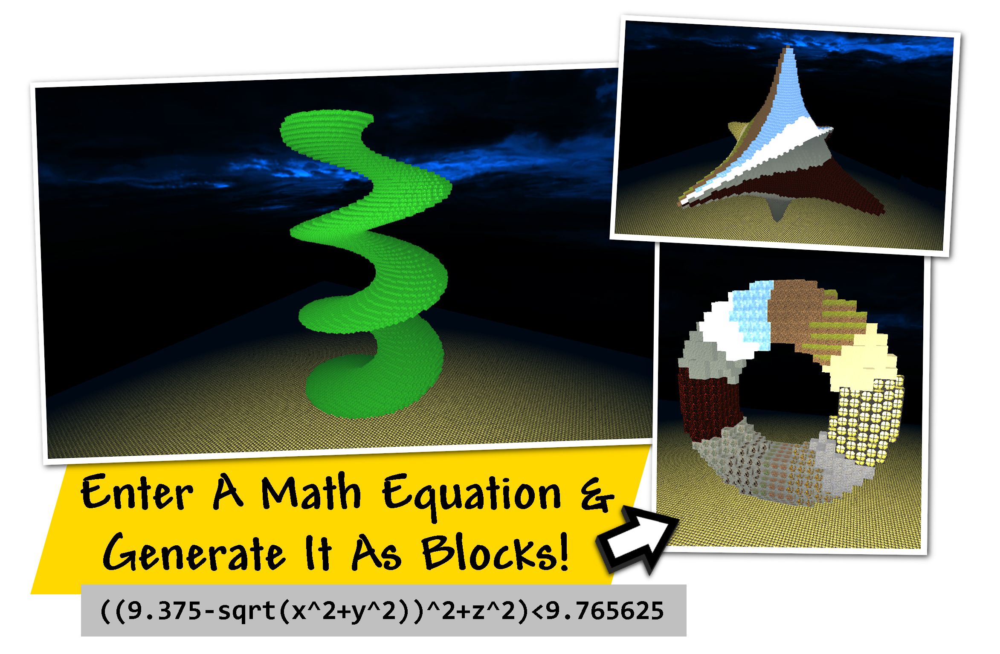
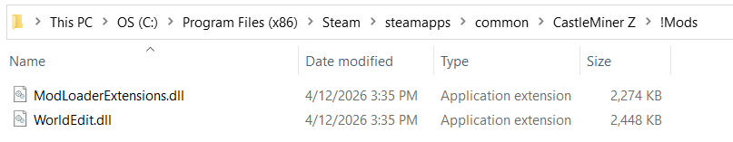
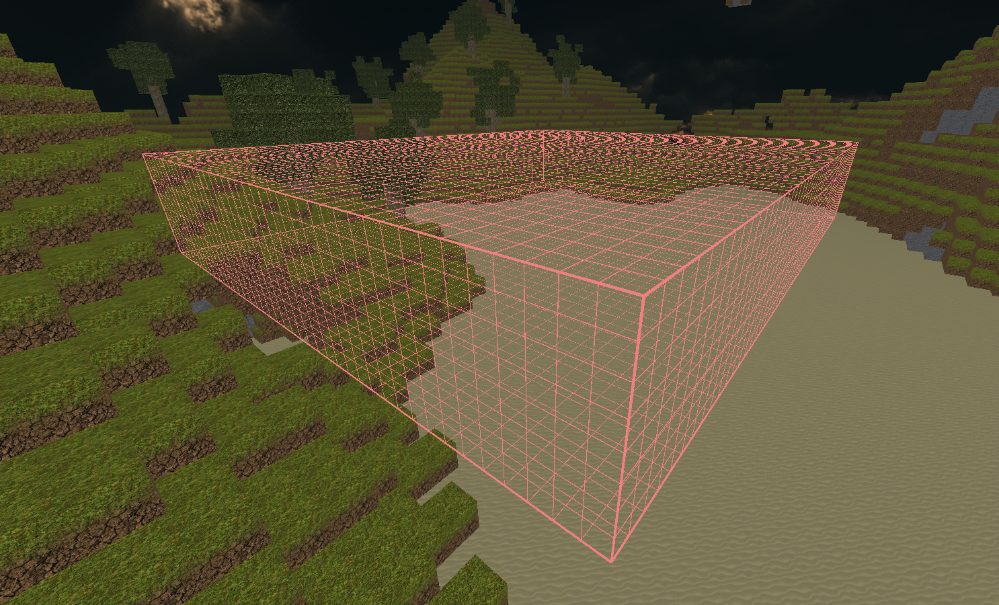
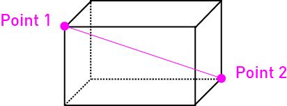

# WorldEdit

<div align="center">
    
</div>
<div align="center">
    <b>A Map Editor... that runs in-game!</b> With selections, schematics, copy and paste, brushes, and scripting. This is a lightweight, blazing fast, csharp-based interpretation of the classic <a href="https://modrinth.com/plugin/worldedit">World Edit</a> for Minecraft.
</div>





WorldEdit brings powerful in-game building, terraforming, clipboard, schematic, chunk, tool, and brush workflows directly into CastleMiner Z. This CMZ-integrated version is based on your standalone **WorldEdit-CSharp** project, but is adapted into a full CastleForge mod with runtime config, Harmony patches, async block placement, selection tooling, undo/redo history, schematic import/export, chunk editing, and optional addon integration.

It is designed to let you make fast world changes **without leaving the game**.

---

## Table of contents

- [What this mod does](#what-this-mod-does)
- [Why this version stands out](#why-this-version-stands-out)
- [Requirements](#requirements)
- [Installation](#installation)
- [First launch and generated files](#first-launch-and-generated-files)
- [Configuration](#configuration)
- [Quick start](#quick-start)
- [How editing works](#how-editing-works)
- [Wands, tools, and brushes](#wands-tools-and-brushes)
- [Performance, async placement, and undo history](#performance-async-placement-and-undo-history)
- [Optional addon integration](#optional-addon-integration)
- [Full command reference](#full-command-reference)
- [Troubleshooting](#troubleshooting)
- [Credits](#credits)

---

## What this mod does

WorldEdit is a high-speed in-game world editing mod that lets you:

- select cuboid regions with commands or a wand
- count, inspect, resize, expand, contract, trim, and shift selections
- fill, replace, break, move, stack, smooth, hollow, wrap, and regenerate terrain
- generate shapes such as cubes, spheres, cylinders, cones, pyramids, rings, diamonds, floors, prisms, and formula-based structures
- use clipboard workflows like copy, cut, paste, rotate, flip, clear clipboard, and matrix placement
- save and load clipboard data as `.schem` files through file dialogs
- perform chunk-based copy, cut, paste, and deletion operations
- bind actions to held items using **tool mode**
- sculpt terrain interactively using **brush mode**
- use an always-available **navigation wand** for fast movement
- toggle undo snapshot recording for extremely large edits
- tune performance through an async block placement pipeline
- optionally hook into **WorldEditCUI**-style selection rendering with `/cui`

This implementation also includes a handful of CMZ-specific quality-of-life and interaction safety behaviors so WorldEdit tools are easier to use in live gameplay.

---

## Why this version stands out

### Built for CastleMiner Z
This is not a generic port dropped into CMZ. The mod is wired into CastleMiner Z systems for:

- block placement and block reads
- player teleport/movement
- held-item interaction
- chunk-aware operations
- live in-session editing
- Harmony-based behavior patching
- optional client-side selection visibility integration

### Async large-edit workflow
Large edits enqueue block changes through an **async frame-budgeted placement queue** instead of trying to hammer the game all at once. That helps reduce stalls during large operations and gives you a tunable performance knob through config.

### Safer tool behavior
When WorldEdit wand/tool modes are active, the mod includes protections to reduce accidental durability loss and unintended normal gameplay interactions on tool items.

### Clipboard + schematic + chunk workflows
The mod supports both traditional selection-based editing and larger structural workflows:

- region clipboard
- clipboard transforms
- `.schem` save/load
- chunk clipboard
- chunk delete
- patterned matrix placement from clipboard data

### CMZ-integrated extras
This build also includes several useful utility/showcase commands that make testing and presenting edits easier, such as:

- `/fullbright`
- `/toggleui`
- `/teleport`
- `/time`
- `/seed`
- `/brightness`
- `/cc`

---

## Requirements

- **CastleForge ModLoader**
- **CastleForge ModLoaderExtensions**
- CastleMiner Z with a working CastleForge mod setup
- A loaded game/world session before using live edit commands

**Target framework in source:** `.NET Framework 4.8.1`

> WorldEdit is intended to run as a CastleForge mod, not as the old standalone wiki/decompiler setup.

---

## Installation

### For players
1. Install **ModLoader** and **ModLoaderExtensions** first.
2. Add the **WorldEdit** mod release to your CastleForge mods setup.
3. Launch the game once.
4. Enter a world/session.
5. Run `/help` to confirm the command list is available.
6. Optionally open the generated config file and tune wand items, undo recording, or async block placement settings.



> **Image suggestion:** Show the CastleForge folder tree with `Mods/WorldEdit/README.md`, plus the runtime `!Mods/WorldEdit` folder that appears after launch.

---

## First launch and generated files

On first launch, WorldEdit will create and/or use content under:

```text
!Mods/WorldEdit/
```

The most important runtime file is:

```text
!Mods/WorldEdit/WorldEdit.Config.ini
```

Depending on packaging and embedded resource extraction, the mod may also populate support files under the same folder.

### What gets persisted
WorldEdit persists its core runtime preferences through the config file, including:

- selection wand item
- navigation wand item
- previous nav wand item for restore toggling
- undo recording enabled/disabled
- async block placer enabled state
- async block placer frame budget
- async placement telemetry
- config reload hotkey

---

## Configuration

WorldEdit generates this config file automatically:

```ini
# WorldEdit - Configuration
# Lines starting with ';' or '#' are comments.

[Wands]
; If true, enabling /wand will add 1x WandItem to your inventory.
GiveWandItemOnEnable = true
; The selection wand item (used when /wand is enabled): Left click sets pos1, right click sets pos2.
WandItem             = CopperAxe
; Navigation wand (always-on): Left click behaves like /jumpto, right click behaves like /thru.
NavWandItem          = Compass
; Stores the last non-none nav-wand item for /navwand toggling (empty -> use default).
NavWandItemPrevious  = 

[Undo]
; If true, record undo/redo snapshots (normal editing behavior).
; If false, skips recording (useful for huge terrain ops; edits still happen).
UndoRecordingEnabled = true

[AsyncBlockPlacer]
; Toggle the async world-edit pipeline (AlterBlockMessage per frame).
Enabled           = true
; Write a light telemetry line occasionally (frame drain, pending, budget).
ShowTelemetry     = false
; Per-frame cap on blocks sent. Higher = faster, but may hitch.
MaxBlocksPerFrame = 2000

[Hotkeys]
; Reload this config while in-game:
ReloadConfig      = Ctrl+Shift+R
```

### Config notes

#### `[Wands]`
- `GiveWandItemOnEnable`  
  If enabled, turning on `/wand` will also grant the configured wand item.
- `WandItem`  
  The item used for normal selection mode.
- `NavWandItem`  
  The always-on navigation wand item. Default is `Compass`.
- `NavWandItemPrevious`  
  Used by `/navwand` so the mod can remember the last non-disabled nav wand item.

#### `[Undo]`
- `UndoRecordingEnabled`  
  When disabled, edits still happen, but undo/redo snapshots are not recorded. This is extremely useful for huge terrain changes where history capture is the expensive part.

#### `[AsyncBlockPlacer]`
- `Enabled`  
  Enables the frame-budgeted block placement pipeline.
- `ShowTelemetry`  
  Prints light placement telemetry for debugging/tuning.
- `MaxBlocksPerFrame`  
  Higher values complete edits faster, but can add more hitching.

#### `[Hotkeys]`
- `ReloadConfig`  
  Reload the config at runtime without relaunching the game. Default: `Ctrl+Shift+R`.

---

## Quick start

This section is for people who want to install WorldEdit and start doing useful things right away.

# Want to see selection lines?
To see lines showing your selection, you can:

* Feel free to check out the plug-n-play [WorldEdit CUI Addon](CastleForge/Mods/WorldEditCUI/README.md) class that adds client-side outline visuals to your selection.
* This addon be be toggled on or off in-game via the new `/cui [on/off]` command.



# Getting Around

First, let’s figure out how you can get around quickly.

1. Look at a block not too far away and type `/jump`
2. Stand under a tree and type `/ascend`
3. While on top of the tree, type `/descend`
4. Stand behind a tree trunk, look straight ahead, make sure there’s room on the other side, and type `/thru`

## Making Selections

A cuboid is a 3D rectangular area. In WorldEdit, you define a selection by marking two opposite corners of the cuboid.



You can mark the two points using different methods:

1. **Using a selection tool** – Left-click one block and right-click another while holding a selection tool. (Use `/wand` to get one.)
2. **Using Position Commands** – Stand in a spot and type `/pos 1` or `/pos 2` to set selection points.

**Try It!** Select a 15×15×15 area and move to the next step.

---

## Doing things with the selection

> **Tip:** Most WorldEdit block arguments accept readable block names, so commands like `/set dirt`, `/replace sand glassstrong`, and `/walls ironwall` work without needing numeric block IDs.

1. Set the entire thing to bedrock: `/set bedrock`
2. Set the entire thing to stone: `/set stone`
3. Set the selection to 50% sand, 50% glass: `/set sand,glassstrong`
4. Replace the sand with dirt: `/replace sand dirt`
5. Clear the area: `/set 0`
6. Generate an interesting shape: `/g 43 data=((32+15/2/pi*atan2(x,y))%16)+1; ((9.375-sqrt(x^2+y^2))^2+z^2)<9.765625`
7. Look in a cardinal direction (not diagonal) and repeat your selection: `/stack 4`

Let’s undo your changes!
* Undo 7 times: `/undo 7`

---

## Playing with brushes

> **Tip:** Brush commands support both readable block names and numeric block IDs. For example, `rock` and `6` both work, so use whichever is faster for you.

1. Turn on a stone brush of radius 5: `/brush on 6 5`
2. Aim at ground not near you and right click to place large stone spheres.
3. Make it so the brush only affects clicked blocks: `/brush replace true`
4. Instead of placing stone, let’s place wall blocks: `/brush block 22,23,24,25`
5. Right click more areas.
6. Disable the brush: `/brush off`

---

## Continuing on

Once you are comfortable with selections, fills, replaces, and brushes, the next step is exploring:

* shape generation
* stack and move commands
* masks and filters
* schematics
* navigation tools
* advanced block patterns
* large-scale terrain editing workflows

The rest of this README covers the command system in more detail.

---

## Block names and IDs

> **Tip:** Most WorldEdit commands support both readable block names and numeric block IDs. In most cases, block names are easier to read and are recommended for normal use.

### CastleMinerZ Block IDs

<details>
  <summary><strong>Show block IDs</strong></summary>

  ```text
  0  = Empty
  1  = Dirt
  2  = Grass
  3  = Sand
  4  = Lantern
  5  = FixedLantern
  6  = Rock
  7  = GoldOre
  8  = IronOre
  9  = CopperOre
  10 = CoalOre
  11 = DiamondOre
  12 = SurfaceLava
  13 = DeepLava
  14 = Bedrock
  15 = Snow
  16 = Ice
  17 = Log
  18 = Leaves
  19 = Wood
  20 = BloodStone
  21 = SpaceRock
  22 = IronWall
  23 = CopperWall
  24 = GoldenWall
  25 = DiamondWall
  26 = Torch
  27 = TorchPOSX
  28 = TorchNEGZ
  29 = TorchNEGX
  30 = TorchPOSZ
  31 = TorchPOSY
  32 = TorchNEGY
  33 = Crate
  34 = NormalLowerDoorClosedZ
  35 = NormalLowerDoorClosedX
  36 = NormalLowerDoor
  37 = NormalUpperDoorClosed
  38 = NormalLowerDoorOpenZ
  39 = NormalLowerDoorOpenX
  40 = NormalUpperDoorOpen
  41 = TNT
  42 = C4
  43 = Slime
  44 = SpaceRockInventory
  45 = GlassBasic
  46 = GlassIron
  47 = GlassStrong
  48 = GlassMystery
  49 = CrateStone
  50 = CrateCopper
  51 = CrateIron
  52 = CrateGold
  53 = CrateDiamond
  54 = CrateBloodstone
  55 = CrateSafe
  56 = SpawnPointBasic
  57 = SpawnPointBuilder
  58 = SpawnPointCombat
  59 = SpawnPointExplorer
  60 = StrongLowerDoorClosedZ
  61 = StrongLowerDoorClosedX
  62 = StrongLowerDoor
  63 = StrongUpperDoorClosed
  64 = StrongLowerDoorOpenZ
  65 = StrongLowerDoorOpenX
  66 = StrongUpperDoorOpen
  67 = LanternFancy
  68 = TurretBlock
  69 = LootBlock
  70 = LuckyLootBlock
  71 = BombBlock
  72 = EnemySpawnOn
  73 = EnemySpawnOff
  74 = EnemySpawnRareOn
  75 = EnemySpawnRareOff
  76 = EnemySpawnAltar
  77 = TeleportStation
  78 = CraftingStation
  79 = HellForge
  80 = AlienSpawnOn
  81 = AlienSpawnOff
  82 = HellSpawnOn
  83 = HellSpawnOff
  84 = BossSpawnOn
  85 = BossSpawnOff
  86 = EnemySpawnDim
  87 = EnemySpawnRareDim
  88 = AlienSpawnDim
  89 = HellSpawnDim
  90 = BossSpawnDim
  91 = AlienHordeOn
  92 = AlienHordeOff
  93 = AlienHordeDim
  94 = NumberOfBlocks
  ```
  
</details>

---

## How editing works

### Selection model
WorldEdit primarily works with a **cuboid selection** defined by two corners:

- `pos1`
- `pos2`


Once both corners are set, region commands can use that cuboid as the working area.

### Clipboard model
`/copy` and `/cut` capture the selected region into a clipboard.  
That clipboard can then be:

- pasted
- rotated
- flipped
- cleared
- saved as a schematic
- repeated with `/matrix`


### Chunk model
For larger structural operations, WorldEdit also supports chunk-based workflows:

- `/copychunk`
- `/cutchunk`
- `/pastechunk`
- `/delchunk`


### Undo/redo model
WorldEdit captures before/after snapshot data for many edit commands so you can:

```text
/undo
/redo
```


For especially large edits, you can temporarily disable undo snapshot recording:

```text
/undorecord off
```

### Schematic model
The schematic workflow uses Windows file dialogs:

- `/schematic save`
- `/schematic load`

<p align="center">
  
  
</p>

That makes it user-friendly for players who want quick export/import without memorizing file paths.

### Crate/container awareness
The mod contains clipboard sidecar logic for container data so copied/pasted structures can preserve more than just raw block IDs where supported.

---

## Wands, tools, and brushes

### Selection wand
The normal WorldEdit wand is the fast way to set region corners.

- **Left click** = set `pos1`
- **Right click** = set `pos2`

### Navigation wand
The nav wand is separate from normal region selection and is designed for movement.

By default:

- configured item: `Compass`
- **Left click** = `/jumpto`
- **Right click** = `/thru`

The nav wand is persistent and configurable through `/navwand` and the config file.


### Tool mode
Tool mode lets you bind a command to the item in your hand, then execute that command by clicking with that item.

Example idea:

```text
/tool on /set glassstrong
```

That turns the held item into a quick action trigger for a WorldEdit command.

### Brush mode
Brush mode turns the held item into an interactive terrain-shaping tool.

Brush mode supports configurable:

- block pattern
- shape
- size
- height
- hollow mode
- replace-only mode
- rapid mode

Supported brush shapes in the current implementation include:

- `floor`
- `cube`
- `prism`
- `sphere`
- `ring`
- `pyramid`
- `cone`
- `cylinder`
- `diamond`
- `tree`
- `snow`
- `schem`
- `floodfill`


### Interaction safety patches
When WorldEdit wand/tool modes are active, the mod includes protections to make those items safer to use by reducing accidental normal-item behavior, such as unwanted durability loss or unintended interaction flow.

---

## Performance, async placement, and undo history

One of the most important CMZ-specific upgrades in this mod is the **async block placement pipeline**.

Instead of forcing every large edit through one giant synchronous burst, WorldEdit can queue block placements and drain them over frames using a configurable budget.


> This demonstration is intentionally slowed down so the async block placement effect is easier to observe.

### Why that matters
Large edits such as:

- massive `/set`
- big `/replace`
- large copy/paste
- big generators
- chunk deletion or chunk paste

can otherwise feel rough if everything is applied at once.

### Tuning tips

#### Big edit is hitching?
Lower:

```ini
MaxBlocksPerFrame
```

#### Edit feels too slow?
Raise:

```ini
MaxBlocksPerFrame
```

#### Need debug feedback while tuning?
Set:

```ini
ShowTelemetry = true
```

#### Need max speed and do not care about history?
Use:

```text
/undorecord off
```

Then turn it back on afterward:

```text
/undorecord on
```

### Practical advice
Use this order when doing very large edits:

1. inspect with `/size`, `/count`, or `/distr`
2. disable undo recording if appropriate
3. run the edit
4. wait for the edit to finish visually
5. re-enable undo recording

---

## Optional addon integration

This README is intentionally focused on the **base WorldEdit mod only**, but the current WorldEdit implementation already includes hooks for addon behavior.

### WorldEditCUI
The mod exposes:

```text
/cui
```

or

```text
/cui on
/cui off
```

This toggles selection visibility support for the **WorldEditCUI** addon when that addon is present.

### Not covered here
These will be better documented in their own dedicated readmes:

- `WorldEditCUI`
- `WorldEditPixelart`

That keeps this page focused on the base mod.

---

## Full command reference

> Most WorldEdit commands support both `/command` and `//command` forms.  
> Aliases are shown where they materially help discoverability.  

---

| **Note:**                                                                                                                               |
|-----------------------------------------------------------------------------------------------------------------------------------------|
| Arguments enclosed in `( )` are optional, those enclosed in `[ ]` are required.                                                         |

| **Tip:**                                                                                                                                |
|-----------------------------------------------------------------------------------------------------------------------------------------|
| You can access a command listing in-game via the `/help` command.                                                                       |

---

<details>
<summary><strong>Showcase / utility extras</strong></summary>

| Command | Example | What it does |
|---|---|---|
| `/cc` | `/cc` | Clears chat. Included as a useful showcase/testing helper. |
| `/brightness [amount]` | `/brightness 3` | Adjusts brightness. `1` is the default baseline. |
| `/fullbright` | `/fullbright` | Toggles full-bright tile rendering. |
| `/teleport [x] [y] [z] (spawnOnTop)` <br> Alias: `/tp` | `/tp 100 20 -45 true` | Teleports the player to a target location. |
| `/time [time]` | `/time 50` | Changes world time. |
| `/toggleui` | `/toggleui` | Hides or shows HUD/UI rendering. |
| `/seed` | `/seed` | Displays the current world seed. |
| `/cui (on/off)` | `/cui on` | Toggles selection-visual support for the WorldEditCUI addon hook. |

---

| **/cc**                                                                                                                                             | |
|-----------------------------------------------------------------------------------------------------------------------------------------------------|-|
| **Description**                | Clears the chat.                                                                                                     |
| **Usage**                      | `/cc`                                                                                                                |

| **/brightness**                                                                                                                                     | |
|-----------------------------------------------------------------------------------------------------------------------------------------------------|-|
| **Description**                | Change the brightness.                                                                                               |
| **Usage**                      | `/brightness [amount]`                                                                                               |
| `[amount]`                     | The level of brightness to apply. Use '1' for default.                                                               |

| **/fullbright**                                                                                                                                     | |
|-----------------------------------------------------------------------------------------------------------------------------------------------------|-|
| **Description**                | Force all tiles to use the max light level.                                                                          |
| **Usage**                      | `/fullbright`                                                                                                        |

| **/teleport (or /tp)**                                                                                                                              | |
|-----------------------------------------------------------------------------------------------------------------------------------------------------|-|
| **Description**                | Teleport the player to a new position.                                                                               |
| **Usage**                      | `/tp [x] [y] [z]`                                                                                                    |
| `[x] [y] [z]`                  | The new XYZ location to send the player.                                                                             |

| **/time**                                                                                                                                           | |
|-----------------------------------------------------------------------------------------------------------------------------------------------------|-|
| **Description**                | Change the worlds time.                                                                                              |
| **Usage**                      | `/time [time]`                                                                                                       |
| `[time]`                       | The time to set. Use 0-100 for time of day.                                                                          |

| **/toggleui**                                                                                                                                       | |
|-----------------------------------------------------------------------------------------------------------------------------------------------------|-|
| **Description**                | Toggles the HUD and UI visibility.                                                                                   |
| **Usage**                      | `/toggleui`                                                                                                          |

| **/seed**                                                                                                                                           | |
|-----------------------------------------------------------------------------------------------------------------------------------------------------|-|
| **Description**                | Displays the current world seed.                                                                                     |
| **Usage**                      | `/seed`                                                                                                              |

| **/cui**                                                                                                                                            | |
|-----------------------------------------------------------------------------------------------------------------------------------------------------|-|
| **Description**                | Toggles selection-visual support for the WorldEditCUI addon hook.                                                    |
| **Usage**                      | `/cui (on/off)`                                                                                                      |
| `(on/off)`                     | Optional switch to explicitly turn the feature on or off. If omitted, the command toggles the current state.         |

</details>

<details>
<summary><strong>General / history</strong></summary>

| Command | Example | What it does |
|---|---|---|
| `/help (page)` | `/help 2` | Shows paginated WorldEdit help. |
| `/undo (times)` | `/undo 3` | Undoes one or more recent edit actions. |
| `/redo (times)` | `/redo 2` | Redoes undone actions. |
| `/clearhistory` <br> Aliases: `/clearh` | `/clearhistory` | Clears undo/redo history. |
| `/undorecord (toggle\|on\|off\|check)` | `/undorecord off` | Enables, disables, toggles, or checks undo snapshot recording. Persists to config. |

---

| **/help**                                                                                                                             | |
|---------------------------------------------------------------------------------------------------------------------------------------|-|
| **Description**                | Display all available commands.                                                                        |
| **Usage**                      | `/help (page)`                                                                                         |
| `(page)`                       | The page to retrieve.                                                                                  |

| **/undo**                                                                                                                             | |
|---------------------------------------------------------------------------------------------------------------------------------------|-|
| **Description**                | Undoes the last action (from history).                                                                 |
| **Usage**                      | `/undo (times)`                                                                                        |
| `(amount)`                     | Number of undoes to perform.                                                                           |

| **/redo**                                                                                                                             | |
|---------------------------------------------------------------------------------------------------------------------------------------|-|
| **Description**                | Redoes the last action (from history).                                                                 |
| **Usage**                      | `/redo (times)`                                                                                        |
| `(amount)`                     | Number of redoes to perform.                                                                           |

| **/clearhistory (or /clearc)**                                                                                                        | |
|---------------------------------------------------------------------------------------------------------------------------------------|-|
| **Description**                | Clear your history.                                                                                    |
| **Usage**                      | `/clearhistory`                                                                                        |

| **/undorecord (toggle\|on\|off\|check)**                                                                                              | |
|---------------------------------------------------------------------------------------------------------------------------------------|-|
| **Description**                | Toggle recording of undo/redo snapshot data (persists to config).                                      |
| **Usage**                      | `/undorecord`                                                                                          |
| `(toggle\|on\|off)`              | `toggle` flips the current state. `on` enables undo recording. `off` disables undo recording.          |
| `(check)`                      | Displays whether undo recording is currently ON or OFF.                                                |


</details>

<details>
<summary><strong>Navigation</strong></summary>

| Command | Example | What it does |
|---|---|---|
| `/unstuck` <br> Alias: `/!` | `/unstuck` | Escapes from being trapped in a block. |
| `/ascend (levels)` <br> Alias: `/asc` | `/ascend 2` | Moves the player up floors/levels. |
| `/descend (levels)` <br> Alias: `/desc` | `/descend 1` | Moves the player down floors/levels. |
| `/ceil` | `/ceil` | Moves the player to a ceiling position. |
| `/thru` | `/thru` | Passes through a wall when there is room beyond it. |
| `/jumpto` <br> Alias: `/j` | `/jumpto` | Teleports to the cursor/targeted location. |
| `/up [amount|max]` | `/up 20` | Moves the player upward and places a landing block. |
| `/down [amount|max]` | `/down 15` | Moves the player downward and places a landing block. |

---

| **/unstuck (or /!)**                                                                                                                  | |
|---------------------------------------------------------------------------------------------------------------------------------------|-|
| **Description**                | Escape from being stuck inside a block.                                                                |
| **Usage**                      | `/unstuck`                                                                                             |

| **/ascend (or /asc)**                                                                                                                 | |
|---------------------------------------------------------------------------------------------------------------------------------------|-|
| **Description**                | Go up a floor.                                                                                         |
| **Usage**                      | `/ascend (levels)`                                                                                     |
| `(levels)`                     | # of levels to ascend.                                                                                 |

| **/descend (or /desc)**                                                                                                               | |
|---------------------------------------------------------------------------------------------------------------------------------------|-|
| **Description**                | Go down a floor.                                                                                       |
| **Usage**                      | `/descend (levels)`                                                                                    |
| `(levels)`                     | # of levels to descend.                                                                                |

| **/ceil**                                                                                                                             | |
|---------------------------------------------------------------------------------------------------------------------------------------|-|
| **Description**                | Go to the ceiling.                                                                                     |
| **Usage**                      | `/ceil`                                                                                                |

| **/thru**                                                                                                                             | |
|---------------------------------------------------------------------------------------------------------------------------------------|-|
| **Description**                | Pass through walls.                                                                                    |
| **Usage**                      | `/thru`                                                                                                |

| **/jumpto (or /j)**                                                                                                                   | |
|---------------------------------------------------------------------------------------------------------------------------------------|-|
| **Description**                | Teleport to the cursors location.                                                                      |
| **Usage**                      | `/jumpto`                                                                                              |

| **/up**                                                                                                                               | |
|---------------------------------------------------------------------------------------------------------------------------------------|-|
| **Description**                | Go upwards some distance.                                                                              |
| **Usage**                      | `/up [amount|max]`                                                                                     |
| `[amount|max]`                 | Distance to go upwards. Use `max` to use the max height.                                               |

| **/down**                                                                                                                             | |
|---------------------------------------------------------------------------------------------------------------------------------------|-|
| **Description**                | Go downwards some distance.                                                                            |
| **Usage**                      | `/down [amount|max]`                                                                                   |
| `[amount|max]`                 | Distance to go downwards. Use `max` to use the max depth.                                              |

</details>

<details>
<summary><strong>Selection / analysis</strong></summary>

| Command | Example | What it does |
|---|---|---|
| `/pos [1/2]` | `/pos 1` | Sets selection position 1 or 2 to your current location. |
| `/pos1` | `/pos1` | Sets selection position 1. |
| `/pos2` | `/pos2` | Sets selection position 2. |
| `/hpos [1/2]` | `/hpos 2` | Sets a selection corner to the targeted block location. |
| `/chunk (chunkRadius\|coordinates)` | `/chunk 2` | Selects the current chunk or chunk-based area. |
| `/wand (on/off)` | `/wand on` | Enables or disables the selection wand. |
| `/contract [amount] (direction)` | `/contract 5 posx` | Contracts the selection. |
| `/shift [amount] (direction)` | `/shift 10 up` | Moves the selection box without moving blocks. |
| `/trim [mask block(,array)]` | `/trim rock` | Shrinks the selection to matching blocks. |
| `/size (clipboard)` | `/size` | Shows region size information. Can also inspect clipboard size. |
| `/count [find block(,array)]` | `/count dirt` | Counts matching blocks in the selection. |
| `/distr (clipboard) (page)` | `/distr clipboard 1` | Shows block distribution for the selection or clipboard. |
| `/expand [amount(vert)] (direction)` | `/expand 20 up` | Expands the selection. |

---

| **/pos**                                                                                                                              | |
|---------------------------------------------------------------------------------------------------------------------------------------|-|
| **Description**                | Set positions.                                                                                         |
| **Usage**                      | `/pos [pos1/pos2..]`                                                                                   |
| `[pos1]`                       | Coordinates to set the primary position to.                                                            |
| `[pos2..]`                     | Coordinates to add as secondary positions.                                                             |

| **/hpos**                                                                                                                             | |
|---------------------------------------------------------------------------------------------------------------------------------------|-|
| **Description**                | Set position to targeted block.                                                                        |
| **Usage**                      | `/pos [hpos1/hpos2..]`                                                                                 |
| `[pos1]`                       | Targeted block to set the primary position to.                                                         |
| `[pos2..]`                     | Targeted block to add as secondary positions.                                                          |

| **/chunk**                                                                                                                            | |
|---------------------------------------------------------------------------------------------------------------------------------------|-|
| **Description**                | Set the selection to your current chunk.                                                               |
| **Usage**                      | `/chunk (chunkRadius\|coordinates)`                                                                    |
| `(chunkRadius\|coordinates)`   | The chunk to select.                                                                                   |

| **/wand**                                                                                                                             | |
|---------------------------------------------------------------------------------------------------------------------------------------|-|
| **Description**                | Get the wand item.                                                                                     |
| **Usage**                      | `/wand [on/off]`                                                                                       |
| `[on/off]`                     | Toggles on or off the wands functionality.                                                             |

| **/contract**                                                                                                                         | |
|---------------------------------------------------------------------------------------------------------------------------------------|-|
| **Description**                | Contract the selection area.                                                                           |
| **Usage**                      | `/contract [amount] (direction)`                                                                       |
| `[amount]`                     | Amount to contract the selection by.                                                                   |
| `(direction)`                  | Direction to contract.                                                                                 |
| `Valid Directions:`            | ``[posX\|negX\|posZ\|negZ\|Up\|Down]``                                                                 |

| **/shift**                                                                                                                            | |
|---------------------------------------------------------------------------------------------------------------------------------------|-|
| **Description**                | Shift the selection area.                                                                              |
| **Usage**                      | `/shift [amount] (direction)`                                                                          |
| `[amount]`                     | Amount to shift the selection by.                                                                      |
| `(direction)`                  | Direction to shift.                                                                                    |
| `Valid Directions:`            | ``[posX\|negX\|posZ\|negZ\|Up\|Down]``                                                                 |

| **/trim**                                                                                                                             | |
|---------------------------------------------------------------------------------------------------------------------------------------|-|
| **Description**                | Minimize the selection to encompass matching blocks.                                                   |
| **Usage**                      | `/trim [mask block(,array)]`                                                                           |
| `[mask block(,array)]`         | Mask of blocks to keep within the selection.                                                           |

| **/size**                                                                                                                             | |
|---------------------------------------------------------------------------------------------------------------------------------------|-|
| **Description**                | Get information about the selection.                                                                   |
| **Usage**                      | `/size (clipboard)`                                                                                    |
| `(clipboard)`                  | Get clipboard info instead.                                                                            |

| **/count**                                                                                                                            | |
|---------------------------------------------------------------------------------------------------------------------------------------|-|
| **Description**                | Counts the number of blocks matching a mask.                                                           |
| **Usage**                      | `/count [find block(,array)]`                                                                          |
| `[find block(,array)]`         | The mask of blocks to match.                                                                           |

| **/distr**                                                                                                                            | |
|---------------------------------------------------------------------------------------------------------------------------------------|-|
| **Description**                | Get the distribution of blocks in the selection.                                                       |
| **Usage**                      | `/distr (clipboard) (page)`                                                                            |
| `(clipboard)`                  | Get the distribution of the clipboard instead.                                                         |
| `(page)`                       | Gets page from a previous distribution.                                                                |

| **/expand**                                                                                                                           | |
|---------------------------------------------------------------------------------------------------------------------------------------|-|
| **Description**                | Expand the selection area.                                                                             |
| **Usage**                      | `/expand [amount(vert)] (direction)`                                                                   |
| `[amount(vert)]`               | Amount to expand the selection by, can be `vert` to expand to the whole vertical column.               |
| `(direction)`                  | Direction to expand.                                                                                   |
| `Valid Directions:`            | ``[posX\|negX\|posZ\|negZ\|Up\|Down]``                                                                 |

</details>

<details>
<summary><strong>Region editing</strong></summary>

| Command | Example | What it does |
|---|---|---|
| `/set [block(,array)] (hollow)` | `/set rock` | Sets every block in the selection to a pattern. |
| `/break (mask block(,array))` | `/break glass` | Breaks matching blocks and drops items. |
| `/line [block(,array)] (thickness)` | `/line ironwall 2` | Draws a line between selection points. |
| `/replace [source] [to]` <br> Aliases: `/rep`, `/re` | `/replace dirt grass` | Replaces matching blocks in the selection. |
| `/allexcept [source] (to)` <br> Alias: `/allex` | `/allexcept bedrock rock` | Replaces everything except the excluded pattern. |
| `/overlay [replace block(,array)]` | `/overlay snow` | Places a block on top of surfaces in the selection. |
| `/naturalize` <br> Alias: `/natur` | `/naturalize` | Applies dirt-over-stone naturalization. |
| `/walls [block(,array)]` | `/walls ironwall` | Builds the four sides of the selection. |
| `/smooth (iterations)` | `/smooth 2` | Smooths terrain/elevation in the selection. |
| `/move [amount] (direction)` | `/move 8 posz` | Moves the contents of the selection. |
| `/stack (amount) (direction) (useAir)` | `/stack 4 posx false` | Repeats the selection contents multiple times. |
| `/regen (seed)` | `/regen` | Regenerates the contents of the current selection. |
| `/stretch (amount) (direction) (useAir)` <br> Alias: `/str` | `/stretch 2 up false` | Stretches the selection contents. |
| `/spell [text\|/paste] [block(,array)] (flip) (rotate)` | `/spell "HELLO" glassstrong false 90` | Builds block text relative to position 1. Can read from clipboard text. |
| `/hollow (block(,array)) (thickness)` | `/hollow air 1` | Hollows out the selected object/volume. |
| `/shapefill [block(,array)]` | `/shapefill rock` | Fills inner-most blocks of a shape/object. |
| `/wrap [replace] (wrap directions) (exclude directions)` | `/wrap glass all down` | Wraps the outer air surface of a shape/object. |
| `/matrix [radius] [spacing] (snow) (default(,array))` | `/matrix 3 10` | Places your clipboard repeatedly on a matrix/grid. |
| `/forest [density] (max height) (snow_radius)` | `/forest 20 12` | Generates a forest in the region or around pos1 depending on context. |
| `/tree (max_height)` | `/tree 10` | Generates a tree at position 1. |

---

| **/set**                                                                                                                              | |
|---------------------------------------------------------------------------------------------------------------------------------------|-|
| **Description**                | Sets all the blocks in the region.                                                                     |
| **Usage**                      | `/set [block(,array)] (hollow)`                                                                        |
| `[block(,array)]`              | The pattern of blocks to set.                                                                          |
| `(hollow)`                     | Generate a hollow shape.                                                                               |

| **/break**                                                                                                                            | |
|---------------------------------------------------------------------------------------------------------------------------------------|-|
| **Description**                | Breaks all blocks in the region (drops items).                                                         |
| **Usage**                      | `/break (mask block(,array))`                                                                          |
| `(mask block(,array))`         | Mask of blocks to break within the selection. No mask breaks all blocks.                               |

| **/line**                                                                                                                             | |
|---------------------------------------------------------------------------------------------------------------------------------------|-|
| **Description**                | Draws line segments between two positions.                                                             |
| **Usage**                      | `/line [block(,array)] (thickness)`                                                                    |
| `[block(,array)]`              | The pattern of blocks to set.                                                                          |
| `(thickness)`                  | The thickness of the line.                                                                             |

| **/replace (or /rep, /re)**                                                                                                           | |
|---------------------------------------------------------------------------------------------------------------------------------------|-|
| **Description**                | Replace all blocks in the selection with another.                                                      |
| **Usage**                      | `/replace [source block,(all)] [to block,(all)]`                                                       |
| `[source block,(all)]`         | The mask representing blocks to replace. Use `all` to replace all blocks.                              |
| `[to block,(all)]`             | The pattern of blocks to replace with. Use `all` to use all blocks.                                    |

| **/allexcept (or /allex)**                                                                                                            | |
|---------------------------------------------------------------------------------------------------------------------------------------|-|
| **Description**                | Replace all blocks except a desired block pattern.                                                     |
| **Usage**                      | `/allexcept [source block(,array)] (to block(,array))`                                                 |
| `[source block(,array)]`       | The mask pattern representing blocks to exclude.                                                       |
| `(to block(,array))`           | The pattern of blocks to replace with.                                                                 |

| **/overlay**                                                                                                                          | |
|---------------------------------------------------------------------------------------------------------------------------------------|-|
| **Description**                | Set a block on top of blocks in the region.                                                            |
| **Usage**                      | `/overlay [replace block(,array)]`                                                                     |
| `[replace block(,array)]`      | The pattern of blocks to overlay the area with.                                                        |

| **/naturalize (or /natur)**                                                                                                           | |
|---------------------------------------------------------------------------------------------------------------------------------------|-|
| **Description**                | 3 layers of dirt on top then rock below.                                                               |
| **Usage**                      | `/naturalize`                                                                                          |

| **/walls**                                                                                                                            | |
|---------------------------------------------------------------------------------------------------------------------------------------|-|
| **Description**                | Build the four sides of the selection.                                                                 |
| **Usage**                      | `/walls [block(,array)]`                                                                               |
| `[block(,array)]`              | The pattern of blocks to set.                                                                          |

| **/smooth**                                                                                                                           | |
|---------------------------------------------------------------------------------------------------------------------------------------|-|
| **Description**                | Smooth the elevation in the selection.                                                                 |
| **Usage**                      | `/smooth (iterations)`                                                                                 |
| `(iterations)`                 | # of iterations to perform.                                                                            |

| **/move**                                                                                                                             | |
|---------------------------------------------------------------------------------------------------------------------------------------|-|
| **Description**                | Move the contents of the selection.                                                                    |
| **Usage**                      | `/move [amount] (direction)`                                                                           |
| `[amount]`                     | # of blocks to move.                                                                                   |
| `(direction)`                  | Direction to move.                                                                                     |
| `Valid Directions:`            | ``[posX\|negX\|posZ\|negZ\|Up\|Down]``                                                                 |

| **/stack**                                                                                                                            | |
|---------------------------------------------------------------------------------------------------------------------------------------|-|
| **Description**                | Repeat the contents of the selection.                                                                  |
| **Usage**                      | `/stack (amount) (direction) (useAir)`                                                                 |
| `(amount)`                     | # of copies to stack.                                                                                  |
| `(direction)`                  | Direction to stack.                                                                                    |
| `(useAir)`                     | Retain all air blocks from within the region (_true_ by default).                                      |
| `Valid Directions:`            | ``[posX\|negX\|posZ\|negZ\|Up\|Down]``                                                                 |

| **/regen**                                                                                                                            | |
|---------------------------------------------------------------------------------------------------------------------------------------|-|
| **Description**                | Regenerates the contents of the selection.                                                             |
| **Usage**                      | `/regen (seed)`                                                                                        |
| `(seed)`                       | The seed to regenerate with, otherwise uses world seed.                                                |

| **/stretch (or /str)**                                                                                                                | |
|---------------------------------------------------------------------------------------------------------------------------------------|-|
| **Description**                | Stretch the contents of the selection.                                                                 |
| **Usage**                      | `/stretch (amount) (direction) (useAir)`                                                               |
| `(amount)`                     | # of copies to stretch.                                                                                |
| `(direction)`                  | Direction to stretch.                                                                                  |
| `(useAir)`                     | Retain all air blocks from within the region (_true_ by default).                                      |
| `Valid Directions:`            | ``[posX\|negX\|posZ\|negZ\|Up\|Down]``                                                                 |

| **/spell**                                                                                                                            | |
|---------------------------------------------------------------------------------------------------------------------------------------|-|
| **Description**                | Draws a text made of blocks relative to position 1.                                                    |
| **Usage**                      | `/spell [words(@linebreak)/(/paste)] [block(,array)] (flip) (rot|rotate)`                              |
| `[words(@linebreak)/(/paste)]` | The text to be interpreted. Use `@` for a line break. Use `/paste` to use clipboard.                   |
| `[block(,array)]`              | The pattern of blocks to set.                                                                          |
| `(flip)`                       | Flip the text across the origin. Use `flip` or `true|false`.                                           |
| `(rot|rotate)`                 | Rotates the text `(90|180|270|360)` degrees around the origin axis. Use `rot=|rotate=` to bypass flip. |

| **/hollow**                                                                                                                           | |
|---------------------------------------------------------------------------------------------------------------------------------------|-|
| **Description**                | Hollows out the object contained in this selection.                                                    |
| **Usage**                      | `/hollow (block(,array)) (thickness)`                                                                  |
| `(block(,array))`              | The pattern of blocks to replace the hollowed area with.                                               |
| `(thickness)`                  | The thickness of the line.                                                                             |

| **/fillshape**                                                                                                                        | |
|---------------------------------------------------------------------------------------------------------------------------------------|-|
| **Description**                | Fills only the inner-most blocks of an object contained in this selection.                             |
| **Usage**                      | `/fillshape [block(,array)]`                                                                           |
| `(block(,array))`              | The pattern of blocks to replace the hollow area with.                                                 |

| **/wrap**                                                                                                                             | |
|---------------------------------------------------------------------------------------------------------------------------------------|-|
| **Description**                | Fills only the outer-most air blocks of an object contained in this selection.                         |
| **Usage**                      | `/wrap [replace block(,array)] (wrap direction(s)(all)) (exclude direction(s))`                        |
| `[replace block(,array)]`      | The pattern of blocks to wrap the area with.                                                           |
| `(wrap direction(s)(all))`     | Comma-separated directions to apply (e.g., _up,down_ or _u,d_). Use `all` to wrap all directions.      |
| `(exclude direction(s))`       | Comma-separated directions to exclude (e.g., _posX,posZ_ or _x+,z+_).                                  |
| `Valid Directions:`            | ``[posX\|negX\|posZ\|negZ\|Up\|Down]``                                                                 |
| `Shorthand:`                   | ``[x+\|x-\|z+\|z-\|u\|d\|+x\|-x\|+z\|-z\|+y\|-y]``                                                     |

| **/matrix**                                                                                                                           | |
|---------------------------------------------------------------------------------------------------------------------------------------|-|
| **Description**                | Places your clipboard spaced out in intervals.                                                         |
| **Usage**                      | `/matrix [radius] [spacing] (snow) (default(,array))`                                                  |
| `[radius]`                     | The radius around position 1 to iterate the clipboard.                                                 |
| `[spacing]`                    | The space to separate each clipboard by.                                                               |
| `(snow)`                       | Place the clipboard on ground level.                                                                   |
| `(default(,array))`            | The pattern of blocks to replace the clipboard with.                                                   |

| **/forest**                                                                                                                           | |
|---------------------------------------------------------------------------------------------------------------------------------------|-|
| **Description**                | Make a forest within the region, or in a circle around pos1.                                           |
| **Usage**                      | `/forest [density] (max height) (snow_radius)`                                                         |
| `[density]`                    | The density of the forest.                                                                             |
| `(max height)`                 | The max tree height _(default: 8)_.                                                                       |
| `(snow_radius)`                | Places trees in a circular radius around position 1 instead of using a region.                         |

| **/tree**                                                                                                                             | |
|---------------------------------------------------------------------------------------------------------------------------------------|-|
| **Description**                | Make a tree at position 1.                                                                             |
| **Usage**                      | `/tree (max height)`                                                                                   |
| `(max height)`                 | The max tree height.                                                                                   |

| **/break**                                                                                                                            | |
|---------------------------------------------------------------------------------------------------------------------------------------|-|
| **Description**                | Mines and drops all blocks within the region.                                                          |
| **Usage**                      | `/break`                                                                                               |

</details>

<details>
<summary><strong>Shape / generation commands</strong></summary>

| Command | Example | What it does |
|---|---|---|
| `/floor [block(,array)] [radius] (hollow)` | `/floor rock 8 false` | Generates a floor. |
| `/cube [block(,array)] [radii] (hollow)` | `/cube glass 6 true` | Generates a cube. |
| `/prism [block(,array)] [length] [width] (height) (hollow)` | `/prism wood 10 6 8 false` | Generates a prism. |
| `/sphere [block(,array)] [radii] (hollow) (height)` | `/sphere rock 8 false` | Generates a sphere. |
| `/pyramid [block(,array)] [size] (hollow)` | `/pyramid bloodstone 12 true` | Generates a pyramid. |
| `/cone [block(,array)] [radii] [height] (hollow)` | `/cone dirt 8 12 false` | Generates a cone. |
| `/cylinder [block(,array)] [radii] [height] (hollow)` <br> Alias: `/cyl` | `/cyl glass 6 12 true` | Generates a cylinder. |
| `/diamond [block(,array)] [radii] (hollow) (squared)` | `/diamond rock 7 false` | Generates a diamond-like volume. |
| `/ring [block(,array)] [radius] (hollow)` | `/ring ironwall 8 true` | Generates a ring. |
| `/ringarray [block(,array)] [amount] [space]` <br> Alias: `/ringa` | `/ringa glass 6 4` | Generates multiple evenly spaced rings. |
| `/generate [block(,array)] [expression(clipboard)] (hollow)` <br> Aliases: `/gen`, `/g` | `/g 43 ((9.375-sqrt(x^2+y^2))^2+z^2)<9.765625` | Generates formula-driven structures from expressions. |

---

| **/floor**                                                                                                                            | |
|---------------------------------------------------------------------------------------------------------------------------------------|-|
| **Description**                | Makes a filled floor.                                                                                  |
| **Usage**                      | `/floor [block(,array)] [radius] (hollow)`                                                             |
| `[block(,array)]`              | The pattern of blocks to set.                                                                          |
| `[radius]`                     | The radius of the floor.                                                                               |
| `(hollow)`                     | Make a hollow floor.                                                                                   |

| **/cube**                                                                                                                             | |
|---------------------------------------------------------------------------------------------------------------------------------------|-|
| **Description**                | Makes a filled cube.                                                                                   |
| **Usage**                      | `/cube [block(,array)] [radii] (hollow)`                                                               |
| `[block(,array)]`              | The pattern of blocks to set.                                                                          |
| `[radii]`                      | The radii of the cube.                                                                                 |
| `(hollow)`                     | Make a hollow cube.                                                                                    |

| **/prism**                                                                                                                            | |
|---------------------------------------------------------------------------------------------------------------------------------------|-|
| **Description**                | Makes a filled prism.                                                                                  |
| **Usage**                      | `/prism [block(,array)] [length] [width] (height) (hollow)`                                            |
| `[block(,array)]`              | The pattern of blocks to set.                                                                          |
| `[length]`                     | The length of the prism.                                                                               |
| `[width]`                      | The width of the prism.                                                                                |
| `(height)`                     | The height of the prism. Not specifying creates a equilateral. Use `-1` as a switch.                   |
| `(hollow)`                     | Make a hollow cube.                                                                                    |

| **/sphere**                                                                                                                           | |
|---------------------------------------------------------------------------------------------------------------------------------------|-|
| **Description**                | Makes a filled sphere.                                                                                 |
| **Usage**                      | `/sphere [block(,array)] [radii] (hollow) (height)`                                                    |
| `[block(,array)]`              | The pattern of blocks to set.                                                                          |
| `[radii]`                      | The radii of the sphere.                                                                               |
| `(hollow)`                     | Make a hollow sphere.                                                                                  |
| `(height)`                     | The height of the sphere.                                                                              |

| **/pyramid**                                                                                                                          | |
|---------------------------------------------------------------------------------------------------------------------------------------|-|
| **Description**                | Makes a filled pryamid.                                                                                |
| **Usage**                      | `/pyramid [block(,array)] [size] (hollow)`                                                             |
| `[block(,array)]`              | The pattern of blocks to set.                                                                          |
| `[size]`                       | The size of the pyramid.                                                                               |
| `(hollow)`                     | Make a hollow pyramid.                                                                                 |

| **/cone**                                                                                                                             | |
|---------------------------------------------------------------------------------------------------------------------------------------|-|
| **Description**                | Makes a filled cone.                                                                                   |
| **Usage**                      | `/cone [block(,array)] [radii] [height] (hollow)`                                                      |
| `[block(,array)]`              | The pattern of blocks to set.                                                                          |
| `[radii]`                      | The radii of the cone.                                                                                 |
| `[height]`                     | The height of the cone.                                                                                |
| `(hollow)`                     | Make a hollow cone.                                                                                    |

| **/cylinder (or /cyl)**                                                                                                               | |
|---------------------------------------------------------------------------------------------------------------------------------------|-|
| **Description**                | Makes a filled cylinder.                                                                               |
| **Usage**                      | `/cylinder [block(,array)] [radii] [height] (hollow)`                                                  |
| `[block(,array)]`              | The pattern of blocks to set.                                                                          |
| `[radii]`                      | The radii of the cylinder.                                                                             |
| `[height]`                     | The height of the cylinder.                                                                            |
| `(hollow)`                     | Make a hollow cylinder.                                                                                |

| **/diamond**                                                                                                                          | |
|---------------------------------------------------------------------------------------------------------------------------------------|-|
| **Description**                | Makes a filled diamond.                                                                                |
| **Usage**                      | `/diamond [r block(,array)] [radii] (hollow) (squared)`                                                |
| `[block(,array)]`              | The pattern of blocks to set.                                                                          |
| `[radii]`                      | The radii of the diamond.                                                                              |
| `(hollow)`                     | Make a hollow diamond.                                                                                 |
| `(squared)`                    | Make a squared diamond.                                                                                |

| **/ring**                                                                                                                             | |
|---------------------------------------------------------------------------------------------------------------------------------------|-|
| **Description**                | Makes a filled ring.                                                                                   |
| **Usage**                      | `/ring [block(,array)] [radius] (hollow)`                                                              |
| `[block(,array)]`              | The pattern of blocks to set.                                                                          |
| `[radius]`                     | The radius of the ring.                                                                                |
| `(hollow)`                     | Make a hollow ring.                                                                                    |

| **/ringarray (or /ringa)**                                                                                                            | |
|---------------------------------------------------------------------------------------------------------------------------------------|-|
| **Description**                | Makes a hollowed ring at evenly spaced intervals.                                                      |
| **Usage**                      | `/ringarray [block(,array)] [amount] [space]`                                                          |
| `[block(,array)]`              | The pattern of blocks to set.                                                                          |
| `[amount]`                     | The amount of rings to generate.                                                                       |
| `[space]`                      | The space between consecutive rings.                                                                   |

| **/generate (or /gen, /g)**                                                                                                           | |
|---------------------------------------------------------------------------------------------------------------------------------------|-|
| **Description**                | Generates a shape according to a formula.                                                              |
| **Usage**                      | `/generate [block(,array)] [expression(clipboard)] (hollow)`                                           |
| `[block(,array)]`              | The pattern of blocks to set.                                                                          |
| `[expression(clipboard)]`      | Expression to test block placement locations and set block type. Use `clipboard` to use the clipboard. |
| `(hollow)`                     | Generate a hollow shape.                                                                               |

</details>

<details>
<summary><strong>Clipboard, schematic, and chunk workflows</strong></summary>

| Command | Example | What it does |
|---|---|---|
| `/schematic save (useAir)` <br> `/schematic load (useAir)` <br> Alias: `/schem` | `/schematic save false` | Saves or loads clipboard data via `.schem` file dialogs. |
| `/copy` | `/copy` | Copies the selected region to the clipboard. |
| `/cut` | `/cut` | Copies the selected region, then removes it from the world. |
| `/paste (useAir) (pos1)` | `/paste false pos1` | Pastes the clipboard. `false` skips air. `pos1` pastes at position 1. |
| `/rotate (rotateY) (rotateX) (rotateZ)` | `/rotate 90 0 0` | Rotates clipboard contents before pasting. |
| `/flip (direction)` | `/flip up` | Flips the clipboard across an axis/direction. |
| `/clearclipboard` <br> Alias: `/clearc` | `/clearclipboard` | Clears clipboard contents. |
| `/copychunk (chunkRadius)` <br> Alias: `/copyc` | `/copychunk 1` | Copies the current chunk area into the chunk clipboard. |
| `/cutchunk (chunkRadius)` <br> Alias: `/cutc` | `/cutchunk 1` | Cuts the current chunk area into the chunk clipboard. |
| `/pastechunk (useAir) (force)` <br> Alias: `/pastec` | `/pastechunk false true` | Pastes copied chunks around the current chunk position. |
| `/delchunk (chunkRadius) (noundo)` <br> Alias: `/delc` | `/delchunk 2` | Deletes current chunks, undoable by default unless told otherwise. |

---

| **/schematic save (or /schem save)**                                                                                                  | |
|---------------------------------------------------------------------------------------------------------------------------------------|-|
| **Description**                | Save your clipboard into a schematic file.                                                             |
| **Usage**                      | `/schematic [save] (saveAir)`                                                                          |
| `[save]`                       | Use the _save_ switch is for saving.                                                                   |
| `(saveAir)`                    | Retain all air blocks from within the build.                                                           |

| **/schem load (or /schem load)**                                                                                                      | |
|---------------------------------------------------------------------------------------------------------------------------------------|-|
| **Description**                | Load a schematic into your clipboard.                                                                  |
| **Usage**                      | `/schematic [load] (loadAir)`                                                                          |
| `[load]`                       | Use the _load_ switch is for loading.                                                                  |
| `(loadAir)`                    | Retain all air blocks from within the schematic.                                                       |

| **/copy**                                                                                                                             | |
|---------------------------------------------------------------------------------------------------------------------------------------|-|
| **Description**                | Copy the selection to the clipboard.                                                                   |
| **Usage**                      | `/copy`                                                                                                |

| **/cut**                                                                                                                              | |
|---------------------------------------------------------------------------------------------------------------------------------------|-|
| **Description**                | Cut the selection to the clipboard.                                                                    |
| **Usage**                      | `/cut`                                                                                                 |

| **/paste**                                                                                                                            | |
|---------------------------------------------------------------------------------------------------------------------------------------|-|
| **Description**                | Paste the clipboard’s contents.                                                                        |
| **Usage**                      | `/paste (useAir) (pos1)`                                                                               |
| `(useAir)`                     | Retain all air blocks from within the clipboard (_true_ by default).                                   |
| `(pos1)`                       | Paste at _position1_ rather then the users location & offset.                                          |

| **/rotate**                                                                                                                           | |
|---------------------------------------------------------------------------------------------------------------------------------------|-|
| **Description**                | Rotate the contents of the clipboard.                                                                  |
| **Usage**                      | `/rotate (rotateY) (rotateX) (rotateZ)`                                                                |
| `(rotateY)`                    | Amount to rotate on the y-axis.                                                                        |
| `(rotateX)`                    | Amount to rotate on the x-axis.                                                                        |
| `(rotateZ)`                    | Amount to rotate on the z-axis.                                                                        |
| `Valid Rotations:`             | ``[0\|-0\|90\|-90\|180\|-180\|240\|-240\|360\|-360]``                                                  |

| **/flip**                                                                                                                             | |
|---------------------------------------------------------------------------------------------------------------------------------------|-|
| **Description**                | Flip the contents of the clipboard across the origin.                                                  |
| **Usage**                      | `/flip (direction)`                                                                                    |
| `(direction)`                  | The direction to flip, defaults to look direction.                                                     |
| `Valid Directions:`            | ``[posX\|negX\|posZ\|negZ\|Up\|Down]``                                                                 |

| **/clearclipboard (or /clearc)**                                                                                                      | |
|---------------------------------------------------------------------------------------------------------------------------------------|-|
| **Description**                | Clear your clipboard.                                                                                  |
| **Usage**                      | `/clearclipboard`                                                                                      |

| **/copychunk (or /copyc)**                                                                                                            | |
|---------------------------------------------------------------------------------------------------------------------------------------|-|
| **Description**                | Copies the current chunk or a 16x16 range of chunks into the chunk clipboard.                          |
| **Usage**                      | `/copychunk (chunkRadius)`                                                                             |
| `(chunkRadius)`                | Radius of chunks to copy (1 = 1x1, 2 = 3x3, 3 = 5x5, etc.). Defaults to 1.                             |

| **/cutchunk (or /cutc)**                                                                                                              | |
|---------------------------------------------------------------------------------------------------------------------------------------|-|
| **Description**                | Cuts the current chunk or a 16x16 range of chunks into the chunk clipboard.                            |
| **Usage**                      | `/cutchunk(chunkRadius)`                                                                               |
| `(chunkRadius)`                | Radius of chunks to cut (1 = 1x1, 2 = 3x3, 3 = 5x5, etc.). Defaults to 1.                              |

| **/pastechunk (or /pastec)**                                                                                                          | |
|---------------------------------------------------------------------------------------------------------------------------------------|-|
| **Description**                | Pastes the copied chunk(s) clipboard around the player's current chunk.                                |
| **Usage**                      | `/pastechunk (useAir) (force)`                                                                         |
| `(useAir)`                     | Skips air blocks when pasting. Default is to paste everything (including air).                         |
| `(force)`                      | `force` or `override` bypasses the chunk-alignment check and pastes anyway.                            |

| **/delchunk (or /delc)**                                                                                                              | |
|---------------------------------------------------------------------------------------------------------------------------------------|-|
| **Description**                | Deletes the contents of your current chunk(s). Undoable by default.                                    |
| **Usage**                      | `/delchunk (chunkRadius) (noundo)`                                                                     |
| `(chunkRadius)`                | Radius of chunks to delete (1 = 1x1, 2 = 3x3, 3 = 5x5, etc.). Defaults to 1.                           |
| `(noundo)`                     | `true` / `noundo` / `nohistory` / `skipundo` skips recording undo/redo history for this delete.        |

</details>

<details>
<summary><strong>Tool and brush workflows</strong></summary>

| Command | Example | What it does |
|---|---|---|
| `/tool on [/command]` | `/tool on /set glass` | Binds a WorldEdit command to the held item. |
| `/tool off` | `/tool off` | Disables the current tool binding. |
| `/tool command [/command]` | `/tool command /replace dirt grass` | Changes the active tool command without rebinding the mode. |
| `/navwand` | `/navwand` | Toggles nav wand on/off using stored config state. |
| `/navwand on` | `/navwand on` | Enables nav wand and restores the previous configured item. |
| `/navwand off` | `/navwand off` | Disables nav wand. |
| `/navwand [item\|id\|none]` | `/navwand Compass` | Changes the nav wand item or disables it with `none`. |
| `/brush on (block) (size)` | `/brush on rock 6` | Activates brush mode on the held item. |
| `/brush off` | `/brush off` | Turns brush mode off. |
| `/brush block [block(,array)]` | `/brush block glassbasic,glassstrong` | Changes brush pattern. |
| `/brush shape [shape]` | `/brush shape sphere` | Changes brush shape. |
| `/brush size [size]` | `/brush size 8` | Changes brush radius/size. |
| `/brush height [height]` | `/brush height 12` | Changes brush height for supported shapes. |
| `/brush hollow [true/false]` | `/brush hollow true` | Toggles hollow generation. |
| `/brush replace [true/false]` | `/brush replace true` | Makes the brush affect only the clicked block type. |
| `/brush rapid [true/false]` | `/brush rapid true` | Enables repeated brush firing while clicking/holding. |

---

| **/tool**                                                                                                                             | |
|---------------------------------------------------------------------------------------------------------------------------------------|-|
| **Description**                | Binds a tool to the item in your hand.                                                                 |
| **Usage**                      | `/tool [on/off] [/command]`                                                                            |
| `[on/off]`                     | Toggles on or off the tool functionality.                                                              |
| `[/command]`                   | The command to bind.                                                                                   |
| `Valid Commands:`              | ``[any_command_&_suffix]``                                                                             |

| **/tool command**                                                                                                                     | |
|---------------------------------------------------------------------------------------------------------------------------------------|-|
| **Description**                | Binds a tool to the item in your hand.                                                                 |
| **Usage**                      | `/tool command [/command]`                                                                             |
| `[/command]`                   | The new command to bind.                                                                               |

| **Tip:**                                                                                                                                |
|-----------------------------------------------------------------------------------------------------------------------------------------|
| **Tool** `/commands` cannot use aliases (shortcuts).                                                                                    |

| **/navwand**                                                                                                                          | |
|---------------------------------------------------------------------------------------------------------------------------------------|-|
| **Description**                | Navigation wand tool.                                                                                  |
| **Usage**                      | `/navwand (on\|off\|ite\|id\|none)`                                                                    |
| `(on/off)`                     | Toggles on or off the tool functionality.                                                              |
| `(item\|id)`                   | Sets the navwand item by _enum name_ or _numeric ID_ and enables it.                                   |
| `(none)`                       | Disables the navwand. The last non-none item is remembered for the next enable.                        |

**Current brush shapes:** `floor`, `cube`, `prism`, `sphere`, `ring`, `pyramid`, `cone`, `cylinder`, `diamond`, `tree`, `snow`, `schem`, `floodfill`

| **/brush (or /br)**                                                                                                                   | |
|---------------------------------------------------------------------------------------------------------------------------------------|-|
| **Description**                | Brushing commands.                                                                                     |
| **Usage**                      | `/brush [on/off] (block(,array)) (size)`                                                               |
| `[on/off]`                     | Toggles on or off the brush functionality.                                                             |
| `(block(,array))`              | The pattern of blocks to set. Ex: 1,2,3.                                                               |
| `(size)`                       | The size of the brush.                                                                                 |

| **/brush block**                                                                                                                      | |
|---------------------------------------------------------------------------------------------------------------------------------------|-|
| **Description**                | Brushing commands.                                                                                     |
| **Usage**                      | `/brush block [block(,array)]`                                                                         |
| `[block(,array)]`              | The pattern of blocks to set. Ex: 1,2,3.                                                               |

| **/brush shape**                                                                                                                      | |
|---------------------------------------------------------------------------------------------------------------------------------------|-|
| **Description**                | Brushing commands.                                                                                     |
| **Usage**                      | `/brush shape [shape]`                                                                                 |
| `[shape]`                      | Set the shape of the brush.                                                                            |
| `Valid Shapes:`                | ``[floor\|cube\|prism\|sphere\|ring\|pyramid\|cone\|cylinder\|diamond\|tree\|snow\|schem\|floodfill]`` |

| **Tip:**                                                                                                                                |
|-----------------------------------------------------------------------------------------------------------------------------------------|
| **Flood fill** replaces all connected blocks of the same type. Use the `Size` setting to limit the maximum number of tiles affected.    |

| **/size**                                                                                                                             | |
|---------------------------------------------------------------------------------------------------------------------------------------|-|
| **Description**                | Brushing commands.                                                                                     |
| **Usage**                      | `/brush size [size]`                                                                                   |
| `[size]`                       | The size of the brush.                                                                                 |

| **/brush height**                                                                                                                     | |
|---------------------------------------------------------------------------------------------------------------------------------------|-|
| **Description**                | Brushing commands.                                                                                     |
| **Usage**                      | `/brush height [height]`                                                                               |
| `[height]`                     | The height of the brush.                                                                               |

| **/brush hollow**                                                                                                                     | |
|---------------------------------------------------------------------------------------------------------------------------------------|-|
| **Description**                | Brushing commands.                                                                                     |
| **Usage**                      | `/brush hollow [true/false]`                                                                           |
| `[true/false]`                 | Create hollow shapes instead.                                                                          |

| **/brush replace**                                                                                                                    | |
|---------------------------------------------------------------------------------------------------------------------------------------|-|
| **Description**                | Brushing commands.                                                                                     |
| **Usage**                      | `/brush replace [true/false]`                                                                          |
| `[true/false]`                 | Replaces only the block id the brush was used on.                                                      |

| **/brush rapid**                                                                                                                      | |
|---------------------------------------------------------------------------------------------------------------------------------------|-|
| **Description**                | Brushing commands.                                                                                     |
| **Usage**                      | `/brush rapid [true/false]`                                                                            |
| `[true/false]`                 | Runs brushing commands continuously in rapid concession (Be extremely careful!).                       |

</details>

<details>
<summary><strong>Fill / terrain utility commands</strong></summary>

| Command | Example | What it does |
|---|---|---|
| `/fill [block(,array)] [radius] (depth) (direction)` | `/fill glassstrong 8 20 down` | Fills connected air columns from the targeted block. |
| `/fillr [block(,array)] [radius] (depth) (direction)` | `/fillr surfacelava 8 20 down` | Recursively fills connected air from the targeted block. |
| `/drain [radius]` | `/drain 20` | Drains connected liquid near the targeted block. |
| `/removenear [radii] (pos1)` <br> Alias: `/nuke` | `/removenear 12` | Removes nearby blocks within a cylindrical radius. |
| `/replacenear [radii] [source] [to] (pos1)` <br> Alias: `/renear` | `/replacenear 12 dirt grass` | Replaces nearby blocks within a cylindrical radius. |
| `/snow [block(,array)] [radius] (pos1\|region (worldY)) (replaceSurface)` | `/snow snow 18 region 0 true` | Places a surface-style layer over terrain or a region. |
| `/randomplace [block(,array)] [radius] (amount) (replaceSurface)` | `/randomplace log 30 50 true` | Randomly places blocks in a square radius. |

---

| **/fill**                                                                                                                             | |
|---------------------------------------------------------------------------------------------------------------------------------------|-|
| **Description**                | Fills connected air columns from the targeted block.                                                   |
| **Usage**                      | `/fill [block(,array)] [radius] (depth) (direction)`                                                   |
| `[block(,array)]`              | The pattern of blocks to fill the area with.                                                           |
| `[radius]`                     | The spherical radius around the targeted block to search for connected air.                            |
| `(depth)`                      | Maximum fill distance along the chosen direction. Defaults to `1`.                                     |
| `(direction)`                  | Direction to continue the fill. Defaults to the direction you are facing toward the cursor.            |
| `Valid Directions:`            | ``[posX\|negX\|posZ\|negZ\|Up\|Down]``                                                                 |

| **/fillr**                                                                                                                            | |
|---------------------------------------------------------------------------------------------------------------------------------------|-|
| **Description**                | Recursively fills connected air from the targeted block.                                               |
| **Usage**                      | `/fillr [block(,array)] [radius] (depth) (direction)`                                                  |
| `[block(,array)]`              | The pattern of blocks to fill the area with.                                                           |
| `[radius]`                     | The spherical radius around the targeted block to search for connected air.                            |
| `(depth)`                      | Maximum recursive fill distance along the chosen direction. Defaults to unlimited.                     |
| `(direction)`                  | Direction used to measure depth. Defaults to the direction you are facing toward the cursor.           |
| `Valid Directions:`            | ``[posX\|negX\|posZ\|negZ\|Up\|Down]``                                                                 |

| **/drain**                                                                                                                            | |
|---------------------------------------------------------------------------------------------------------------------------------------|-|
| **Description**                | Drains connected liquid near the targeted block.                                                       |
| **Usage**                      | `/drain [radius]`                                                                                      |
| `[radius]`                     | The spherical radius around the targeted block to search for connected lava blocks.                    |

| **/removenear (or /nuke)**                                                                                                            | |
|---------------------------------------------------------------------------------------------------------------------------------------|-|
| **Description**                | Remove all blocks within a cylindrical radii.                                                          |
| **Usage**                      | `/removenear [radii] (pos1)`                                                                           |
| `[radii]`                      | The radii of the circular region.                                                                      |
| `(pos1)`                       | Use _position1_ rather then the users location.                                                        |

| **/replacenear (or /renear)**                                                                                                         | |
|---------------------------------------------------------------------------------------------------------------------------------------|-|
| **Description**                | Replace all blocks within a cylindrical radii with another.                                            |
| **Usage**                      | `/replacenear [radii] [source block,(all)] [to block,(all)] (pos1)`                                    |
| `[radii]`                      | The radii of the circular region.                                                                      |
| `[source block,(all)]`         | The mask representing blocks to replace. Use `all` to replace all blocks.                              |
| `[to block,(all)]`             | The pattern of blocks to replace with. Use `all` to use all blocks.                                    |
| `(pos1)`                       | Use _position1_ rather then the users location.                                                        |

| **/snow**                                                                                                                             | |
|---------------------------------------------------------------------------------------------------------------------------------------|-|
| **Description**                | Places a pattern of blocks on ground level or within the selected region.                              |
| **Usage**                      | `/snow [block(,array)] [radius] (pos1\|region) (replaceSurface)`                                       |
| `[block(,array)]`              | The pattern of blocks to set.                                                                          |
| `[radius]`                     | Circle radius around you (or pos1). Ignored in region mode.                                            |
| `(pos1\|region)`               | `pos1` uses _position1_ as the center. `region` uses the current selection (_pos1_ + _pos2_).          |
| `(worldY)`                     | Optional region mode switch. Begins scanning from `WorldHeights.MaxY` instead of the region's `maxY`.  |
| `(replaceSurface)`             | `true` / `replace` / `surface` places blocks directly on the first solid block found. Default: (y+1).  |

| **/randomplace**                                                                                                                      | |
|---------------------------------------------------------------------------------------------------------------------------------------|-|
| **Description**                | Places a block pattern at random positions within a square radius.                                     |
| **Usage**                      | `/randomplace [block(,array)] [radius] (amount) (replaceSurface)`                                      |
| `[block(,array)]`              | The pattern of blocks to set.                                                                          |
| `[radius]`                     | Circle radius around you (or pos1). Ignored in region mode.                                            |
| `(amount)`                     | How many random placements to attempt.                                                                 |
| `(replaceSurface)`             | `true` / `replace` / `surface` places blocks directly on the first solid block found. Default: (y+1).  |

</details>

<details>
<summary><strong>Developer / benchmarking</strong></summary>

| Command | Example | What it does |
|---|---|---|
| `/rngbench (iterations) (patternLen) (modes)` | `/rngbench 2000000 64 buffered,fast` | Runs the in-game RNG benchmark harness for development/testing. |

</details>

---

## Troubleshooting

### "My wand is not doing anything"
Check all of the following:

- you are actually in a world/session
- the correct item is in your hand
- `/wand on` is enabled for selection wand behavior
- your configured wand item in `WorldEdit.Config.ini` matches the item you expect
- no in-game menu/chat/crafting screen is blocking the click logic

### "My nav wand is not working"
Try one of these:

```text
/navwand on
```

If the configured item may be wrong, explicitly set it again:

```text
/navwand Compass
```

To completely disable it:

```text
/navwand none
```

Also verify `NavWandItem` in `WorldEdit.Config.ini` is not set to `none`, `off`, or `disabled`.

### "Large edits are stuttering"
Try one or more of these:

- lower `MaxBlocksPerFrame`
- disable undo recording for the operation with `/undorecord off`
- break the job into smaller regions
- use `/size` before running a giant edit

### "Undo is not working for a huge edit"
You may have disabled history recording:

```text
/undorecord check
```

If it is off, turn it back on:

```text
/undorecord on
```

### "`/cui` does not show outlines"
That command only toggles the WorldEdit-side integration flag.  
You still need the **WorldEditCUI addon** for selection visualization itself.

### "Schematic save/load did not open a path prompt"
The current implementation uses Windows file dialogs. Make sure the game/mod environment can show desktop dialogs normally.

---

## Credits

- **RussDev7** — original WorldEdit-CSharp project and CMZ/CastleForge integration
- **EngineHub / Minecraft WorldEdit** — foundational inspiration for the workflow and command style
- **CastleForge** — mod loader ecosystem and project structure this version lives in