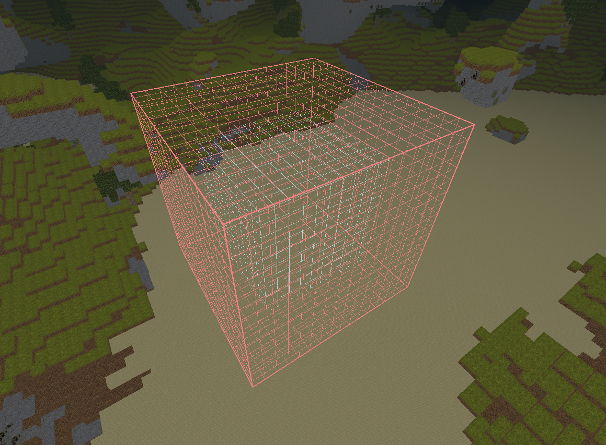
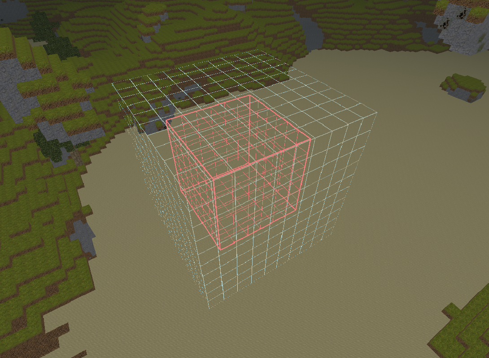
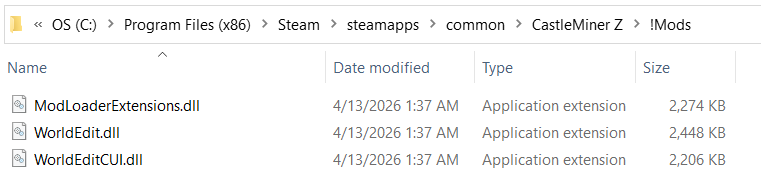
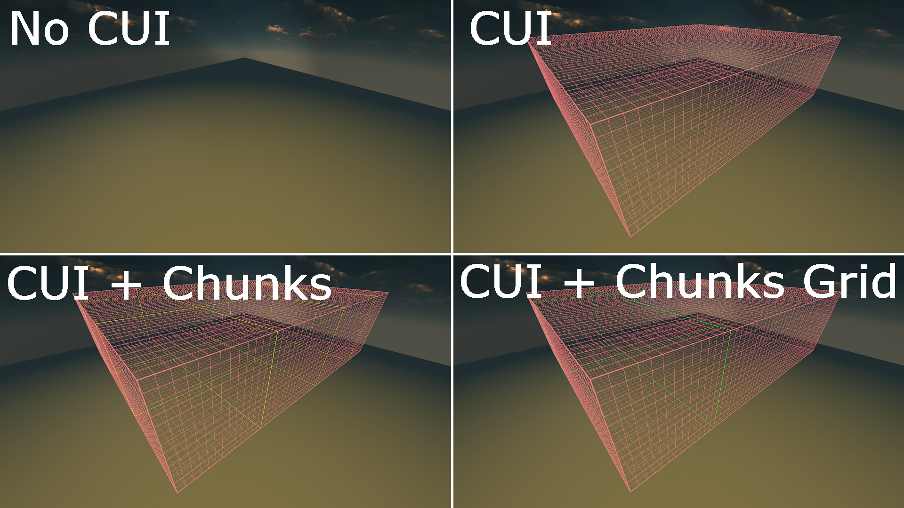
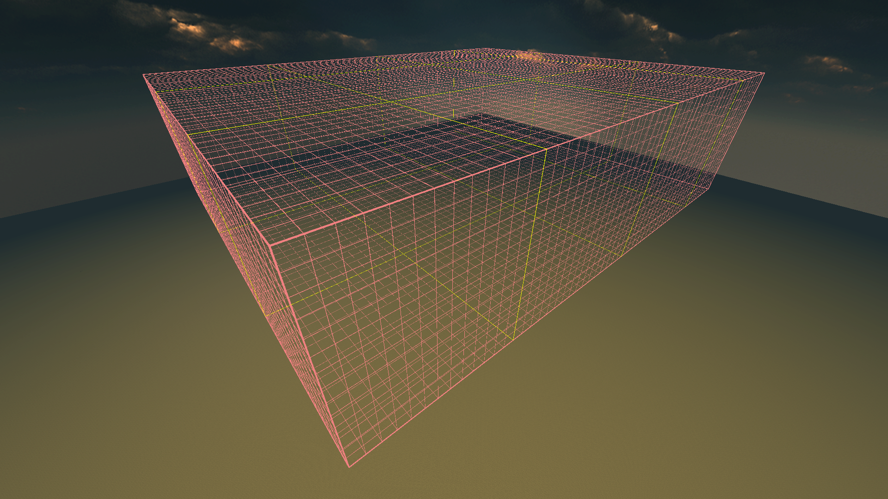
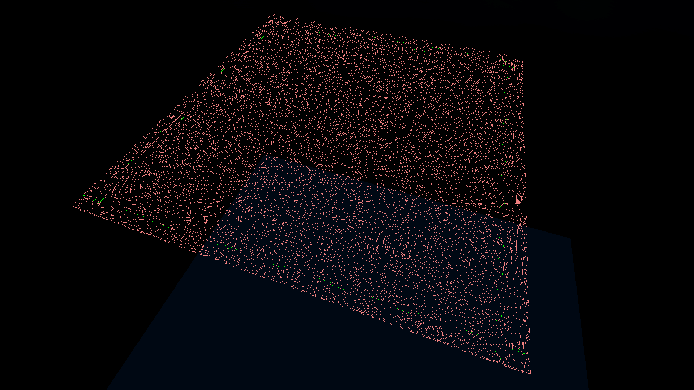
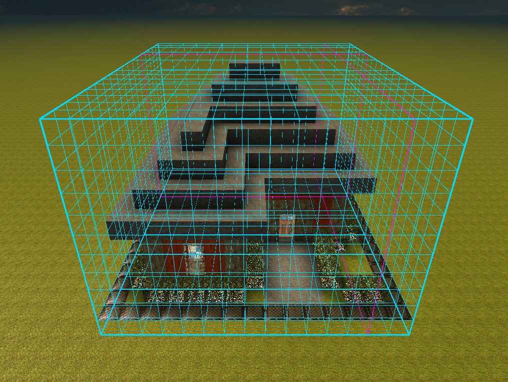
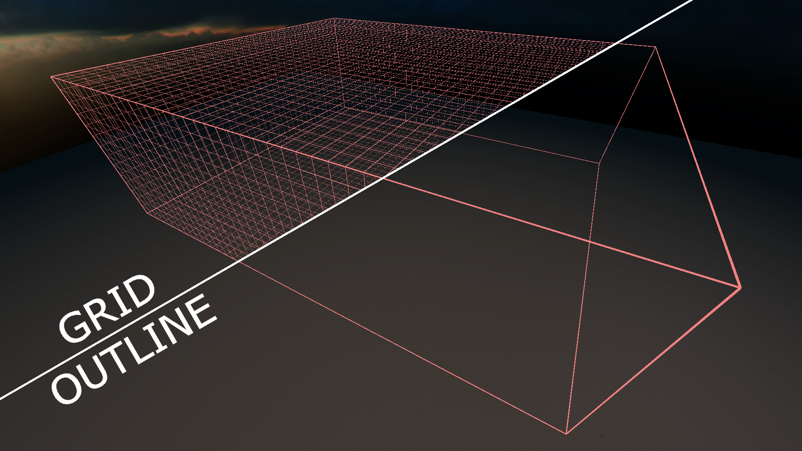

# WorldEditCUI

<div align="center">
    
</div>
<div align="center">
    <b>A frontend overlay for WorldEdit.</b> WorldEditCUI is designed to help you use WorldEdit more confidently by visualizing your current selection directly in-game.
</div>

<p align="center">
  
  
</p>

WorldEditCUI is a **graphical frontend addon** for the CastleForge **WorldEdit** mod. It does **not** edit the world by itself. Instead, it renders your active WorldEdit selection as an in-world overlay so you can see exactly what you are about to modify before you run a command.

That means fewer accidental edits, easier selection work, and a much better feel when using large WorldEdit operations inside CastleMiner Z.

---

## Table of contents

- [What this addon does](#what-this-addon-does)
- [Why this addon is useful](#why-this-addon-is-useful)
- [Important: this is not WorldEdit itself](#important-this-is-not-worldedit-itself)
- [Requirements](#requirements)
- [Installation](#installation)
- [First launch and generated files](#first-launch-and-generated-files)
- [Configuration](#configuration)
- [Quick start](#quick-start)
- [Overlay modes and chunk helpers](#overlay-modes-and-chunk-helpers)
- [Commands](#commands)
- [Customization tips](#customization-tips)
- [Troubleshooting](#troubleshooting)
- [Credits](#credits)

---

## What this addon does

WorldEditCUI adds a live visual overlay for your current WorldEdit selection, including:

- a visible 3D selection outline drawn directly in the world
- a **grid-style** base outline mode for easier volume reading
- an **outline-only** mode for a cleaner look
- optional **16×16 chunk boundary** overlays inside the selection
- optional **24×24 chunk mega-grid** overlays for large-scale planning
- configurable colors for the main outline, chunk lines, and mega-grid lines
- configurable line thickness values for each overlay type
- in-game commands to toggle modes and recolor overlays
- hot-reload support for the config file without restarting the game

This makes it much easier to line up large edits, confirm region bounds, and avoid mistakes before running commands like `/set`, `/replace`, `/stack`, `/move`, `/copy`, or `/paste`.

---

## Why this addon is useful

### It helps prevent accidental edits
When you can actually see the region you selected, it becomes much easier to catch mistakes before they happen.

### It makes large selections easier to understand
Grid lines and chunk overlays make it easier to judge scale, spacing, and boundaries in large builds or terrain operations.

### It feels more natural in-game
Instead of guessing where your selection starts and ends, you get immediate visual feedback while moving around the world.

### It pairs perfectly with WorldEdit workflows
This addon is especially useful for:

- large cuboid fills and replaces
- chunk-based editing
- structure copy/paste alignment
- terrain smoothing and regeneration
- precision building and layout planning

---

## Important: this is not WorldEdit itself

WorldEditCUI is **not** the editing mod.

It is a **frontend addon** for **WorldEdit**.

You must already have the base **WorldEdit** mod installed and working. WorldEditCUI only handles the **visualization layer**. The actual world-editing commands still come from **WorldEdit** itself.

If you only install WorldEditCUI without WorldEdit, you will not get the editing features this overlay is meant to visualize.

---

## Requirements

- **CastleForge ModLoader**
- **CastleForge ModLoaderExtensions**
- **WorldEdit**
- CastleMiner Z with a working CastleForge mod setup
- A loaded world/session when using WorldEdit selections

> WorldEditCUI depends on the base WorldEdit mod and is intended to be used alongside it.

---

## Installation

### For players
1. Install **ModLoader** and **ModLoaderExtensions**.
2. Install the base **WorldEdit** mod first.
3. Add the **WorldEditCUI** mod to your CastleForge mods setup.
4. Launch the game.
5. Enter a world/session.
6. Make a WorldEdit selection.
7. Use `/cui on` if selection visuals are not already enabled.



---

## First launch and generated files

On first launch, WorldEditCUI creates and uses files under:

```text
!Mods/WorldEditCUI/
```

The main runtime config file is:

```text
!Mods/WorldEditCUI/WorldEditCUI.Config.ini
```

This file stores:

- whether chunk outlines are enabled
- whether the mega-grid overlay is enabled
- the base overlay mode (`Grid` or `Outline`)
- main outline color
- chunk outline color
- chunk mega-grid color
- overlay thickness values
- config reload hotkey

---

## Configuration

WorldEditCUI generates this config file automatically:

```ini
# WorldEditCUI - Configuration
# Lines starting with ';' or '#' are comments.

[CUI]
; Selection outline color (R,G,B,A).
OutlineColor     = 240,128,128,255

; Base outline mode: Grid (default) or Outline (edges only).
BaseMode         = Grid
; Selection outline thickness (world units).
OutlineThickness = 0.06
; Interior grid line thickness used by OutlineSelectionWithGrid (world units).
GridThickness    = 0.02

[Chunks]
; Show 16x16 chunk boundaries inside the selection.
Enabled   = false
; Chunk boundary line color (R,G,B,A).
Color     = 255,255,0,255
; Chunk boundary line thickness (world units).
Thickness = 0.025

[ChunkGrid]
; Show the 24x24-chunk mega-grid boundaries (every 384 blocks) inside the selection.
Enabled   = false
; Mega-grid boundary line color (R,G,B,A).
Color     = 0,255,0,255
; Mega-grid boundary line thickness (world units).
Thickness = 0.03

[Hotkeys]
; Reload this config while in-game:
ReloadConfig = Ctrl+Shift+R
```

### Config notes

#### `[CUI]`
- `OutlineColor`  
  Main selection outline color in `R,G,B,A` format.
- `BaseMode`  
  `Grid` draws the selection with interior guide lines. `Outline` draws only the outer edges.
- `OutlineThickness`  
  Thickness of the main outer selection box.
- `GridThickness`  
  Thickness of the interior grid lines when `BaseMode = Grid`.

#### `[Chunks]`
- `Enabled`  
  Shows 16×16 chunk boundaries inside your current selection.
- `Color`  
  Color of the chunk boundary overlay.
- `Thickness`  
  Thickness of the chunk boundary lines.

#### `[ChunkGrid]`
- `Enabled`  
  Shows the larger 24×24 chunk mega-grid boundaries inside your selection.
- `Color`  
  Color of the mega-grid overlay.
- `Thickness`  
  Thickness of the mega-grid lines.

#### `[Hotkeys]`
- `ReloadConfig`  
  Reloads the config at runtime. Default: `Ctrl+Shift+R`.

---

## Quick start

This is the simplest path for getting WorldEditCUI working.

### 1) Make sure WorldEdit is installed
WorldEditCUI is only the frontend overlay. The base **WorldEdit** mod must already be installed and working.

### 2) Create a WorldEdit selection
Use your normal WorldEdit workflow:

```text
/wand on
```

Then mark two corners with your selection wand, or use:

```text
/pos1
/pos2
```

### 3) Turn selection visuals on
The visibility toggle comes from the **base WorldEdit mod**:

```text
/cui on
```

If you want to hide them again:

```text
/cui off
```

### 4) Switch between the two base visual styles
Use the WorldEditCUI command:

```text
/cuimode grid
/cuimode outline
```

### 5) Turn on chunk helpers when needed
```text
/cuichunks on
/cuichunksgrid on
```

### 6) Customize colors if you want
```text
/cuicolor 240,128,128,255
/cuichunkscolor 255,255,0,255
/cuichunksgridcolor 0,255,0,255
```



---

## Overlay modes and chunk helpers

### Grid mode
`Grid` is the default mode. It draws the outer selection and adds interior guide lines across the selection faces.

This is the most useful mode when:

- judging large volumes
- planning symmetrical edits
- aligning builds to a region
- checking size at a glance

### Outline mode
`Outline` draws just the outer edges of the selected cuboid.

This is useful when:

- you want a cleaner visual
- the grid feels too busy
- you only need the outer boundary

### 16×16 chunk outlines
Chunk outlines draw normal world chunk boundaries inside the current selection.

This is helpful for:

- chunk-aligned builds
- chunk-based editing workflows
- planning repeated layouts
- debugging chunk-sized region work



### 24×24 chunk mega-grid
The mega-grid overlay marks the larger cached grid spacing every **384 blocks**.

This is especially useful for:

- huge planning layouts
- long-distance alignment
- large map/grid organization
- debugging large-scale edit spacing



---

## Commands

> Like WorldEdit itself, these commands are designed to work naturally alongside your normal selection workflow.

| Command | Example | What it does |
|---|---|---|
| `/cui (on/off)` | `/cui on` | Turns the base WorldEdit selection visualization on or off. This command is provided by **WorldEdit**, not WorldEditCUI. |
| `/cuimode [grid\|outline]` | `/cuimode grid` | Sets the base overlay mode. With no argument, it toggles between the two modes. |
| `/cuichunks [on/off/toggle]` | `/cuichunks on` | Shows or hides 16×16 chunk boundaries inside the current selection. |
| `/cuichunksgrid [on/off/toggle]` | `/cuichunksgrid on` | Shows or hides the 24×24 chunk mega-grid overlay. |
| `/cuicolor <r,g,b,a>` | `/cuicolor 240,128,128,255` | Changes the main selection outline color and saves it to config. |
| `/cuichunkscolor <r,g,b,a>` | `/cuichunkscolor 255,255,0,255` | Changes the 16×16 chunk boundary color and saves it to config. |
| `/cuichunksgridcolor <r,g,b,a>` | `/cuichunksgridcolor 0,255,0,255` | Changes the mega-grid color and saves it to config. |
| `/cuireload` | `/cuireload` | Reloads `WorldEditCUI.Config.ini` from disk and reapplies it. |
| `/cuir` | `/cuir` | Short alias for `/cuireload`. |

### Command details

| **/cui**                                                                                                                                     | |
|----------------------------------------------------------------------------------------------------------------------------------------------|-|
| **Description**      | Enables or disables selection outline visuals provided by the WorldEdit + WorldEditCUI pairing.                         |
| **Usage**            | `/cui (on/off)`                                                                                                         |
| `(on/off)`           | Optional switch to explicitly set the state. If omitted, the command toggles the current state.                         |
| **Note**             | This command is handled by the base **WorldEdit** mod, but WorldEditCUI is what actually renders the enhanced overlay.  |

| **/cuimode**                                                                                                                                 | |
|----------------------------------------------------------------------------------------------------------------------------------------------|-|
| **Description**      | Switches the base selection overlay between `grid` mode and `outline` mode.                                             |
| **Usage**            | `/cuimode (grid\|outline)`                                                                                              |
| `(grid\|outline)`    | Optional mode to force. If omitted, the command toggles between the two modes.                                          |

| **/cuichunks**                                                                                                                               | |
|----------------------------------------------------------------------------------------------------------------------------------------------|-|
| **Description**      | Toggles 16×16 chunk boundary outlines inside the current selection.                                                     |
| **Usage**            | `/cuichunks (on\|off\|toggle)`                                                                                          |
| `(on\|off\|toggle)`  | Optional switch to explicitly set the state. If omitted, the command toggles the current state.                         |
| **Alias**            | `/cuichunk`                                                                                                             |

| **/cuichunksgrid**                                                                                                                           | |
|----------------------------------------------------------------------------------------------------------------------------------------------|-|
| **Description**      | Toggles the 24×24 chunk mega-grid overlay inside the current selection.                                                 |
| **Usage**            | `/cuichunksgrid (on\|off\|toggle)`                                                                                      |
| `(on\|off\|toggle)`  | Optional switch to explicitly set the state. If omitted, the command toggles the current state.                         |
| **Alias**            | `/cuichunkgrid`                                                                                                         |

| **/cuicolor**                                                                                                                                | |
|----------------------------------------------------------------------------------------------------------------------------------------------|-|
| **Description**      | Sets the main selection outline color and saves it to config.                                                           |
| **Usage**            | `/cuicolor <r,g,b,a>`                                                                                                   |
| `<r,g,b,a>`          | Color values in red, green, blue, alpha format. Alpha is optional and defaults to `255`.                                |

| **/cuichunkscolor**                                                                                                                          | |
|----------------------------------------------------------------------------------------------------------------------------------------------|-|
| **Description**      | Sets the 16×16 chunk outline color and saves it to config.                                                              |
| **Usage**            | `/cuichunkscolor <r,g,b,a>`                                                                                             |
| `<r,g,b,a>`          | Color values in red, green, blue, alpha format. Alpha is optional and defaults to `255`.                                |
| **Alias**            | `/cuichunkcolor`                                                                                                        |

| **/cuichunksgridcolor**                                                                                                                      | |
|----------------------------------------------------------------------------------------------------------------------------------------------|-|
| **Description**      | Sets the 24×24 chunk mega-grid color and saves it to config.                                                            |
| **Usage**            | `/cuichunksgridcolor <r,g,b,a>`                                                                                         |
| `<r,g,b,a>`          | Color values in red, green, blue, alpha format. Alpha is optional and defaults to `255`.                                |
| **Alias**            | `/cuichunkgridcolor`                                                                                                    |

| **/cuireload**                                                                                                                               | |
|----------------------------------------------------------------------------------------------------------------------------------------------|-|
| **Description**      | Reloads `WorldEditCUI.Config.ini` from disk and reapplies it immediately.                                               |
| **Usage**            | `/cuireload`                                                                                                            |
| **Alias**            | `/cuir`                                                                                                                 |

---

## Customization tips

### Want the cleanest look?
Use:

```text
/cuimode outline
```

### Want the most informative look?
Use:

```text
/cuimode grid
/cuichunks on
```

### Working on huge planning layouts?
Use:

```text
/cuichunksgrid on
```

### Want a softer or brighter color theme?
Adjust:

```text
/cuicolor ...
/cuichunkscolor ...
/cuichunksgridcolor ...
```

### Edited the config by hand?
Reload it without restarting:

```text
/cuireload
```

### Prefer hotkeys?
The default config reload hotkey is:

```text
Ctrl+Shift+R
```



---

## Troubleshooting

### "I installed this and nothing edits the world"
That is expected. WorldEditCUI is only the **visual overlay addon**. You still need the base **WorldEdit** mod for actual editing commands.

### "I do not see any selection lines"
Check all of the following:

- the base **WorldEdit** mod is installed
- WorldEditCUI is installed too
- you are in a loaded world/session
- you have actually made a valid WorldEdit selection
- selection visuals are enabled with `/cui on`

### "The overlay is visible, but I want a different style"
Use:

```text
/cuimode grid
```

or:

```text
/cuimode outline
```

### "My colors are too bright or too hard to see"
Adjust the overlay colors in the config file or with:

```text
/cuicolor ...
/cuichunkscolor ...
/cuichunksgridcolor ...
```

### "I changed the config but nothing happened"
Reload it with:

```text
/cuireload
```

or press the configured reload hotkey:

```text
Ctrl+Shift+R
```

### "Chunk overlays are too busy"
Disable the extra layers:

```text
/cuichunks off
/cuichunksgrid off
```

### "I only want the outer box"
Use:

```text
/cuimode outline
```



---

## Credits

- **RussDev7** — original WorldEdit-CSharp project, CastleForge integration, and WorldEditCUI addon adaptation
- **EngineHub / WorldEditCUI inspiration** — for the original idea of a visual frontend for WorldEdit-style selections
- **CastleForge / CastleMiner Z modding stack** — for the mod-loading and runtime environment this addon builds on