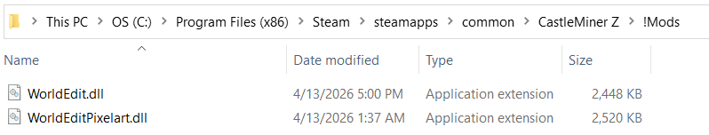

# WorldEditPixelart

<div align="center">
    
</div>
<div align="center">
    <b>🖼️ Image ➔ 🎨 Pixel Art Editor ➔ 🏗️ Schematic.</b> Convert source images into CastleMiner Z block art directly inside the game, preview the result, tune the palette, and send the finished build to WorldEdit.
</div>


> **Image suggestion:** Show the full editor open in-game with the source image on the left, converted output on the right, and the schematic / scaling controls visible.

---

## Table of contents

- [What this addon does](#what-this-addon-does)
- [Why this version stands out](#why-this-version-stands-out)
- [Requirements](#requirements)
- [Installation](#installation)
- [First launch and generated files](#first-launch-and-generated-files)
- [Configuration](#configuration)
- [Quick start](#quick-start)
- [How the workflow works](#how-the-workflow-works)
- [Editor feature tour](#editor-feature-tour)
- [Commands and hotkeys](#commands-and-hotkeys)
- [Color palettes, XML filters, and why they matter](#color-palettes-xml-filters-and-why-they-matter)
- [Palette builder and luminosity tools](#palette-builder-and-luminosity-tools)
- [Python palette visualization script](#python-palette-visualization-script)
- [Schematic export and WorldEdit clipboard workflow](#schematic-export-and-worldedit-clipboard-workflow)
- [Performance and rendering notes](#performance-and-rendering-notes)
- [Troubleshooting](#troubleshooting)
- [Credits](#credits)

---

## What this addon does

**WorldEditPixelart** is an in-game image conversion overlay for CastleForge that helps turn real images into block-based pixel art for CastleMiner Z.

It is designed to work alongside **WorldEdit**, letting you:

- open a full pixel-art editor from inside the game
- drag and drop an image directly into the tool
- preview a converted block-art result before exporting
- choose how the image is resampled using multiple scaling algorithms
- manage the block color palette used for matching colors
- load, save, reset, and customize XML color filters
- add custom palette entries by sampling a source color and assigning it to a block ID
- remove unused or unwanted colors from the active palette
- rotate and orient the generated schematic before export
- copy the generated result directly into **WorldEdit's clipboard**
- save the result to disk as a `.schem` file
- save the converted preview image as a normal image file
- inspect total width, height, and block count before you build

This makes it much faster to go from **reference image** to **editable in-game build** without manually placing every pixel by hand.

---

## Why this version stands out

### Built into the game session
This is not a separate desktop converter that happens to target CMZ. The editor runs **inside the CastleMiner Z process** as a WinForms overlay and is opened directly from the game.

### Made for WorldEdit workflows
WorldEditPixelart is not just about producing an image preview. It is built around real **WorldEdit-friendly output**, including:

- direct copy into the WorldEdit clipboard
- `.schem` export for saved builds
- rotation and placement orientation controls
- dimensions and block-count feedback for planning

### Palette editing is part of the workflow
A big part of getting good-looking block art is the palette. This addon does not lock you into a fixed color filter. It supports a full color-tuning workflow built around XML filters and companion tooling:

- use the embedded default block palette
- load your own XML color filters
- save modified filters back out
- reduce the palette to unique colors only
- remove unused colors after a render
- sample a source-image color and assign it to a specific block ID
- build brand new `BlockColors.xml` files from screenshots
- generate brighter adjusted palette variants when needed
- visualize palette changes with the original Python helper script

### Multiple scaling strategies
Different images look better with different resampling methods. The editor supports:

- Bilinear
- Nearest Neighbor
- Bicubic
- Lanczos
- Hermite
- Spline
- Gaussian

That gives you more control over whether the final block art looks smoother, sharper, or more stylized.

### In-game-friendly overlay behavior
The overlay is designed to temporarily capture input while open so you can safely work inside the editor without fighting the game's normal mouse / camera input.

---

## Requirements

- **CastleForge ModLoader**
- **CastleForge ModLoaderExtensions**
- **WorldEdit**
- CastleMiner Z with a working CastleForge mod setup
- A loaded world or active session before opening the editor

**Target framework in source:** `.NET Framework 4.8.1`

> WorldEditPixelart is a companion addon for WorldEdit. It is not a replacement for WorldEdit itself.

---

## Installation

### For players
1. Install **ModLoader** and **ModLoaderExtensions** first.
2. Install **WorldEdit**.
3. Add the **WorldEditPixelart** mod release to your CastleForge mods setup.
4. Launch the game once.
5. Enter a world or session.
6. Open the editor with `/pixelart` or one of its aliases.
7. Optionally configure a hotkey in the generated INI file for faster access.
8. If you want custom color behavior, load or create a custom XML palette.



---

## First launch and generated files

On first launch, the addon creates and/or uses content under:

```text
!Mods/WorldEditPixelart/
```

The most important runtime files are:

```text
!Mods/WorldEditPixelart/WorldEditPixelart.ini
!Mods/WorldEditPixelart/ColorPalette/BlockColors.xml
```

### What gets generated

- **`WorldEditPixelart.ini`** stores the overlay hotkey and window-hosting mode.
- **`ColorPalette/BlockColors.xml`** is the extracted default block palette used for color matching.

That palette file is not just background data. It is one of the most important parts of the conversion workflow, because changing it changes how your images map to blocks.

---

## Configuration

WorldEditPixelart generates this config file automatically:

```ini
; WorldEditPixelart - Configuration
; Lines starting with ';' or '#' are comments.

[Hotkeys]
; ToggleKey opens the editor and freezes input; pressing it again in the editor closes/unfreezes.
; Set to 'None' to disable the hotkey entirely.
; Examples: F10, F4, Insert, Delete, OemTilde, None
ToggleKey=None

[Behavior]
; Overlay host mode:
;   true  = Embed inside the game window (child mode).
;           - Lives within the game's client area; can't be dragged outside.
;           - No taskbar entry; z-order follows the game.
;           - Best for windowed/borderless; avoids focus flicker.
;   false = Show as a separate window (owned by the game).
;           - Standard title bar + icon; can move to other monitors.
;           - May briefly steal/return focus when opened/closed.
;           - Use if you want a normal, freely movable window.
EmbedAsChild=true
```

### Config notes

#### `[Hotkeys]`
- `ToggleKey`  
  Optional keyboard shortcut for opening the editor. The default is `None`, meaning the hotkey is disabled until you set one.

#### `[Behavior]`
- `EmbedAsChild`  
  Controls whether the editor is embedded inside the game window or shown as a separate owned window.

---

## Quick start

This is the fastest path from a source image to a WorldEdit-ready result.

### 1) Open the editor
Use any of these commands in-game:

```text
/pixelart
/pixel
/pa
/imagetopixelart
/pixelarttool
```

### 2) Load an image
Use **Open New Image** or drag and drop an image onto the source preview area.

### 3) Choose your conversion settings
Set the options you want before rendering, such as:

- scaling mode
- spacing
- ratio / zoom level
- grid visibility
- backdrop handling
- schematic generation
- rotation
- flat vs standing mode
- X-axis vs Y-axis output orientation

### 4) Choose or tune your palette
Before converting, decide whether the default `BlockColors.xml` is good enough for this image.

You can:

- use the default embedded palette
- load a custom XML color filter
- delete unused colors
- add a hand-picked source color to block mapping
- save the adjusted filter for reuse later

> **Tip:** If the output colors feel "off," the palette is usually the first thing you should adjust.

### 5) Convert the image
Click:

```text
Convert To Pixel Art
```

The output preview will update using the current palette and scaling settings.

### 6) Export or send to WorldEdit
Once the result looks right, you can:

- **Copy To Clipboard** to send the generated schematic to WorldEdit
- **Save Schematic To File** to write a `.schem` file
- **Save Image** to keep the rendered preview as a normal image
- **Save Color Filter** to preserve the palette you used


> **Image suggestion:** Show a 4-panel sequence: open editor → load source image → adjust palette / convert preview → copy to WorldEdit or save schematic.

---

## How the workflow works

WorldEditPixelart follows a simple pipeline:

1. **Load a source image**  
   You can open one manually or drag and drop it into the editor.

2. **Choose a color palette**  
   The tool compares the source image against a CMZ block-color palette.

3. **Resample the image**  
   The selected scaling mode determines how image pixels are interpreted before matching them to blocks.

4. **Match colors to blocks**  
   Each rendered output cell is matched to the nearest color in the active palette.

5. **Optionally refine the palette**  
   If the output looks wrong, you can load a different XML filter, delete colors, add custom colors, or rebuild the palette externally with the companion tools.

6. **Optionally build schematic data while rendering**  
   Enabling **Generate Schematic** prepares data for clipboard copy or schematic save.

7. **Rotate/orient the output**  
   You can change standing vs flat mode, world axis, and rotation before exporting.

8. **Send the result to WorldEdit or save it to disk**  
   Once satisfied, you can move directly into the WorldEdit building workflow.

---

## Editor feature tour

### Image input and output
The editor is built around two main panes:

- **Image Input** for your source image
- **Image Output** for the converted block-art preview

The source pane supports drag-and-drop image loading, while the output pane reflects the currently selected conversion settings.


> **Image suggestion:** Show the same image on the left and its converted block-art preview on the right.

### Basic configurations
The main configuration area includes controls for:

- spacing
- ratio / zoom refresh
- opening a new image
- converting the image
- saving the converted preview image
- generating and saving schematic data
- copying the build into WorldEdit's clipboard
- overwriting the last saved schematic

### Schematic rotation and orientation
The editor can rotate and orient the generated schematic before export.

Supported options include:

- **No Rotation**
- **90 Degrees**
- **180 Degrees**
- **270 Degrees**
- **Standing** mode
- **Flat** mode
- **X-Axis** output
- **Y-Axis** output

This makes it easier to prepare a build for different placement styles before pasting it into the world.


> **Image suggestion:** Show the rotation controls with two small example outputs, one standing and one flat.

### Grid and preview options
Preview helpers include:

- **Show Grid**
- **Backdrop** for transparent areas
- **Grid Color** picker
- **Grid X Offset**
- **Grid Y Offset**

These options do not change the core idea of the image, but they make it much easier to inspect alignment and spacing before export.

### Scaling modes
The current implementation supports these conversion modes:

- Bilinear
- Nearest Neighbor
- Bicubic
- Lanczos
- Hermite
- Spline
- Gaussian

Additional tuning controls include:

- **A=** for Lanczos behavior
- **Sigma=** for Gaussian behavior

That makes the addon flexible enough for both crisp low-resolution sprite work and smoother photo-based conversions.


> **Image suggestion:** Show the same source image converted with 3 or 4 different scaling modes side by side.

### Palette controls
The palette-management side of the editor includes:

- **Load Color Filter**
- **Save Color Filter**
- **Reset Colors**
- **Unique Colors**
- **Delete Null Colors**
- **Delete Color**
- **Custom Color Picker**

These controls are one of the most important parts of the tool, because they directly affect how blocks are chosen during conversion.


> **Image suggestion:** Show the palette management controls, the custom color picker, and a small before/after conversion difference.

### Statistics and progress
The tool can display or update:

- total height
- total width
- total blocks
- total colors
- filtered colors
- progress bar state during rendering

That helps estimate the size and cost of a build before you paste it.

---

## Commands and hotkeys

WorldEditPixelart is intentionally simple on the command side. Its main job is to launch the editor.

| Command | Aliases | What it does |
|---|---|---|
| `/pixelart` | `/pixel`, `/pa`, `/imagetopixelart`, `/pixelarttool` | Opens the WorldEditPixelart editor overlay. |

> The addon also registers `//` forms for the same commands.

### Example

```text
/pixelart
```

### Hotkey behavior
If you set a `ToggleKey` in the config, that key can also be used to open the editor. While the editor is focused, pressing the same key again closes it.

---

## Color palettes, XML filters, and why they matter

This is one of the most important parts of the addon.

If two players use the same image but different `BlockColors.xml` files, they can get very different results. That means the quality of your pixel art is tied not just to the source image, but also to the color filter behind the conversion.

### Default palette
On first run, the addon extracts the embedded default palette to:

```text
!Mods/WorldEditPixelart/ColorPalette/BlockColors.xml
```

### Palette manager features
The editor can:

- load an external XML color filter
- save the current active filter to XML
- reset back to the embedded default palette
- collapse duplicates with **Unique Colors**
- remove colors that were not used in the current render with **Delete Null Colors**
- remove a specific rendered color interactively with **Delete Color**

### Custom Color Picker
The **Custom Color Picker** lets you:

1. click a source-image color
2. enter a target block ID
3. inject that new mapping into the active palette

This is useful when you want a very specific source color to map to a block of your choosing rather than relying only on nearest-match logic.

### When to adjust the palette
Consider adjusting your XML filter when:

- colors keep mapping to the wrong block even after changing scaling modes
- a certain block dominates the output too much
- you added modded/custom blocks and need them included in the palette
- you want a brighter or more stylized variant of the same palette
- you are building art for a different content pack or project


> **Image suggestion:** Show the color filter manager, a small XML preview, and before/after output using two different palettes.

---

## Palette builder and luminosity tools

Your original project documentation included companion tooling for building and adjusting XML palette files. These tools are extremely useful if you want better control over your color matching.

### XML color filter builder
This workflow is meant for mass-gathering average colors from screenshots of blocks and automatically writing them into an XML palette file.

### How it works
1. Take screenshots of your blocks.
2. Rename each screenshot using the required naming format.
3. Drag and drop the screenshot files onto the builder executable.
4. The tool generates a `BlockColors.xml` file.

### Required filename format
Use this format for your images:

```text
blockname,id.*
```

Examples:

```text
rock,6.png
ironwall,22.jpg
bloodstone,20.bmp
```

### Supported image formats
- `.jpg`
- `.png`
- `.bmp`

This is a very fast way to build or rebuild a palette for:

- modded blocks
- texture/content packs
- alternate projects
- corrected or cleaner screenshots
- a custom block set you want the pixel-art editor to understand


> **Image suggestion:** Show a folder of block screenshots named `name,id.png` and the resulting `BlockColors.xml` file beside it.

### Luminosity adjustment tool
The original workflow also included a simple way to brighten an existing XML palette.

### How it works
1. Drag and drop your existing `BlockColors.xml` file onto the luminosity tool executable.
2. Enter the luminosity percentage increase.
3. The tool creates an adjusted XML file.

### Output
The adjusted file is written as:

```text
AdjustedBlockColors.xml
```

This is helpful when your palette is technically correct but the in-game result is too dark and you want a brighter variant without manually rewriting every color entry.


> **Image suggestion:** Show `BlockColors.xml` being dropped into the tool and `AdjustedBlockColors.xml` appearing after the brightness increase.

---

## Python palette visualization script

Your original docs also included a simple Python script for previewing the colors inside either `BlockColors.xml` or `AdjustedBlockColors.xml`.

This is very useful when you want to visually inspect palette changes before loading the XML back into the editor.

<details>
  <summary><strong>Show Python script</strong></summary>

```py
import xml.etree.ElementTree as ET
import matplotlib.pyplot as plt

# Load and parse the XML file.
tree = ET.parse("BlockColors.xml")
root = tree.getroot()

# Extract color values, names, and IDs from the XML.
colors = []
names = []
ids = []

for block in root.find("Blocks").findall("Block"):
    color = block.get("Color")            # Get the color attribute.
    name = block.get("Name", "Unknown")   # Get the block name.
    block_id = block.get("Id", "??")      # Get the block ID.

    if color.startswith("#FF"):           # Remove alpha (FF).
        color = "#" + color[3:]

    colors.append(color)
    names.append(name)
    ids.append(block_id)

# Plot the colors as horizontal bars.
fig, ax = plt.subplots(figsize=(8, len(colors) * 0.4))
ax.set_ylim(0, len(colors))
ax.set_xlim(-0.5, 1.5)
ax.axis("off")

# Display each color as a horizontal bar.
for i, (color, name, block_id) in enumerate(zip(colors, names, ids)):
    ax.add_patch(plt.Rectangle((0, i), 1, 1, color=color))                                  # Draw horizontal color bar.
    ax.text(-0.1, i + 0.5, name, ha="right", va="center", fontsize=10)                      # Name on the left.
    ax.text(1.1, i + 0.5, block_id, ha="left", va="center", fontsize=10, fontweight="bold") # ID on the right.

# Invert the y-axis so that the first element is at the top.
ax.invert_yaxis()

plt.show()
```

</details>


> **Image suggestion:** Show the generated horizontal color-bar preview with block names on the left and IDs on the right.

---

## Schematic export and WorldEdit clipboard workflow

WorldEditPixelart supports two main output paths.

### 1) Copy directly into WorldEdit
When **Generate Schematic** is enabled and the current render is up to date, clicking **Copy To Clipboard** sends the generated schematic data into **WorldEdit's clipboard**.

That means you can go straight from image conversion to WorldEdit paste workflows without manually rebuilding anything.

### 2) Save a `.schem` file
You can also save the generated result to disk as a schematic file for reuse later.

### Extra export notes
- The tool warns you if your schematic data is no longer up to date with the current image/settings.
- You can overwrite the previously saved schematic file directly from the editor.
- Rotation and orientation settings affect how the schematic is produced.
- Palette changes affect what gets built, so it is worth saving the palette too when you save an important project.


> **Image suggestion:** Show the copy-to-clipboard button, a `.schem` save dialog, and the result pasted into the world with WorldEdit.

---

## Performance and rendering notes

Pixel-art conversion is usually fast, but a few settings can affect how heavy a render feels.

### Settings that can increase work
- very large source images
- high output ratios
- more complex scaling modes
- **Generate Schematic** enabled during conversion
- progress/stat gathering enabled during long jobs
- larger or more detailed palettes

### Practical advice
- Start with a smaller image or lower ratio first.
- Use simpler scaling modes when iterating quickly.
- Turn on **Generate Schematic** when you are ready to export, not only while experimenting.
- Use the preview image and block statistics to estimate how large the final build will be.
- If colors are wrong, fix the palette before pushing the size higher.

### Canceling a render
The convert button can switch into a cancel state while a render is running, so large jobs do not have to be left to complete if you already know you want different settings.

---

## Troubleshooting

### "The editor does not open"
Check all of the following:

- you are currently in a loaded world/session
- the mod dependencies are installed correctly
- WorldEdit is installed
- the command was typed correctly
- your configured hotkey is not set to `None` if you are expecting hotkey launch

### "The pixel art colors look wrong"
This is usually a palette issue, not just a rendering issue.

Try one or more of these:

- load a different XML color filter
- reset colors to the default palette
- remove bad mappings with **Delete Color**
- add missing mappings with **Custom Color Picker**
- build a new `BlockColors.xml` from fresh screenshots
- create a brighter `AdjustedBlockColors.xml` if the palette is too dark

### "Copy To Clipboard says the schematic is empty"
Generate the pixel art first, and make sure **Generate Schematic** is enabled if your workflow depends on clipboard or file export.

### "My schematic is outdated"
The addon tracks whether the saved schematic data still matches your current image/settings. Re-render before exporting if you changed important settings.

### "The preview is fine, but the build still does not look right"
Double-check all of these:

- standing vs flat mode
- X-axis vs Y-axis orientation
- rotation setting
- current XML palette
- whether the source image needs a different scaling mode

---

## Credits

- **RussDev7** — original tool design, CastleForge integration, XML palette workflow, and companion scripting/docs
- **WorldEdit** — required companion mod for clipboard and build workflows
- The original WorldEditPixelart project documentation and tooling workflow, including the XML palette builder, luminosity adjustment workflow, and Python visualization helper
