# WorldGenPlus

> Rebuild CastleMiner Z world generation with configurable surface layouts, custom biome loading, vanilla-style overlays, seed control, multiplayer sync, and a full in-game tuning screen.


[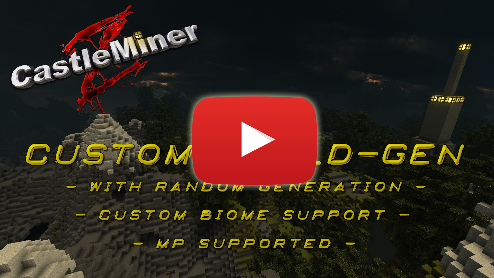](https://youtu.be/zZ81ndwFSYw "CMZ Random World-Gen Test v1.2 (Full MP Support) - Click to Watch!")

---

## Overview

**WorldGenPlus** is a deep world-generation overhaul for CastleForge that replaces the default `WorldBuilder` with a configurable builder capable of:

- preserving a vanilla-like feel when you want it,
- reshaping the surface into new patterns,
- tuning overlays like crash sites, bedrock, ore, trees, and hell,
- forcing deterministic seeds,
- syncing host settings to clients,
- and loading **custom biome DLLs** from disk so new biome types can participate in rings, single-biome worlds, and random-region generation.

This is not just a “new biome” mod. It is a **worldgen framework** for CastleMiner Z.

---

## Why this mod stands out

WorldGenPlus goes much further than a simple biome swap:

- It supports **four surface generation modes** instead of a single hard-coded world layout.
- It keeps **vanilla overlay behavior** where it matters, while still allowing custom surface logic.
- It exposes an **in-game configuration screen** instead of forcing you to edit every value by hand.
- It supports **custom biome discovery from external DLLs**.
- It can **broadcast host worldgen settings to joining clients** so multiplayer sessions stay consistent.
- It gives you control over **surface rings, region blending, bedrock thickness, crash-site carving, ore distribution, loot placement, and tree generation**.

---

## Feature highlights

### Surface generation modes

WorldGenPlus can generate the surface using four different strategies:

| Mode | What it does | Best use case |
|---|---|---|
| **Vanilla Rings** | Radial ring-based biome layout with repeat and mirror support | Vanilla-style worlds with more control |
| **Square Bands** | Concentric square bands using ring logic | Stylized or map-like worlds |
| **Single Biome** | Uses one biome everywhere | Challenge runs, themed worlds, biome testing |
| **Random Regions** | Deterministic Voronoi-style biome regions with border blending | Minecraft-like biome blobs and mixed-region worlds |

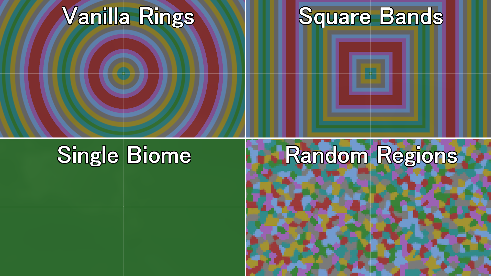

*Image suggestion:* Show the same seed generated in all four modes from a top-down map or stitched panorama.

### Vanilla-style overlays, but configurable

After the surface biome is chosen, WorldGenPlus can still run a familiar overlay stack:

- crash sites,
- caves,
- ore passes,
- hell ceiling,
- hell floor,
- bedrock,
- origin / Lantern Land,
- water setup,
- and trees.

Each overlay can be toggled on or off, and several of them have their own tuning section.

### Custom biome loading

WorldGenPlus scans:

```text
!Mods/WorldGenPlus/CustomBiomes/*.dll
```

Any **non-abstract `Biome` subclass** with a constructor that accepts `WorldInfo` can be discovered and used in:

- ring cores,
- single-biome mode,
- random-region pools,
- and ring-random bags.

This turns WorldGenPlus into a foundation for future biome mods instead of a closed system.

### In-game configuration screen

The mod injects a **“Custom Biomes”** button into the world-selection flow and opens a custom menu that supports:

- mouse hover highlighting,
- mouse wheel scrolling,
- draggable scrollbar,
- keyboard/controller navigation,
- left/right hold-to-repeat for fast tuning,
- inline seed editing,
- save,
- reset to vanilla defaults.

<p align="center">
  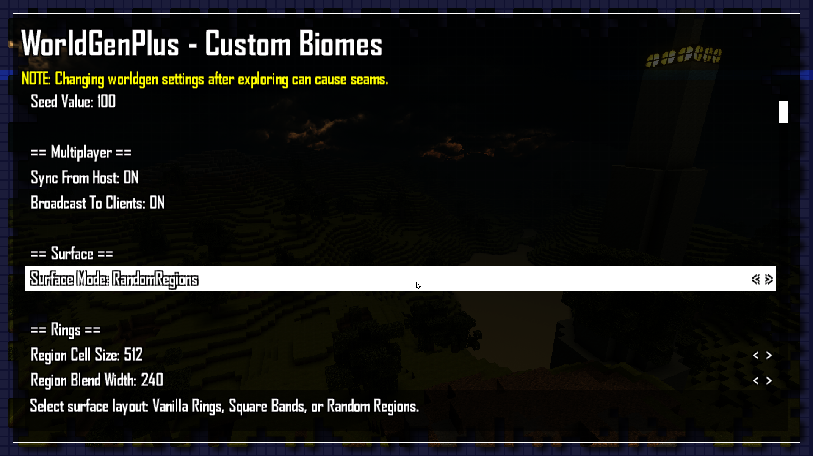
  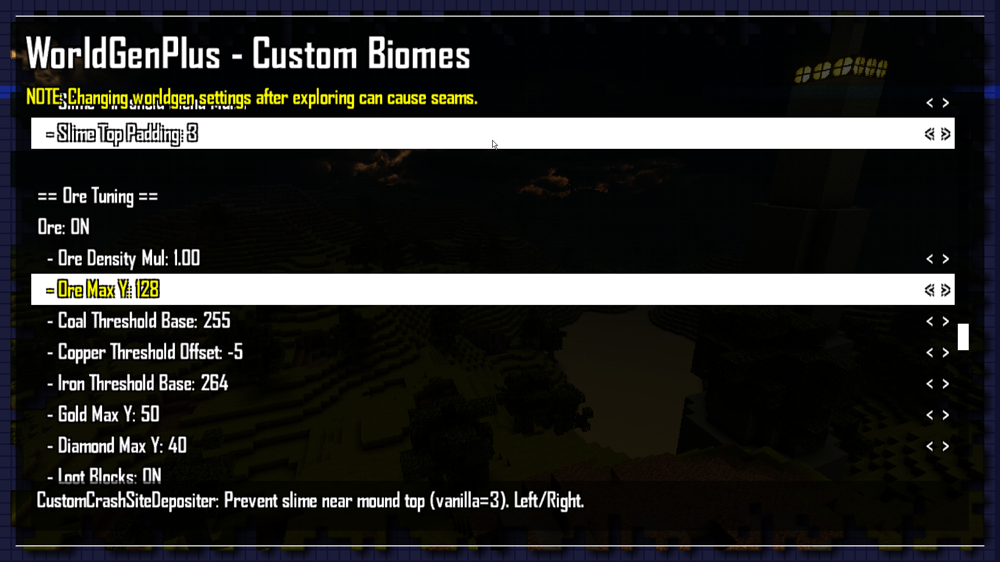
</p>

*Image suggestion:* Capture the config menu on a long section such as Ore Tuning so readers can immediately see how much is configurable.

### Multiplayer sync support

Hosts can optionally append a compressed WorldGenPlus settings payload to the vanilla world info join flow. Clients can opt in to consume it for the current session.

This means:

- the **host** stays authoritative,
- clients can **sync into the host’s worldgen rules**,
- and the override is **cleared when the session ends**.

### Seed override and force-reload fixes

The patch set also addresses two practical problems:

- it can **force terrain reloads** when starting a world so changes apply immediately,
- and it can **inject an override seed** during world creation / preloaded world startup.

That makes testing worldgen changes much less frustrating.

---

## What the mod actually changes

At load, WorldGenPlus:

1. initializes embedded dependency resolution,
2. extracts embedded resources if needed,
3. applies Harmony patches,
4. injects the **Custom Biomes** UI button,
5. intercepts terrain initialization,
6. swaps the world’s builder to `WorldGenPlusBuilder` when appropriate.

At generation time, the custom builder:

1. selects the surface biome,
2. computes overlay blending,
3. runs overlay passes,
4. performs the tree pass after terrain is built,
5. runs hell-floor post processing when used.

---

## Main gameplay-facing capabilities

### 1) Surface control

WorldGenPlus lets you define where biomes appear instead of being locked to one shape.

### Vanilla Rings
Uses the classic radial layout, with configurable:

- ring period,
- mirror repeat,
- transition width,
- ring count,
- ring end radii,
- ring biome assignment.

### Square Bands
Uses **Chebyshev distance** to create square “rings” instead of circular ones, while still respecting repeat and mirror rules.

### Single Biome
Applies one biome across the entire surface. Great for:

- all-desert runs,
- all-arctic survival,
- testing custom biome DLLs,
- map themes.

### Random Regions
Builds deterministic Voronoi-like biome cells with configurable:

- region cell size,
- border blend width,
- blend power,
- smooth-edge mode,
- weighted biome bags.

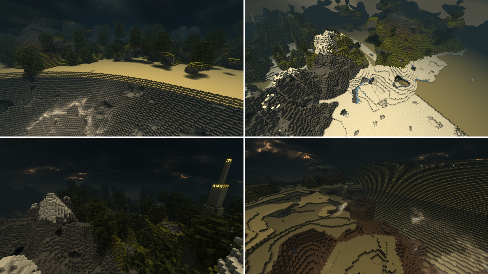

---

### 2) Ring logic beyond vanilla

WorldGenPlus expands ring behavior with some especially useful tricks:

### `@Random` ring biome token
A ring core biome can be set to:

```ini
@Random
```

That ring will then pull from the **[RingsRandom]** biome bag.

### Pipe-pattern ring entries
Ring biome strings can use pattern segments like:

```text
BiomeA|BiomeB|BiomeC
```

The current repeated pattern index chooses which segment is active.

This gives you a way to vary repeated rings without duplicating your full ring layout.

### Random-by-period support
When enabled, repeated ring periods can choose new random biomes each period instead of repeating the same random pick.

### DecentBiome special handling
`DecentBiome` is treated specially to preserve vanilla-like fade behavior. WorldGenPlus contains dedicated logic so it behaves more like the base game instead of a normal biome slot.

---

### 3) Overlay stack

Once the surface is chosen, WorldGenPlus can still run a configurable overlay chain.

### Crash Sites
Configurable crater placement and shaping with options for:

- density,
- world scale,
- Y carving range,
- crater depth,
- mound generation,
- bloodstone protection,
- slime ore inside the crash-site structure.

### Caves
Vanilla cave pass can still be enabled as part of the overlay flow.

### Ore
A heavily configurable ore/loot pass with controls for:

- blend behavior,
- ore thresholds,
- ore depth limits,
- lava thresholds,
- diamond thresholds,
- loot generation,
- survival vs scavenger loot behavior,
- optional loot on non-rock blocks.

### Hell Ceiling / Hell Floor
The mod preserves hell overlay support and applies special suppression rules to certain unusual/test biomes when guards are enabled.

### Bedrock
Bottom bedrock thickness can be smoothed and varied.

### Origin / Lantern Land
The origin overlay can be enabled independently. The config UI explicitly labels this as **Origin (Lantern Land)**.

### Water
Water behavior can be enabled at the builder level. The builder sets water-related values such as `WaterLevel` and uses a custom water depth value.

### Trees
Tree placement runs after the main terrain/overlay pass and keeps a seam-safe inner generation area to avoid chunk-edge canopy clipping.

<details>
<summary><strong>Custom Biome Knobs</strong></summary>

<br>

| Preview | Knob |
|--------------------------------------------------------|-----------------|
| 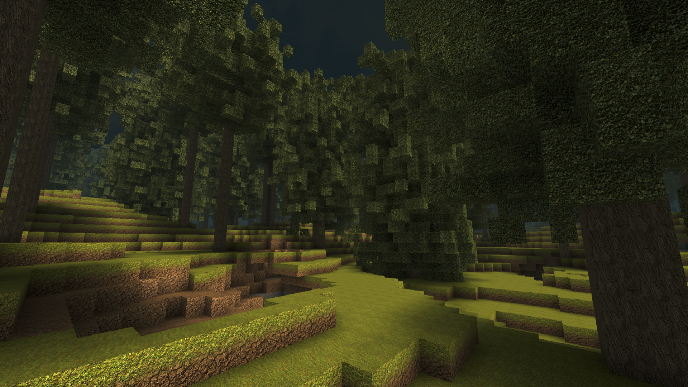       | `CustomTree`    |
| 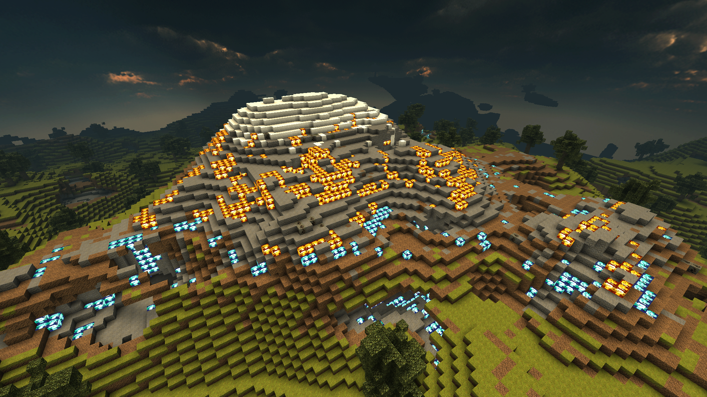 | `CustomLootbox` |
| 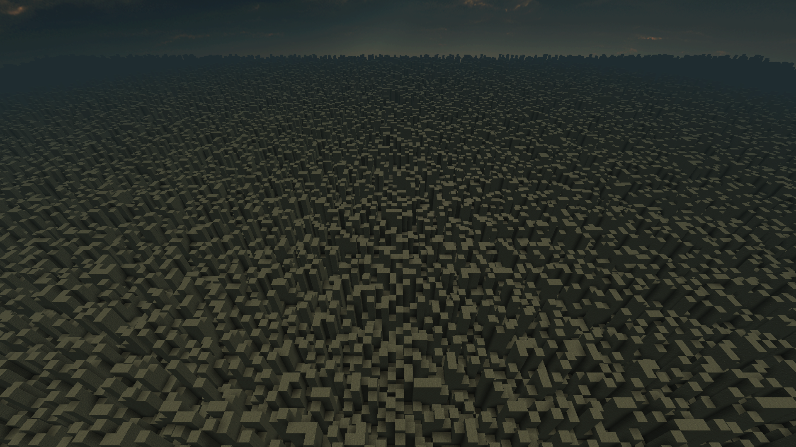 | `CustomBedrock` |
| 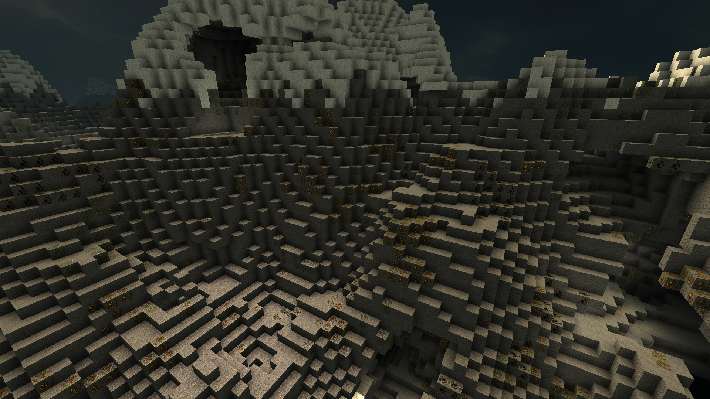         | `CustomOre`     |

</details>

---

### 4) Custom biomes

WorldGenPlus includes a registry that discovers biome DLLs from:

```text
!Mods/WorldGenPlus/CustomBiomes
```

### Discovery rules

A custom biome is discoverable when it:

- derives from `DNA.CastleMinerZ.Terrain.WorldBuilders.Biome`,
- is not abstract,
- has a constructor like `MyBiome(WorldInfo worldInfo)`.

### Important note
Custom biome DLLs are loaded with `Assembly.LoadFrom(...)`, which means **new DLLs can be discovered**, but **updated/replaced DLLs usually require a restart** because .NET Framework does not unload them cleanly.

### Sample included in the project
The project contains a `MyTestBiome.cs` sample that demonstrates a simple rolling-hills biome with:

- Perlin-noise-driven terrain height,
- grass top layer,
- dirt underlayer,
- rock beneath.

### Build output for custom biome sources
The project file contains a custom build target that compiles biome source files into:

```text
!Mods/WorldGenPlus/CustomBiomes/*.dll
```

That makes WorldGenPlus especially nice for modular biome authoring.

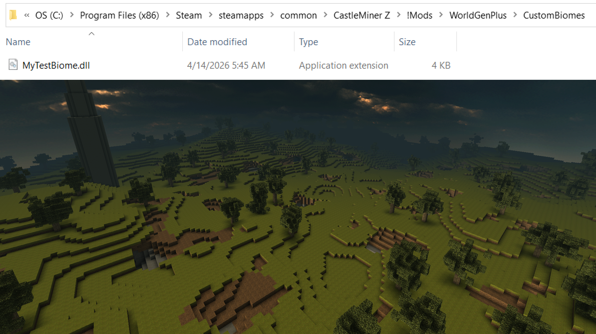

---

### 5) Multiplayer support

WorldGenPlus includes a host/client sync path for worldgen settings.

### Host side
If broadcasting is enabled, the host:

- snapshots the current WorldGenPlus settings,
- compresses and serializes them,
- appends them to the world info join payload.

### Client side
If sync is enabled, the client:

- detects the tagged payload,
- decodes it,
- applies it as an **in-memory network override**,
- strips the injected payload back out afterward.

### Session cleanup
When the game session ends, the network override is cleared so it does not leak into later sessions.

### Why this matters
For multiplayer worldgen mods, consistency matters. This makes it much easier for clients to experience the host’s intended worldgen without needing identical local manual edits first.

---

### 6) UI and usability polish

The configuration screen is a major feature on its own.

### UI capabilities
- custom scrollable list,
- non-selectable headers and spacers,
- keyboard/controller navigation,
- mouse hover descriptions,
- mouse-wheel scrolling,
- draggable scrollbar,
- arrow-based left/right tuning,
- hold-to-repeat on left/right,
- inline numeric seed editing,
- save / reset / back actions.

### Where to find it
WorldGenPlus injects a **Custom Biomes** button into the saved-world selection flow and opens the config screen from there.

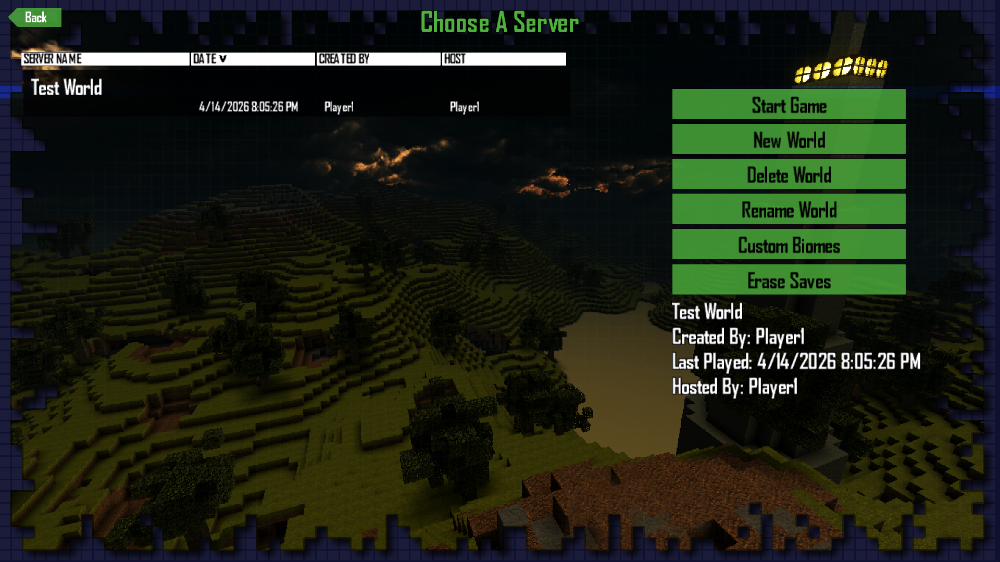

---

## Installation

### Requirements

- **CastleForge ModLoader**
- **CastleForge ModLoaderExtensions**
- **CastleMiner Z**
- .NET Framework runtime support compatible with the rest of CastleForge

### Install steps

1. Install the CastleForge loader stack normally.
2. Copy the built **WorldGenPlus** mod output into your game’s `!Mods` folder.
3. Launch the game.
4. Open the world-selection flow and enter the **Custom Biomes** menu.
5. Save your desired configuration.
6. Start or reload the world.

## Typical folder layout

```text
CastleMinerZ/
└─ !Mods/
   ├─ WorldGenPlus.dll
   └─ WorldGenPlus/
      ├─ WorldGenPlus.Config.ini
      └─ CustomBiomes/
         ├─ MyBiome.dll
         └─ AnotherBiome.dll
```

> The config file is stored at:
>
> `!Mods/WorldGenPlus/WorldGenPlus.Config.ini`

---

## Generated / important files

| Path | Purpose |
|---|---|
| `!Mods/WorldGenPlus/WorldGenPlus.Config.ini` | Main WorldGenPlus config |
| `!Mods/WorldGenPlus/CustomBiomes/*.dll` | Discoverable custom biome assemblies |
| `!Mods/WorldGenPlus/...` | Extracted embedded resources, if present |

---

## Default surface layout

By default, the vanilla-style ring list is:

| Ring end radius | Biome |
|-----:|------------------|
| 200  | `ClassicBiome`   |
| 900  | `LagoonBiome`    |
| 1600 | `DesertBiome`    |
| 2300 | `MountainBiome`  |
| 3000 | `ArcticBiome`    |
| 3600 | `DecentBiome`    |

That gives you a good starting point even before you customize anything.

---

## Default biome bags

### Default random-region bag
- `ClassicBiome`
- `LagoonBiome`
- `DesertBiome`
- `MountainBiome`
- `ArcticBiome`
- `DecentBiome`
- `HellFloorBiome`

### Default ring-random bag
- `ClassicBiome`
- `LagoonBiome`
- `DesertBiome`
- `MountainBiome`
- `ArcticBiome`
- `DecentBiome`
- `HellFloorBiome`

---

## Included vanilla biome choices in the UI

The config screen can cycle through built-in biome names such as:

- `ClassicBiome`
- `LagoonBiome`
- `DesertBiome`
- `MountainBiome`
- `ArcticBiome`
- `CaveBiome`
- `DecentBiome`
- `HellCeilingBiome`
- `HellFloorBiome`
- `OriginBiome`
- `CostalBiome`
- `FlatLandBiome`
- `TestBiome`
- `TreeTestBiome`
- `OceanBiome`

Custom biome DLLs are merged into this list automatically.

---

## Biome & depositor gallery

<details>
<summary><strong>Built-in Biomes</strong></summary>

<br>

| Preview | Biome |
|---------|-------|
| 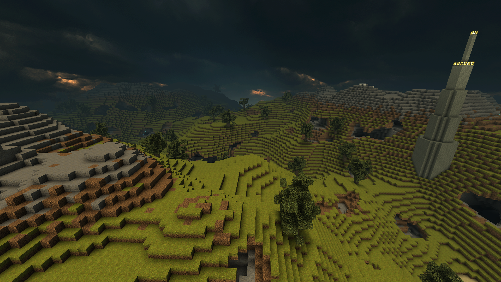         | `ClassicBiome`     |
| 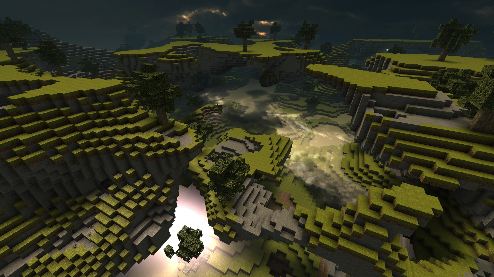           | `LagoonBiome`      |
| 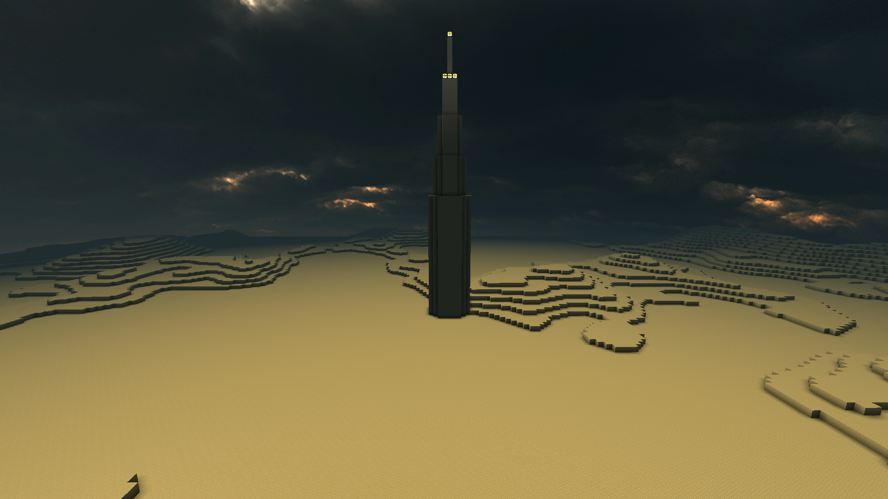           | `DesertBiome`      |
|        | `MountainBiome`    |
|            | `ArcticBiome`      |
| 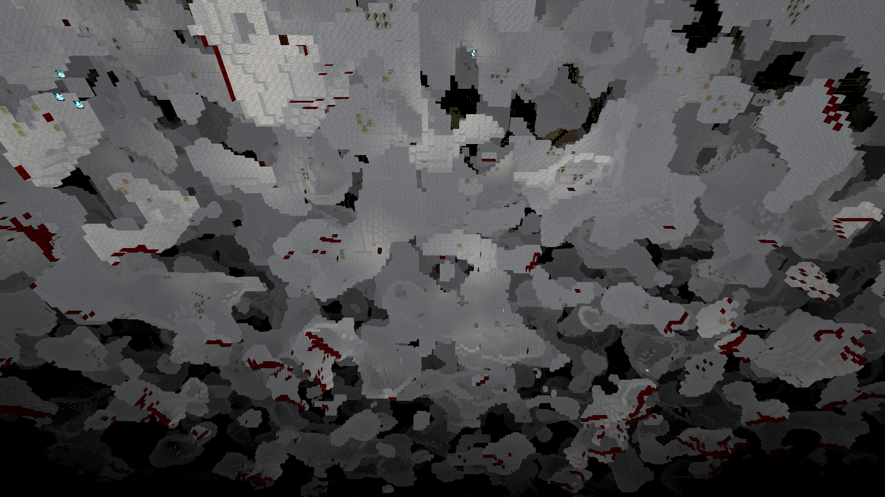               | `CaveBiome`        |
| 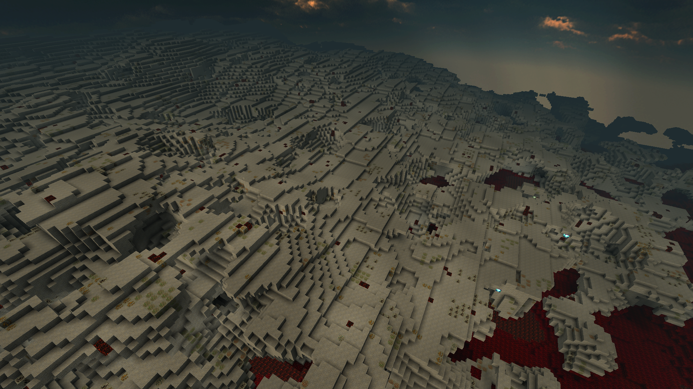           | `DecentBiome`      |
| 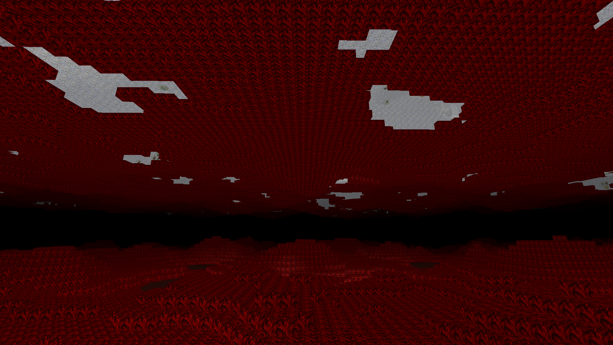 | `HellCeilingBiome` |
| 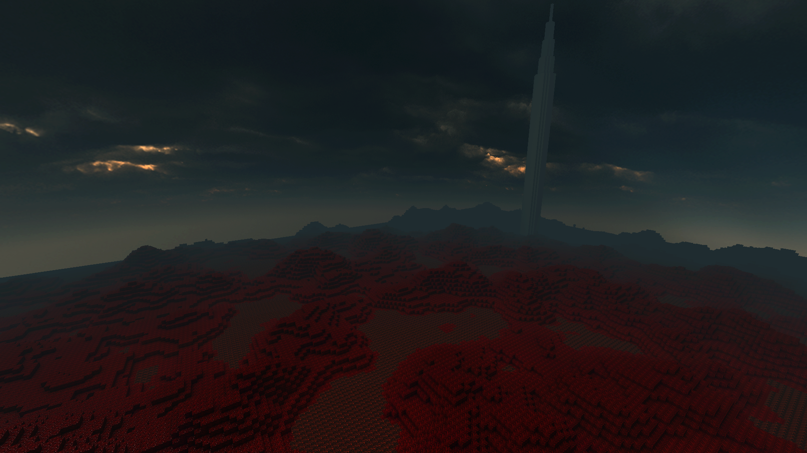     | `HellFloorBiome`   |
| 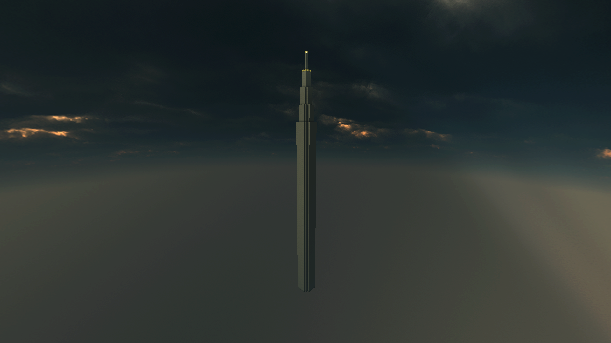           | `OriginBiome`      |
|            | `CostalBiome`      |
| 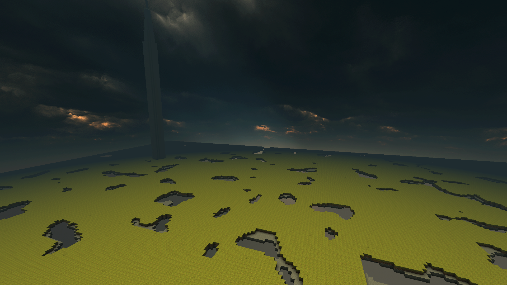       | `FlatLandBiome`    |
| 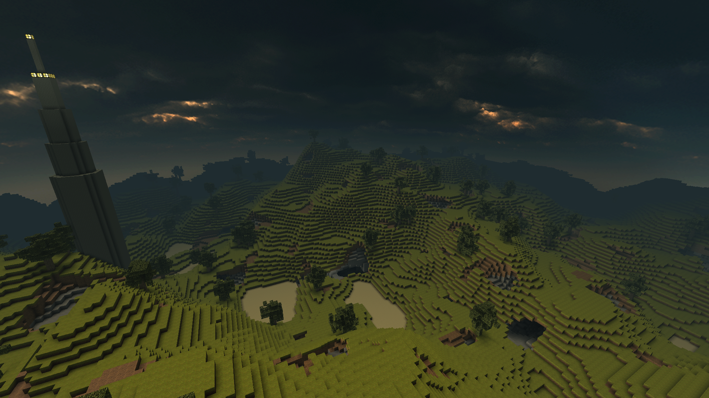               | `TestBiome`        |
| 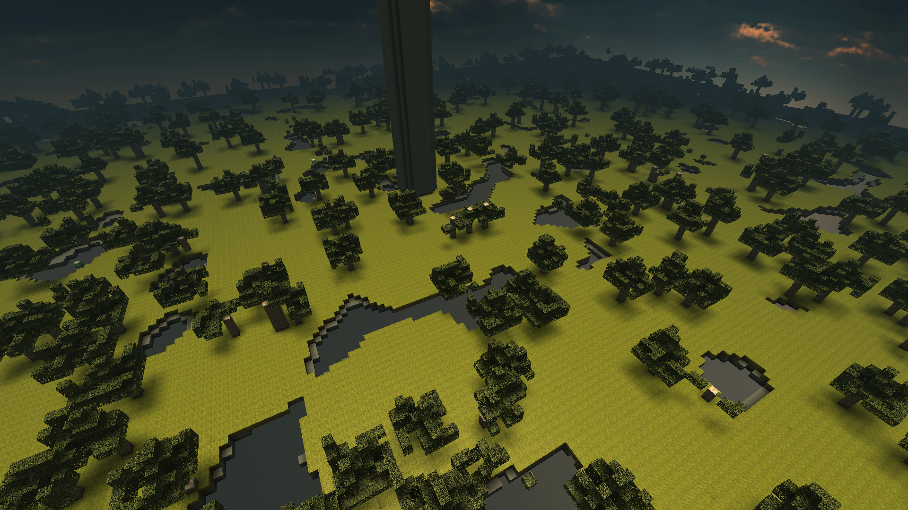       | `TreeTestBiome`    |
| 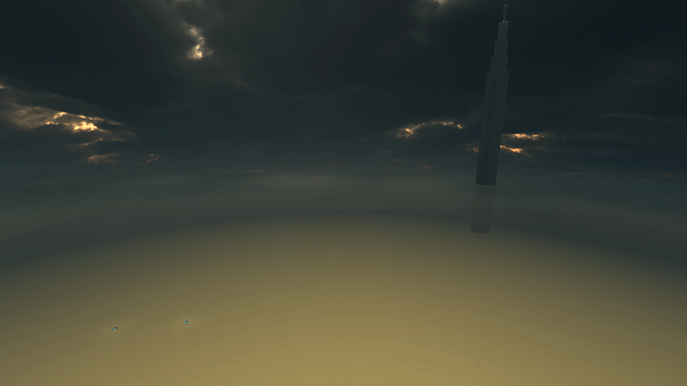             | `OceanBiome`       |

</details>

<details>
<summary><strong>Built-in Depositors</strong></summary>

<br>

| Preview | Depositor |
|---------|-----------|
|              | `OreDepositer`       |
|      | `BedrockDepositer`   |
|  | `CrashSiteDepositer` |
|            | `TreeDepositer`      |

</details>

<details>
<summary><strong>Custom Sample Biomes</strong></summary>

<br>

| Preview | Custom Biome |
|---------|--------------|
| 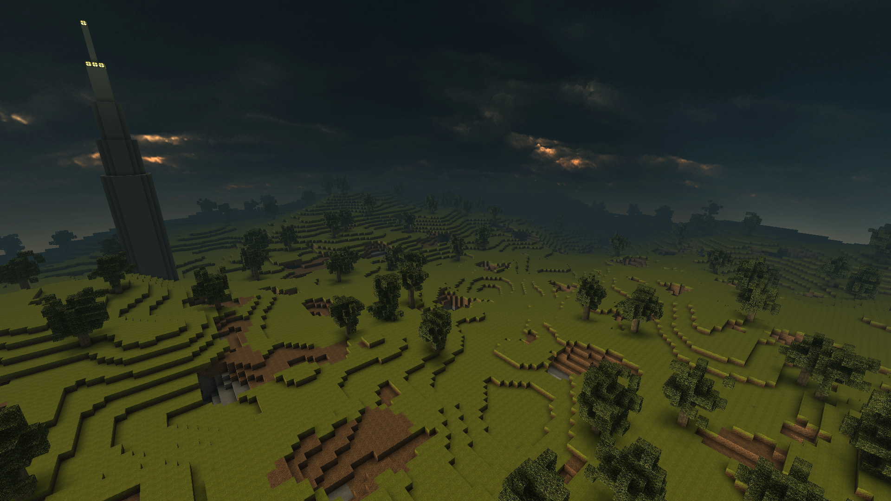 | `MyTestBiome` |

</details>

---

## Configuration

WorldGenPlus writes an INI file with clear comments and sections. The in-game UI is the easiest way to work with it, but the file is still clean enough to hand-edit.

### Minimal example

```ini
[WorldGenPlus]
Enabled = true

[Seed]
Enabled = true
Value   = 123456

[Surface]
Mode              = 3
RegionCellSize    = 512
RegionBlendWidth  = 240
RegionBlendPower  = 3
RegionSmoothEdges = true

[Overlays]
CrashSites  = true
Caves       = true
Ore         = true
HellCeiling = true
Hell        = true
Bedrock     = true
Origin      = true
Water       = true
Trees       = true
BiomeGuards = true
```

---

## Full config reference

<details>
<summary><strong>[WorldGenPlus]</strong></summary>

| Key | Default | Description |
|---|---:|---|
| `Enabled` | `false` | Master toggle. When enabled, the host swaps terrain generation over to `WorldGenPlusBuilder`. |

</details>

<details>
<summary><strong>[Seed]</strong></summary>

| Key | Default | Description |
|---|---:|---|
| `Enabled` | `false` | Enables seed override logic. |
| `Value` | `0` | Seed value used when override is active. |

**Notes**

- Seed override is independent of the main `Enabled` toggle.
- The patch pack also contains extra logic to force the seeded world path more reliably during startup.

</details>

<details>
<summary><strong>[Multiplayer]</strong></summary>

| Key | Default | Description |
|---|---:|---|
| `SyncFromHost` | `true` | Client-side toggle. Accept host-sent WorldGenPlus settings for the current session. |
| `BroadcastToClients` | `true` | Host-side toggle. Include a compressed WorldGenPlus payload in the join flow. |

</details>

<details>
<summary><strong>[Surface]</strong></summary>

| Key | Default | Description |
|---|---:|---|
| `Mode` | `0` | Surface mode. `0=Vanilla Rings`, `1=Square Bands`, `2=Single Biome`, `3=Random Regions`. |
| `RegionCellSize` | `512` | Size of a random-region cell. Larger values create larger biome blobs. |
| `RegionBlendWidth` | `240` | Width of region border blending. `0` makes hard edges. |
| `RegionBlendPower` | `3` | Border sharpness shaping. Higher values feel sharper. |
| `RegionSmoothEdges` | `true` | Uses Voronoi bisector distance for smoother constant-width region borders. |

</details>

<details>
<summary><strong>[Rings]</strong></summary>

| Key | Default | Description |
|---|---:|---|
| `Period` | `4400` | Ring repeat distance. |
| `MirrorRepeat` | `true` | Mirrors every other repeated pattern period. |
| `TransitionWidth` | `100` | Width of ring-to-ring blending. |
| `CoreCount` | `6` | Number of ring cores defined below. |
| `Core{i}End` | varies | End radius for ring core `i`. |
| `Core{i}Biome` | varies | Biome type for ring core `i`. Supports full type names, `@Random`, and pipe-patterns like `BiomeA|BiomeB`. |

**Default cores**

```ini
Core0End   = 200
Core0Biome = DNA.CastleMinerZ.Terrain.WorldBuilders.ClassicBiome

Core1End   = 900
Core1Biome = DNA.CastleMinerZ.Terrain.WorldBuilders.LagoonBiome

Core2End   = 1600
Core2Biome = DNA.CastleMinerZ.Terrain.WorldBuilders.DesertBiome

Core3End   = 2300
Core3Biome = DNA.CastleMinerZ.Terrain.WorldBuilders.MountainBiome

Core4End   = 3000
Core4Biome = DNA.CastleMinerZ.Terrain.WorldBuilders.ArcticBiome

Core5End   = 3600
Core5Biome = DNA.CastleMinerZ.Terrain.WorldBuilders.DecentBiome
```

</details>

<details>
<summary><strong>[RingsRandom]</strong></summary>

| Key | Default | Description |
|---|---:|---|
| `VaryByPeriod` | `true` | Repeated ring periods can choose new random biomes instead of repeating the same pick. |
| `BiomeCount` | `7` | Number of weighted entries in the ring-random bag. |
| `Biome0..BiomeN` | default bag | Weighted biome entries used when a ring core uses `@Random`. Duplicate entries increase weight. |
| `AutoIncludeCustomBiomes` | `false` | Appends discovered custom biome types into the random bag. |

</details>

<details>
<summary><strong>[SingleBiome]</strong></summary>

| Key | Default | Description |
|---|---:|---|
| `SingleSurfaceBiome` | `ClassicBiome` | Full biome type name used when `Mode=2`. |

</details>

<details>
<summary><strong>[RandomRegions]</strong></summary>

| Key | Default | Description |
|---|---:|---|
| `BiomeCount` | `7` | Number of entries in the weighted random-region biome bag. |
| `Biome0..BiomeN` | default bag | Weighted biome entries used by random-region mode. Duplicate entries increase weight. |
| `AutoIncludeCustomBiomes` | `false` | Appends discovered custom biome DLL types into the region pool. |

</details>

<details>
<summary><strong>[Overlays]</strong></summary>

| Key | Default | Description |
|---|---:|---|
| `WorldBlendRadius` | `3600` | Global overlay fade radius used for vanilla-style blending. |
| `CrashSites` | `true` | Enables crash-site overlay generation. |
| `Caves` | `true` | Enables the cave overlay pass. |
| `Ore` | `true` | Enables ore and loot passes. |
| `HellCeiling` | `true` | Enables hell-ceiling overlay. |
| `Hell` | `true` | Enables hell-floor overlay. |
| `Bedrock` | `true` | Enables bedrock overlay. |
| `Origin` | `true` | Enables origin / Lantern Land overlay. |
| `Water` | `true` | Enables water setup in the builder. |
| `Trees` | `true` | Enables the post-surface tree pass. |
| `BiomeGuards` | `true` | Suppresses certain hell/bedrock overlays on unusual/test biomes. |

</details>

<details>
<summary><strong>[Bedrock]</strong></summary>

| Key | Default | Description |
|---|---:|---|
| `CoordDiv` | `1` | Noise frequency divisor for bedrock thickness. Higher values smooth the variation. |
| `MinLevel` | `1` | Minimum bedrock thickness. |
| `Variance` | `3` | Additional bedrock-thickness variance. |

</details>

<details>
<summary><strong>[CrashSite]</strong></summary>

| Key | Default | Description |
|---|---:|---|
| `WorldScale` | `0.0046875` | Noise world scale for crash-site placement. |
| `NoiseThreshold` | `0.5` | Minimum noise needed before a crash site activates. |
| `GroundPlane` | `66` | Reference Y used in crater/mound shaping. |
| `StartY` | `20` | Inclusive start Y for carve logic. |
| `EndYExclusive` | `126` | Exclusive end Y for carve logic. |
| `CraterDepthMul` | `140` | Strength multiplier for crater depth. |
| `EnableMound` | `true` | Enables crater rim / mound formation. |
| `MoundThreshold` | `0.55` | Noise threshold for mound creation. |
| `MoundHeightMul` | `200` | Mound height multiplier. |
| `CarvePadding` | `10` | Extra carve padding around the crater. |
| `ProtectBloodStone` | `true` | Avoids carving bloodstone. |
| `EnableSlime` | `true` | Allows slime block placement inside crash structures. |
| `SlimePosOffset` | `777` | Slime noise sampling offset. |
| `SlimeCoarseDiv` | `2` | Coarse divisor for slime field shaping. |
| `SlimeAdjustCenter` | `128` | Center term for slime threshold adjustment. |
| `SlimeAdjustDiv` | `8` | Divisor for slime adjustment shaping. |
| `SlimeThresholdBase` | `265` | Base slime threshold. |
| `SlimeBlendToIntBlendMul` | `10` | Scales overlay blend influence into slime logic. |
| `SlimeThresholdBlendMul` | `1` | Scales how much blend modifies slime threshold. |
| `SlimeTopPadding` | `3` | Keeps slime away from the very top of the mound region. |

</details>

<details>
<summary><strong>[Ore]</strong></summary>

| Key | Default | Description |
|---|---:|---|
| `BlendRadius` | `0` | Builder-side ore blend radius. `0` means use `WorldBlendRadius`. |
| `BlendMul` | `1` | Multiplier applied to blend influence. |
| `BlendAdd` | `0` | Additive bias applied to blend influence. |
| `MaxY` | `128` | Global max Y for the main ore pass. |
| `BlendToIntBlendMul` | `10` | Converts float blend into internal ore-blend strength. |
| `NoiseAdjustCenter` | `128` | Center term for combined ore-noise adjustment. |
| `NoiseAdjustDiv` | `8` | Divisor for ore-noise adjustment. |
| `CoalCoarseDiv` | `4` | Coarse divisor for coal/copper distribution. |
| `CoalThresholdBase` | `255` | Base coal threshold. |
| `CopperThresholdOffset` | `-5` | Offset relative to coal threshold. |
| `IronOffset` | `1000` | Decorrelates iron/gold sampling from earlier passes. |
| `IronCoarseDiv` | `3` | Coarse divisor for iron/gold distribution. |
| `IronThresholdBase` | `264` | Base iron threshold. |
| `GoldThresholdOffset` | `-9` | Offset relative to iron threshold. |
| `GoldMaxY` | `50` | Gold will not spawn above this Y. |
| `DeepPassMaxY` | `50` | Maximum Y for deep-only ore passes. |
| `DiamondOffset` | `777` | Decorrelates diamond sampling. |
| `DiamondCoarseDiv` | `2` | Coarse divisor for diamond distribution. |
| `LavaThresholdBase` | `266` | Base threshold for lava pocket generation. |
| `DiamondThresholdOffset` | `-11` | Offset relative to deep-pass baseline. |
| `DiamondMaxY` | `40` | Diamond will not spawn above this Y. |
| `LootEnabled` | `true` | Enables loot generation. |
| `LootOnNonRockBlocks` | `true` | Allows loot on non-rock blocks such as sand/snow/bloodstone. |
| `LootSandSnowMaxY` | `60` | Max Y for loot in sand/snow areas. |
| `LootOffset` | `333` | Decorrelates loot sampling. |
| `LootCoarseDiv` | `5` | Coarse divisor for loot distribution. |
| `LootFineDiv` | `2` | Fine detail divisor for loot shaping. |
| `LootSurvivalMainThreshold` | `268` | Main loot threshold for Survival/Exploration. |
| `LootSurvivalLuckyThreshold` | `249` | Lucky loot threshold for Survival/Exploration. |
| `LootSurvivalRegularThreshold` | `145` | Regular loot threshold for Survival/Exploration. |
| `LootLuckyBandMinY` | `55` | Lower lucky-band Y gate. |
| `LootLuckyBandMaxYStart` | `100` | Upper lucky-band starting Y gate. |
| `LootScavengerTargetMod` | `1` | Scavenger-mode target modifier. |
| `LootScavengerMainThreshold` | `267` | Main loot threshold for Scavenger/Creative. |
| `LootScavengerLuckyThreshold` | `250` | Lucky loot threshold for Scavenger/Creative. |
| `LootScavengerLuckyExtraPerMod` | `3` | Extra lucky chance per mod step in scavenger logic. |
| `LootScavengerRegularThreshold` | `165` | Regular loot threshold for Scavenger/Creative. |

**Notes**

- Ore placement is primarily rock-based.
- Loot generation is mode-sensitive.
- Endurance-style modes are intentionally excluded from loot generation logic.
- This is one of the most advanced parts of the mod and worth tuning slowly.

</details>

<details>
<summary><strong>[Trees]</strong></summary>

| Key | Default | Description |
|---|---:|---|
| `Scale` | `0.4375` | Noise scale used for tree placement checks. |
| `Threshold` | `0.6` | Tree placement threshold. Higher values reduce tree density. |
| `BaseTrunkHeight` | `5` | Minimum trunk height before noise-based growth. |
| `HeightVarMul` | `9` | Strength of noise-driven trunk-height variation. |
| `LeafRadius` | `3` | Canopy radius. Also affects chunk-edge safe area. |
| `LeafNoiseScale` | `0.5` | Noise scale for leaf canopy shaping. |
| `LeafCutoff` | `0.25` | Higher values create sparser canopies. |
| `GroundScanStartY` | `124` | Starting Y for the downward scan that searches for grass. |
| `GroundScanMinY` | `0` | Lowest Y the scan may reach. |
| `MinGroundHeight` | `1` | Prevents tree placement on tiny invalid columns. |

</details>

<details>
<summary><strong>[Hotkeys]</strong></summary>

| Key | Default | Description |
|---|---:|---|
| `ReloadConfig` | `Ctrl+Shift+R` | Reserved reload binding stored in config. |

**Important**

The project comments describe this as an **optional reload binding** to be wired similarly to other mods. In this version, it is a stored config value, but it is not the main interaction method for the mod.

</details>

---

## In-game menu sections

The WorldGenPlus config screen is organized into the following sections:

- WorldGenPlus
- Multiplayer
- Surface
- Rings
- Ring Indexing
- Single Surface
- Random Region Indexing
- Overlays
- Bedrock Tuning
- Crash Site Tuning
- Ore Tuning
- Trees Tuning
- Menu Actions

This is one of the reasons the mod feels approachable despite the amount of depth under the hood.

---

## Using custom biomes

### Option 1: Compile biome DLLs as part of the project
The project file already includes support for compiling custom biome source files into separate DLLs.

### Option 2: Drop external biome DLLs into the folder
You can also place compatible biome DLLs directly into:

```text
!Mods/WorldGenPlus/CustomBiomes
```

### What happens next
Once discovered, those custom biome type names become available to:

- ring core selection,
- single-biome mode,
- random-region biome bags,
- ring-random biome bags.

### Example concept
A custom biome could define:

- its own terrain profile,
- custom surface composition,
- distinct blending response,
- special world identity for themed maps.

---

## Notes for pack authors and modders

### Ring biome strings are more powerful than they look
A single ring entry can be:

- a normal full type name,
- `@Random`,
- a pipe-pattern string like `BiomeA|BiomeB|BiomeC`.

That makes the ring system much more expressive than a normal linear list.

### Random-region bags are weighted by duplication
If you add the same biome multiple times in `[RandomRegions]`, it appears more often.

### Ring-random bags are also weighted by duplication
The same weighting trick works in `[RingsRandom]`.

### Some unusual biomes are intentionally guarded
WorldGenPlus contains suppression logic for special/test biomes such as Origin, FlatLand, Ocean, and certain others so that hell/bedrock overlays do not appear in obviously broken ways when guards are enabled.

### Custom biome DLL replacement usually needs restart
Because the registry uses `Assembly.LoadFrom`, replacing an already loaded DLL is normally a restart operation.

---

## Recommended screenshots for GitHub

### Hero section
- a four-world comparison image,
- or a single dramatic landscape showing unusual biome transitions.

### Surface modes
- top-down map or world preview of all four generation modes.

### Config UI
- the scrollable menu open on a dense section like Ore Tuning.

### Crash-site tuning
- a crater with mound and slime visible.

### Random regions
- a map showing large, obvious deterministic biome blobs.

### Custom biomes
- Explorer window with `CustomBiomes` folder beside an in-game screenshot of the custom biome.

### Multiplayer sync
- host and client in the same world with matching terrain, plus config screenshot.

---

## Good use cases

WorldGenPlus is especially useful for:

- custom survival worlds,
- themed biome-only challenge runs,
- testing biome concepts before writing a bigger biome pack,
- building multiplayer servers with a consistent world identity,
- experimenting with world balance through ore/tree/crash-site tuning,
- creating stylized map layouts that vanilla never supported.

---

## Known behavior and practical notes

- The mod is most powerful when the **host** is treated as authoritative.
- Custom biome discovery is safe to call repeatedly, but updated DLL replacement generally needs restart.
- Tree generation intentionally avoids chunk-edge seams by limiting where trees can be placed inside each chunk.
- Seed override support is present both in config and in startup patches.
- The config UI is the preferred tuning workflow; direct INI editing is still supported.
- The stored hotkey entry is more of a framework hook than the main advertised interaction path in this build.

---

## Suggested companion docs for the main CastleForge repository

When you add this README into the CastleForge tree, it pairs especially well with:

- `docs/getting-started.md`
- `docs/installation.md`
- `docs/mod-catalog.md`
- `docs/architecture.md`
- `docs/compatibility.md`

A future cross-link from `docs/mod-catalog.md` to this README would make a lot of sense because WorldGenPlus is both a playable mod and a framework for future biome content.

---

## TL;DR

WorldGenPlus turns CastleMiner Z world generation into a configurable framework.

You get:

- four surface generation modes,
- weighted biome pools,
- ring randomization,
- custom biome DLL loading,
- configurable crash/ore/tree/bedrock systems,
- seed override support,
- multiplayer sync,
- and a proper in-game configuration screen.

If you want a CastleForge mod that feels like **a platform for building worlds**, this is one of the most important ones in the repository.