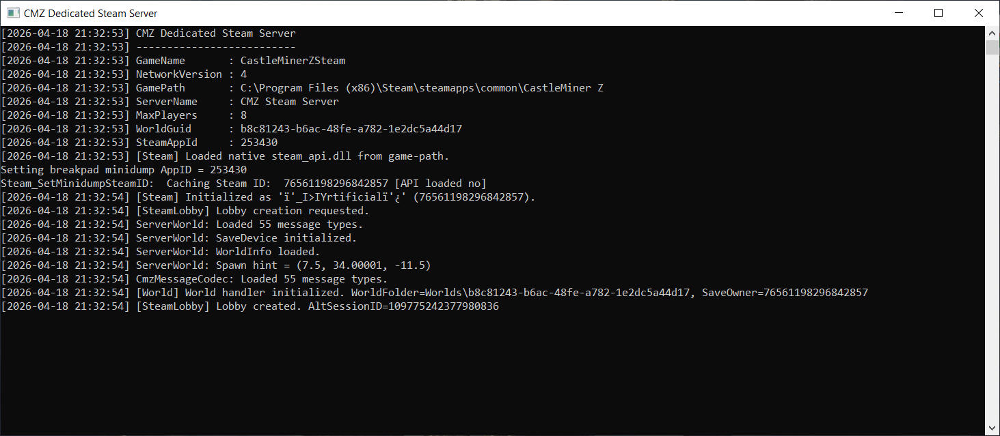

# CMZDedicatedSteamServer

> Host a **Steam-native CastleMiner Z dedicated server** outside the normal game window, advertise it through the Steam browser flow, and run it under a real logged-in Steam account.

**CMZDedicatedSteamServer** is the Steam transport companion project for CastleForge. It is built in **C# / .NET Framework 4.8.1**, loads the original CastleMiner Z runtime through **reflection**, initializes the normal **Steam client API path**, creates a Steam-hosted session/lobby, and runs dedicated host logic without opening the playable game window.

> **Transport note:** **CMZDedicatedSteamServer** is the **Steam-native** dedicated-server transport for CastleForge. It is separate from **CMZDedicatedLidgrenServer**, which is the **Lidgren / direct-IP** transport for manual IP-based workflows.

> **Current status:** this project is intended for the CastleForge Steam hosting workflow and is still evolving. Treat it as an advanced / in-progress dedicated-server option rather than a drop-in anonymous Steam game-server replacement.



---

## Why use CMZDedicatedSteamServer?

CastleMiner Z's normal Steam multiplayer flow was designed around the live game host, not a standalone server executable. **CMZDedicatedSteamServer** moves that hosting flow into a dedicated process so you can bring up a Steam-visible host without leaving the normal game window running.

That gives you a cleaner setup for:
- Steam-browser visibility
- dedicated testing and development
- hosting under a separate Steam account
- server-side world and inventory persistence
- pairing with **DirectConnect** for quick frontend launch convenience

### Highlights
- **Dedicated executable host** for the Steam transport path.
- Uses the **normal Steam client API path** under a real logged-in Steam account.
- Creates a **Steam-visible lobby/session** for CastleMiner Z-compatible clients.
- Loads the original game/runtime assemblies through **reflection**.
- Supports a configurable **`game-path`** instead of forcing a hardcoded install path.
- Loads Harmony from a local **`Libs`** folder.
- Uses packaged **server.properties**, world, and inventory layout similar to the Lidgren server package.
- Does **not** open the playable CastleMiner Z game window.
- Can be launched from **DirectConnect** using **Launch Dedicated (Steam)**.

---

## What this project does

### 1) Starts a dedicated Steam-native CastleMiner Z host
This project boots a dedicated process that initializes Steam, creates a Steam session/lobby, and exposes a CastleMiner Z-compatible hosted session without leaving the normal playable client open.

### 2) Loads game/runtime assemblies dynamically
Instead of compiling directly against the full game as a normal shared project dependency, the host loads:
- `CastleMinerZ.exe`
- `DNA.Common.dll`
- `DNA.Steam.dll`
- related runtime dependencies

This keeps the host flexible and lets it work from a configurable game install path.

### 3) Uses the active logged-in Steam account
This transport is built around the **normal SteamAPI path** under a real logged-in Steam account.

That means:
- Steam must already be running
- the server process must run under the **same Windows user context** as Steam
- the active Steam account should own CastleMiner Z

### 4) Keeps world flow on the server
Like the Lidgren server path, the Steam dedicated server is designed around host-side handling for world, chunk, inventory, and time-related flow rather than relying on a normal in-game host.

### 5) Uses a packaged dedicated-server layout
The runtime package is designed to feel familiar if you already use the Lidgren dedicated server:
- local `Libs`
- local `Inventory`
- local `Worlds`
- local `server.properties`
- optional `RunServer.bat`

### 6) Pairs well with DirectConnect
While Steam clients can use the online browser flow, **DirectConnect** also provides a convenient **Launch Dedicated (Steam)** button that closes the game first and then starts the Steam dedicated server from the frontend.

---

## Key differences from the Lidgren server

| CMZDedicatedLidgrenServer | CMZDedicatedSteamServer |
|---|---|
| Direct-IP / Lidgren transport | Steam-native transport |
| Best paired with **Direct Connect** for joining by IP | Intended for Steam-browser / Steam-hosted session workflows |
| Does not require the live Steam client runtime to host | Requires a real logged-in Steam client session |
| Best for local, private, or direct-IP hosting | Best for Steam-visible hosting and Steam-session workflows |

---

## How to use it

### Quick start
1. Build or obtain `CMZDedicatedSteamServer.exe`.
2. Make sure Steam is already running under the same Windows user context.
3. Edit `server.properties`.
4. Launch `CMZDedicatedSteamServer.exe` or `RunServer.bat`.
5. Confirm the server reaches Steam initialization and lobby/session creation.
6. Join from a compatible CastleMiner Z Steam client through the intended Steam workflow.

### Typical local test flow
1. Sign into the Steam account you want the server to host under.
2. Set `game-path` to your CastleMiner Z Steam install folder.
3. Start the dedicated Steam server.
4. Verify the server creates a Steam-visible session/lobby.
5. Join from another compatible Steam client/account.
6. Validate session visibility, world loading, inventory flow, and gameplay/bootstrap behavior.

## Local Test Workflow


---

## Installation

### Requirements
- Windows
- **.NET Framework 4.8.1**
- Steam installed and already running
- CastleMiner Z game files available somewhere on disk
- A Steam account that can host through the normal Steam client API path
- Optional but recommended: **DirectConnect** for frontend launch convenience

### Build output / packaged layout
The project is configured to output into a CastleForge-style runtime folder like this:

```text
!Mods\CMZDedicatedSteamServer\
```

A typical packaged runtime layout looks like:

```text
!Mods\CMZDedicatedSteamServer\
├─ CMZDedicatedSteamServer.exe
├─ RunServer.bat
├─ server.properties
├─ steam_appid.txt
├─ Libs/
│  └─ 0Harmony.dll
├─ Game/
│  └─ README.txt
├─ Inventory/
│  └─ default.inv
└─ Worlds/
   └─ {world-guid}/
      └─ world.info
```

### Game files
This repository/package intentionally does **not** ship the original CastleMiner Z game files.

You can either:
- point `game-path` to your real CastleMiner Z Steam install folder elsewhere on disk, or
- copy the required game files into the local layout you use for your dedicated package

Required runtime files include:
- `CastleMinerZ.exe`
- `DNA.Common.dll`
- `DNA.Steam.dll`
- `steam_api.dll`

---

## Configuration

The server reads configuration from `server.properties` in the server root.

### Example

```properties
# Server identity / compatibility
server-name=CMZ Steam Server
game-name=CastleMinerZSteam
network-version=4

# Bind / limits
server-ip=0.0.0.0
server-port=61903
max-players=8
password=

# Game files
game-path=C:\Program Files (x86)\Steam\steamapps\common\CastleMiner Z

# Steam runtime / hosting behavior
steam-app-id=253430
steam-lobby-visible=true
steam-allow-minimal-updates=false
steam-account-required=true
steam-friends-only=false
write-steam-appid-file=true
require-running-steam-client=true

# Save / world identity
save-owner-steam-id=0
world-guid=

# Host view / update loop
view-distance-chunks=8
tick-rate-hz=60

# Session gameplay values
game-mode=1
pvp-state=0
difficulty=1
infinite-resource-mode=false

# Optional behavior
allow-client-time-sync=false
```

### Config fields

| Key | Purpose |
|-------------------------------|--------------------------------------------------------------------------------------------------------------------------------------------------|
| `server-name`                 | Display name shown in Steam-hosted session/server info.                                                                                          |
| `game-name`                   | Expected CastleMiner Z network game name.                                                                                                        |
| `network-version`             | Expected protocol/network version.                                                                                                               |
| `server-ip`                   | Local IP used by the host process.                                                                                                               |
| `server-port`                 | Host/server port setting used by the dedicated process.                                                                                          |
| `max-players`                 | Maximum number of connected players.                                                                                                             |
| `password`                    | Optional session password.                                                                                                                       |
| `game-path`                   | Path to the CastleMiner Z Steam binaries folder.                                                                                                 |
| `steam-app-id`                | Steam App ID for CastleMiner Z.                                                                                                                  |
| `steam-lobby-visible`         | Whether the Steam-hosted lobby/session is visible.                                                                                               |
| `steam-allow-minimal-updates` | Allows reduced/minimal Steam update behavior if your runtime supports it.                                                                        |
| `steam-account-required`      | Documents that this transport expects a real logged-in Steam account.                                                                            |
| `steam-friends-only`          | Restricts the hosted session to friends-only visibility if enabled.                                                                              |
| `write-steam-appid-file`      | Writes `steam_appid.txt` beside the server EXE at startup.                                                                                       |
| `require-running-steam-client`| Documents that Steam must already be running before launch.                                                                                      |
| `save-owner-steam-id`         | Steam ID used for save identity. `0` means use the currently logged-in Steam account automatically.                                             |
| `world-guid`                  | GUID of the world folder to load under `Worlds\{guid}`.                                                                                         |
| `view-distance-chunks`        | Host-side chunk view radius used for chunk-related behavior.                                                                                     |
| `tick-rate-hz`                | Main update loop rate in Hz.                                                                                                                     |
| `game-mode`                   | Session game mode numeric value.                                                                                                                 |
| `pvp-state`                   | Session PVP numeric value.                                                                                                                       |
| `difficulty`                  | Session difficulty numeric value.                                                                                                                |
| `infinite-resource-mode`      | Enables/disables infinite-resource session metadata.                                                                                             |
| `allow-client-time-sync`      | Allows client-sent `TimeOfDayMessage` packets to update server time. Recommended to leave `false` unless you intentionally want that behavior. |

---

## Running

After deployment, start the server with either:

```bat
CMZDedicatedSteamServer.exe
```

or:

```bat
RunServer.bat
```

On startup, the host should print a summary similar to:

```text
CMZ Dedicated Steam Server
--------------------------
GameName       : CastleMinerZSteam
NetworkVersion : 4
GamePath       : C:\Program Files (x86)\Steam\steamapps\common\CastleMiner Z
ServerName     : CMZ Steam Server
MaxPlayers     : 8
WorldGuid      : ...
SteamAppId     : 253430
[Steam] Loaded native steam_api.dll from game-path.
[Steam] Initialized as 'YourHostAccount' (...)
[SteamLobby] Lobby creation requested.
[SteamLobby] Lobby created. AltSessionID=...
```

---

## Compatibility Notes

CMZDedicatedSteamServer is intended for a **CastleMiner Z-compatible Steam hosting workflow** built around the original runtime and the normal Steam client API path.

It is especially useful for:
- Steam-browser visibility goals
- dedicated testing and development
- hosting under a separate Steam account
- pairing with **DirectConnect** for quick launch convenience

### Important notes
- The project expects access to the original CastleMiner Z runtime files.
- It does **not** bundle the original game files.
- Steam must already be running before the dedicated server starts.
- The dedicated server process should run under the **same Windows user context** as the Steam client.
- This project is **not** the anonymous Steam GameServer API path.
- Session compatibility still depends on matching client/server expectations such as `game-name` and `network-version`.

---

## Server Plugins

CastleForge Dedicated Servers now include basic **server-side plugin support** for host-authoritative world protections and future server extensions.

Plugins run inside the dedicated server process and can inspect selected host/world packets before the server applies or relays them. This allows the server to enforce rules even when connecting players do **not** have the matching client-side mod installed.

Current built-in plugin support includes:

- **RegionProtect** server enforcement
- block mining / placing protection
- explosion protection
- crate item protection
- crate break protection
- per-world plugin configuration

> Server plugins are currently compiled into the dedicated server build. External plugin DLL loading may be added later.

## RegionProtect Server Plugin

The dedicated servers include a built-in **RegionProtect** plugin that protects configured world areas directly from the server.

Unlike the normal client/host RegionProtect mod, the dedicated server version does not require players to install anything client-side. The server checks protected actions before saving or relaying world changes.

### Protected actions

RegionProtect currently protects:

| Action                  | Packet handled                                     | Description                                              |
|-------------------------|----------------------------------------------------|----------------------------------------------------------|
| Mining / block breaking | `AlterBlockMessage`                                | Blocks protected terrain removal                         |
| Block placing           | `AlterBlockMessage`                                | Blocks protected block placement                         |
| Explosions              | `DetonateExplosiveMessage` / `RemoveBlocksMessage` | Blocks protected explosion damage                        |
| Crate item edits        | `ItemCrateMessage`                                 | Blocks adding/removing crate contents in protected areas |
| Crate breaking          | `DestroyCrateMessage`                              | Blocks crate destruction in protected areas              |

### Config location

RegionProtect stores its configuration beside each dedicated server executable:

```text
CMZDedicatedLidgrenServer/
└─ Plugins/
   └─ RegionProtect/
      ├─ RegionProtect.Config.ini
      └─ Worlds/
         └─ <world-guid>/
            └─ RegionProtect.Regions.ini
````

For the Steam dedicated server:

```text
CMZDedicatedSteamServer/
└─ Plugins/
   └─ RegionProtect/
      ├─ RegionProtect.Config.ini
      └─ Worlds/
         └─ <world-guid>/
            └─ RegionProtect.Regions.ini
```

### General config

`RegionProtect.Config.ini` controls which protection systems are enabled:

```ini
[General]
Enabled                = true
ProtectMining          = true
ProtectPlacing         = true
ProtectExplosions      = true
ProtectCrateItems      = true
ProtectCrateMining     = true
WarnPlayers            = true
WarningCooldownSeconds = 2
LogDenied              = true
```

### Region config

Each world has its own `RegionProtect.Regions.ini` file:

```ini
[SpawnProtection]
Enabled        = true
Range          = 64
AllowedPlayers = RussDev7

[Region:SpawnTown]
Min            = -80,0,-80
Max            = 80,120,80
AllowedPlayers = RussDev7,SomeAdmin
```

### Player warning behavior

When a player tries to edit a protected area, the server blocks the action and sends a warning such as:

```text
[RegionProtect] Protected by region 'SpawnTown'. Breaking blocks here was blocked. Client-only desync; not saved to server.
```

In some cases, the client may briefly show a block as broken or changed. The server does **not** save that blocked change, and the area will correct itself after resyncing or rejoining.

### Notes and limitations

* RegionProtect is server-authoritative.
* Players do not need the RegionProtect mod installed to be blocked by protected regions.
* Commands such as `/regionpos` and `/regioncreate` are not currently part of the dedicated server plugin.
* Regions are currently edited manually through the `.ini` files.
* Explosion restoration can visually desync on the attacking client, but protected explosion damage is not saved to the server.

---

## Troubleshooting

<details>
<summary><strong>The server says Steam initialization failed</strong></summary>

Check that:
- Steam is already running
- the dedicated server process is using the same Windows user context as Steam
- the active Steam account has access to CastleMiner Z
- `steam_api.dll` is available through the configured game path

</details>

<details>
<summary><strong>The server says the game folder or required runtime files are missing</strong></summary>

Make sure the host can find the real CastleMiner Z files through `game-path` or your local runtime layout.

Expected files include:

```text
CastleMinerZ.exe
DNA.Common.dll
DNA.Steam.dll
steam_api.dll
```

</details>

<details>
<summary><strong>The server starts but does not appear in the browser</strong></summary>

Check:
- `steam-lobby-visible=true`
- `game-name`
- `network-version`
- `game-mode`
- `difficulty`
- `pvp-state`
- `infinite-resource-mode`

Also verify that the server completed Steam initialization and reached lobby/session creation in the startup log.

</details>

<details>
<summary><strong>Joining hangs or behaves unexpectedly</strong></summary>

This project is part of an evolving Steam-native dedicated-server workflow.

If you are troubleshooting join issues, verify:
- both sides are using compatible CastleForge / CastleMiner Z expectations
- the server successfully created its Steam-hosted session
- the client and server agree on `game-name` and `network-version`
- your world/inventory/runtime layout is valid

</details>

<details>
<summary><strong>The wrong world loads</strong></summary>

Verify:

```properties
world-guid=...
```

and make sure the matching folder exists under:

```text
Worlds\{world-guid}
```

</details>

---

## Technical Overview

<details>
<summary><strong>Main Components</strong></summary>

### `Program.cs`
Entry point for the dedicated Steam host.

It:
- loads `server.properties`
- resolves the game binaries folder from `game-path`
- resolves support libraries from `Libs`
- loads `CastleMinerZ.exe` and related assemblies
- applies Harmony patches
- prints a startup summary
- starts the Steam dedicated host and enters the update loop

### `Hosting/SteamDedicatedServer.cs`
The main Steam-hosting runtime.

It is responsible for:
- Steam-side host setup
- lobby/session creation flow
- peer tracking
- connection approval flow
- channel/data routing
- host-side message/bootstrap handling
- dedicated update-loop behavior

### `Steam/SteamServerBootstrap.cs`
Steam runtime bootstrap helper.

It handles:
- locating/loading Steam runtime components
- writing `steam_appid.txt` when configured
- initializing the normal Steam client API path
- resolving the active host Steam identity

### `World/ServerWorldHandler.cs`
Host-side world and persistence bridge shared conceptually with the dedicated hosting workflow.

It handles:
- `world.info` loading
- save device initialization
- chunk request / chunk cache flow
- inventory persistence
- host-consumed world messages
- time-of-day handling

### `Config/SteamServerConfig.cs`
Loads and validates typed config values from `server.properties`, supplies defaults, and derives world-related paths.

</details>

---

## Original standalone project

This CastleForge version of **CMZDedicatedLidgrenServer** is based on and evolves the earlier standalone dedicated-server project:

- [CMZDedicatedServers](https://github.com/RussDev7/CMZDedicatedServers)

## License

This project is licensed under **GPL-3.0-or-later**.
See [LICENSE](LICENSE) for details.

## Credits

Developed and maintained by:
- RussDev7
- unknowghost0
