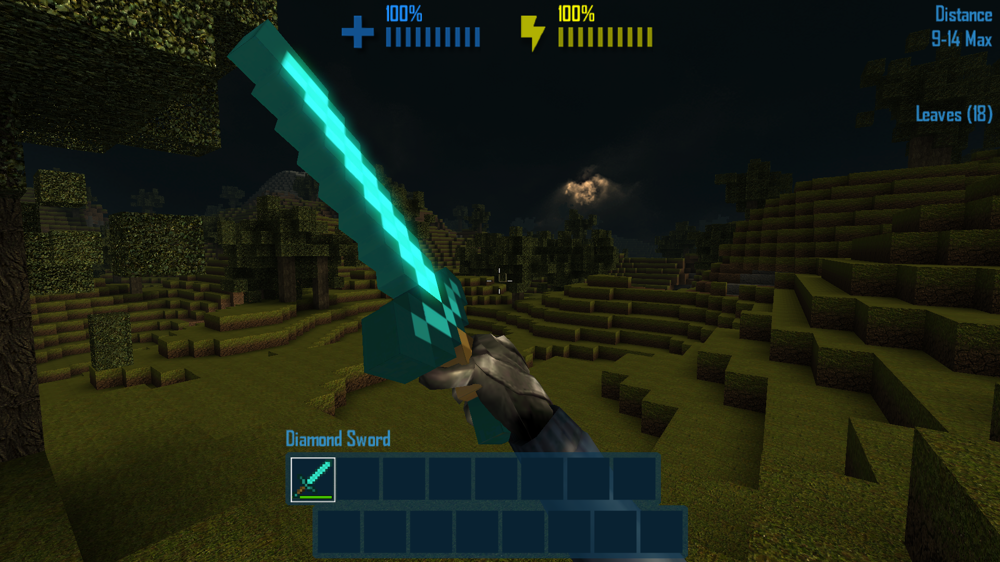
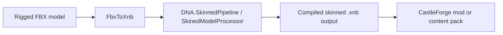

# DNA.SkinnedPipeline

> Compile CastleMiner Z / DNA-style **skinned FBX models** into runtime-friendly `.xnb` assets by pairing a custom XNA pipeline extension with **FbxToXnb**.

<p align="center">
  
  
</p>

---

## Overview

**DNA.SkinnedPipeline** is a CastleForge authoring tool that provides the missing piece for **skinned** model conversion.

On its own, **FbxToXnb** can already compile normal static FBX models through the XNA pipeline. But skinned assets often need more than the stock `ModelProcessor` if you want them to load cleanly in a CastleMiner Z / DNA-style runtime.

That is exactly what this project provides.

It ships a custom XNA content pipeline extension named **`SkinedModelProcessor`** that:

- starts from XNA’s stock `ModelProcessor`,
- preserves the processed bone hierarchy,
- builds a DNA-compatible `Skeleton`,
- computes inverse bind pose matrices,
- attaches runtime skinning metadata into `Model.Tag`, and
- includes writer classes that force the `.xnb` manifest to bind to the game’s expected runtime readers.

In plain terms, this tool exists so that **skinned content can be compiled in a way the game actually understands**.

---

## Why this tool stands out

### Built specifically around CMZ / DNA runtime expectations
This is not a generic “maybe it works” skinned model helper. It is shaped around the way the DNA runtime expects skeleton and animation-related data to be stored in compiled content.

### Uses a real XNA pipeline extension instead of a post-build hack
Rather than editing compiled files after the fact, it plugs into the content pipeline properly through a custom processor and custom writers.

### Produces `Model.Tag` skinning metadata
The processor attaches **`SkinedAnimationData`** directly into the compiled model so runtime code can reconstruct skeleton state and apply the inverse bind pose.

### Includes runtime-reader-safe writers
The included writers force the `.xnb` to bind to the game’s own reader types instead of relying on reflective reader behavior that may not match what the runtime expects.

### Works naturally with `FbxToXnb`
This project is designed to pair with **FbxToXnb**. It even includes a drag-and-drop batch file that calls `FbxToXnb.exe` with the correct processor and pipeline DLL path.

---

## What ships with DNA.SkinnedPipeline

This project includes:

- **`DNA.SkinnedPipeline.dll`**
- **`SkinedModelProcessor`** content processor
- **`SkeletonWriter`**
- **`AnimationClipWriter`**
- **`FbxToXnb_Drop_Skinned.bat`**
- deploy logic that places the processor DLL beside the rest of the FbxToXnb authoring toolchain

This makes it both a **pipeline extension** and a **creator-facing utility companion**.

---

## How it fits into CastleForge

`DNA.SkinnedPipeline` belongs under your **Tools** section, not your gameplay mod catalog.

It is best thought of as part of the content-authoring workflow:



This is especially useful when you are preparing assets for systems like:

- custom model-driven mods,
- advanced content packs,
- experimental creature or character assets,
- or future CastleForge tooling that expects DNA-style skinned model metadata.

---

## Key feature breakdown

### 1) Custom `SkinedModelProcessor`
The heart of this project is the custom XNA content processor:

```text
SkinedModelProcessor
```

This processor is registered with the display name above and is meant to be selected when building a **skinned FBX** instead of a normal rigid/static model.

Its flow is intentionally simple and predictable:

1. Let XNA’s stock `ModelProcessor` do the heavy lifting.
2. Read the processed bone hierarchy.
3. Build a DNA-compatible skeleton.
4. Compute absolute bind poses.
5. Invert those bind poses into inverse bind pose matrices.
6. Attach everything as `SkinedAnimationData` in `Model.Tag`.

That means the compiled asset carries the runtime skinning metadata along with it.

### 2) DNA-compatible skeleton generation
The processor builds the skeleton directly from the processed bone list.

It preserves:

- bone names,
- parent indices,
- local bind transforms,
- and the overall hierarchy order.

This is important for runtime systems that expect reliable bone lookup by name, such as muzzle points, hand bones, head bones, or named attachment bones.

### 3) Inverse bind pose generation
The processor computes absolute bind pose matrices and then inverts them.

That inverse bind pose array is one of the key pieces a runtime skinning system needs in order to deform the mesh correctly.

### 4) Runtime-safe `.xnb` reader binding
The two writer classes are a major part of why this project matters.

Instead of letting XNA pick a fallback reflective reader, the writers explicitly point compiled content back at the game’s expected runtime reader types.

That makes the output safer and more predictable for the DNA / CMZ runtime.

### 5) Drag-and-drop skinned conversion helper
The included batch file:

```text
FbxToXnb_Drop_Skinned.bat
```

acts as a convenience launcher.

It automatically calls `FbxToXnb.exe` with:

- the custom pipeline DLL path, and
- the `SkinedModelProcessor` processor name.

That means a creator can often just drag one or more `.fbx` files onto the batch file instead of typing the full command manually.

---

## Included components in detail

<details>
<summary><strong>SkinedModelProcessor</strong></summary>

This processor:

- inherits from XNA’s `ModelProcessor`,
- processes the source model with the stock XNA pipeline first,
- extracts bone names, parent indices, and local transforms,
- computes absolute bind pose transforms,
- builds inverse bind pose matrices,
- uses the DNA `Bone.BuildSkeleton(...)` helper to construct a `Skeleton`, and
- stores the final result as `SkinedAnimationData` in `Model.Tag`.

### Important note
The current implementation attaches an **empty animation clip dictionary**.

That prevents null-related runtime issues around skeleton data, but it also means this tool is currently focused on:

- skeleton-ready skinned models,
- bind-pose-aware output,
- and runtime compatibility,

rather than a full end-to-end animation extraction pipeline.

</details>

<details>
<summary><strong>SkeletonWriter</strong></summary>

`SkeletonWriter` serializes `DNA.Drawing.Skeleton` in the exact layout expected by the runtime reader.

It writes:

1. bone count,
2. bone name,
3. parent index,
4. local transform matrix.

It then forces the `.xnb` manifest to bind to:

```text
DNA.Drawing.Skeleton+Reader
```

That is one of the core compatibility pieces of the project.

</details>

<details>
<summary><strong>AnimationClipWriter</strong></summary>

`AnimationClipWriter` serializes `DNA.Drawing.Animation.AnimationClip` using the layout expected by the game’s own reader.

It writes:

1. clip name,
2. animation frame rate,
3. duration ticks,
4. bone count,
5. per-bone position / rotation / scale frame arrays.

It also defensively handles null clips by writing a safe empty clip instead of crashing the build path.

Even though clip extraction is not yet wired into `SkinedModelProcessor`, the writer is already present so the project has the proper serialization foundation in place.

</details>

---

## Installation

### Requirements

- Windows
- .NET Framework 4.8.1
- XNA Game Studio 4.0 pipeline references
- **FbxToXnb** companion tool
- access to the required CastleForge reference assemblies used by the project

---

## Quick start

### Easiest method: drag-and-drop
After building or packaging the tools, drag one or more `.fbx` files onto:

```text
FbxToXnb_Drop_Skinned.bat
```

That helper automatically routes the build through:

- `FbxToXnb.exe`
- `DNA.SkinnedPipeline.dll`
- `SkinedModelProcessor`

### Manual command-line method

You can also call the converter directly:

```powershell
FbxToXnb.exe "C:\Path\To\MyRiggedModel.fbx" --pipeline "C:\Path\To\DNA.SkinnedPipeline.dll" --processor "SkinedModelProcessor"
```

### Batch conversion

Because the batch file loops over all dropped arguments, you can drag multiple FBX files onto it in one shot.

---

## Recommended creator workflow

### 1) Prepare the source asset
Author and export your rigged model as `.fbx` from your DCC tool.

### 2) Keep textures organized
Place the textures where the converter can stage them during build.

A clean layout like this works well:

```text
MyRiggedAsset/
├─ Alien.fbx
├─ Alien.png
└─ textures/
   ├─ emissive.png
   └─ normal.png
```

### 3) Build with the skinned processor
Use `FbxToXnb_Drop_Skinned.bat` or the manual command line.

### 4) Review the compiled output
The compiled `.xnb` files will be generated into a dedicated output folder named after the source FBX.

### 5) Move the result into your pack or mod asset layout
Once compiled, place the generated `.xnb` files wherever your CastleForge mod or content pack expects them.

---

## Example output pattern

If you build:

```text
C:\Models\Alien.fbx
```

you should expect output in a folder named after the asset, such as:

```text
C:\Models\Alien\
├─ Alien.xnb
├─ texture.xnb
└─ other compiled dependency .xnb files
```

This isolated-per-asset layout helps avoid collisions between generic dependency names like `texture.xnb`.

---

## When to use this tool

Use **DNA.SkinnedPipeline** when your FBX is:

- rigged,
- bone-driven,
- expected to carry skeleton information at runtime,
- or intended for a DNA / CMZ runtime path that expects skinning metadata in `Model.Tag`.

Use normal **FbxToXnb** processing without this extension when your model is simply:

- a rigid item,
- a static prop,
- a weapon model with no real skeleton requirement,
- or any other plain model that is fine with the stock `ModelProcessor`.

---

## Limitations and important notes

### Animation clip extraction is not implemented yet
This is the single biggest behavior note to call out.

The processor currently builds and attaches:

- the skeleton,
- inverse bind pose data,
- and an empty clip dictionary.

So this project is already excellent for **runtime-compatible skinned model structure**, but it is **not yet a full animation extraction pipeline**.

### The processor name intentionally uses `Skined`, not `Skinned`
The processor name is:

```text
SkinedModelProcessor
```

That spelling matters because it is the name used by the pipeline registration and helper batch file.

### This is a companion tool, not a standalone in-game mod
It does not add gameplay by itself. Its job is to help creators build assets correctly.

---

## Troubleshooting

<details>
<summary><strong>“Cannot find content processor”</strong></summary>

This usually means `FbxToXnb` was not given the pipeline DLL or pipeline folder that contains `DNA.SkinnedPipeline.dll`.

Make sure you either:

- use `FbxToXnb_Drop_Skinned.bat`, or
- manually pass `--pipeline` or `--pipelineDir`.

</details>

<details>
<summary><strong>The model builds, but runtime skinning still does not behave correctly</strong></summary>

Double-check:

- exported bone hierarchy,
- bind pose correctness,
- bone naming,
- and whether your runtime code expects real animation clips instead of only skeleton data.

The current processor provides the skeleton and inverse bind pose foundation, but not full clip extraction.

</details>

<details>
<summary><strong>I am building a normal static model. Do I need this?</strong></summary>

Probably not.

If the asset is just a static model, use the normal FbxToXnb flow with the default `ModelProcessor`.

</details>

---

## Best pairing inside CastleForge

This tool pairs especially well with:

- **FbxToXnb** for compiling the source FBX,
- **WeaponAddons** when you are preparing advanced model assets for creator workflows,
- and future CastleForge toolchains that need runtime-safe skinned model content.

---

## Summary

**DNA.SkinnedPipeline** is the CastleForge tool that turns **FbxToXnb** from a normal FBX compiler into a **CMZ / DNA-aware skinned model pipeline**.

If you need skeleton metadata, inverse bind pose data, and reader-compatible `.xnb` output for a rigged model, this is the piece that makes the workflow feel complete.