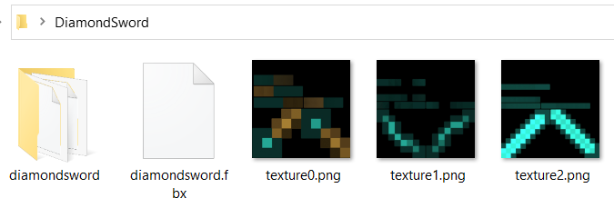

# FbxToXnb

> Convert one or more `.fbx` models into XNA-ready `.xnb` output with a workflow built for CastleForge creators, drag-and-drop usage, isolated output folders, and optional custom pipeline processors.


---

## Overview

**FbxToXnb** is a CastleForge content-authoring tool that compiles **FBX model files into XNB assets** using the **XNA Game Studio 4.0 Content Pipeline**.

At its simplest, it gives creators an easy way to take a model like:

```text
MyWeapon.fbx
```

and turn it into something the XNA-era content pipeline can actually load at runtime:

```text
MyWeapon.xnb
```

But the tool goes beyond a one-shot converter.

It is designed to make the conversion workflow friendlier and safer by:

- supporting drag-and-drop,
- supporting interactive console usage,
- supporting batch conversion,
- compiling each model into its own output folder,
- staging texture files into a temporary build root,
- helping detect or install XNA pipeline dependencies,
- and allowing advanced creators to inject a **custom pipeline extension** such as **`DNA.SkinnedPipeline`**.

That makes it one of the most useful pieces in the CastleForge tooling stack for model authors.

---

## Why this tool stands out

### Drag-and-drop friendly
You can drop one or more `.fbx` files directly onto the included batch file and let the tool handle the rest.

### Interactive mode for repeated testing
If you launch the EXE with no FBX arguments, it enters an interactive mode where you can keep feeding it files and options without relaunching the tool every time.

### Isolated output folders per asset
Each FBX compiles into its own folder named after the source asset. That helps prevent common collisions with generic filenames like `texture.xnb`.

### Texture staging without messing up your source folder
The tool stages candidate texture files into a temporary build folder so the XNA pipeline can resolve them, while keeping your original source folder unchanged.

### Supports custom processors
For standard static assets, the default XNA `ModelProcessor` is fine. For skinned or DNA-specific assets, the tool can route the build through a custom processor like **`SkinedModelProcessor`** from **DNA.SkinnedPipeline**.

### Helps with missing XNA pipeline bits
If the required XNA Game Studio pipeline references are not installed, the tool can prompt to install them using an embedded MSI.

---

## What ships with FbxToXnb

This project includes:

- **`FbxToXnb.exe`**
- **`FbxToXnb_Drop_Normal.bat`**
- **`README.txt`**
- embedded **`XNA Game Studio Shared.msi`** for dependency setup
- the internal build wrapper around XNA’s `BuildContent` task
- optional support for custom pipeline DLLs / folders

This makes it both a simple end-user converter and a more advanced authoring utility.

---

## How it fits into CastleForge

Within the CastleForge layout, this belongs under:

```text
CastleForge/
└─ CastleForge/
   └─ Tools/
      └─ FbxToXnb/
         └─ README.md
```

This is not a gameplay mod. It is a **creator tool** that sits in the pipeline between raw art assets and mod-ready compiled content.


It pairs especially well with:

- **WeaponAddons** for custom model-driven weapon packs,
- **DNA.SkinnedPipeline** for rigged or skinned assets,
- and any CastleForge workflow that needs XNA-compatible compiled content.

---

## Core feature breakdown

### 1) FBX to XNB conversion
The main job of the tool is straightforward:

- accept one or more `.fbx` files,
- build them through the XNA content pipeline,
- emit compiled `.xnb` output.

### 2) One output folder per source asset
Instead of dumping all compiled content into one shared directory, the tool builds each model into its own folder named after the FBX file stem.

That means something like:

```text
C:\Models\0051_Pistol_model.fbx
```

becomes:

```text
C:\Models\0051_Pistol_model\0051_Pistol_model.xnb
```

If the build also produces compiled dependency content, those files stay alongside it inside the same isolated folder.

This is a very practical quality-of-life choice because many models end up producing common dependency names like `texture.xnb`.

### 3) Temporary texture staging
Before the tool invokes the pipeline, it copies likely texture files into a temporary working folder.

That staging logic supports:

- textures next to the FBX,
- textures inside subfolders,
- multiple common texture extensions,
- preserved relative paths,
- and a legacy compatibility alias of `texture.png` when an `<AssetName>.png` sidecar exists.

That improves compatibility with exported FBX material references while keeping your original source folder untouched.

### 4) Interactive mode
If you start the EXE without passing any FBX files, the tool switches into interactive console mode.

That mode lets you:

- paste or drag paths into the console,
- keep options like pipeline directories and processor names loaded between commands,
- and repeatedly test builds without relaunching the program.

### 5) Custom pipeline support
Advanced users can pass one or more custom pipeline DLLs or directories using:

```text
--pipeline
--pipelineDir
```

This is how you hook in extensions such as:

- **DNA.SkinnedPipeline.dll**

That capability is what lets FbxToXnb handle both:

- normal rigid/static models, and
- custom CastleForge processing paths for skinned models.

### 6) BuildContent wrapper with logging
Internally, the tool wraps the XNA `BuildContent` pipeline task and captures:

- messages,
- warnings,
- errors,
- and optional log-file output.

When a build fails, it tries to surface the first useful error line to speed up troubleshooting.

### 7) XNA pipeline dependency setup
If the required XNA content pipeline DLLs are not detected, the tool can prompt to install them via the embedded **XNA Game Studio Shared** MSI.

That helps reduce one of the most common setup headaches for older XNA workflows.

---

## Quick start

### Drag-and-drop method
The included batch file is the easiest entry point for standard models:

```text
FbxToXnb_Drop_Normal.bat
```

Just drag one or more `.fbx` files onto it.

### Command-line method

```powershell
FbxToXnb.exe "C:\Path\To\MyModel.fbx"
```

You can also pass multiple files:

```powershell
FbxToXnb.exe "C:\Path\To\A.fbx" "C:\Path\To\B.fbx"
```

### Interactive mode
Run the EXE without FBX arguments:

```powershell
FbxToXnb.exe
```

Then drag or paste paths into the console window and press Enter.

Type:

```text
help
```

for flags, or:

```text
exit
```

to quit.

---

## Advanced usage

### Use a custom processor
For a skinned model or a custom CastleForge pipeline extension:

```powershell
FbxToXnb.exe --processor SkinedModelProcessor --pipelineDir "C:\Path\To\PipelineBin" "C:\Path\To\Alien.fbx"
```

### Use a direct DLL path instead of a folder

```powershell
FbxToXnb.exe --processor SkinedModelProcessor --pipeline "C:\Path\To\DNA.SkinnedPipeline.dll" "C:\Path\To\Alien.fbx"
```

### Use the environment variable for repeated sessions
The tool also supports:

```text
CMZ_PIPELINE=path1;path2;...
```

That makes it easier to keep your custom pipeline locations available automatically.

---

## Command-line reference

| Flag | Purpose |
|-----------------------------|-------------------------------------------------------------------|
| `--pipeline <dllOrDir>`     | Adds a custom pipeline DLL or folder. Repeatable.                 |
| `--pipelineDir <dir>`       | Same idea as `--pipeline`, but clearer when pointing at a folder. |
| `--processor <name>`        | Overrides the FBX processor name, such as `SkinedModelProcessor`. |
| `--help`                    | Shows help text.                                                  |

### Default processor behavior
If you do not provide a processor override, the build path uses the normal XNA:

```text
ModelProcessor
```

That is ideal for static or rigid assets.

---

## Recommended folder layout

A clean authoring folder might look like this:

```text
MyAsset/
├─ MyAsset.fbx
├─ MyAsset.png
├─ textures/
│  ├─ emissive.png
│  └─ trim.png
└─ materials/
   └─ detail.jpg
```

After conversion, you will typically get:

```text
MyAsset/
├─ MyAsset.fbx
├─ MyAsset.png
├─ textures/
│  ├─ emissive.png
│  └─ trim.png
├─ materials/
│  └─ detail.jpg
└─ MyAsset/
   ├─ MyAsset.xnb
   ├─ texture.xnb
   └─ other compiled dependency .xnb files
```

That nested output folder is intentional.

It keeps each model’s compiled output self-contained and avoids overwriting another model’s dependency files.



---

## How texture discovery works

The texture staging logic is one of the nicest quality-of-life parts of the tool.

It searches the source directory recursively for likely texture files, including:

- `.png`
- `.jpg`
- `.jpeg`
- `.bmp`
- `.tga`
- `.dds`

Those files are copied into a temporary working directory while preserving relative paths.

That means an FBX that references textures in subfolders has a much better chance of compiling cleanly.

### Sidecar texture compatibility
If a sidecar PNG exists with the same base name as the FBX, the tool also exposes a compatibility alias named:

```text
texture.png
```

inside the temp build root.

That is particularly helpful for exports that expect a generic texture name.

---

## Output behavior

### Example input

```text
C:\Models\Alien.fbx
```

### Example output

```text
C:\Models\Alien\
├─ Alien.xnb
├─ texture.xnb
└─ additional compiled dependency .xnb files
```

### Why this layout matters
Many model pipelines generate dependency names like:

- `texture.xnb`
- `texture_0.xnb`
- `texture_1.xnb`

If every asset compiled into the same shared output directory, those generic names would collide constantly.

The per-asset folder approach avoids that problem.

---

## Build behavior under the hood

<details>
<summary><strong>XNA target settings</strong></summary>

The tool builds content for:

- **Target Platform:** `Windows`
- **Target Profile:** `Reach`
- **Content Compression:** enabled

</details>

<details>
<summary><strong>Pipeline assembly resolution</strong></summary>

The tool resolves the required XNA Game Studio 4.0 content pipeline DLLs from:

1. a caller-provided location,
2. the default XNA install path,
3. or an app-local fallback.

It can also expand extra pipeline DLLs from a directory when you pass custom pipeline locations.

</details>

<details>
<summary><strong>Environment setup</strong></summary>

The tool ensures the `XNAGSv4` environment variable is available when possible, which helps older XNA tooling locate the expected Game Studio root.

</details>

<details>
<summary><strong>Cleanup behavior</strong></summary>

The converter stages builds through temporary work and intermediate directories, then restores the original working directory and attempts to clean the temporary folders on completion.

</details>

---

## Installation

### Requirements

- Windows
- .NET Framework 4.8.1
- XNA Game Studio 4.0 content pipeline reference DLLs

### If XNA references are missing
On startup, the tool can prompt to install the missing XNA pipeline references through the embedded **XNA Game Studio Shared.msi**.

### Typical working folder
Your built toolchain will commonly look something like this:

```text
!Mods/
└─ TexturePacks/
   └─ _FbxToXnb/
      ├─ FbxToXnb.exe
      ├─ FbxToXnb_Drop_Normal.bat
      ├─ FbxToXnb_Drop_Skinned.bat (via DNA.SkinnedPipeline)
      ├─ README.txt
      ├─ XNA-related dependencies
      └─ optional custom pipeline folders
```

---

## Best use cases

FbxToXnb is especially useful for:

- custom weapon model workflows,
- preparing `.xnb` assets for pack-based systems,
- converting rigid/static models for CastleForge mods,
- experimenting with XNA-compatible asset compilation,
- and pairing with **DNA.SkinnedPipeline** for more advanced skinned content.

---

## Troubleshooting

<details>
<summary><strong>“Build failed. Check logfile.txt / builder errors.”</strong></summary>

When a build fails, look at the first surfaced builder error and check for:

- missing XNA content pipeline references,
- missing texture files,
- mismatched texture filenames referenced by the FBX,
- or a missing custom processor DLL.

</details>

<details>
<summary><strong>“Cannot find content processor”</strong></summary>

This usually means you requested a processor like `SkinedModelProcessor` without also providing the required pipeline DLL or pipeline directory.

Pass `--pipeline` or `--pipelineDir`, or use the skinned drag-and-drop helper that comes with **DNA.SkinnedPipeline**.

</details>

<details>
<summary><strong>The FBX references textures, but the build still fails</strong></summary>

Check whether the exported FBX expects exact filenames or relative subfolder paths. The tool stages likely texture files recursively, but the exported material references still need to line up with the files you actually provide.

</details>

<details>
<summary><strong>I only want static model conversion. Do I need DNA.SkinnedPipeline too?</strong></summary>

No.

For standard rigid/static models, the default `ModelProcessor` path is usually all you need.

</details>

---

## Summary

**FbxToXnb** is the CastleForge tool that turns raw `.fbx` files into **practical, XNA-ready `.xnb` assets** without making creators fight the content pipeline every single time.

It is simple enough for drag-and-drop use, but flexible enough to support custom processors, batch workflows, texture staging, and older XNA dependency handling when your authoring pipeline gets more advanced.