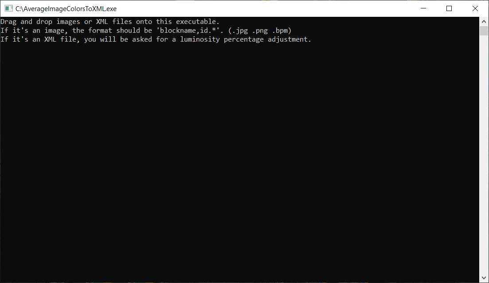
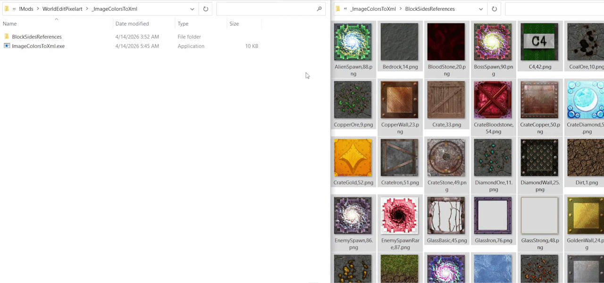
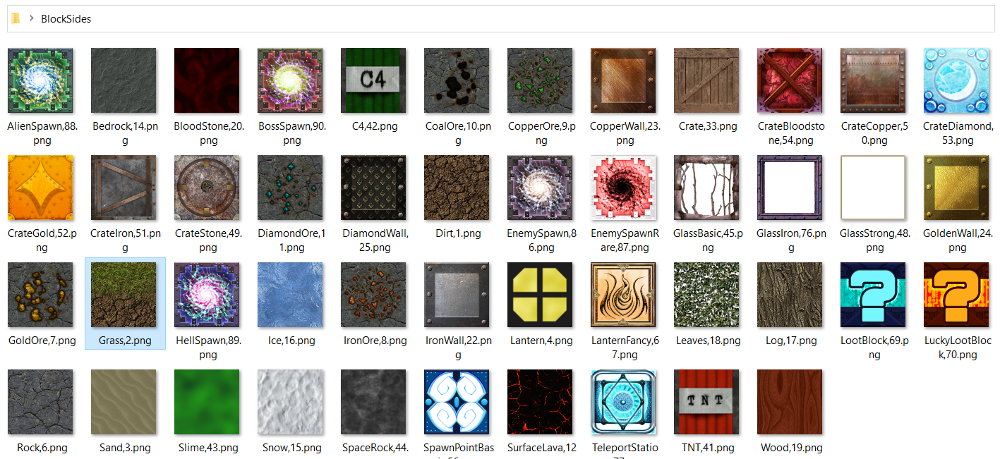

# ImageColorsToXml

<div align="center">
    <b>🧪 Screenshot ➜ 🎨 Average Color ➜ 📄 XML Palette</b>
</div>
<div align="center">
    Build `BlockColors.xml` palette files from block screenshots, then optionally brighten or rebalance them for use with <b>WorldEditPixelart</b> or other CastleMiner Z tooling.
</div>
<div align="center">
    
</div>

---

## Table of contents

- [What this tool does](#what-this-tool-does)
- [Why this tool is useful](#why-this-tool-is-useful)
- [Feature summary](#feature-summary)
- [Where it fits in CastleForge](#where-it-fits-in-castleforge)
- [Requirements](#requirements)
- [Installation](#installation)
- [Quick start](#quick-start)
- [Workflow A: Build a new BlockColors.xml palette](#workflow-a-build-a-new-blockcolorsxml-palette)
- [Workflow B: Brighten or rebalance an existing XML palette](#workflow-b-brighten-or-rebalance-an-existing-xml-palette)
- [Filename format rules](#filename-format-rules)
- [Supported input types](#supported-input-types)
- [Generated files](#generated-files)
- [Included starter reference pack](#included-starter-reference-pack)
- [XML format produced by the tool](#xml-format-produced-by-the-tool)
- [How this connects to WorldEditPixelart](#how-this-connects-to-worldeditpixelart)
- [Build and source notes](#build-and-source-notes)
- [Troubleshooting](#troubleshooting)
- [Credits](#credits)

---

## What this tool does

**ImageColorsToXml** is a lightweight companion utility that helps you build and adjust XML color palettes for block-based image conversion workflows.

It is designed around a very simple drag-and-drop flow:

- drop one or more block screenshots onto the executable
- let the tool calculate the **average color** of each image
- automatically write those results into a `BlockColors.xml` file
- optionally drop an existing XML palette onto the executable and apply a luminosity adjustment
- use the resulting XML in **WorldEditPixelart** or any other workflow that expects the same palette structure

This makes it much faster to build or refine a palette than manually typing dozens of `<Block ... />` entries by hand.

---

## Why this tool is useful

### It turns screenshots into a working palette
Instead of guessing colors or sampling everything manually, you can capture block faces, name the files correctly, and let the tool do the repetitive work.

### It matches the XML workflow used by WorldEditPixelart
The output is built for the same general palette format used by the Pixelart tooling, so it fits naturally into a CastleForge art pipeline.

### It is fast enough for bulk palette building
The tool processes dropped files in parallel, which is especially useful when generating a fresh palette from a large set of block screenshots.

### It can brighten an existing palette without rebuilding it from scratch
If a palette is technically correct but visually too dark in practice, you can generate a brighter variant in seconds.

### It stays lightweight
There is no large editor UI, no complicated setup, and no config file to maintain. It is a focused utility for one job: **building and adjusting palette XMLs**.

---

## Feature summary

| Area | What it does |
|---------------------|--------------------------------------------------------------------------------------|
| Palette creation    | Calculates average colors from dropped `.jpg`, `.png`, or `.bmp` files               |
| Metadata extraction | Reads the block `Name` and numeric `Id` directly from the image filename             |
| XML generation      | Writes a `BlockColors.xml` file in the expected block-palette structure              |
| XML adjustment      | Reads an existing XML and applies a luminosity percentage change to each block color |
| Batch processing    | Handles multiple dropped image files in one run                                      |
| Reference assets    | Ships with `BlockSidesReferences.zip` as a starter screenshot/reference pack         |
| Workflow fit        | Designed as a companion to **WorldEditPixelart** and similar CMZ palette workflows   |

---

## Where it fits in CastleForge

This project is best presented as a **tool**, not a gameplay mod.

Suggested location in the repo:

```text
CastleForge/
└─ Tools/
   └─ ImageColorsToXml/
      └─ README.md
```

When built from source using the included project settings, the executable is placed under the WorldEditPixelart runtime area:

```text
!Mods/WorldEditPixelart/_ImageColorsToXml/
```

That makes it easy to ship alongside the pixel-art workflow it supports.

---

## Requirements

### For normal use
- Windows
- The compiled `ImageColorsToXml.exe`
- Block screenshots named in the expected format

### For source builds
- Visual Studio / MSBuild setup capable of building **.NET Framework 4.8** projects
- `x86` build target
- `unsafe` code enabled (already configured in the project)

### For WorldEditPixelart integration
- **CastleForge ModLoader**
- **CastleForge ModLoaderExtensions**
- **WorldEdit**
- **WorldEditPixelart**

> **Important:** This tool can be used by itself, but its most natural use case is generating palettes for **WorldEditPixelart**.

---

## Installation

### For players / creators using a built release
Place the tool in a convenient folder, or keep it in the companion runtime location:

```text
!Mods/WorldEditPixelart/_ImageColorsToXml/
```

Then keep your source screenshots in the same folder or drag them in from anywhere.

### For source users
The project builds as a small standalone console executable and copies its bundled reference zip beside the executable.

Runtime companion files:

```text
ImageColorsToXml.exe
BlockSidesReferences.zip
```


---

## Quick start

### Build a brand-new palette
1. Gather screenshots of the block faces you want represented.
2. Rename each screenshot to the required format:

```text
BlockName,Id.ext
```

3. Drag and drop the image files onto `ImageColorsToXml.exe`.
4. The tool calculates the average color of each image.
5. A `BlockColors.xml` file is written.
6. Load that XML into **WorldEditPixelart**.

### Brighten an existing palette
1. Drag and drop `BlockColors.xml` onto `ImageColorsToXml.exe`.
2. Enter the luminosity percentage when prompted.
3. The tool writes `AdjustedBlockColors.xml`.
4. Load the adjusted file into **WorldEditPixelart** and compare results.



---

## Workflow A: Build a new BlockColors.xml palette

This is the main use case.

### Step 1: Capture your reference images
Take screenshots of the block faces you want to include. These can be vanilla blocks, modded blocks, custom pack assets, or project-specific materials.

### Step 2: Rename each file correctly
The filename is how the tool learns the block's display name and block ID.

Required pattern:

```text
BlockName,Id.ext
```

Examples:

```text
Rock,6.png
IronWall,22.jpg
BloodStone,20.bmp
GlassBasic,45.png
TeleportStation,77.png
```

### Step 3: Drop the images onto the EXE
You can drop a single image or a whole batch.

For each valid file, the tool:

- opens the image as a bitmap
- scans all pixels
- calculates the average RGB color
- converts that into an XML color string in `#FFRRGGBB` format used by the project
- adds a `<Block />` entry to the output XML

### Step 4: Use the generated XML
The generated palette file is written as:

```text
BlockColors.xml
```

You can then load it into **WorldEditPixelart** as a custom color filter.



---

## Workflow B: Brighten or rebalance an existing XML palette

The same executable can also reprocess an existing palette.

### Step 1: Drop an XML file onto the EXE
Drop a palette file that already contains `Block` entries with `Color` attributes.

### Step 2: Enter a luminosity percentage
The tool prompts in the console for a percentage adjustment.

### Step 3: Review the adjusted output
The adjusted file is written as:

```text
AdjustedBlockColors.xml
```

This is useful when:

- a palette looks too dark in practice
- a custom content pack needs a slightly brighter matching profile
- you want to compare multiple palette variants without rebuilding from screenshots

### Helpful note
Although the prompt describes this as a percentage **increase**, the code accepts an integer value. In practice, that means negative values can also be used to darken a palette.


---

## Filename format rules

The naming rule is strict because the file name is parsed directly.

Expected format:

```text
BlockName,Id.ext
```

### Rules to follow
- Use **exactly one comma** between the name and ID.
- The ID must be a valid integer.
- The extension must be `.jpg`, `.png`, or `.bmp`.
- The tool reads the file name **without** the extension.

### Valid examples
```text
Rock,6.png
CopperOre,9.png
DiamondWall,25.jpg
LootBlock,69.bmp
```

### Invalid examples
```text
Rock.png                 <- missing ID
Rock-6.png               <- wrong separator
Rock,abc.png             <- ID is not numeric
Rock,6,Extra.png         <- too many comma-separated parts
```

> Files that do not match the expected pattern are skipped.

---

## Supported input types

### Image inputs
- `.jpg`
- `.png`
- `.bmp`

### XML inputs
- `.xml`

### Best practice
Use **one mode per run**:

- drop **images** when building a new palette
- drop **a single XML file** when doing a luminosity adjustment

Because the tool processes dropped files in parallel, mixing multiple XML files into one run is not the cleanest workflow for interactive console prompts.

---

## Generated files

### When processing images
The tool writes:

```text
BlockColors.xml
```

### When processing XML
The tool writes:

```text
AdjustedBlockColors.xml
```

### Where they appear
These files are written using relative output paths, so in normal drag-and-drop use they will typically appear next to the executable.

---

## Included starter reference pack

The project includes a bundled file named:

```text
BlockSidesReferences.zip
```

This is useful as a starter/reference bundle for block-side imagery and naming examples.

<details>
  <summary><strong>Show bundled reference filenames</strong></summary>

```text
AlienSpawn,88.png
Bedrock,14.png
BloodStone,20.png
BossSpawn,90.png
C4,42.png
CoalOre,10.png
CopperOre,9.png
CopperWall,23.png
Crate,33.png
CrateBloodstone,54.png
CrateCopper,50.png
CrateDiamond,53.png
CrateGold,52.png
CrateIron,51.png
CrateStone,49.png
DiamondOre,11.png
DiamondWall,25.png
Dirt,1.png
EnemySpawn,86.png
EnemySpawnRare,87.png
GlassBasic,45.png
GlassIron,76.png
GlassStrong,48.png
GoldOre,7.png
GoldenWall,24.png
Grass,2.png
HellSpawn,89.png
Ice,16.png
IronOre,8.png
IronWall,22.png
Lantern,4.png
LanternFancy,67.png
Leaves,18.png
Log,17.png
LootBlock,69.png
LuckyLootBlock,70.png
Rock,6.png
Sand,3.png
Slime,43.png
Snow,15.png
SpaceRock,44.png
SpawnPointBasic,56.png
SurfaceLava,12.png
TNT,41.png
TeleportStation,77.png
Wood,19.png
```

</details>

---

## XML format produced by the tool

The generated file follows a straightforward structure:

```xml
<?xml version="1.0" encoding="utf-8"?>
<Colors>
  <Blocks>
    <Block Id="6" Name="Rock" Color="#FFAABBCC" />
    <Block Id="22" Name="IronWall" Color="#FFAABBCC" />
  </Blocks>
</Colors>
```

### Attribute meanings
- `Id` = numeric block ID
- `Name` = block or material name taken from the filename
- `Color` = average image color as an ARGB hex string

### Technical note
The tool always writes colors with a full alpha prefix of `FF`.

---

## How this connects to WorldEditPixelart

This tool is a direct companion to the Pixelart workflow.

Typical pipeline:

1. capture or prepare block-face screenshots
2. build `BlockColors.xml` with **ImageColorsToXml**
3. open **WorldEditPixelart** in-game
4. load the XML as a custom color filter
5. convert your source image using the new palette
6. export to schematic or copy into **WorldEdit**

This is especially useful when:

- you add custom blocks
- you rebalance a content pack
- you want different palettes for different art styles
- you want brighter or darker variants without hand-editing dozens of entries

---

## Build and source notes

### Source project details
- **Project type:** Console application
- **Framework:** `.NET Framework 4.8`
- **Platform target:** `x86`
- **Unsafe blocks:** enabled
- **Bundled runtime content:** `BlockSidesReferences.zip`

### Behavior worth knowing
- Images are processed in parallel for speed.
- Invalid filenames are skipped instead of crashing the entire run.
- XML luminosity changes are applied by updating each `Block` entry's `Color` attribute.
- The output order of blocks may not always mirror the exact drag/drop order because the image results are collected concurrently.

### Runtime output location in source builds
The project file is configured to place build output under:

```text
$(BuildOutputRoot)$(Configuration)\!Mods\WorldEditPixelart\_ImageColorsToXml\
```

That keeps the tool close to the mod workflow it supports.

---

## Troubleshooting

### "Nothing happened when I opened the EXE"
If you launch the EXE without dropped files, the tool prints usage instructions and waits. It is primarily designed for **drag-and-drop use**.

### "My image was skipped"
Check the filename. It must follow:

```text
BlockName,Id.ext
```

The ID must be numeric.

### "My XML did not change"
Make sure the XML actually contains `Block` entries with `Color` attributes in the expected format.

### "Where did the output file go?"
Look in the executable's folder first. The tool writes `BlockColors.xml` and `AdjustedBlockColors.xml` using simple relative file paths.

### "Can I use this for modded blocks too?"
Yes. The tool does not hardcode a vanilla-only block list for palette generation. If you provide valid screenshots and the right IDs, it can build entries for modded or project-specific content as well.

### "Can I drop a bunch of XML files at once?"
It is better not to. XML adjustment prompts for console input, so the cleanest workflow is **one XML at a time**.

### "Do I need a config file?"
No. This tool does not generate or require a settings INI.

---

## Credits

- **RussDev7** — original tool creation, CastleForge integration, and XML palette workflow
- **WorldEdit-CSharp** — the source header notes that this class was taken from the earlier [WorldEdit-CSharp](https://github.com/RussDev7/WorldEdit-CSharp) project and adapted into this tool flow
- **WorldEditPixelart** — primary companion workflow that benefits from the palette XMLs generated here