# CastleForge


> **CastleForge** is an open-source modding framework, mod catalog, dedicated-server stack, and creator toolset for **CastleMiner Z**.

CastleForge is more than a single loader DLL. It is a full ecosystem built around a config-bootstrapped runtime loader, shared framework services, large gameplay and utility mods, in-game editors, world-generation overhauls, content-pack systems, a dedicated host path, and supporting creator tools.

This root README is now the **main landing page and catalog** for the whole repository.
For the deep loader internals that used to live here, go to **[CastleForge/ModLoaderFramework/ModLoader/README.md](CastleForge/ModLoaderFramework/ModLoader/README.md)**.

---

## Support CastleForge

If CastleForge has been useful to you and you’d like to support continued development, documentation, fixes, and new tools/mods, you can support the project here:

[](https://buymeacoffee.com/castleforge)

> Donations help support ongoing work across the CastleForge ecosystem, including the loader, official mods, tools, documentation, and repository infrastructure.

---

## What lives in this repository

- **2 core framework projects**: `ModLoader` and `ModLoaderExtensions`
- **29 gameplay / utility / world-building mods**
- **1 dedicated server project**: `CMZServerHost`
- **3 creator tools** for pipelines and asset preparation

### Why CastleForge stands out

- **No external injector required** — the core loader starts through `CastleMinerZ.exe.config` and a custom `AppDomainManager`.
- **In-process, mod-author-friendly runtime** — discover DLLs from `!Mods`, apply Harmony patches, and tick mods from the live game.
- **A real ecosystem instead of isolated experiments** — many projects share common infrastructure, shared helpers, and consistent packaging patterns.
- **Both player-facing and creator-facing** — the repo includes in-game mods, a dedicated server path, content-pack systems, and offline tools.
- **Strong emphasis on usability** — many projects expose clean in-game UIs, config reload workflows, or menu-integrated entry points instead of forcing external setup.

---

## Start here

| I want to... | Go here |
|--------------------------------------|--------------------------------------------------------------------------------------------------------------------------------------------------------------------------------------------------------------------------------------------|
| Understand how the loader works      | [ModLoader README](CastleForge/ModLoaderFramework/ModLoader/README.md)                                                                                                                                                                     |
| See the shared framework layer       | [ModLoaderExtensions README](CastleForge/ModLoaderFramework/ModLoaderExtensions/README.md)                                                                                                                                                 |
| Browse gameplay and utility mods     | [Full project catalog](#full-project-catalog)                                                                                                                                                                                              |
| Run a dedicated server               | [CMZServerHost README](CastleForge/Servers/CMZServerHost/README.md)                                                                                                                                                                        |
| Build content packs or custom assets | [WeaponAddons](CastleForge/Mods/WeaponAddons/README.md), [TexturePacks](CastleForge/Mods/TexturePacks/README.md), [FbxToXnb](CastleForge/Tools/FbxToXnb/README.md), [DNA.SkinnedPipeline](CastleForge/Tools/DNA.SkinnedPipeline/README.md) |
| Build palettes for pixel art         | [WorldEditPixelart](CastleForge/Mods/WorldEditPixelart/README.md) and [ImageColorsToXml](CastleForge/Tools/ImageColorsToXml/README.md)                                                                                                     |
| Start writing a new mod              | [Example](CastleForge/Mods/Example/README.md)                                                                                                                                                                                              |

---

## Quick install flow

1. Install **[ModLoader](CastleForge/ModLoaderFramework/ModLoader/README.md)**.
2. Drop **`ModLoaderExtensions.dll`** and the mods you want into `!Mods`.
3. Launch CastleMiner Z and choose whether to start **with mods** or **without mods**.
4. Open each project README for install notes, config keys, commands, hotkeys, screenshots, and troubleshooting.

> `ModLoaderExtensions` is technically optional, but many CastleForge projects are designed to work best with it.

---

## Repository layout

<details>
<summary>Open a simplified repository map</summary>

```text
CastleForge/
├─ README.md
├─ CastleForge/
│  ├─ ModLoaderFramework/
│  │  ├─ ModLoader/
│  │  └─ ModLoaderExtensions/
│  ├─ Mods/
│  │  ├─ BruteForceJoin/
│  │  ├─ CastleWallsMk2/
│  │  ├─ ChatTranslator/
│  │  ├─ CMZMaterialColors/
│  │  ├─ DirectConnect/
│  │  ├─ Example/
│  │  ├─ FastBoot/
│  │  ├─ InfiniteGPS/
│  │  ├─ LanternLandMap/
│  │  ├─ Minimap/
│  │  ├─ MoreAchievements/
│  │  ├─ NetworkSniffer/
│  │  ├─ PhysicsEngine/
│  │  ├─ QoLTweaks/
│  │  ├─ RegionProtect/
│  │  ├─ RenderDistancePlus/
│  │  ├─ Restore360Water/
│  │  ├─ SetHomes/
│  │  ├─ TacticalNuke/
│  │  ├─ TexturePacks/
│  │  ├─ TooManyItems/
│  │  ├─ TreeFeller/
│  │  ├─ VeinMiner/
│  │  ├─ VoiceChat/
│  │  ├─ WeaponAddons/
│  │  ├─ WorldEdit/
│  │  ├─ WorldEditCUI/
│  │  ├─ WorldEditPixelart/
│  │  └─ WorldGenPlus/
│  ├─ Servers/
│  │  └─ CMZServerHost/
│  └─ Tools/
│     ├─ DNA.SkinnedPipeline/
│     ├─ FbxToXnb/
│     └─ ImageColorsToXml/
└─ ReferenceAssemblies/
```

</details>

---

## Official mod catalog

The catalog below is organized so the root README stays friendly to browse while still surfacing the full scope of the repo.

### Core framework

<details open>
<summary>Open core framework table</summary>

<table>
  <tr>
    <th width="28%">Preview</th>
    <th width="52%">Description</th>
    <th width="20%">Links</th>
  </tr>
  <tr>
    <td align="center" valign="top"><a href="CastleForge/ModLoaderFramework/ModLoader/README.md"></a><br><b>ModLoader</b></td>
    <td valign="top">The config-bootstrapped core loader for CastleForge. It starts through `CastleMinerZ.exe.config`, installs early assembly resolution, prompts for startup mode, optionally verifies core hashes, loads mods from `!Mods`, and ticks them in-process.</td>
    <td valign="top"><a href="CastleForge/ModLoaderFramework/ModLoader/README.md">README</a><br><a href="CastleForge/ModLoaderFramework/ModLoader/Deployment/CastleMinerZ.exe.config">Sample config</a></td>
  </tr>
  <tr>
    <td align="center" valign="top"><a href="CastleForge/ModLoaderFramework/ModLoaderExtensions/README.md"></a><br><b>ModLoaderExtensions</b></td>
    <td valign="top">The shared companion layer that most CastleForge setups will want. It adds slash-command infrastructure, hot-reloadable config, exception capture hooks, fullscreen/UI safety patches, chat and networking hardening, and reusable embedded dependency helpers.</td>
    <td valign="top"><a href="CastleForge/ModLoaderFramework/ModLoaderExtensions/README.md">README</a><br><a href="CastleForge/ModLoaderFramework/ModLoaderExtensions/README.md#overview">Overview</a></td>
  </tr>
</table>

</details>

### Gameplay, QoL & progression

<details>
<summary>Open gameplay, QoL & progression table</summary>

<table>
  <tr>
    <th width="28%">Preview</th>
    <th width="52%">Description</th>
    <th width="20%">Links</th>
  </tr>
  <tr>
    <td align="center" valign="top"><a href="CastleForge/Mods/CMZMaterialColors/README.md">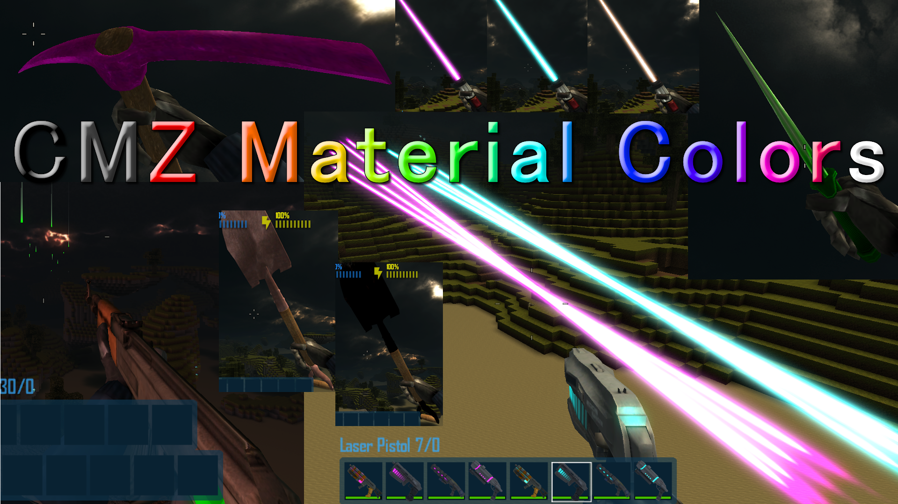</a><br><b>CMZMaterialColors</b></td>
    <td valign="top">A config-first recolor mod for material-based tools and weapons. It overrides body and laser/emissive colors from an INI file, refreshes cached item classes, rebuilds affected icons, and supports hot reloading while the game is running.</td>
    <td valign="top"><a href="CastleForge/Mods/CMZMaterialColors/README.md">README</a></td>
  </tr>
  <tr>
    <td align="center" valign="top"><a href="CastleForge/Mods/FastBoot/README.md">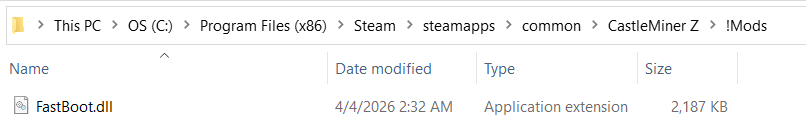</a><br><b>FastBoot</b></td>
    <td valign="top">A tiny startup-speed mod that short-circuits load-screen delays and fade timers so launches feel dramatically faster while still preserving the game’s expected screen-stack behavior.</td>
    <td valign="top"><a href="CastleForge/Mods/FastBoot/README.md">README</a></td>
  </tr>
  <tr>
    <td align="center" valign="top"><a href="CastleForge/Mods/InfiniteGPS/README.md">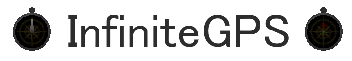</a><br><b>InfiniteGPS</b></td>
    <td valign="top">Prevents GPS-based items from taking durability damage, so normal GPS and GPS-derived items stay usable for the entire session.</td>
    <td valign="top"><a href="CastleForge/Mods/InfiniteGPS/README.md">README</a></td>
  </tr>
  <tr>
    <td align="center" valign="top"><a href="CastleForge/Mods/MoreAchievements/README.md">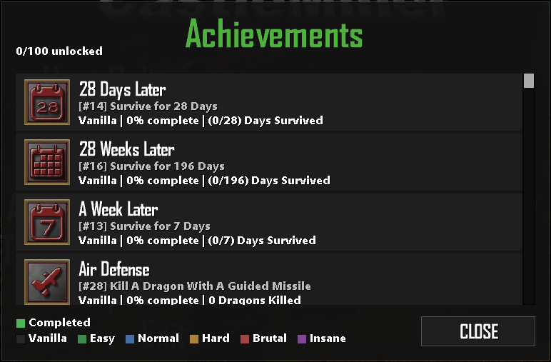</a><br><b>MoreAchievements</b></td>
    <td valign="top">Expands progression with a large custom achievement set, a full browser UI, custom icons and sounds, reward support, helper/admin commands, and config-driven rules for when progress can be earned.</td>
    <td valign="top"><a href="CastleForge/Mods/MoreAchievements/README.md">README</a></td>
  </tr>
  <tr>
    <td align="center" valign="top"><a href="CastleForge/Mods/PhysicsEngine/README.md">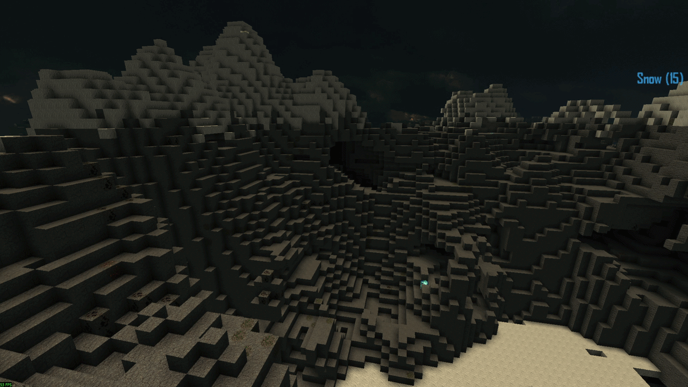</a><br><b>PhysicsEngine</b></td>
    <td valign="top">A configurable lava-simulation mod that turns placed lava into a live spreading hazard, with bounded simulation budgets, runtime tuning, and clean in-game reload support.</td>
    <td valign="top"><a href="CastleForge/Mods/PhysicsEngine/README.md">README</a></td>
  </tr>
  <tr>
    <td align="center" valign="top"><a href="CastleForge/Mods/QoLTweaks/README.md">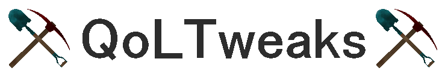</a><br><b>QoLTweaks</b></td>
    <td valign="top">A lightweight quality-of-life patch pack that improves building reach, offline chat, text input, targeted block labels, chat usability, HUD readability, paste support, and vertical freedom without adding bulky menus.</td>
    <td valign="top"><a href="CastleForge/Mods/QoLTweaks/README.md">README</a></td>
  </tr>
  <tr>
    <td align="center" valign="top"><a href="CastleForge/Mods/RenderDistancePlus/README.md">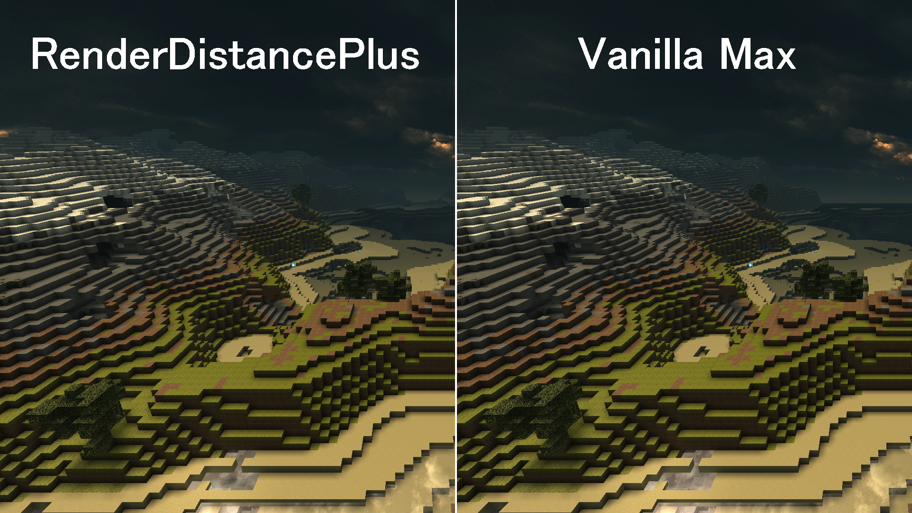</a><br><b>RenderDistancePlus</b></td>
    <td valign="top">Extends terrain draw distance beyond vanilla Ultra with a safer graphics-menu workflow. It removes internal clamps, adds a 10-step slider, and protects the menu path from higher saved values.</td>
    <td valign="top"><a href="CastleForge/Mods/RenderDistancePlus/README.md">README</a></td>
  </tr>
  <tr>
    <td align="center" valign="top"><a href="CastleForge/Mods/Restore360Water/README.md">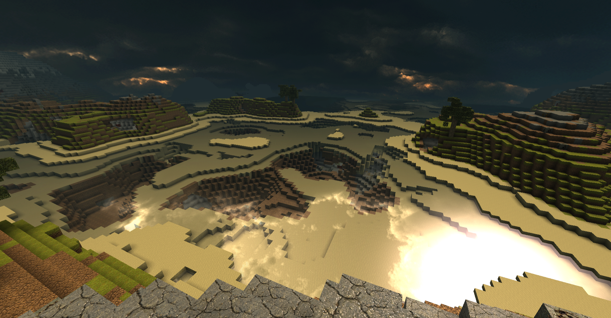</a><br><b>Restore360Water</b></td>
    <td valign="top">Revives the Xbox 360-style water feel with biome-aware water bands, optional reflections, custom water audio, live config reloads, and WorldGenPlus-aware surface detection.</td>
    <td valign="top"><a href="CastleForge/Mods/Restore360Water/README.md">README</a><br><a href="CastleForge/Mods/WorldGenPlus/README.md">WorldGenPlus</a></td>
  </tr>
  <tr>
    <td align="center" valign="top"><a href="CastleForge/Mods/SetHomes/README.md"></a><br><b>SetHomes</b></td>
    <td valign="top">Lets players save named homes per world, teleport back instantly, jump to spawn, and preserve exact facing direction on arrival.</td>
    <td valign="top"><a href="CastleForge/Mods/SetHomes/README.md">README</a></td>
  </tr>
  <tr>
    <td align="center" valign="top"><a href="CastleForge/Mods/TacticalNuke/README.md">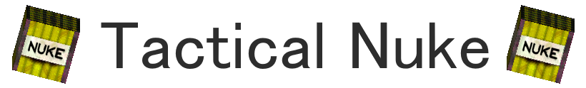</a><br><b>TacticalNuke</b></td>
    <td valign="top">Adds a custom nuke item and full explosive workflow with custom icons and block skinning, longer fuses, warning announcements, configurable crater shaping, chain reactions, and optional async blast processing.</td>
    <td valign="top"><a href="CastleForge/Mods/TacticalNuke/README.md">README</a></td>
  </tr>
  <tr>
    <td align="center" valign="top"><a href="CastleForge/Mods/TooManyItems/README.md"></a><br><b>TooManyItems</b></td>
    <td valign="top">An in-game item browser and creative-control overlay that exposes hidden items, supports search and favorites, saves inventory snapshots, and adds quick world utilities for testing and sandbox play.</td>
    <td valign="top"><a href="CastleForge/Mods/TooManyItems/README.md">README</a></td>
  </tr>
  <tr>
    <td align="center" valign="top"><a href="CastleForge/Mods/TreeFeller/README.md"></a><br><b>TreeFeller</b></td>
    <td valign="top">Automatically fells connected natural trees when you cut into the trunk with an axe or chainsaw, while using safety heuristics and caps to avoid tearing through player builds.</td>
    <td valign="top"><a href="CastleForge/Mods/TreeFeller/README.md">README</a></td>
  </tr>
  <tr>
    <td align="center" valign="top"><a href="CastleForge/Mods/VeinMiner/README.md"></a><br><b>VeinMiner</b></td>
    <td valign="top">Mines the rest of a connected ore vein after the first valid block breaks, with pick-only behavior, per-ore toggles, safety caps, and config hot reloading.</td>
    <td valign="top"><a href="CastleForge/Mods/VeinMiner/README.md">README</a></td>
  </tr>
</table>

</details>

### Multiplayer, networking, moderation & hosting

<details>
<summary>Open multiplayer, networking, moderation & hosting table</summary>

<table>
  <tr>
    <th width="28%">Preview</th>
    <th width="52%">Description</th>
    <th width="20%">Links</th>
  </tr>
  <tr>
    <td align="center" valign="top"><a href="CastleForge/Mods/BruteForceJoin/README.md">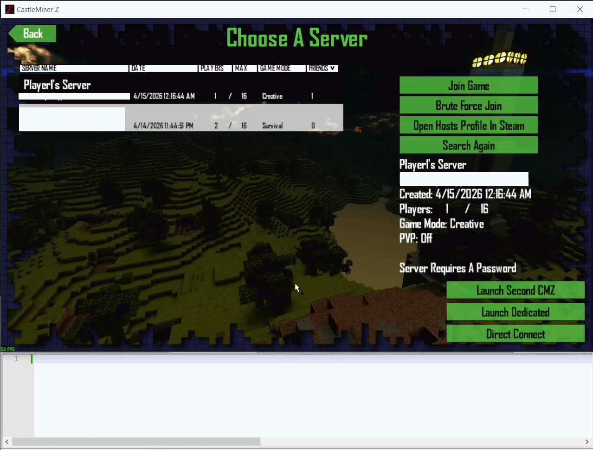</a><br><b>BruteForceJoin</b></td>
    <td valign="top">A proof-of-concept password-testing mod for servers you own or are authorized to audit. It adds a native-feeling browser button, runs an asynchronous word-list join loop, rate-limits attempts, shows progress, and cancels cleanly.</td>
    <td valign="top"><a href="CastleForge/Mods/BruteForceJoin/README.md">README</a></td>
  </tr>
  <tr>
    <td align="center" valign="top"><a href="CastleForge/Mods/CastleWallsMk2/README.md"></a><br><b>CastleWallsMk2</b></td>
    <td valign="top">A massive all-in-one overlay and sandbox toolkit with live editors, session utilities, moderation workflows, networking tools, diagnostics, visual helpers, and experimental gameplay controls for power users.</td>
    <td valign="top"><a href="CastleForge/Mods/CastleWallsMk2/README.md">README</a></td>
  </tr>
  <tr>
    <td align="center" valign="top"><a href="CastleForge/Mods/ChatTranslator/README.md">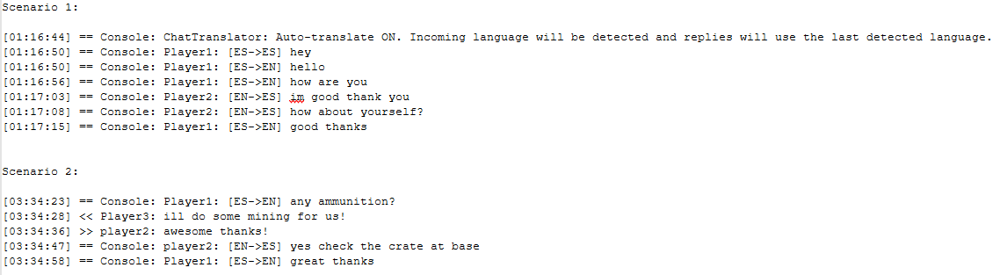</a><br><b>ChatTranslator</b></td>
    <td valign="top">Live in-game chat translation for multilingual sessions. Read incoming messages in your language, translate replies before sending, and switch between manual and auto-detect workflows without leaving CastleMiner Z.</td>
    <td valign="top"><a href="CastleForge/Mods/ChatTranslator/README.md">README</a></td>
  </tr>
  <tr>
    <td align="center" valign="top"><a href="CastleForge/Mods/DirectConnect/README.md">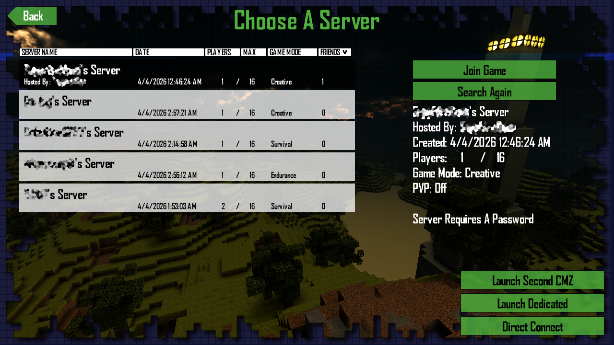</a><br><b>DirectConnect</b></td>
    <td valign="top">Adds a proper direct IP join flow to the multiplayer browser. It remembers the last address you used, adds a real cancel path while joining, and can launch a compatible dedicated server or a second client from the menu.</td>
    <td valign="top"><a href="CastleForge/Mods/DirectConnect/README.md">README</a><br><a href="CastleForge/Servers/CMZServerHost/README.md">Dedicated server</a></td>
  </tr>
  <tr>
    <td align="center" valign="top"><a href="CastleForge/Mods/NetworkSniffer/README.md"></a><br><b>NetworkSniffer</b></td>
    <td valign="top">A developer-facing network logger that hooks CastleMiner Z message flow, captures incoming and outgoing traffic, and writes readable logs with filtering, sampling, and optional raw hex dumps.</td>
    <td valign="top"><a href="CastleForge/Mods/NetworkSniffer/README.md">README</a></td>
  </tr>
  <tr>
    <td align="center" valign="top"><a href="CastleForge/Mods/RegionProtect/README.md"></a><br><b>RegionProtect</b></td>
    <td valign="top">A host-friendly protection system for spawn and named regions. It can block griefing actions like mining, placing, explosions, and crate tampering while allowing trusted-player whitelists.</td>
    <td valign="top"><a href="CastleForge/Mods/RegionProtect/README.md">README</a></td>
  </tr>
  <tr>
    <td align="center" valign="top"><a href="CastleForge/Mods/VoiceChat/README.md">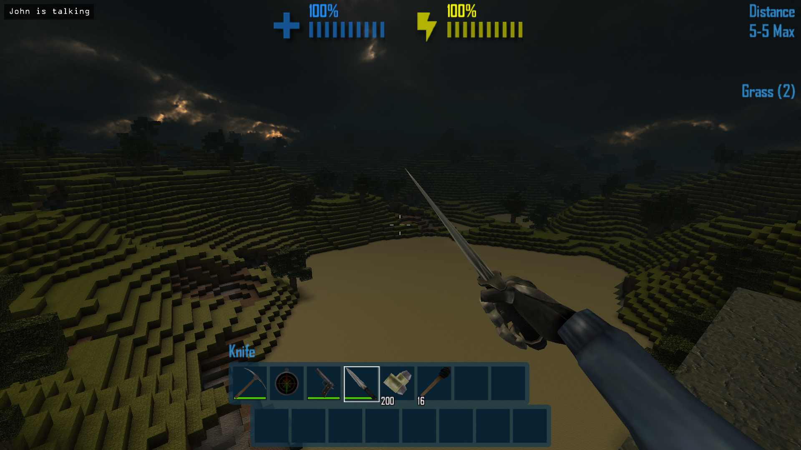</a><br><b>VoiceChat</b></td>
    <td valign="top">Modernizes CastleMiner Z voice with push-to-talk, self-mute, speaker HUD feedback, safer packet handling, and cleaner session cleanup without replacing the game’s built-in voice path.</td>
    <td valign="top"><a href="CastleForge/Mods/VoiceChat/README.md">README</a></td>
  </tr>
  <tr>
    <td align="center" valign="top"><a href="CastleForge/Servers/CMZServerHost/README.md">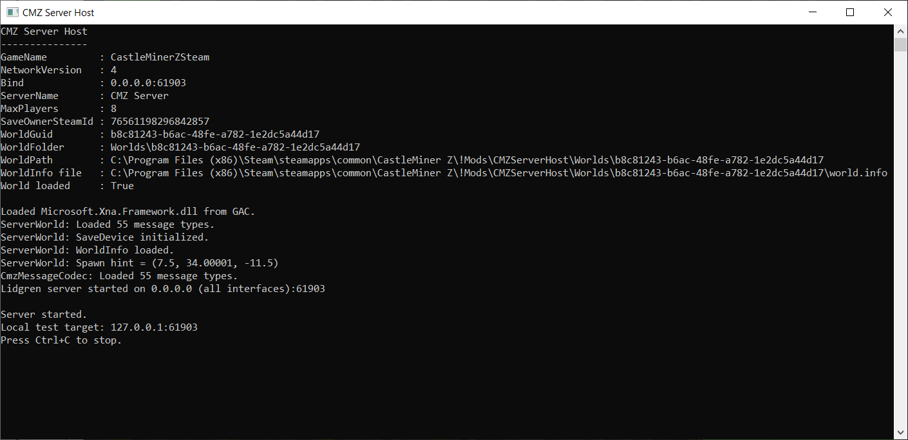</a><br><b>CMZServerHost</b></td>
    <td valign="top">A dedicated CastleMiner Z server host that runs outside the normal game client, keeps world state server-side, and pairs naturally with mods like DirectConnect for smoother custom multiplayer hosting.</td>
    <td valign="top"><a href="CastleForge/Servers/CMZServerHost/README.md">README</a><br><a href="CastleForge/Mods/DirectConnect/README.md">Pairs with DirectConnect</a></td>
  </tr>
</table>

</details>

### World editing, mapping & generation

<details>
<summary>Open world editing, mapping & generation table</summary>

<table>
  <tr>
    <th width="28%">Preview</th>
    <th width="52%">Description</th>
    <th width="20%">Links</th>
  </tr>
  <tr>
    <td align="center" valign="top"><a href="CastleForge/Mods/LanternLandMap/README.md">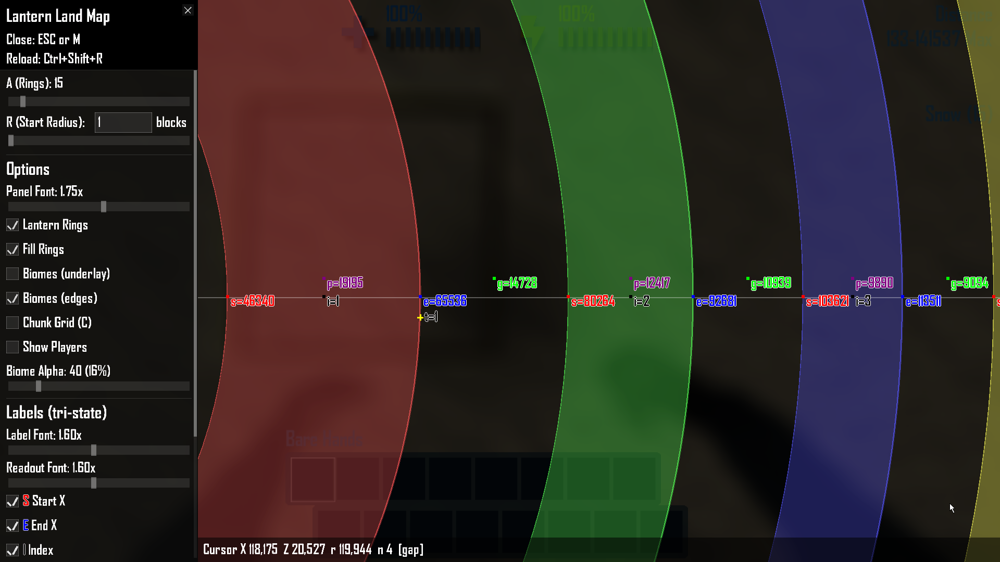</a><br><b>LanternLandMap</b></td>
    <td valign="top">A full-screen Lantern Land analysis overlay that visualizes ring walls, gaps, spawn-tower rings, biome boundaries, and optional WorldGenPlus surfaces on a practical world-scale map.</td>
    <td valign="top"><a href="CastleForge/Mods/LanternLandMap/README.md">README</a><br><a href="CastleForge/Mods/WorldGenPlus/README.md">WorldGenPlus</a></td>
  </tr>
  <tr>
    <td align="center" valign="top"><a href="CastleForge/Mods/Minimap/README.md">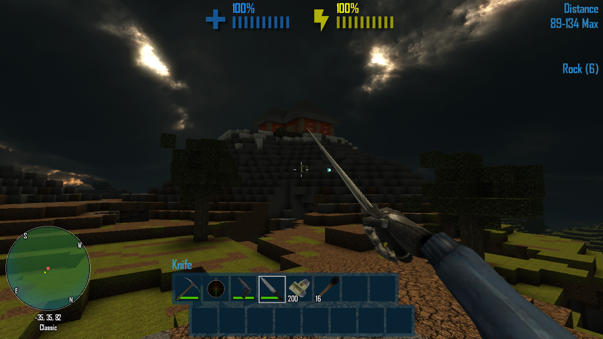</a><br><b>Minimap</b></td>
    <td valign="top">A lightweight biome-aware HUD minimap with player, enemy, dragon, and multiplayer markers, plus optional chunk grids, biome edges, compass helpers, and WorldGenPlus-aware surface rendering.</td>
    <td valign="top"><a href="CastleForge/Mods/Minimap/README.md">README</a><br><a href="CastleForge/Mods/WorldGenPlus/README.md">WorldGenPlus</a></td>
  </tr>
  <tr>
    <td align="center" valign="top"><a href="CastleForge/Mods/WorldEdit/README.md"></a><br><b>WorldEdit</b></td>
    <td valign="top">A high-speed in-game map editor with selections, schematics, copy/paste, brushes, scripting, async block placement, undo/redo history, and deep world-building workflows.</td>
    <td valign="top"><a href="CastleForge/Mods/WorldEdit/README.md">README</a></td>
  </tr>
  <tr>
    <td align="center" valign="top"><a href="CastleForge/Mods/WorldEditCUI/README.md"></a><br><b>WorldEditCUI</b></td>
    <td valign="top">A visual frontend addon for WorldEdit that renders your active selection in-world, with outline modes and chunk-grid helpers so large edits are easier to see before you commit them.</td>
    <td valign="top"><a href="CastleForge/Mods/WorldEditCUI/README.md">README</a><br><a href="CastleForge/Mods/WorldEdit/README.md">Requires WorldEdit</a></td>
  </tr>
  <tr>
    <td align="center" valign="top"><a href="CastleForge/Mods/WorldEditPixelart/README.md">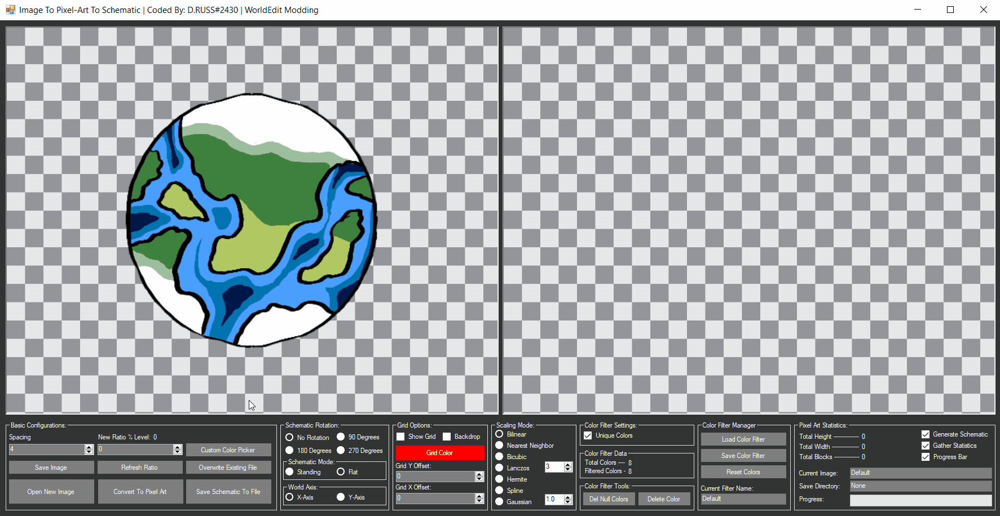</a><br><b>WorldEditPixelart</b></td>
    <td valign="top">An in-game image-to-block-art editor that converts real images into CastleMiner Z pixel art, previews results, tunes palettes, and exports finished work into a WorldEdit-ready schematic workflow.</td>
    <td valign="top"><a href="CastleForge/Mods/WorldEditPixelart/README.md">README</a><br><a href="CastleForge/Tools/ImageColorsToXml/README.md">Palette tool</a></td>
  </tr>
  <tr>
    <td align="center" valign="top"><a href="CastleForge/Mods/WorldGenPlus/README.md">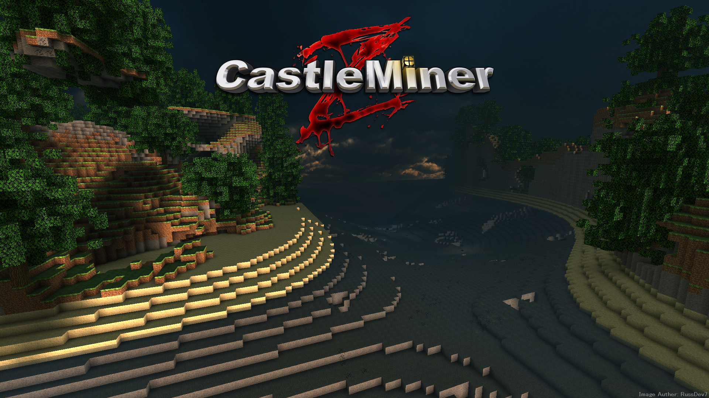</a><br><b>WorldGenPlus</b></td>
    <td valign="top">A world-generation framework and overhaul that replaces the default builder with configurable surface modes, custom biome loading, seed control, multiplayer sync, overlays, and an in-game tuning screen.</td>
    <td valign="top"><a href="CastleForge/Mods/WorldGenPlus/README.md">README</a></td>
  </tr>
</table>

</details>

### Content systems, packs & creator tooling

<details>
<summary>Open content systems, packs & creator tooling table</summary>

<table>
  <tr>
    <th width="28%">Preview</th>
    <th width="52%">Description</th>
    <th width="20%">Links</th>
  </tr>
  <tr>
    <td align="center" valign="top"><a href="CastleForge/Mods/TexturePacks/README.md"></a><br><b>TexturePacks</b></td>
    <td valign="top">A full runtime content-pack framework for re-skinning CastleMiner Z far beyond block textures, including terrain, icons, HUD, menus, fonts, audio, skyboxes, models, and more.</td>
    <td valign="top"><a href="CastleForge/Mods/TexturePacks/README.md">README</a></td>
  </tr>
  <tr>
    <td align="center" valign="top"><a href="CastleForge/Mods/WeaponAddons/README.md">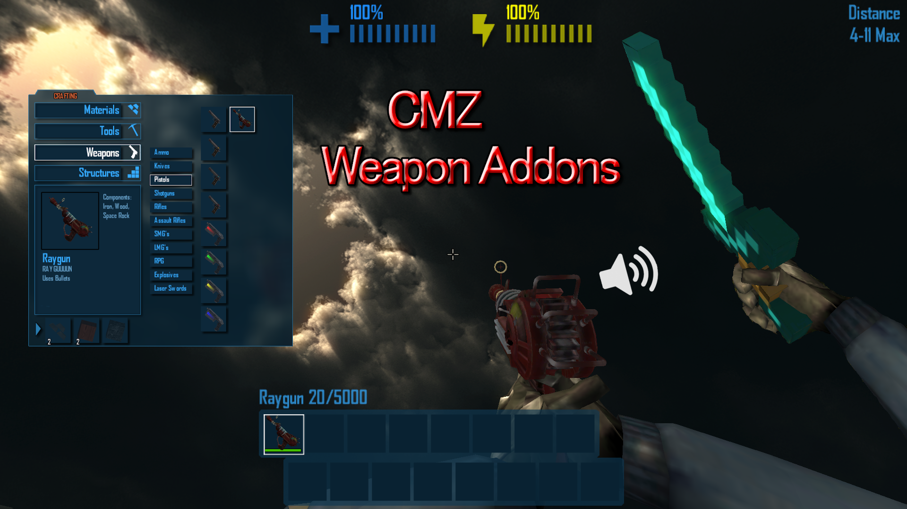</a><br><b>WeaponAddons</b></td>
    <td valign="top">Turns weapons into data-driven content packs. Define custom weapons with `.clag` files, custom models, icons, sounds, optional recipes, and runtime-safe synthetic item IDs.</td>
    <td valign="top"><a href="CastleForge/Mods/WeaponAddons/README.md">README</a><br><a href="CastleForge/Tools/FbxToXnb/README.md">FbxToXnb</a><br><a href="CastleForge/Tools/DNA.SkinnedPipeline/README.md">DNA.SkinnedPipeline</a></td>
  </tr>
  <tr>
    <td align="center" valign="top"><a href="CastleForge/Tools/DNA.SkinnedPipeline/README.md">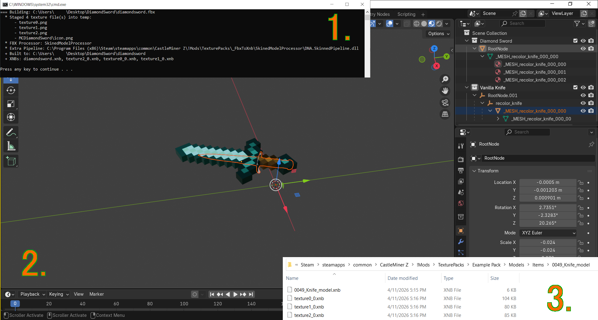</a><br><b>DNA.SkinnedPipeline</b></td>
    <td valign="top">A custom pipeline helper for compiling CastleMiner Z / DNA-style skinned FBX models into runtime-friendly `.xnb` assets for packs and mods.</td>
    <td valign="top"><a href="CastleForge/Tools/DNA.SkinnedPipeline/README.md">README</a></td>
  </tr>
  <tr>
    <td align="center" valign="top"><a href="CastleForge/Tools/FbxToXnb/README.md">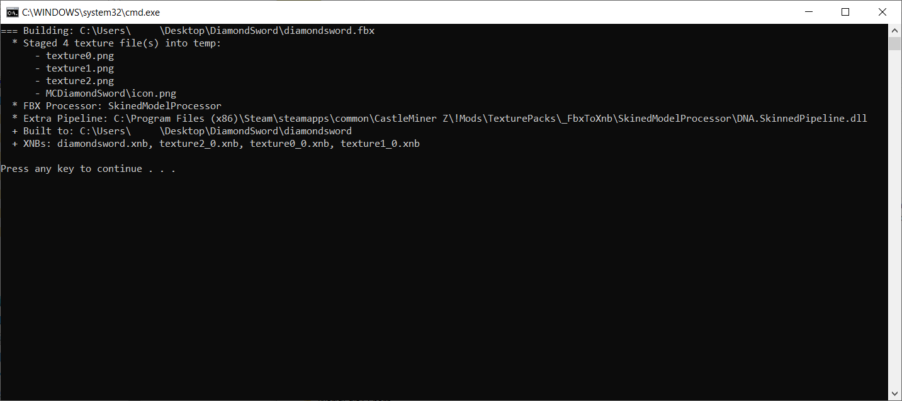</a><br><b>FbxToXnb</b></td>
    <td valign="top">A creator-facing conversion tool that turns one or more `.fbx` models into XNA-ready `.xnb` output with a workflow built around CastleForge content creation.</td>
    <td valign="top"><a href="CastleForge/Tools/FbxToXnb/README.md">README</a></td>
  </tr>
  <tr>
    <td align="center" valign="top"><a href="CastleForge/Tools/ImageColorsToXml/README.md"></a><br><b>ImageColorsToXml</b></td>
    <td valign="top">A palette-building companion tool that turns screenshot colors into XML palette files for WorldEditPixelart and related workflows, with optional brightness and rebalance utilities.</td>
    <td valign="top"><a href="CastleForge/Tools/ImageColorsToXml/README.md">README</a></td>
  </tr>
</table>

</details>

### Developer reference

<details>
<summary>Open developer reference table</summary>

<table>
  <tr>
    <th width="28%">Preview</th>
    <th width="52%">Description</th>
    <th width="20%">Links</th>
  </tr>
  <tr>
    <td align="center" valign="top"><a href="CastleForge/Mods/Example/README.md"></a><br><b>Example</b></td>
    <td valign="top">A clean starter/reference mod that shows CastleForge best practices: config loading, command registration, startup and shutdown flow, Harmony patch bootstrap, and embedded dependency handling.</td>
    <td valign="top"><a href="CastleForge/Mods/Example/README.md">README</a><br><a href="CastleForge/ModLoaderFramework/ModLoader/README.md">Loader docs</a></td>
  </tr>
</table>

</details>

---

## Community Mods

Looking for third-party creations from the CastleForge community?

### Just want to browse mods?

The easiest way to explore community submissions is through the live **CastleForge Community Mod Browser**:

➡️ **[Open the Mod Browser](https://russdev7.github.io/CastleForge-CommunityMods/)**

Use the browser if you want to:
- preview community mods
- open each mod's README
- jump to source repositories
- find release/download links

### Want to contribute, submit, or maintain a listing?

Visit the **CastleForge Community Mods** repository:

➡️ **[Open the Community Mod Repository](https://github.com/RussDev7/CastleForge-CommunityMods)**

Use the repository if you want to:
- submit a new community mod
- edit metadata or previews
- update README entries
- maintain an existing listing

> Community mods are maintained separately from the main CastleForge repository so official projects and community submissions stay organized and easier to support.

---

## Recommended reading order

If you are new to the repo, this is a good flow:

1. **[ModLoader](CastleForge/ModLoaderFramework/ModLoader/README.md)** — understand how CastleForge boots and loads mods.
2. **[ModLoaderExtensions](CastleForge/ModLoaderFramework/ModLoaderExtensions/README.md)** — see the shared layer many projects depend on.
3. **[Example](CastleForge/Mods/Example/README.md)** — use it as the cleanest reference for authoring your own mod.
4. Move into the specific mod, server, or tool README that matches what you want to build or use.

---

## Notes

- This root page is intentionally focused on **showcasing and organizing the entire repository**.
- The old low-level loader deep dive has been moved into the dedicated **[ModLoader README](CastleForge/ModLoaderFramework/ModLoader/README.md)** so the root page can stay more discoverable.
- Each subproject README is where command lists, config details, workflow notes, and troubleshooting should continue to live.

---

## License

CastleForge is open source. See the repository **LICENSE** file and the individual project files where applicable.
